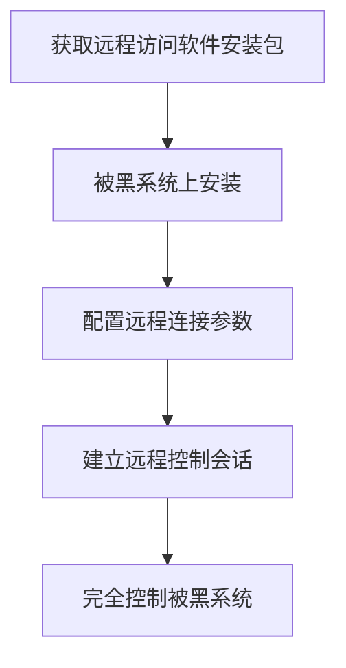

# 远程访问软件 (T1219)

## 一句话通俗理解

就像直接用别人的电脑桌面——攻击者使用TeamViewer、AnyDesk等远程控制软件的合法功能来操控被黑的电脑。

## 难度等级

- ⭐ 初级（新手可学）

## 技术描述

远程访问软件（Remote Access Software）是 MITRE ATT&CK 框架中命令与控制战术下的一种技术，编号为 T1219。

**通俗解释：**
TeamViewer、AnyDesk、VNC 这些远程控制软件本来就是设计来管控远程电脑的——它们的功能和C2后门本质上是一样的：屏幕控制、文件传输、命令行执行。攻击者只是"合法地"使用这些软件来做坏事。因为这些都是知名的、被广泛使用的商业软件，安全团队很难区分"员工的合法远程办公"和"攻击者的恶意远程控制"。

**技术原理：**
攻击者在本应被允许的远程访问产品之上建立交互式C2会话。大多使用系统代理和内部网络安全特性，在已经允许传出连接的通道上建立连接。许多现有的远程支持应用程序使用已知的端口和协议；对于这些应用来说，从应用层来看这很平常。

**用途与影响：**
因为远程访问软件是合法产品，攻击者可以完美融入正常办公环境中。APT组织越来越倾向于使用合法的远程管理工具进行C2通信，因为其流量与合法流量无法区分。

## 子技术列表

**该技术没有子技术。**

## 攻击流程

### 典型攻击流程

```
获取安装包 --> 安装/绿色运行 --> 建立远程 --> 完全控制
```



**步骤详解：**

1. **获取安装包**
   - 通俗描述：下载TeamViewer或AnyDesk的便携版
   - 技术细节：便携版无需管理员权限，直接运行

2. **安装运行**
   - 技术细节：配置无人值守访问，设置强密码

3. **建立连接**
   - 技术细节：攻击者使用同样的软件连接被黑系统

## 真实案例

### 案例1：APT29 — TEAMVIEWER 远程支持C2（2024年）

- **时间**: 2024年
- **目标**: 全球IT管理服务提供商（MSP）及下游客户
- **攻击组织**: APT29（Cozy Bear / NOBELIUM）
- **手法**: 2024年11月披露的APT29活动中，攻击者利用被入侵的MSP基础设施分发 TeamViewer。攻击者在IT管理员通过TeamViewer进行日常远程支持的合法会话中，利用同一通道执行恶意操作。APT29在受感染MSP的RMM工具中植入后门，触发TeamViewer在客户系统上运行，攻击者使用TeamViewer的远程桌面功能手动执行攻击操作。
- **影响**: 多个MSP及其数百个下游客户面临被入侵风险
- **参考链接**: [DFIR Report - APT29 TEAMVIEWER (2024)](https://thedfirreport.com/2024/11/18/apt29-teams-up-with-teamviewer/)

### 案例2：UNC1945 — AnyDesk 持久化C2（2020-2021年）

- **时间**: 2020-2021年
- **目标**: 全球金融、医疗、政府机构
- **攻击组织**: UNC1945（Mandiant追踪）
- **手法**: UNC1945 在初始入侵后安装 AnyDesk 以建立持久的交互式C2通道。攻击者在受感染的系统上以"绿色免安装模式"运行 AnyDesk，设置随机密码并通过C2通道传递密码。TA使用AnyDesk的文件传输功能窃取数据和上传新工具，使用远程桌面手动执行横向移动操作。
- **影响**: 多个关键基础设施组织被入侵
- **参考链接**: [Mandiant - UNC1945](https://www.mandiant.com/resources/unc1945)

### 案例3：Scattered Spider — 社交工程+RMM工具C2（2023年）

- **时间**: 2023年
- **目标**: 科技、金融、零售行业
- **攻击组织**: Scattered Spider（UNC3944）
- **手法**: Scattered Spider 使用社交工程欺骗IT服务台，重置目标系统密码。然后使用 ScreenConnect、LogMeIn 等远程访问工具建立C2通道。攻击者使用这些合法RMM工具的屏幕控制和文件传输功能，手动执行数据窃取和勒索软件部署。
- **影响**: 多家大型科技和零售企业
- **参考链接**: [CISA - Scattered Spider (2023)](https://www.cisa.gov/news-events/cybersecurity-advisories/aa23-320a)

## 红队视角

> ⚠️ **免责声明**：以下内容仅用于合法的安全测试、渗透测试和教育目的。未经授权对他人系统进行测试是违法行为。

> ⚠️ **免责声明**：以下内容仅用于合法的安全测试。

### 实战技巧

1. **RMM 软件选择**
   优先使用目标环境本身就在使用的RMM工具。如果目标使用ScreenConnect，就用ScreenConnect。

2. **便携版 vs 安装版**
   使用便携版减少安装痕迹，避免UAC弹窗。

### 常用工具

| 工具名称 | 用途 | 平台 | 链接 |
|----------|------|------|------|
| TeamViewer | 远程桌面 | 跨平台 | https://www.teamviewer.com/ |
| AnyDesk | 远程桌面 | 跨平台 | https://anydesk.com/ |
| ScreenConnect | RMM软件 | 跨平台 | ConnectWise |
| LogMeIn | 远程访问 | 跨平台 | https://www.logmein.com/ |

### 注意事项

- 远程访问软件在EDR的白名单列表中，但安装行为会被记录
- 部分企业禁止RMM软件运行

## 蓝队视角

### 检测要点

1. **RMM 软件安装**
   - 日志来源：Windows Event Log、Sysmon
   - 异常特征：非IT人员安装RMM软件

2. **RMM 客户端配置变化**
   - 异常特征：无人值守访问配置被启用

### 监控建议

- 监控RMM软件的安装事件
- 列入白名单的RMM版本

## 检测建议

### 网络层检测

**检测方法：** 监控RMM（远程监控管理）工具的known端口和协议指纹特征，包括TeamViewer、AnyDesk、ScreenConnect等工具的独特握手包和TCP连接模式。

**具体规则/命令示例：**
```
# 检测TeamViewer协议特征
suricata -r traffic.pcap --rule "alert tcp $HOME_NET any -> $EXTERNAL_NET 5938 (msg:\"TeamViewer Connection\"; sid:1000035;)"

# 检测AnyDesk的UDP特征
zeek -r traffic.pcap | grep "7070" | grep "udp"

# 识别非授权RMM工具的TLS指纹
tcpdump -i eth0 port 443 -A | grep -E "TeamViewer|AnyDesk" | head
```

### 主机层检测

**检测方法：** 监控RMM软件的安装和配置变化。

**Sigma规则示例：**
```yaml
title: 非授权 RMM 工具安装
status: experimental
logsource:
    product: windows
    service: sysmon
detection:
    selection:
        EventID: 1
        Image|endswith:
            - 'TeamViewer.exe'
            - 'AnyDesk.exe'
            - 'ScreenConnect*.exe'
    condition: selection
level: high
tags:
    - attack.t1219
```

## 缓解措施

### 优先级1：关键措施

**措施名称：** RMM 白名单

**具体实施步骤：**
1. 列出允许的RMM工具清单
2. 检测清单之外的RMM工具运行

### MITRE ATT&CK 缓解措施映射

| 缓解措施ID | 缓解措施名称 | 适用性 | 说明 |
|------------|-------------|--------|------|
| M0950 | 应用白名单 | 适用 | 限制非授权RMM工具 |

## 动手实验

> ⚠️ **重要提示**：所有实验必须在隔离的实验室环境中进行，禁止对未授权的真实系统进行测试。

### 实验1：识别RMM流量（中级）

**实验目标：** 捕获和分析TeamViewer通信流量。

**实验步骤：**
1. 在实验室中安装TeamViewer便携版
2. 建立远程连接
3. 用Wireshark捕获TeamViewer流量
4. 分析协议特征

## 术语解释

| 术语 | 英文原名 | 通俗解释 |
|------|----------|----------|
| RMM | Remote Monitoring and Management | 远程监控和管理软件 |
| 便携版 | Portable Edition | 无需安装直接运行的版本 |

## 参考资料

### 官方文档

- [MITRE ATT&CK - T1219](https://attack.mitre.org/techniques/T1219/)

### 安全报告

- [DFIR Report - APT29 TEAMVIEWER (2024)](https://thedfirreport.com/2024/11/18/apt29-teams-up-with-teamviewer/)
