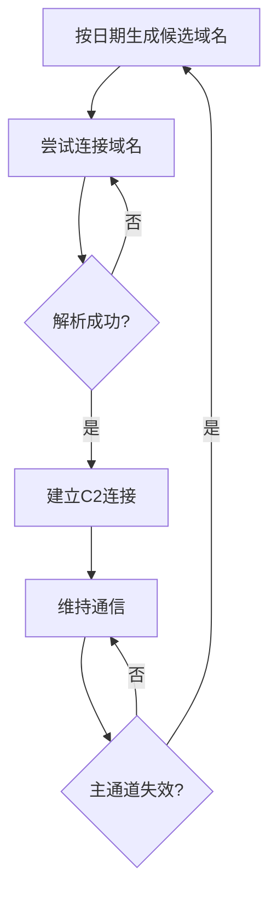

# 动态解析 (T1568)

## 一句话通俗理解

就像打地鼠游戏——攻击者的C2地址不断变化，你刚封了一个，它又从另一个地方冒出来。

## 难度等级

- ⭐⭐⭐ 高级（需要深入技术知识）

## 技术描述

动态解析（Dynamic Resolution）是 MITRE ATT&CK 框架中命令与控制战术下的一种高级技术，编号为 T1568。

**通俗解释：**
传统C2使用固定的IP地址或域名，安全厂商发现后可以直接封掉。动态解析让C2地址像变色龙一样不断变化——一小时内换几十个IP，一天生成几百个域名。安全团队刚把当前地址加入黑名单，攻击者已经换到了下一个。这种"动态"特性使基于静态黑名单的防御策略几乎失效。

**技术原理：**
动态解析通过三种核心机制实现：
1. Fast Flux（快速通量）：为单个域名分配数十个IP地址，每几分钟轮换一次
2. DGA（域名生成算法）：恶意软件根据日期/时间等种子值，每天算法生成大量候选域名，攻击者只注册其中少数
3. DNS Calculation（DNS计算）：从合法域名的DNS响应数值（如IP地址的字节值）中计算C2参数

**用途与影响：**
动态解析解决了C2基础设施的"弹性"问题——即使部分C2服务器被关闭，攻击者仍然可以通过其他域名或IP维持控制。高级勒索软件（如LockBit）和僵尸网络（如TrickBot）都依赖DGA维持C2通道的长期存活。

## 子技术列表

**该技术共有 3 个子技术：**

| 子技术ID | 中文名称 | 通俗解释 |
|----------|----------|----------|
| T1568.001 | Fast Flux DNS | 一个域名绑几十个IP轮换，封了一个还有几十个 |
| T1568.002 | 域名生成算法（DGA） | 每天自动生成几百个域名，只要攻击者注册其中几个就行 |
| T1568.003 | DNS计算 | 从正常DNS响应的IP地址数字中"算出"C2服务器的位置 |

<details>
<summary><strong>展开查看各子技术详细说明</strong></summary>

各子技术详细说明请参阅独立文档：

- [T1568.001 - 快速Flux DNS](./T1568/T1568.001-Fast-Flux-DNS-Fast-Flux-DNS.md) — 域名像地铁一样，今天走这个站明天换那个站。
- [T1568.002 - 域名生成算法（DGA）](./T1568/T1568.002-Domain-Generation-Algorithm.md) — 恶意软件每天按算法"算"出一堆域名，像买彩票一样试哪个能连上。
- [T1568.003 - DNS计算](./T1568/T1568.003-DNS-Calculation.md) — 从正常网站的IP地址中"读"出暗号。

</details>

## 攻击流程

### 典型攻击流程

```
生成候选域名 --> 尝试连接 --> 域名解析（轮换IP） --> 建立C2 --> 维持通信
```



**步骤详解：**

1. **生成候选域名**
   - 通俗描述：恶意软件根据当天日期，用预设算法生成几百个随机域名
   - 技术细节：输入种子值（日期/时间/硬编码密钥）到DGA算法，输出域名列表
   - 常用工具：自定义DGA算法

2. **尝试连接**
   - 通俗描述：逐个尝试连接这些域名，直到有一个成功
   - 技术细节：对每个域名发起DNS查询，收到有效响应后连接
   - 常用工具：标准DNS库

3. **域名解析（轮换IP）**
   - 通俗描述：C2域名每次解析都返回不同的IP地址
   - 技术细节：配合 Fast Flux 网络，DNS记录频繁变更
   - 常用工具：Fast Flux 脚本

4. **建立C2连接**
   - 通俗描述：成功连接到C2服务器
   - 技术细节：使用HTTP/HTTPS/DNS等协议建立通信
   - 常用工具：C2框架

## 真实案例

### 案例1：LockBit 3.0 — 基于 AES 的高级 DGA（2022-2024年）

- **时间**: 2022-2024年
- **目标**: 全球企业（制造业、医疗、教育）
- **攻击组织**: LockBit 勒索软件集团
- **手法**: LockBit 3.0（Black）的 DGA 算法使用 AES 加密当前日期生成复杂的域名组合。每天生成数百个候选域名，LockBit运营者预先注册少量域名指向C2基础设施。当C2服务器被执法部门查封（如2022年和2024年的多次国际执法行动），LockBit的备用DGA域名通道使部分受感染系统仍能继续接收指令。2024年2月的"Operation Cronos"执法行动虽然查封了LockBit的基础设施，但其DGA机制使得全面清除极为困难。
- **影响**: 全球数千家企业被勒索，损失数十亿美元
- **参考链接**: [MITRE ATT&CK - S1113](https://attack.mitre.org/software/S1113/)

### 案例2：TrickBot — 多种子 DGA 与 Fast Flux 结合（2016-2023年）

- **时间**: 2016-2023年
- **目标**: 全球金融机构、企业网络
- **攻击组织**: TrickBot
- **手法**: TrickBot 结合使用 DGA 和 Fast Flux DNS。其 DGA 基于硬编码种子列表和当前日期生成域名，每日生成域名使用多个种子以提高弹性。同时使用 Fast Flux 网络为每个C2域名分配多个前端代理IP。TrickBot 的 Fast Flux 基础设施依托大量受感染主机（包括 IoT 设备）。安全厂商需要同时跟踪 DGA 种子算法和 Fast Flux IP 池的变化才能有效阻断其C2通道。
- **影响**: 多次执法行动后仍能恢复通信，造成严重的金融损失
- **参考链接**: [MITRE ATT&CK - S0266](https://attack.mitre.org/software/S0266/)

### 案例3：Conficker — 开创性的 DGA 应用（2008-2009年）

- **时间**: 2008-2009年
- **目标**: 全球 Windows 系统，超1000万台被感染
- **攻击组织**: Conficker 蠕虫
- **手法**: Conficker 是DGA技术的开创者之一。Conficker.A 每天生成250个候选域名，后续变种增加到50000个（对110个顶级域各生成500个）。即使安全厂商提前注册了部分域名，Conficker庞大的域名生成量使预先注册全部域名的成本极高。最终多个安全厂商合作注册候选域名和 sinkhole 的动态防御模式才控制了其扩散。
- **影响**: 史上最大规模的僵尸网络之一
- **参考链接**: [MITRE ATT&CK - S0608](https://attack.mitre.org/software/S0608/)

### 案例4：Skitnet (Bossnet) — DNS 心跳 C2 与 DGA 结合（2024-2025年）

- **时间**: 2024年4月-2025年
- **目标**: 全球企业网络，被 BlackBasta 和 Cactus 勒索软件使用
- **攻击组织**: LARVA-306（MaaS服务商）
- **手法**: Skitnet 恶意软件在2024年4月首次出现在RAMP论坛上，采用多阶段架构（Rust加载器+Nim组件）。其C2通信使用 DNS 隧道，每10秒发送一次心跳。Skitnet 使用 DGA 生成C2域名，配合 DNS 隧道协议将加密的 TLS 流量封装在 DNS A 和 AAAA 记录中传输。该恶意软件被 BlackBasta 和 Cactus 等知名勒索软件组织集成到攻击链中，作为初始访问后的C2通道。
- **影响**: 多个企业被勒索软件攻击，数据被加密和窃取
- **参考链接**: [CyberSecSentinel - Skitnet Malware](https://cybersecsentinel.com/skitnet-malware-c2-via-dns-and-rust-loader-threatens-enterprise-networks/)

## 红队视角

> ⚠️ **免责声明**：以下内容仅用于合法的安全测试、渗透测试和教育目的。未经授权对他人系统进行测试是违法行为。

### 实战技巧

1. **DGA 种子选择**
   使用知名网站的公开数据（如 Twitter 趋势、Google 搜索热词）作为 DGA 种子，使安全厂商难以预测明天的域名。

2. **Fast Flux 节点管理**
   使用云服务提供商（AWS、GCP、Azure）的临时实例作为 Flux 节点，这些实例的IP信誉高且可快速创建。

3. **TTL 策略**
   Fast Flux 中 TTL 设置不要低于60秒，极短的 TTL 本身就是检测信号。

### 常用工具

| 工具名称 | 用途 | 平台 | 链接 |
|----------|------|------|------|
| DGA 生成器 | 生成算法域名 | 跨平台 | 自定义脚本 |
| PowerDNS | 快速 DNS 轮换 | Linux | https://www.powerdns.com/ |
| F5 BIG-IP DNS | 商业DNS负载均衡 | 硬件/软件 | F5 |

### 注意事项

- DGA 算法一旦逆向分析出来，所有未来域名都可被预测
- Fast Flux 需要使用大量 IP 资源，维护成本高
- 许多安全厂商建立了 DGA 域名预测机制

## 蓝队视角

### 检测要点

1. **高 NXDOMAIN 率**
   - 日志来源：DNS 服务器日志
   - 关注字段：查询结果、查询域名
   - 异常特征：单个主机大量查询不存在的域名（NXDOMAIN 率 > 50%）

2. **短 TTL 和高频 A 记录变更**
   - 日志来源：DNS 日志、被动 DNS 数据库
   - 关注字段：TTL 值、A 记录值
   - 异常特征：TTL < 300 秒、同一域名24小时内解析到10+个不同IP

3. **算法生成域名特征**
   - 日志来源：DNS 日志
   - 关注字段：域名结构、字符分布
   - 异常特征：高熵域名、元音/辅音比例异常、可读性差

### 监控建议

- 部署 DNS sinkhole 检测和拦截 DGA 流量
- 使用机器学习分析 DNS 查询模式
- 建立组织 DNS 流量基线，标记新域名的访问

## 检测建议

### 网络层检测

**检测方法：** 分析 DNS 查询的 NXDOMAIN 比率和域名熵值。

**示例（Zeek脚本）：**
```
# 检测高NXDOMAIN率的DNS查询
event dns_message(c: connection, is_orig: bool, msg: dns_msg, len: count)
{
    if ( msg$rcode == 3 ) # NXDOMAIN
        ++nxdomain_count[c$id$orig_h];
}
```

### 主机层检测

**检测方法：** 监控异常的 DNS 查询行为。

**Sigma规则示例：**
```yaml
title: DGA 域名查询检测
status: experimental
description: 检测高熵值域名的 DNS 查询
logsource:
    category: dns
    product: windows
detection:
    selection:
        QueryName|re: "[a-z0-9]{20,}\.(com|org|net|top|xyz)"
    condition: selection
level: medium
tags:
    - attack.t1568
```

## 缓解措施

### 优先级1：关键措施

**措施名称：** DNS Sinkhole

**具体实施步骤：**
1. 部署 DNS sinkhole 服务
2. 配置已知 DGA 域名的拦截规则
3. 与威胁情报源同步更新

### 优先级2：重要措施

**措施名称：** DNS 查询行为分析

**具体实施步骤：**
1. 部署 DNS 分析工具
2. 配置异常 DNS 告警规则

### MITRE ATT&CK 缓解措施映射

| 缓解措施ID | 缓解措施名称 | 适用性 | 说明 |
|------------|-------------|--------|------|
| M0931 | 网络监控 | 适用 | 监控DNS流量异常 |
| M0950 | DNS 安全 | 适用 | 部署DNS安全扩展和过滤 |

## 动手实验

> ⚠️ **重要提示**：所有实验必须在隔离的实验室环境中进行，禁止对未授权的真实系统进行测试。

### 实验1：编写简单的 DGA 算法（初级）

**实验目标：** 理解 DGA 的工作原理。

**实验步骤：**
1. 用 Python 编写一个基于日期的 DGA 函数
2. 生成一周的候选域名
3. 观察域名的变化规律

### 实验2：Fast Flux 环境搭建（高级）

**实验目标：** 搭建小型 Fast Flux 环境。

**实验步骤：**
1. 准备多台虚拟机作为 Flux 节点
2. 配置 DNS 记录的快速轮换
3. 测试解析结果的变化

## 术语解释

| 术语 | 英文原名 | 通俗解释 |
|------|----------|----------|
| DGA | Domain Generation Algorithm | 域名生成算法，每天算出一堆随机域名 |
| Fast Flux | Fast Flux | 快速轮换IP的技术，一个域名绑几十个IP |
| NXDOMAIN | Non-Existent Domain | DNS返回"域名不存在"的响应码 |
| Sinkhole | DNS Sinkhole | 把恶意域名劫持到安全分析服务器的技术 |
| 种子值 | Seed Value | DGA算法的"输入"，决定生成什么域名 |

## 参考资料

### 官方文档

- [MITRE ATT&CK - T1568](https://attack.mitre.org/techniques/T1568/)

### 安全报告

- [Skitnet/Cactus 勒索软件分析(2025)](https://cybersecsentinel.com/skitnet-malware-c2-via-dns-and-rust-loader-threatens-enterprise-networks/)
- [Unit 42 - DNS Tunneling 新活动(2024)](https://unit42.paloaltonetworks.com/detecting-dns-tunneling-campaigns/)
