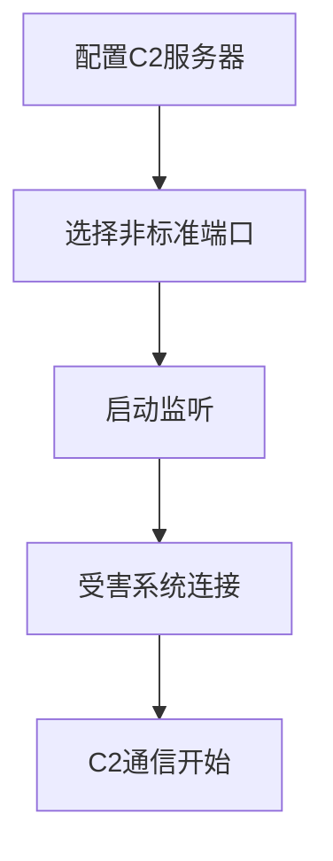

# 非标准端口 (T1571)

## 一句话通俗理解

就像小偷不从前门走，而是爬窗户——攻击者把C2通信放在非标准端口上（比如SSH跑在2222端口而不是22），绕过只检查标准端口的防火墙。

## 难度等级

- ⭐ 初级（新手可学）

## 技术描述

非标准端口（Non-Standard Port）是 MITRE ATT&CK 框架中命令与控制战术下的一种基础技术，编号为 T1571。

**通俗解释：**
网络防火墙和安全设备通常只检查标准端口上的流量——80端口看HTTP、443看HTTPS、22看SSH等。如果攻击者在8443端口上跑HTTPS、或者在2222端口上跑SSH，很多安全设备就不会检查这个端口上的内容。就像酒店的保安只盯着正门检查身份，小偷从侧门溜进去了。

**技术原理：**
攻击者只是将C2协议的监听端口从"默认端口"改为"非标准端口"。技术实现上与标准端口通信完全相同（同样是完整的TLS握手、标准的HTTP请求），唯一的区别是端口号不是默认值。

**用途与影响：**
非标准端口本身不是一种强大的规避手段——下一代防火墙和EDR产品通常会检查所有端口上的协议内容。但它增加了防御者的"发现成本"，让自动化扫描工具和初级SOC分析师更难识别恶意流量。

## 子技术列表

**该技术没有子技术。**

## 攻击流程

### 典型攻击流程

```
配置C2服务器 --> 选择非标准端口 --> 监听 --> 受害系统连接 -->
```



**步骤详解：**

1. **配置C2服务器**
   - 通俗描述：修改C2框架的配置文件
   - 技术细节：C2框架监听端口设置

2. **受害系统连接**
   - 通俗描述：被黑的电脑上的agent连接非标准端口
   - 技术细节：agent配置中指定连接的端口

## 真实案例

### 案例1：Cobalt Strike — 自定义端口配置（持续活跃）

- **时间**: 2012年至今
- **目标**: 全球多行业
- **攻击组织**: 多个APT组织
- **手法**: Cobalt Strike 默认的 HTTPS Beacon 监听在443端口，但红队和攻击者可以自定义任何端口。常见的非标准端口有 8443、4443、8080、8444、50050、2222 等。攻击者使用 Malleable C2 配置自定义profile，支持指定任意监听端口，使通信与目标环境的正常流量混合。
- **影响**: Cobalt Strike是全球使用最广泛的C2框架
- **参考链接**: [Cobalt Strike Documentation](https://hstechdocs.helpsystems.com/manuals/cobaltstrike/current/usermanual/content/topics/malleable-c2_4_configuration.htm)

### 案例2：Sofacy — 复合端口策略（2015-2024年）

- **时间**: 2015-2024年
- **目标**: 全球政府、军事、外交、研究机构
- **攻击组织**: Sofacy（APT28 / Fancy Bear）
- **手法**: GPU技术峰会2024年的报告指出，Sofacy 的 Zebrocy 工具在不同目标环境中使用不同端口：标准HTTP/S端口（80/443）用于常规通信，非标准端口（例如 8888、9000、4443）用于需要绕过特定端口限制的环境。Sofacy 根据目标所处国家的网络限制，动态选择端口。
- **影响**: 全球多个政府机构被入侵
- **参考链接**: [GPU Technology Summit 2024 - Hidden in Plain Sight](https://www.gputechnology.com/blog/hidden-in-plain-sight-apt28s-multi-channel-approach-to-command-and-control)

## 红队视角

> ⚠️ **免责声明**：以下内容仅用于合法的安全测试、渗透测试和教育目的。未经授权对他人系统进行测试是违法行为。

> ⚠️ **免责声明**：以下内容仅用于合法的安全测试。

### 实战技巧

1. **端口的"自然感"**
   选择在目标环境中看起来"合理"的端口。例如很多企业使用 8443（https-alt）、8080（http-proxy）、4443 等端口。

2. **避免"危险端口"**
   某些端口（如 4444/1337/6666）在安全社区已知为常用C2端口，避免使用。

### 常用工具

| 工具名称 | 用途 | 平台 | 链接 |
|----------|------|------|------|
| Cobalt Strike | 自定义端口Beacon | Windows/Linux | https://www.cobaltstrike.com/ |

## 蓝队视角

### 检测要点

1. **非常见端口上的HTTPS**
   - 日志来源：防火墙日志
   - 异常特征：非标准端口上的TLS握手

## 检测建议

### 网络层检测

**检测方法：** 检测非标准端口上的应用层协议。

**示例（Suricata规则）：**
```
alert tcp $EXTERNAL_NET any -> $HOME_NET !80,!443 (flow:from_client,established; content:"|0d 0a|Host|3a|"; offset:0; depth:6; sid:1000001;)
```

### Sigma规则示例

**Sigma规则示例：**
```yaml
title: 非标准端口协议失配检测
status: experimental
description: 检测在非标准端口上运行的HTTP流量，可能是C2绕行防火墙的尝试
logsource:
    category: network
    product: zeek
detection:
    selection:
        dest_port:
            - "!80"
            - "!443"
            - "!8080"
        http_method: "GET"
    condition: selection
level: medium
tags:
    - attack.t1571
    - attack.command_and_control
```

## 缓解措施

### 优先级1：关键措施

**措施名称：** 端口策略强化

**具体实施步骤：**
1. 非必要端口全部封锁
2. 对所有端口DPI深度检测

### MITRE ATT&CK 缓解措施映射

| 缓解措施ID | 缓解措施名称 | 适用性 | 说明 |
|------------|-------------|--------|------|
| M0937 | 网络过滤 | 适用 | 配置防火墙仅允许标准端口出站 |
| M0931 | 网络监控 | 适用 | 部署DPI检测非标准端口上的协议失配 |
| M0941 | 加密流量分析 | 部分适用 | 对非标准端口加密流量进行深度分析 |

## 动手实验

> ⚠️ **重要提示**：所有实验必须在隔离的实验室环境中进行，禁止对未授权的真实系统进行测试。

### 实验1：测试非标准端口通信（初级）

**实验目标：** 使用 nc 在非标准端口上建立连接。

**实验步骤：**
1. 在服务器上执行 `nc -lvp 8443` 监听非标准端口
2. 在客户端执行 `nc <server_ip> 8443`
3. 发送消息，验证连接成功
4. 用 Wireshark 抓包观察非标准端口流量

## 术语解释

| 术语 | 英文原名 | 通俗解释 |
|------|----------|----------|
| 标准端口 | Well-known port | 0-1023端口，IANA分配的知名服务端口 |

## 参考资料

### 官方文档

- [MITRE ATT&CK - T1571](https://attack.mitre.org/techniques/T1571/)
