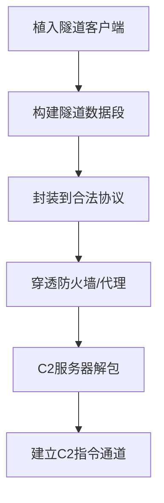

# 协议隧道 (T1572)

## 一句话通俗理解

就像在公共水管里偷偷接一根私管——攻击者把C2流量"伪装"成合法的DNS、HTTP或SSH流量，藏在正常的网络服务中传输。

## 30秒速查卡

| 维度 | 说明 |
|------|------|
| **一句话理解** | 攻击者把C2指令打包进DNS、HTTP、SSH等合法协议中传输，就像把密信藏在牛奶盒里送出去——外层看着正常，内层全是机密 |
| **三种常见手法** | ① DNS隧道：C2数据藏在DNS查询/响应的TXT记录中 ② SSH隧道：通过SSH连接转发任意TCP流量 ③ ICMP隧道：C2数据藏在Ping请求的数据字段中 |
| **常用工具** | dnscat2（DNS隧道）、chisel（HTTP/SSH隧道）、iodine（DNS隧道）、plink（SSH隧道） |
| **关键日志源** | DNS日志（TXT记录大小、子域名熵值、查询频率）、防火墙日志（非标准端口的SSH连接）、NetFlow/IPFIX（异常协议比例） |
| **难度评级** | ⭐⭐⭐ 高级 - 需要理解网络协议栈、编码/加密技术和防火墙绕过原理 |

## 难度等级

- ⭐⭐⭐ 高级（需要深入技术知识）

## 技术描述

协议隧道（Protocol Tunneling）是 MITRE ATT&CK 框架中命令与控制战术下的一种高级技术，编号为 T1572。

**通俗解释：**
协议隧道是将一种协议封装在另一种网络协议中传输的技术。攻击者把C2控制数据"打包"进完全合法的协议流量中。比如把C2指令编码成DNS查询请求，或者通过SSH隧道转发所有后续C2流量。因为外层流量看起来完全正常，防御者很难区分"真正的DNS查询"和"藏了C2数据的DNS查询"。

**技术原理：**
协议隧道利用OSI模型的协议分层特性：
1. **隧道协议**（外层）：正常、允许通过的协议（DNS/HTTP/SSH）
2. **被封装协议**（内层）：实际传输的C2指令和数据
3. **封装过程**：C2数据经过编码/加密后放入外层协议的数据字段

**常见隧道类型：**
- **DNS隧道**：C2数据编码在DNS查询/响应中（最流行）
- **HTTP隧道**：C2数据编码在HTTP头/请求体中
- **SSH隧道**：通过SSH连接转发任意TCP流量
- **ICMP隧道**：C2数据编码在ICMP数据字段中

**用途与影响：**
协议隧道是APT组织的核心武器之一。因为隧道利用的是网络运维"必须允许"的协议（企业必须能查DNS才能上网），防御者几乎无法完全阻止。DNS隧道特别难以检测——每个DNS查询看起来都很正常，但N多查询串在一起就形成了C2通道。

## 子技术列表

**该技术没有子技术。**

## 攻击流程

### 典型攻击流程

```
植入隧道客户端 --> 构建隧道协议包 --> 穿透防火墙 --> 建立C2通道
```



**步骤详解：**

1. **植入隧道客户端**
   - 通俗描述：在被黑电脑上安装隧道软件
   - 技术细节：隧道工具通常为单文件，无安装过程
   - 常用工具：dnscat2、chisel、plink

2. **构建隧道协议包**
   - 通俗描述：将C2指令编码到协议数据段
   - 技术细节：数据编码方式（Base64、Hex等）

3. **穿透防火墙**
   - 技术细节：外层协议是防火墙必须放行的

## 真实案例

### 案例1：DNSPionage — DNS隧道C2（2023-2024年）

- **时间**: 2023-2024年
- **目标**: 全球航空、酒店、金融行业
- **攻击组织**: DNSPionage
- **手法**: DNSPionage 使用 DNS 隧道作为主要C2通道。恶意软件定期向攻击者控制的域名发送TXT记录类型的DNS查询——C2指令编码在TXT记录响应中返回。隧道使用了 Base32 和自定义编码，分片传输以防止单个DNS查询体积过大。DNS 查询频率模拟正常业务系统的DNS活动（每5-10分钟一次查询）。
- **影响**: 多个行业组织数据长期被窃取
- **参考链接**: [MITRE ATT&CK - DNSPionage](https://attack.mitre.org/software/S1060/)

### 案例2：ChromeLoader — DNS/HTTP双隧道（2022-2023年）

- **时间**: 2022-2023年
- **目标**: 全球浏览器用户
- **攻击组织**: ChromeLoader
- **手法**: ChromeLoader 使用 DNS 隧道作为初始C2通道，在确认被感染系统有价值后切换到 HTTP 隧道。DNS 隧道阶段通过TXT记录获取C2指令；切换到HTTP隧道后，通过自定义HTTP请求头传递C2数据。双隧道设计实现了"先隐蔽后高效"的平衡。
- **影响**: 超过50000台计算机被感染
- **参考链接**: [Unit 42 - ChromeLoader (2023)](https://unit42.paloaltonetworks.com/chromeloader-malware/)

### 案例3：Simda — 多层隧道技术（2017-2024年）

- **时间**: 2017-2024年
- **目标**: 全球Windows用户
- **攻击组织**: Simda Botnet
- **手法**: Simda 使用 DNS 隧道作为"存活探测"通道，通过周期性的DNS TXT查询确认受害系统在线。同时使用 SSH 隧道作为数据传输通道——如果 DNS 通道指示有指令等待，Simda 通过 SSH 隧道发起独立的加密连接下载指令和数据。Simda 的 C2 域名使用 DGA 算法生成，每日更换。
- **影响**: 大规模的僵尸网络
- **参考链接**: [Recorded Future - Simda Botnet](https://www.recordedfuture.com/simda-botnet)

### 案例4：Goffee — DQuic + BindSycler 复合隧道（2024-2025年）

- **时间**: 2024-2025年
- **目标**: 俄罗斯组织
- **攻击组织**: Goffee
- **手法**: Goffee 使用多种隧道技术。DQuic 建立基于 QUIC 协议（HTTP/3）的隧道——QUIC 基于 UDP，很多传统防火墙不检查。BindSycler 建立 SSH 隧道——通过 SSH 远程端口转发，将内部服务的流量通过加密通道引出目标网络。Goffee 还利用多种第三方服务（Slack、Telegram、Cloudflare Workers）作为隧道中继。
- **影响**: 俄罗斯军工企业被入侵
- **参考链接**: [PT Security - Goffee Group (2025)](https://global.ptsecurity.com/en/research/pt-esc-threat-intelligence/fortune-telling-on-goffee-grounds/)

## 红队视角

> ⚠️ **免责声明**：以下内容仅用于合法的安全测试、渗透测试和教育目的。未经授权对他人系统进行测试是违法行为。

### 实战技巧

1. **DNS隧道频率控制**
   DNS查询频率设置为5-10分钟一次，模拟正常DNS活动。使用多级域名增加编码容量。

2. **协议选择策略**
   根据目标环境选择隧道协议。如果使用Microsoft DNS，选择DNS隧道；如果使用OpenSSH，选择SSH隧道。

### 常用工具

| 工具名称 | 用途 | 平台 | 链接 |
|----------|------|------|------|
| dnscat2 | DNS隧道 C2 | 跨平台 | https://github.com/iagox86/dnscat2 |
| chisel | HTTP/SSH隧道 | Go | https://github.com/jpillora/chisel |
| iodine | DNS隧道 | Linux | https://github.com/yarrick/iodine |
| plink | SSH隧道 | Windows | PuTTY工具包 |

### 注意事项

- DNS隧道数据拆包/组包逻辑复杂
- 隧道协议会引入额外延迟

## 蓝队视角

### 检测要点

1. **DNS查询异常**
   - 数据集来源：DNS日志
   - 异常特征：异常大的TXT记录响应、子域名包含随机字符串

2. **SSH隧道检测**
   - 异常特征：非SSH标准端口、SSH连接持续时间异常

### 监控建议

- 部署 DNS 隧道检测系统
- 监控 SSH 连接的目的地

## 检测建议

### 网络层检测

**检测方法：** 分析 DNS 查询的异常模式。

**示例（Zeek脚本逻辑）：**
```zeek
# DNS隧道检测逻辑（Zeek脚本）
event dns_end(c: connection, msg: dns_msg)
{
    # 检测1：TXT记录响应大于500字节
    if ( |msg$answers| > 500 )
    {
        NOTICE([$note=DNS_Tunnel_Alert,
                $msg=fmt("疑似DNS隧道：TXT记录异常大 (%d 字节)", |msg$answers|)]);
    }

    # 检测2：子域名熵值大于4.0（随机字符串特征）
    if ( calc_subdomain_entropy(msg$query) > 4.0 )
    {
        NOTICE([$note=DNS_Tunnel_Alert,
                $msg="疑似DNS隧道：子域名包含高熵随机字符串"]);
    }

    # 检测3：单小时内DNS查询超过60次
    if ( c$dns$query_count > 60 )
    {
        NOTICE([$note=DNS_Tunnel_Alert,
                $msg=fmt("疑似DNS隧道：DNS查询频率异常 (%d 次/小时)", c$dns$query_count)]);
    }
}
```

### Sigma规则示例

**Sigma规则示例：**
```yaml
title: DNS隧道检测（异常TXT记录）
status: experimental
description: 检测DNS TXT记录查询的异常大小和频率，可能指示DNS隧道C2通信
logsource:
    category: network
    product: zeek
detection:
    selection:
        dns_qtype: "TXT"
        dns_rcode: "NOERROR"
    condition: selection and (txt_record_size > 500 or dns_query_count > 60 within 1h)
level: high
tags:
    - attack.t1572
    - attack.command_and_control
```

## 缓解措施

### 优先级1：关键措施

**措施名称：** DNS 隧道检测

**具体实施步骤：**
1. 部署 DNS 隧道检测工具
2. 限制TXT记录查询的大小

### MITRE ATT&CK 缓解措施映射

| 缓解措施ID | 缓解措施名称 | 适用性 | 说明 |
|------------|-------------|--------|------|
| M0938 | DNS过滤 | 适用 | 部署DNS安全网关 |

## 动手实验

> ⚠️ **重要提示**：所有实验必须在隔离的实验室环境中进行，禁止对未授权的真实系统进行测试。

### 实验1：搭建 DNS 隧道（高级）

**实验目标：** 使用 dnscat2 建立 DNS 隧道。

**实验步骤：**
1. 配置 dnscat2 服务端
2. 在受害系统执行客户端
3. 通过 DNS 隧道执行命令

## 术语解释

| 术语 | 英文原名 | 通俗解释 |
|------|----------|----------|
| 隧道 | Tunnel | 将一种协议封装到另一种协议中的传输方式 |
| DNS隧道 | DNS Tunnel | 利用DNS协议传输非DNS数据 |
| 外层/内层 | Outer/Inner | 用于封装的外层协议和被封装的内层数据 |

## 参考资料

### 官方文档

- [MITRE ATT&CK - T1572](https://attack.mitre.org/techniques/T1572/)

### 安全报告

- [Unit 42 - ChromeLoader (2023)](https://unit42.paloaltonetworks.com/chromeloader-malware/)
- [PT Security - Goffee (2025)](https://global.ptsecurity.com/en/research/pt-esc-threat-intelligence/fortune-telling-on-goffee-grounds/)
