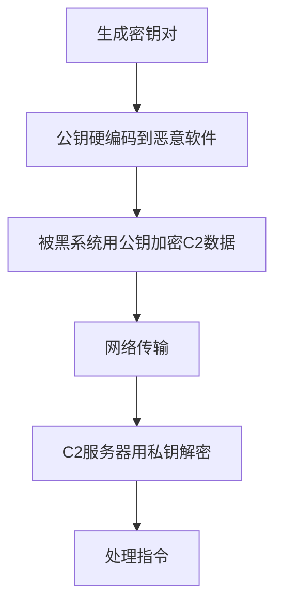

# 加密通道 (T1573)

## 一句话通俗理解

就像给C2通信加了一把锁——就算别人截获了通信内容，没有钥匙也看不懂里面是什么。

## 难度等级

- ⭐⭐ 中级（需要一定基础）

## 技术描述

加密通道（Encrypted Channel）是 MITRE ATT&CK 框架中命令与控制战术下的重要技术，编号为 T1573。

**通俗解释：**
如果C2通信不加密，安全设备可以直接"偷看"通信内容——看到"下载恶意软件""窃取密码"等命令，直接拦截。加密就是给C2数据"上锁"：攻击者和被黑电脑各有一把钥匙（密钥），通信内容用钥匙加密后再传输。安全设备看到的是乱码，只有通信双方能看懂。普通网站用 HTTPS 也是同样的原理——但攻击者用的是自己的加密方式，而不是标准的 HTTPS。

**技术原理：**
加密通道在应用层协议的载荷之上实施，与标准协议加密（HTTPS 的 TLS）不同，攻击者可能使用自定义加密方案。这就形成了"双重加密"——外层是 HTTPS 的 TLS 加密，内层是恶意软件自己的加密。即使安全设备解密了 TLS，看到的仍然是加密数据。

**对称加密（T1573.001）：** 加密和解密用同一个密钥，速度快，适合大量数据传输。常见算法：AES、RC4、ChaCha20。

**非对称加密（T1573.002）：** 加密和解密用不同的密钥（公钥加密、私钥解密），速度慢但更安全。常用于分发对称密钥或数字签名验证。

**用途与影响：**
加密使网络监控工具无法读取C2通信内容，增加检测和逆向分析的难度。高级 APT 组织使用自定义加密方案，使即使流量被捕获也需要持续的分析才能破解密文。

## 子技术列表

**该技术共有 2 个子技术：**

| 子技术ID | 中文名称 | 通俗解释 |
|----------|----------|----------|
| T1573.001 | 对称加密 | 加密解密用同一把钥匙，速度快，适合大量C2通信 |
| T1573.002 | 非对称加密 | 用公钥加密、私钥解密，更安全但慢，常用于交换密钥 |

<details>
<summary><strong>展开查看各子技术详细说明</strong></summary>

### T1573.001 - 对称加密

**通俗理解：** 你和攻击者用同一把锁的钥匙，你锁上他打开，他锁上你打开。

**详细说明：**
对称加密使用相同的密钥进行加密和解密。恶意软件中通常硬编码了对称密钥，或通过密钥派生函数（PBKDF2、HKDF）在运行时生成。对称加密计算开销小，适合需要高频率通信的C2场景。算法包括 AES-128/256、RC4（现在被认为不安全但仍在被使用）、Salsa20/ChaCha20（现代流加密）。

### T1573.002 - 非对称加密

**通俗理解：** 攻击者给被黑电脑一把"锁"（公钥），被黑电脑把情报锁进箱子，只有攻击者自己的钥匙（私钥）能打开。

**详细说明：**
非对称加密使用公钥-私钥对。公钥硬编码在恶意软件中用于加密发送给C2的数据，私钥仅由C2服务器持有。即使用户提取了恶意软件中的公钥，也无法解密C2服务器的响应。常见算法包括 RSA、ECDSA、Curve25519。计算成本高，通常仅用于关键数据交换或对称密钥分发。

</details>

## 攻击流程

### 典型攻击流程

```
生成密钥 --> 硬编码/分发密钥 --> 加密C2指令 --> 传输加密数据 --> 解密执行
```



**步骤详解：**

1. **生成密钥对**（非对称加密）
   - 通俗描述：C2服务器生成一对密钥（公钥+私钥）
   - 技术细节：使用 RSA 2048/4096 位或 ECDSA 算法
   - 常用工具：openssl

2. **公钥硬编码到恶意软件**
   - 通俗描述：公钥（只能加密不能解密）被嵌入恶意软件中
   - 技术细节：公钥以二进制形式存储在恶意软件代码中
   - 常用工具：编译器

3. **加密/解密C2指令**
   - 通俗描述：通信双方用对称密钥加密大量数据
   - 技术细节：先用非对称加密传输会话密钥，后续用对称加密通信
   - 常用工具：AES-NI硬件加速

## 真实案例

### 案例1：APT29 — SUNBURST 自定义加密（2020年）

- **时间**: 2020年
- **目标**: 美国政府机构、科技公司
- **攻击组织**: APT29（NOBELIUM）
- **手法**: APT29 的 SUNBURST 后门使用高度定制的加密方案。初期使用自定义的 XOR + 替换密码的加密算法，后续演进为 AES 加密变体。其 APC（AES + Polysubstitution Cipher）方案专门用于编码C2载荷。WellMess 后门同样使用 AES 加密，密钥通过 RSA 非对称加密传输。这种双重加密确保即使流量被捕获也无法解密。
- **影响**: SolarWinds 供应链攻击导致多家美国政府机构和科技公司被入侵
- **参考链接**: [MITRE ATT&CK - S0557](https://attack.mitre.org/software/S0557/)

### 案例2：Cobalt Strike — AES 加密元数据（持续活跃）

- **时间**: 2012年至今
- **目标**: 全球多行业
- **攻击组织**: 多个APT组织
- **手法**: Cobalt Strike 的 Beacon 使用标准的 HTTPS 加密，同时在其 Malleable C2 配置文件中增加了自定义 AES 加密层。Beacon 的 HTTP/HTTPS 流量使用标准 TLS，但在 HTTP body 中使用 AES-256 加密元数据和任务数据。攻击者可以通过 Malleable C2 配置文件自定义加密实现方式。2024年 Unit 42 的报告显示，攻击者从公开仓库复制 Malleable C2 配置，仅修改少量参数就能生成新的加密指纹。
- **影响**: 使用最广泛的C2框架之一，被几乎所有APT组织使用
- **参考链接**: [Unit 42 - Public Cobalt Strike Profiles (2024)](https://unit42.paloaltonetworks.com/attackers-exploit-public-cobalt-strike-profiles/)

### 案例3：TrickBot — 多层加密C2通道（2016-2022年）

- **时间**: 2016-2022年
- **目标**: 全球金融机构
- **攻击组织**: TrickBot
- **手法**: TrickBot 使用多层加密保护C2通道。第一层使用 RC4 加密整个 HTTP body，第二层使用硬编码的 XOR 密钥进一步混淆配置数据。C2通信使用 JSON 格式 payload，经过 RC4 加密后 Base64 编码发送。配置文件中的C2列表是 AES 加密的，需要从恶意软件样本中提取解密密钥。
- **影响**: 全球银行和金融机构遭受重大损失
- **参考链接**: [MITRE ATT&CK - S0266](https://attack.mitre.org/software/S0266/)

### 案例4：Duqu 2.0 — 自定义 RC6 加密（2015年）

- **时间**: 2015年
- **目标**: 伊朗核谈判相关机构
- **攻击组织**: Duqu 2.0（疑似与 Stuxnet 同源）
- **手法**: Duqu 2.0 使用自定义的 RC6 加密算法——加密密钥硬编码在恶意软件中，每个C2会话使用16字节加密密钥与4字节IV的组合。加密后的数据嵌入到 HTTP 协议和 JPEG 图片文件中，使流量分析工具难以识别C2模式。
- **影响**: 全球外交和谈判机构被监控
- **参考链接**: [MITRE ATT&CK - S0038](https://attack.mitre.org/software/S0038/)

## 红队视角

> ⚠️ **免责声明**：以下内容仅用于合法的安全测试、渗透测试和教育目的。未经授权对他人系统进行测试是违法行为。

> ⚠️ **免责声明**：以下内容仅用于合法的安全测试。

### 实战技巧

1. **混合加密策略**
   使用非对称加密（如 Curve25519）交换会话密钥，然后使用对称加密（如 ChaCha20-Poly1305）加密大量通信数据，兼顾安全性和性能。

2. **密钥轮换**
   定期更换加密密钥，即使某个密钥被破解，历史通信数据仍然安全。

### 常用工具

| 工具名称 | 用途 | 平台 | 链接 |
|----------|------|------|------|
| OpenSSL | 加密工具 | 跨平台 | https://www.openssl.org/ |
| libsodium | 现代加密库 | 跨平台 | https://doc.libsodium.org/ |

### 注意事项

- 自定义加密算法容易实现错误，导致可被破解
- 硬编码密钥存在被逆向分析提取的风险
- 加密后的高熵数据本身可能被检测

## 蓝队视角

### 检测要点

1. **JA3/JA3S 指纹**
   - 关注字段：TLS 握手指纹
   - 异常特征：与常见浏览器/客户端不匹配的 JA3 指纹

2. **加密流量模式**
   - 关注字段：加密数据长度、传输频率
   - 异常特征：固定间隔的加密数据包、固定的加密数据块大小

### 监控建议

- 部署 TLS 解密代理检查加密流量
- 使用机器学习分类器识别加密C2流量
- 分析 JA3 指纹与已知恶意工具的匹配

## 检测建议

### 网络层检测

**检测方法：** 分析 TLS 握手特征和加密流量模式。

**示例（JA3指纹检测）：**
```
JA3 指纹: 19e29534fd49dd27d09234e639c4057e (Golang TLS - Sliver C2)
```

### Sigma规则示例：
```yaml
title: 可疑 JA3 指纹检测
status: experimental
description: 检测与已知C2框架匹配的TLS指纹
logsource:
    category: network
    product: zeek
detection:
    selection:
        ja3: "19e29534fd49dd27d09234e639c4057e"
    condition: selection
level: high
tags:
    - attack.t1573
```

## 缓解措施

### 优先级1：关键措施

**措施名称：** 部署 TLS 解密代理

**具体实施步骤：**
1. 部署 SSL/TLS 拦截代理
2. 配置证书策略
3. 检查解密后的内容

### MITRE ATT&CK 缓解措施映射

| 缓解措施ID | 缓解措施名称 | 适用性 | 说明 |
|------------|-------------|--------|------|
| M0941 | 加密流量分析 | 适用 | 部署TLS解密和加密流量分析 |
| M0931 | 网络监控 | 适用 | 监控加密流量模式 |

## 动手实验

> ⚠️ **重要提示**：所有实验必须在隔离的实验室环境中进行，禁止对未授权的真实系统进行测试。

### 实验1：OpenSSL 加解密（初级）

**实验目标：** 掌握基本的加密操作。

**实验步骤：**
1. 使用 OpenSSL 生成 RSA 密钥对
2. 用公钥加密文件
3. 用私钥解密

### 实验2：分析 TLS 握手指纹（中级）

**实验目标：** 学习 JA3 指纹的生成和检测。

**实验步骤：**
1. 使用 Wireshark 捕获 HTTPS 连接
2. 提取 TLS Client Hello 信息
3. 计算 JA3 指纹
4. 对比不同客户端的 JA3 差异

## 术语解释

| 术语 | 英文原名 | 通俗解释 |
|------|----------|----------|
| 对称加密 | Symmetric Encryption | 加密解密用同一把钥匙 |
| 非对称加密 | Asymmetric Encryption | 加密用公钥、解密用私钥 |
| JA3指纹 | JA3 Fingerprint | TLS客户端握手的"指纹" |
| AES | Advanced Encryption Standard | 高级加密标准，最常用的对称加密 |
| RSA | Rivest-Shamir-Adleman | 最常用的非对称加密算法 |

## 参考资料

### 官方文档

- [MITRE ATT&CK - T1573](https://attack.mitre.org/techniques/T1573/)
- [MITRE ATT&CK - T1573.001](https://attack.mitre.org/techniques/T1573/001/)
- [MITRE ATT&CK - T1573.002](https://attack.mitre.org/techniques/T1573/002/)

### 安全报告

- [Unit 42 - JA3 指纹库](https://github.com/salesforce/ja3)
- [Cobalt Strike Malleable C2 文档](https://www.cobaltstrike.com/help-malleable-c2)
