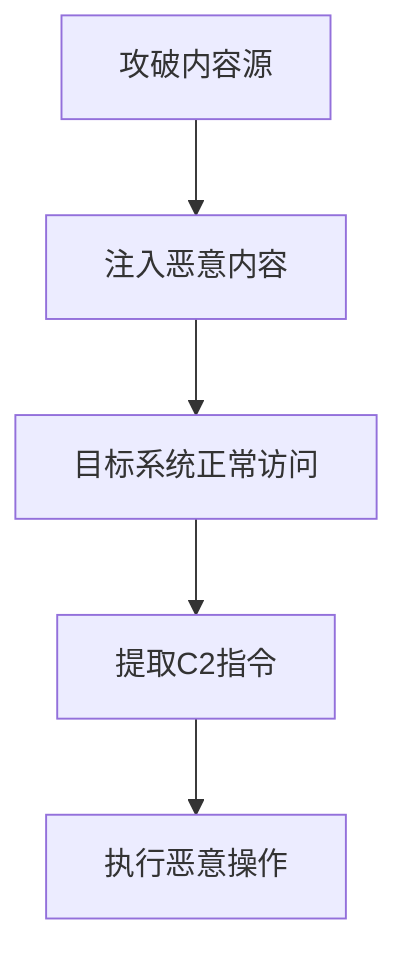

# 内容注入 (T1659)

## 一句话通俗理解

就像把情报藏在公告栏的公告里——攻击者篡改正常网站的内容，把C2指令藏在里面，被黑电脑去读取这些内容来接收指令。

## 难度等级

- ⭐⭐⭐ 高级（需要深入技术知识）

## 技术描述

内容注入（Content Injection）是 MITRE ATT&CK 框架中命令与控制战术下的一种高级技术，编号为 T1659。

**通俗解释：**
攻击者不去直接连接被黑的电脑，而是在被黑电脑"信任"的地方（比如经常访问的新闻网站、软件更新服务器、广告网络）注入恶意内容。被黑电脑在正常访问这些内容时，恶意软件从中提取隐藏的C2指令。这就像间谍不去接头人家里，而是在公共布告栏贴一张密文，接头人路过时看到就能收到指令。

**技术原理：**
1. 攻击者攻破一个目标系统信任的第三方内容源（如新闻网站、CDN节点、广告服务器、软件更新服务器）
2. 在合法内容中注入隐藏的C2数据（如HTML注释、JavaScript变量、图片LSB隐写、JSON响应中的额外字段）
3. 受感染的系统在正常访问这些内容时，恶意软件从中提取并解码C2指令
4. 由于流量目标是完全合法的第三方服务，网络安全设备无法识别其中的恶意内容

**用途与影响：**
内容注入利用了"信任"这个最薄弱的环节。即使目标网络的安全防护做得再好，如果它信任的第三方内容源被攻破，攻击者就能在不与目标建立直接连接的情况下下发C2指令。SolarWinds 供应链攻击就是内容注入的经典案例——攻击者将恶意代码注入到合法的软件更新中，数千家组织主动下载了包含后门的"更新"。

## 子技术列表

**该技术没有子技术。**

## 攻击流程

### 典型攻击流程

```
攻破内容源 --> 注入恶意内容 --> 目标访问 --> 提取C2指令 --> 执行操作
```



**步骤详解：**

1. **攻破内容源**
   - 通俗描述：攻击者入侵一个被黑电脑经常访问的网站或服务
   - 技术细节：通过 SQL 注入、CMS 漏洞、弱口令等方式获取网站的控制权，或通过供应链攻击侵入软件更新服务器
   - 常用工具：SQL 注入工具、CMS 漏洞利用、社会工程

2. **注入恶意内容**
   - 通俗描述：在正常内容中藏入C2指令
   - 技术细节：将编码后的C2指令藏在HTML注释、JavaScript变量、图片文件的像素数据、JSON响应的额外字段中
   - 常用工具：Web Shell、自定义注入脚本

3. **目标系统正常访问**
   - 通俗描述：被黑的电脑像平常一样访问这些网站
   - 技术细节：用户正常浏览网页，恶意软件在后台监控网络流量或浏览器活动，从响应内容中提取隐藏数据
   - 常用工具：浏览器扩展、中间人代理

4. **提取C2指令**
   - 通俗描述：恶意软件从网页内容中解析出隐藏的指令
   - 技术细节：根据预定义的提取规则（如正则表达式、特定HTML标签ID、特定的JSON字段名）从内容中提取编码数据，然后解码得到实际指令
   - 常用工具：自定义解析函数

5. **执行恶意操作**
   - 通俗描述：被黑电脑执行攻击者的指令
   - 技术细节：执行从C2指令中解析出的命令
   - 常用工具：shell命令、PowerShell、WMI

## 真实案例

### 案例1：UNC2452（SolarWinds / NOBELIUM）— 可信更新通道注入（2019-2020年）

- **时间**: 2019年9月-2020年12月
- **目标**: 美国政府机构、科技公司、关键基础设施（约18000个组织受影响）
- **攻击组织**: UNC2452 / NOBELIUM（与APT29关联）
- **手法**: 这是迄今为止最著名的内容注入案例。攻击者侵入了 SolarWinds 的构建系统，将恶意代码注入到 Orion 软件的合法数字签名更新中。当受影响的组织自动下载 SolarWinds 更新时，其中包含了伪装成正常补丁的 SUNBURST 后门。SUNBURST 通过合法的软件更新管道在目标系统中存活了数月。恶意代码隐藏在 SolarWinds.Orion.Core.BusinessLayer.dll 中，通过正常的 HTTP API 调用与 C2 服务器通信，等待特定的"休眠"期后才激活。
- **影响**: 美国多个联邦机构（包括财政部、商务部、能源部）、FireEye、Microsoft 等顶级科技公司被入侵
- **参考链接**: [MITRE ATT&CK - S0557](https://attack.mitre.org/software/S0557/)

### 案例2：Operation DreamJob (Lazarus Group) — 恶意广告注入（2020-2022年）

- **时间**: 2020-2022年
- **目标**: 全球国防工业、航空航天、加密货币行业
- **攻击组织**: Lazarus Group（Hidden Cobra）
- **手法**: Lazarus 的高级分支 Operation DreamJob 攻破了若干中小型广告网络服务器，将恶意 JavaScript 代码注入到数字广告中。当受感染系统访问包含恶意广告的正常网站时，广告代码解码出隐藏的C2指令。这些指令嵌入在广告内容的JSON配置中，看起来是正常的广告展示参数，实际上是Base64编码的C2命令。由于流量指向正常的广告服务CDN，受害网络的安全设备无法识别出C2通信。
- **影响**: 多个行业的员工被针对性钓鱼攻击，敏感数据被窃取
- **参考链接**: [Kaspersky - Operation DreamJob](https://securelist.com/operation-dreamjob/104237/)

### 案例3：APT41（Winnti）— Web 内容投毒（2019-2021年）

- **时间**: 2019-2021年
- **目标**: 全球游戏行业、制药企业、高科技制造业
- **攻击组织**: APT41（Winnti / Barium）
- **手法**: APT41 通过 SQL 注入攻破多个合法网站的内容管理系统，在 HTML 页面中注入隐藏的恶意代码。这些代码以 HTML 注释、隐藏的 iframe、JavaScript 变量的形式存在，其中嵌入了C2指令数据。受感染系统在正常访问这些网站时，恶意软件解析页面内容提取C2指令。APT41 选择高流量行业新闻网站作为注入目标，确保受感染主机有较大可能访问到这些被投毒的网站，并使用动态注入策略（仅对特定IP段的请求返回含恶意内容的响应）。
- **影响**: 游戏公司源代码被盗、制药企业研发数据泄露
- **参考链接**: [MITRE ATT&CK - G0096](https://attack.mitre.org/groups/G0096/)

### 案例4：Cobalt Strike 通过 Quora 和 GitHub 内容注入（2024-2025年）

- **时间**: 2024年11月-2025年4月
- **目标**: 俄罗斯IT企业及其他国家实体
- **攻击组织**: 未命名APT组织
- **手法**: 安全厂商 Kaspersky 在2025年7月披露了一起复杂的攻击活动，攻击者利用社交媒体和代码托管平台的内容注入功能隐藏C2基础设施。攻击者创建了 GitHub、Quora、Microsoft Learn Challenge 等平台的账户配置，在这些合法网站的页面中嵌入经过 XOR 加密的 URL 字符串。恶意软件使用 DLL 劫持技术加载后，从这些平台获取 HTML 内容，搜索特定模式的加密字符串，解码后得到 C2 shellcode 的下载地址。这种方法使攻击者的 C2 基础设施完全隐藏在合法的第三方平台内容中。该活动在2024年11月至12月最为活跃，一直持续到2025年4月。
- **影响**: 俄罗斯IT公司被入侵，恶意软件同时在日本、马来西亚、秘鲁等国被检测到
- **参考链接**: [Kaspersky - Targeted attacks leverage social media as C2 servers](https://securelist.com/cobalt-strike-attacks-using-quora-github-social-media/117085/)

## 红队视角

> ⚠️ **免责声明**：以下内容仅用于合法的安全测试、渗透测试和教育目的。未经授权对他人系统进行测试是违法行为。

### 实战技巧

1. **选择合适的注入载体**
   优先选择目标组织日常业务依赖的第三方服务（如 Salesforce、Confluence、Jira 等企业级 SaaS），这些服务的内容更新频繁，且安全策略通常允许其流量。

2. **利用 CDN 缓存投毒**
   CDN 边缘节点缓存的内容可以被"毒化"——通过控制源服务器返回包含恶意内容但被 CDN 缓存的响应，使后续所有访问该 CDN 节点的用户都收到被篡改的内容。

3. **动态响应策略**
   只对特定 IP 段、特定 User-Agent、特定 Cookie 的请求返回包含恶意内容的响应，对其他请求返回正常内容。这样即使网站管理员检查也无法发现异常。

### 常用工具

| 工具名称 | 用途 | 平台 | 链接 |
|----------|------|------|------|
| Web Shell | 持续控制被攻破的Web服务器 | 跨平台 | 各种WebShell |
| Cobalt Strike | 配合内容注入的C2框架 | Windows/Linux | https://www.cobaltstrike.com/ |
| Beef | 浏览器利用框架 | Linux | https://beefproject.com/ |

### 注意事项

- 内容注入通常需要攻破第三方基础设施，这增加了攻击的复杂性和法律风险
- 注入的内容要伪装得足够逼真，避免被网站所有者发现
- 需要提前了解目标系统会访问哪些特定的网站或服务

## 蓝队视角

### 检测要点

1. **软件更新完整性检查**
   - 日志来源：系统更新日志、文件完整性监控
   - 关注字段：数字签名、文件哈希、文件大小
   - 异常特征：合法软件的更新文件签名异常、文件大小与历史版本显著不同

2. **Web 响应内容异常**
   - 日志来源：Web 代理日志、网络流量捕获
   - 关注字段：响应内容的结构变化、意外字段
   - 异常特征：HTML 中出现隐藏的 iframe、异常的 Base64 字符串、JSON 响应中的非标准字段

3. **DNS 解析异常**
   - 日志来源：DNS 服务器日志
   - 关注字段：域名解析结果变化、DNS 记录变更频率
   - 异常特征：合法域名的 A 记录突然变化、新增异常的 NS 记录

### 监控建议

- 部署网页完整性监控系统，定期对比关键网站的内容基线
- 实施软件更新的数字签名强制验证
- 监控 CDN 和云服务内容的异常变更

## 检测建议

### 网络层检测

**检测方法：** 分析 HTTP 响应内容中的异常模式。

**示例（Suricata规则）：**
```
alert http $EXTERNAL_NET any -> $HOME_NET any (msg:"HTML中的隐藏iframe检测"; content:"<iframe"; http_server_body; content:"style|3d|""display:none"""; http_server_body; sid:1000002; rev:1;)
```

### 主机层检测

**检测方法：** 监控文件完整性校验。

**Windows事件ID：**
- 事件ID 4688：进程创建（检测非签名可执行文件的执行）
- 事件ID 1 (Sysmon)：进程创建（检测异常的执行链）

**具体命令示例：**
```bash
# 检查关键系统文件的数字签名
Get-AuthenticodeSignature -FilePath "C:\Program Files\SolarWinds\Orion\*.dll"
```

### 应用层检测

**检测方法：** 使用 Sigma 规则检测软件更新异常。

**Sigma规则示例：**
```yaml
title: 软件更新签名异常
status: experimental
description: 检测软件更新的数字签名验证失败
logsource:
    category: process_creation
    product: windows
detection:
    selection:
        EventID: 1
        Image|endswith: '\updater.exe'
    condition: selection
level: high
tags:
    - attack.t1659
```

## 缓解措施

### 优先级1：关键措施

**措施名称：** 软件更新完整性强制验证

**具体实施步骤：**
1. 对所有软件更新实施数字签名验证
2. 配置系统策略禁止安装未签名或签名异常的更新
3. 使用文件完整性监控（FIM）检测关键文件的意外变更

### 优先级2：重要措施

**措施名称：** Web 内容安全策略（CSP）

**具体实施步骤：**
1. 部署 CSP 标头限制外部资源的加载
2. 配置子资源完整性（SRI）检查
3. 监控违反 CSP 策略的行为

### 优先级3：建议措施

**措施名称：** 供应链安全审计

**具体实施步骤：**
1. 定期审计第三方软件供应商的安全状态
2. 对供应商的更新包进行沙箱测试
3. 建立供应链安全事件响应流程

### MITRE ATT&CK 缓解措施映射

| 缓解措施ID | 缓解措施名称 | 适用性 | 说明 |
|------------|-------------|--------|------|
| M0947 | 供应链安全 | 适用 | 审计和监控第三方软件供应链 |
| M0940 | 文件完整性监控 | 适用 | 监控关键系统文件的完整性 |

## 动手实验

> ⚠️ **重要提示**：所有实验必须在隔离的实验室环境中进行，禁止对未授权的真实系统进行测试。

### 实验环境准备

**所需工具：**
- Apache/Nginx Web 服务器
- Python 脚本编写
- Wireshark

### 实验1：在网页中隐藏数据（初级）

**实验目标：** 学习如何在正常的HTML页面中隐藏数据。

**实验步骤：**
1. 创建一个简单的 HTML 页面
2. 在 HTML 注释中隐藏编码后的指令
3. 编写 Python 脚本从页面中提取指令

**预期结果：** 理解如何在网页内容中隐藏和提取数据。

### 实验2：模拟软件更新注入（高级）

**实验目标：** 模拟通过被篡改的软件更新下发C2指令。

**实验步骤：**
1. 搭建一个模拟的软件更新服务器
2. 在正常的更新包中注入额外数据
3. 编写客户端脚本验证提取功能

**预期结果：** 理解供应链攻击中内容注入的原理。

## 术语解释

| 术语 | 英文原名 | 通俗解释 |
|------|----------|----------|
| 内容注入 | Content Injection | 在合法内容中藏入恶意数据的攻击手段 |
| 供应链攻击 | Supply Chain Attack | 通过攻击软件供应商来间接攻击最终用户 |
| CDN缓存投毒 | CDN Cache Poisoning | 篡改CDN缓存的正常内容，让所有用户都收到毒化数据 |
| 数字签名 | Digital Signature | 软件的电子签名，确保软件没有被篡改 |
| 隐写术 | Steganography | 把秘密信息藏在普通文件（如图片、音频）中的技术 |
| 文件完整性监控 | File Integrity Monitoring | 监控系统文件是否被非法修改的安全措施 |

## 参考资料

### 官方文档

- [MITRE ATT&CK - T1659](https://attack.mitre.org/techniques/T1659/)

### 安全报告

- [Kaspersky - Operation DreamJob](https://securelist.com/operation-dreamjob/104237/) - Lazarus 恶意广告注入分析
- [Kaspersky - Cobalt Strike via Quora/GitHub (2025)](https://securelist.com/cobalt-strike-attacks-using-quora-github-social-media/117085/) - 2024-2025内容注入攻击分析
- [Mandiant - SolarWinds 供应链攻击](https://www.mandiant.com/resources/evasive-attacker-leveraging-solarwinds-supply-chain-compromises)

### 工具与资源

- [SUNBURST 后门分析](https://attack.mitre.org/software/S0557/)
- [DNSpionage 工具分析](https://attack.mitre.org/software/S0311/)
