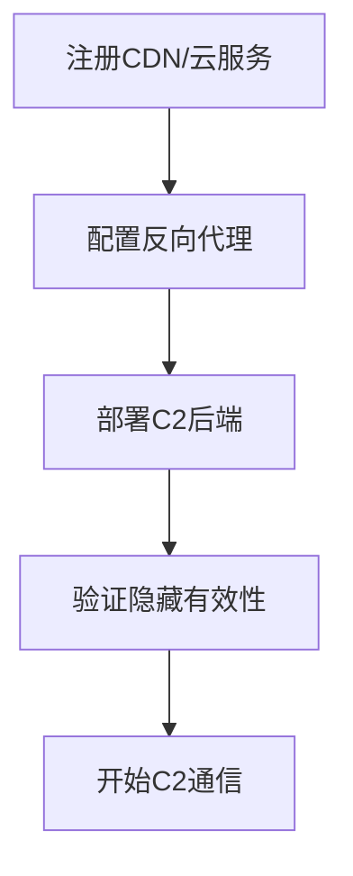

# 隐藏基础设施 (T1665)

## 一句话通俗理解

就像特工把自己的老巢伪装成普通办公室——攻击者把C2服务器藏在CDN、云服务后面，让防御方找不到真实位置。

## 难度等级

- ⭐⭐⭐ 高级（需要深入技术知识）

## 技术描述

隐藏基础设施（Hide Infrastructure）是 MITRE ATT&CK 框架中命令与控制战术下的一种高级技术，编号为 T1665。

**通俗解释：**
攻击者的C2服务器就像战场上的指挥部——如果被敌人发现位置，很快就会被端掉。所以攻击者费尽心思隐藏C2服务器：把C2服务部署在CDN后面（看起来像普通网站）、使用被攻破的合法服务器作为跳板、通过多层代理转发流量。防御者即使捕获到C2流量，看到的也是Cloudflare或Azure的IP地址，而不是攻击者的真实服务器。

**技术原理：**
攻击者构建"多层洋葱"式的隐藏架构：
1. 第一层（公开层）：CDN或云服务入口节点（如 Cloudflare、Azure Front Door）
2. 第二层（代理层）：中继跳板服务器
3. 第三层（真实层）：真正的C2控制服务器
每一层都可能对流量进行过滤和验证，只有满足特定条件的请求才能穿透到下一层。

**用途与影响：**
基础设施隐藏使防御者即使发现了C2活动，也无法追溯到攻击者的真实基础设施位置。成熟APT组织投入大量资源设计多层隐藏方案。2024年的研究表明，即使主流CDN提供商（如Akamai、Fastly）声称已阻止域名前置，实际测试中22/30的CDN仍然允许这种隐藏技术。

## 子技术列表

**该技术没有子技术。**

## 攻击流程

### 典型攻击流程

```
注册CDN/云服务 --> 配置反向代理 --> 部署C2后端 --> 验证隐藏有效性 --> 开始C2通信
```



**步骤详解：**

1. **注册CDN/云服务**
   - 通俗描述：攻击者在Cloudflare、AWS等平台注册免费或付费账号
   - 技术细节：使用虚假身份或被盗支付信息注册
   - 常用工具：Cloudflare、AWS CloudFront、Azure Front Door

2. **配置反向代理**
   - 通俗描述：配置CDN将流量转发到真实的C2服务器
   - 技术细节：CDN配置中将特定路径的请求转发到后端C2服务器
   - 常用工具：CDN控制台

3. **部署C2后端**
   - 通俗描述：在隐藏的服务器上运行C2框架
   - 技术细节：C2服务器只允许来自CDN节点的连接
   - 常用工具：Cobalt Strike、Mythic、Sliver

## 真实案例

### 案例1：APT41 — Cloudflare Workers 隐藏C2（2024年）

- **时间**: 2023-2024年
- **目标**: 全球航运、物流、科技行业
- **攻击组织**: APT41
- **手法**: APT41 在2024年的攻击活动中广泛使用 Cloudflare Workers 作为C2隐藏层。他们的 BEACON 后门使用 Cloudflare Workers 作为HTTPS C2通道的前端——恶意软件连接到 Cloudflare Workers URL，Workers 函数处理请求并将其转发到隐藏的C2后端。所有出站流量指向 Cloudflare 的IP，而非APT41的真实服务器。Mandiant 和 Google TAG 的联合报告详细披露了这种架构。
- **影响**: 多个国家数十家组织被入侵
- **参考链接**: [Google Cloud - APT41 Has Arisen From the DUST](https://cloud.google.com/blog/topics/threat-intelligence/apt41-arisen-from-dust)

### 案例2：Lotus Blossom — Fastly CDN 域名前置（2024年）

- **时间**: 2024年
- **目标**: 亚太地区组织和企业
- **攻击组织**: Lotus Blossom（疑似中国背景）
- **手法**: Viettel Threat Intelligence 在2025年3月披露，Lotus Blossom 组织自2022年以来持续利用域名前置技术隐藏C2基础设施。攻击者主要利用 Fastly CDN 的基础设施，使用 Cobalt Strike 配置 Host Header 和 Hostname 来混淆C2流量。2024年7月至10月期间，该组织使用了包括 www.wired.com、www.nescafe.com.vn、www.imgur.com 在内的多个高信誉域名作为前端。即使在2024年3月 Fastly 开始封锁域名前置后，部分旧CDN配置仍然可被利用。
- **影响**: 多个亚太地区的组织和企业被入侵
- **参考链接**: [Viettel - Lotus Blossom Domain Fronting](https://blog.viettelcybersecurity.com/lotus-blossoms-new-attack-campaign-domain-fronting-and-abusing-centralized-domain-management-part-2/)

### 案例3：Praetorian 研究 — Google 基础设施域名前置复活（2025年）

- **时间**: 2025年9月（披露）
- **目标**: 安全研究（概念验证）
- **手法**: Praetorian 安全公司在2025年9月披露了一种针对 Google 基础设施的新型域名前置技术。研究发现，Google Cloud Run、Google Meet、YouTube 等 Google 服务可以被用于域名前置——攻击者连接到 google.com，设置 Host header 指向攻击者控制的 Google Cloud Run 函数，CDN 将流量路由到攻击者的后端。由于 google.com、meet.google.com、payments.google.com 等域名被许多企业的 TLS 解密代理排除在外（因为证书锁定），这种技术极为隐蔽。Praetorian 还发布了开源的重定向工具帮助红队利用此技术。
- **影响**: 证明了域名前置技术并未"死亡"，Google 基础设施存在重大隐私/安全盲点
- **参考链接**: [Praetorian - Domain Fronting is Dead. Long Live Domain Fronting!](https://www.praetorian.com/blog/domain-fronting-is-dead-long-live-domain-fronting/)

### 案例4：APT29 — Cloudflare 域名前置（2020-2021年）

- **时间**: 2020-2021年
- **目标**: 美国政府机构、科技公司、智库
- **攻击组织**: APT29（Cozy Bear / NOBELIUM）
- **手法**: APT29 广泛使用域名前置技术，通过Cloudflare、Azure CDN 隐藏真实C2服务器。TLS握手时的SNI字段包含合法前端域名（如 cloudfront.net、azure.com），而 HTTP Host 头携带真实C2后端域名。CDN 根据 Host 头将流量路由到攻击者服务器。即使安全团队捕获到C2流量，原始连接也指向合法的CDN IP地址。
- **影响**: SolarWinds 供应链攻击的一部分，影响范围极其广泛
- **参考链接**: [MITRE ATT&CK - G0016](https://attack.mitre.org/groups/G0016/)

## 红队视角

> ⚠️ **免责声明**：以下内容仅用于合法的安全测试、渗透测试和教育目的。未经授权对他人系统进行测试是违法行为。

> ⚠️ **免责声明**：以下内容仅用于合法的安全测试。

### 实战技巧

1. **CDN 选择的考量**
   选择你目标网络中"必须允许"的CDN服务（如目标使用 Azure 就优先用 Azure Front Door）。流量指向目标业务依赖的CDN时，被封锁的可能性最低。

2. **域名前置的TLS细节**
   使用 Praetorian 2025年披露的技术——利用 Google Cloud Run 配合 google.com 进行域名前置，因为 google.com 通常被排除在 TLS 解密之外。

### 常用工具

| 工具名称 | 用途 | 平台 | 链接 |
|----------|------|------|------|
| Cloudflare Workers | Serverless C2前端 | Web | https://workers.cloudflare.com/ |
| Azure Front Door | CDN C2隐藏 | Azure | https://azure.microsoft.com/ |
| Google Cloud Run | Serverless C2前端 | GCP | https://cloud.google.com/run |
| Praetorian google-redirector | 域名前置工具 | Go | https://github.com/praetorian-inc/google-redirector |

### 注意事项

- 2024年后许多CDN已封禁域名前置（Cloudflare 2015年、AWS 2018年、Azure/Fastly 2024年）
- Praetorian 2025年发现的Google技术是目前较少被封锁的
- 隐藏基础设施需要持续关注CDN策略变化

## 蓝队视角

### 检测要点

1. **SNI 与 Host 头不一致**
   - 日志来源：TLS 解密代理、网络流量捕获
   - 异常特征：TLS SNI 字段与 HTTP Host 头指向不同域名

2. **CDN 流量异常**
   - 日志来源：Web 代理日志
   - 异常特征：到CDN域名的流量模式与正常业务不符

### 监控建议

- 部署 TLS 解密代理检查 SNI 和 Host 头的一致性
- 监控 CDN 域名的异常连接模式
- 与威胁情报源同步已知的恶意CDN入口

## 检测建议

### 网络层检测

**检测方法：** 监控 SNI 与 HTTP Host 头的不一致。

**示例（检测规则）：**
```
# 检测 TLS SNI 与 HTTP Host 头不匹配
当 TLS SNI="www.google.com" 且 HTTP Host="attacker-controlled.com" 时告警
```

### Sigma规则示例

**Sigma规则示例：**
```yaml
title: SNI与HTTP Host头不一致检测（域名前置）
status: experimental
description: 检测TLS SNI字段与HTTP Host头不一致的HTTPS请求，可能指示域名前置C2隐藏
logsource:
    category: network
    product: zeek
detection:
    selection:
        tls_sni: "*"
        http_host: "*"
    filter:
        tls_sni: http_host
    condition: selection and not filter
level: high
tags:
    - attack.t1665
    - attack.command_and_control
```

## 缓解措施

### 优先级1：关键措施

**措施名称：** 部署 TLS 解密和检查

**具体实施步骤：**
1. 部署 SSL/TLS 拦截代理
2. 启用 SNI 和 Host 头一致性检查
3. 配置告警规则

### MITRE ATT&CK 缓解措施映射

| 缓解措施ID | 缓解措施名称 | 适用性 | 说明 |
|------------|-------------|--------|------|
| M0941 | 加密流量分析 | 适用 | 解密和检查加密流量中的Host头 |

## 动手实验

> ⚠️ **重要提示**：所有实验必须在隔离的实验室环境中进行，禁止对未授权的真实系统进行测试。

### 实验1：配置 CDN 反向代理（中级）

**实验目标：** 理解CDN如何隐藏后端服务器。

**实验步骤：**
1. 在 AWS CloudFront 上配置一个分发
2. 配置源服务器指向本地运行的C2服务
3. 验证通过CDN域名访问后端服务

### 实验2：域名前置验证（高级）

**实验目标：** 理解域名前置的工作原理。

**实验步骤：**
1. 使用 curl 发送带自定义 Host 头的 HTTPS 请求
2. 观察 CDN 对 Host 头的处理
3. 分析 TLS SNI 和 HTTP Host 头的差异

## 术语解释

| 术语 | 英文原名 | 通俗解释 |
|------|----------|----------|
| 域名前置 | Domain Fronting | 利用CDN的流量转发机制隐藏真实目标 |
| CDN | Content Delivery Network | 内容分发网络，全球分布的缓存服务器集群 |
| SNI | Server Name Indication | TLS握手时客户端告诉服务器要访问哪个域名的字段 |
| 前端/后端 | Frontend/Backend | 对外可见的入口（前端）和隐藏的真实服务器（后端） |

## 参考资料

### 官方文档

- [MITRE ATT&CK - T1665](https://attack.mitre.org/techniques/T1665/)

### 安全报告

- [Praetorian - Google Domain Fronting (2025)](https://www.praetorian.com/blog/domain-fronting-is-dead-long-live-domain-fronting/)
- [Viettel - Lotus Blossom Domain Fronting (2025)](https://blog.viettelcybersecurity.com/lotus-blossoms-new-attack-campaign-domain-fronting-and-abusing-centralized-domain-management-part-2/)
- [ACM - CDN Domain Fronting 研究 (2024)](https://dl.acm.org/doi/10.1145/3589334.3645656)
