# 渗漏 (TA0010)

## 一句话理解

数据渗漏就是攻击者把偷到的数据偷偷运出去，就像小偷在屋里翻到值钱的东西后，要想办法运出小区大门。

## 战术概述

渗漏（Exfiltration）是MITRE ATT&CK框架中攻击链末端阶段的战术，编号为TA0010。

**通俗解释：**
渗漏战术描述了攻击者在目标网络中收集到数据后，如何将这些数据传输出网络的过程。就像小偷已经翻到了保险柜里的现金和金条，现在要想办法把这些赃物带出小区而不被保安发现。攻击者可以使用网络传输（通过互联网发送）、物理介质（用U盘拷贝）或云服务（上传到云端）等多种方式把数据运出去。

**在攻击中的作用：**
渗漏是攻击者的最终目标之一——把有价值的数据拿到手。没有成功的渗漏，前面的侦察、入侵、横向移动、收集都白费功夫。攻击者为了安全地把数据运出去，会想尽办法绕过网络监控、防火墙、DLP（防数据泄露）系统等安全措施。

**包含的技术类型：**
- 通过网络通道渗漏：利用C2通道、Web服务、替代协议等
- 通过物理方式渗漏：使用USB驱动器等物理介质
- 通过云方式渗漏：跨云账户数据传输
- 通过定时/自动化渗漏：计划任务、自动化工具
- 通过数据拆分渗漏：分片传输绕过大小限制

## 战术在攻击链中的位置

### 攻击链全景图

```mermaid
graph LR
    A["侦察<br/>TA0043"] --> B["资源开发<br/>TA0042"]
    B --> C["初始访问<br/>TA0001"]
    C --> D["执行<br/>TA0002"]
    D --> E["持久化<br/>TA0003"]
    E --> F["权限提升<br/>TA0004"]
    F --> G["隐蔽<br/>TA0005"]
    G --> H["防御削弱<br/>TA0112"]
    H --> I["凭证访问<br/>TA0006"]
    I --> J["发现<br/>TA0007"]
    J --> K["横向移动<br/>TA0008"]
    K --> L["收集<br/>TA0009"]
    L --> M["命令与控制<br/>TA0011"]
    M --> N["渗漏<br/>TA0010"]
    N --> O["影响<br/>TA0040"]

    style N fill:#ff6b6b,stroke:#333,stroke-width:3px,color:#fff
```

### 当前战术的角色

渗漏是攻击链中"把数据变现"的关键一步。在攻击者完成信息收集之后，渗漏负责把窃取的数据安全地传输到攻击者控制的系统。没有渗漏，攻击者就无法真正获得数据资产。渗漏成功与否直接决定了攻击的价值。

### 前置战术

- **收集 (TA0009)**：攻击者必须先在内网中把数据收集好，才能进行渗漏传输
- **命令与控制 (TA0011)**：多数渗漏方式需要利用已建立的C2通道或命令执行能力

### 后续战术

- **影响 (TA0040)**：渗漏完成后，攻击者可能进一步破坏系统（如加密勒索、数据销毁）

## 技术索引表

| 技术ID | 中文名称 | 难度 | 子技术数 | 一句话理解 | 文档状态 |
|--------|----------|------|----------|------------|----------|
| [T1567](./T1567-Exfiltration-Over-Web-Service.md) | 通过Web服务渗漏 | ⭐⭐ | 4 | 用网盘、GitHub、Pastebin等正规网站把数据传出去 | ✅ 已完成 |
| [T1052](./T1052-Exfiltration-Over-Physical-Medium.md) | 通过物理介质渗漏 | ⭐⭐ | 2 | 用U盘、硬盘等实物把数据带出网络 | ✅ 已完成 |
| [T1029](./T1029-Scheduled-Transfer.md) | 定时传输 | ⭐⭐ | 0 | 设定半夜自动上传，趁没人值班时偷偷传数据 | ✅ 已完成 |
| [T1537](./T1537-Transfer-Data-to-Cloud-Account.md) | 传输数据到云账户 | ⭐⭐ | 0 | 把受害者的云数据直接转到攻击者的云账户里 | ✅ 已完成 |
| [T1011](./T1011-Exfiltration-Over-Other-Network-Medium.md) | 通过其他网络介质渗漏 | ⭐⭐⭐ | 0 | 用蓝牙、Wi-Fi、4G等非标准网络通道传数据 | ✅ 已完成 |
| [T1041](./T1041-Exfiltration-Over-C2-Channel.md) | 通过C2通道渗漏 | ⭐⭐ | 0 | 直接使用命令控制的通道顺便把数据带出去 | ✅ 已完成 |
| [T1048](./T1048-Exfiltration-Over-Alternative-Protocol.md) | 通过替代协议渗漏 | ⭐⭐ | 3 | 用DNS、邮件、ICMP等非预期协议传输数据 | ✅ 已完成 |
| [T1030](./T1030-Data-Transfer-Size-Limits.md) | 数据大小限制 | ⭐ | 0 | 把大文件切成小份分批传，避开文件大小检测 | ✅ 已完成 |
| [T1020](./T1020-Automated-Exfiltration.md) | 自动化渗漏 | ⭐⭐ | 0 | 写个脚本自动把偷到的数据不停往外传 | ✅ 已完成 |

## 子技术索引

| 子技术ID | 名称 | 难度 | 一句话理解 | 文档状态 |
|----------|------|:----:|-----------|:--------:|
| [T1048.002](./T1048/T1048.002-Symmetric-Exfiltration.md) | 对称加密渗出 | ⭐⭐ | 用同一把钥匙加解密数据后传输，虽然被看到但打不开 | ✅ 已完成 |
| [T1048.001](./T1048/T1048.001-Asymmetric-Exfiltration.md) | 非对称加密渗出 | ⭐⭐ | 用公钥加密，只有攻击者的私钥能解密，更安全 | ✅ 已完成 |
| [T1048.003](./T1048/T1048.003-Plaintext-Exfiltration.md) | 未加密渗出 | ⭐⭐ | 直接明文传输，速度快但容易被截获 | ✅ 已完成 |
| [T1052.001](./T1052/T1052.001-USB-USB.md) | USB | ⭐⭐ | 用U盘等USB设备拷贝数据带走 | ✅ 已完成 |
| [T1052.002](./T1052/T1052.002-Air-Gap-Exfiltration.md) | 空气间隙 | ⭐⭐ | 从完全与互联网物理隔离的系统中把数据取出 | ✅ 已完成 |
| [T1567.001](./T1567/T1567.001-Cloud-Storage.md) | 云存储 | ⭐⭐ | 用网盘（OneDrive、Google Drive、Dropbox）传数据 | ✅ 已完成 |
| [T1567.002](./T1567/T1567.002-Code-Repository.md) | 代码仓库 | ⭐⭐ | 用GitHub、GitLab等代码托管平台传数据 | ✅ 已完成 |
| [T1567.003](./T1567/T1567.003-Paste-Site.md) | 文本分享网站 | ⭐⭐ | 用Pastebin等文本分享平台传小数据 | ✅ 已完成 |
| [T1567.004](./T1567/T1567.004-Webhook-Webhook.md) | Webhook | ⭐⭐ | 用Slack、Discord的Webhook接口传数据 | ✅ 已完成 |

### 统计信息

- **技术总数**：9 个
- **子技术总数**：9 个
- **已完成文档**：9 个
- **进行中文档**：0 个
- **待编写文档**：0 个

## 推荐阅读顺序

### 入门阶段（第1-2周）

> 适合零基础的安全爱好者，从最直观、最容易理解的技术开始。

**前置知识：** 了解基本的网络概念（什么是IP地址、什么是HTTP协议）

**推荐阅读：**

1. **[通过Web服务渗漏 (T1567)](./T1567-Exfiltration-Over-Web-Service.md)** - 最贴近日常生活的渗漏方式，用百度网盘、GitHub这些你熟悉的网站来理解
2. **[数据大小限制 (T1030)](./T1030-Data-Transfer-Size-Limits.md)** - 最简单的概念——把大文件切成小块传
3. **[通过物理介质渗漏 (T1052)](./T1052-Exfiltration-Over-Physical-Medium.md)** - 用U盘拷数据，完全不涉及网络

**学习建议：**
- 先理解"为什么要渗漏"而不是"怎么渗漏"
- 想象自己是一个小偷，思考怎么把赃物运出小区

### 进阶阶段（第3-4周）

> 适合有一定基础的学习者，开始接触更复杂的技术。

**前置知识：** 了解基本的防火墙规则、C2通信概念、云服务基础

**推荐阅读：**

1. **[通过C2通道渗漏 (T1041)](./T1041-Exfiltration-Over-C2-Channel.md)** - 理解攻击者如何复用已有通道
2. **[通过替代协议渗漏 (T1048)](./T1048-Exfiltration-Over-Alternative-Protocol.md)** - DNS隧道等高级技术
3. **[定时传输 (T1029)](./T1029-Scheduled-Transfer.md)** - 理解攻击者如何选择时机
4. **[自动化渗漏 (T1020)](./T1020-Automated-Exfiltration.md)** - 理解攻击者如何批量窃取数据

**学习建议：**
- 尝试在虚拟机中模拟简单的数据渗漏场景
- 关注每种技术的检测方法，思考如何防御

### 高级阶段（第5-6周）

> 适合有较好技术基础的学习者，深入理解复杂技术原理。

**前置知识：** 了解云安全、高级网络协议、物理安全

**推荐阅读：**

1. **[传输数据到云账户 (T1537)](./T1537-Transfer-Data-to-Cloud-Account.md)** - 理解云环境下的数据渗漏
2. **[通过其他网络介质渗漏 (T1011)](./T1011-Exfiltration-Over-Other-Network-Medium.md)** - 蓝牙、Wi-Fi等非传统通道

**学习建议：**
- 结合云安全攻防知识理解[T1537](T1537-Transfer-Data-to-Cloud-Account.md)
- 思考物理隔离网络（Air Gap）的安全防护

## 参考资料

### 官方文档

- [MITRE ATT&CK - Exfiltration](https://attack.mitre.org/tactics/TA0010/)
- [MITRE ATT&CK Enterprise Matrix](https://attack.mitre.org/matrices/enterprise/)

### 学习资源

- [MITRE ATT&CK 官方 - 渗漏技术列表](https://attack.mitre.org/tactics/TA0010/) - MITRE官方TA0010页面
- [Verizon 2025 DBIR](https://www.verizon.com/business/resources/reports/dbir/) - 年度数据泄露调查报告
- [ITRC 2025 Data Breach Report](https://www.idtheftcenter.org/publication/2025-data-breach-report/) - 美国身份盗窃资源中心年度报告

### 相关工具

- [rclone](https://rclone.org/) - 云存储同步工具，常被攻击者用于数据渗漏
- [Cobalt Strike](https://www.cobaltstrike.com/) - 渗透测试框架，内含数据渗漏模块
