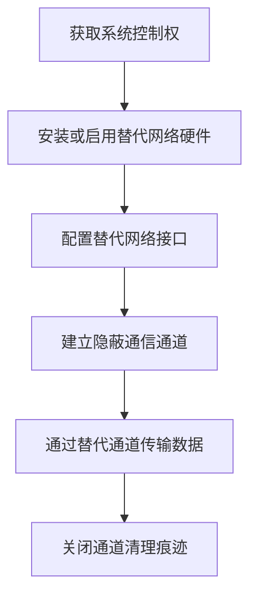

# 通过其他网络介质渗漏 (T1011)

## 一句话通俗理解

就像小偷发现正门有监控，于是从通风管道爬出去——不走正常的网络出口，用蓝牙、Wi-Fi、4G等"偏门"通道把数据传出去。

## 难度等级

- ⭐⭐⭐ 高级（需要深入技术知识）

## 技术描述

通过其他网络介质渗漏（T1011）是MITRE ATT&CK框架中渗漏战术的一种技术。

**通俗解释：**
攻击者不使用标准的网络出口（比如公司的宽带），而是通过非传统的网络介质来传输数据。比如在电脑上插一个USB Wi-Fi网卡建立隐藏的无线连接，或者用蓝牙把数据传输到附近的接收器，甚至用手机4G网络直接把数据发出去。这种技术特别适合对付那些网络出口被严密监控的"高安全"环境。

**技术原理：**

1. 攻击者在目标系统上启用或安装替代网络硬件（如USB Wi-Fi适配器、蓝牙模块）
2. 建立绕过标准网络出口的替代通信通道
3. 通过该通道将数据传输到附近的接收设备或直接连接到外部网络
4. 数据完全避开了防火墙、入侵检测等网络监控设备

**用途与影响：**
这种技术在高度隔离或物理访问受限的环境中最为有效。当标准的网络出口被严密监控时，攻击者转向使用非传统的网络介质来"架桥"。对于物理隔离（Air Gap）环境，替代网络介质可能是唯一的渗漏途径。

## 子技术列表

**该技术没有子技术。**

## 攻击流程

### 典型攻击流程

```
获取系统控制 --> 启用替代网络硬件 --> 建立隐蔽通道 --> 传输数据 --> 清理痕迹
```



**步骤详解：**

1. **获取系统控制权**
   - 通俗描述：先黑进目标电脑，获得管理员权限
   - 技术细节：通过漏洞利用、社会工程学等方式
   - 常用工具：Cobalt Strike、Metasploit

2. **安装或启用替代网络硬件**
   - 通俗描述：插上一个USB无线网卡或打开蓝牙
   - 技术细节：插入新的硬件或启用系统内置但禁用的无线功能
   - 常用工具：USB Wi-Fi适配器、蓝牙适配器、4G USB调制解调器

3. **配置替代网络接口**
   - 通俗描述：设置新装上硬件网络参数
   - 技术细节：配置IP地址、连接Wi-Fi网络或配对蓝牙设备
   - 常用工具：netsh、iwconfig、bluetoothctl

4. **建立隐蔽通信通道**
   - 通俗描述：创建一个不走公司网络的通信链路
   - 技术细节：建立SSH隧道、VPN连接或直接socket连接
   - 常用工具：SSH、OpenVPN、自定义脚本

5. **通过替代通道传输数据**
   - 通俗描述：把数据通过这个秘密通道发出去
   - 技术细节：使用scp、rsync等工具通过替代通道传输
   - 常用工具：scp、rsync、nc、curl

6. **关闭通道清理痕迹**
   - 通俗描述：传完后关闭连接，删除驱动和日志
   - 技术细节：禁用网络接口、卸载驱动、清除事件日志
   - 常用工具：系统管理工具、自定义脚本

## 真实案例

### 案例1：Agent.BTZ使用USB无线网卡绕过军方网络监控（2008）

- **时间**: 2008年
- **目标**: 美国军方网络
- **攻击组织**: 疑似俄罗斯军事情报机构
- **手法**: Agent.BTZ恶意软件在感染美国中央司令部网络后，通过受感染计算机上插入的USB无线网卡建立隐蔽的Wi-Fi连接。恶意软件通过这个替代网络介质将数据从隔离的军用网络传输到附近的接收设备，绕过标准的网络出口监控。这次攻击导致美国军方实施了严格的USB设备管控政策。
- **影响**: 美国军方网络敏感数据被盗
- **参考链接**: [MITRE ATT&CK - Agent.BTZ](https://attack.mitre.org/software/S0092/)

### 案例2：Turla使用蓝牙桥接空气间隙（2015-2018）

- **时间**: 2015-2018年
- **目标**: 欧洲政府机构
- **攻击组织**: Turla（又名Uroburys）
- **手法**: Turla在针对欧洲外交部门的攻击中使用蓝牙（Bluetooth）作为替代网络介质。攻击者在已经通过USB感染的计算机上启用蓝牙功能，并将收集到的数据通过蓝牙广播到近距离范围内的接收设备。这种方法在没有任何网络连接的空气间隙环境中实现了数据转移，完全不产生网络流量特征。
- **影响**: 多个欧洲外交使团数据被盗
- **参考链接**: [MITRE ATT&CK - Turla](https://attack.mitre.org/groups/G0010/)

### 案例3：DarkHotel使用蜂窝网络调制解调器绕过酒店网络监控（2014-2017）

- **时间**: 2014-2017年
- **目标**: 亚太地区酒店VIP客人
- **攻击组织**: DarkHotel
- **手法**: DarkHotel在感染目标系统后，寻找系统中已连接的3G/4G USB调制解调器硬件，或远程启用系统自带的WWAN模块。通过蜂窝网络进行的渗出完全绕过了酒店的局域网监控，直接通过移动运营商网络传出。这种方式使攻击者的数据传输完全独立于酒店的网络安全监控系统。
- **影响**: 大量商务人士敏感数据被盗
- **参考链接**: [MITRE ATT&CK - DarkHotel](https://attack.mitre.org/groups/G0044/)

### 案例4：Fxmsp团伙使用多网卡跨域传输（2017-2019）

- **时间**: 2017-2019年
- **目标**: 全球防务、教育行业
- **攻击组织**: Fxmsp
- **手法**: Fxmsp团伙在受感染计算机上利用多网卡环境（同时连接内网和外网的服务器），将内网收集的数据通过双网卡桥接写入外网可达的中间文件系统，然后通过外网接口转发到C2服务器。这种技术利用系统已有的多网络接口进行跨域数据传输，无需额外硬件。
- **影响**: 多个防务承包商数据被盗
- **参考链接**: [MITRE ATT&CK - Fxmsp](https://attack.mitre.org/groups/G1026/)

### 案例5：RAMBO攻击——利用内存总线无线电信号突破空气间隙（2024）

- **时间**: 2024年
- **目标**: 空气间隙隔离网络中的高安全计算机系统
- **攻击组织**: 研究验证（Ben-Gurion University安全研究团队）
- **手法**: 安全研究人员演示了RAMBO（RAM-Based Overt）攻击方法，展示如何通过内存总线产生的无线电信号从空气间隙计算机中渗漏数据。攻击者首先通过USB植入或用U盘传递恶意软件到目标空气间隙系统中。恶意软件通过精确控制CPU对内存的读写指令，使RAM总线上的电流变化产生特定频率的无线电信号（0-60kHz频段）。敏感数据（文件、按键记录、加密密钥等）被编码调制在这些电磁波上向外广播。攻击者使用配备小型天线的软件定义无线电（SDR）设备在数十米范围内接收信号，解码还原出原始数据，传输速率最高达1000比特/秒。这种技术完全不需要网络连接或物理接触，利用计算机硬件本身产生的电磁辐射作为数据载体，是典型的通过替代网络介质（无线电波）进行渗漏的高级攻击方式。
- **影响**: 证明了即使最严格物理隔离的网络也可能通过硬件电磁辐射发生数据泄漏，直接影响空气间隙网络的安全假设
- **参考链接**: [RAMBO: Leaking Secrets from Air-Gap Computers by Spelling Covert Radio Signals from Computer RAM](https://arxiv.org/abs/2409.02292)

## 红队视角

> ⚠️ **免责声明**：以下内容仅用于合法的安全测试、渗透测试和教育目的。未经授权对他人系统进行测试是违法行为。

### 实战技巧

1. **USB Wi-Fi适配器隐蔽连接**
   使用USB Wi-Fi适配器建立独立于企业网络的无线连接。选择小型适配器，容易隐藏，使用后即可拔除。

2. **蓝牙广播数据**
   利用蓝牙低功耗（BLE）广播数据包在小范围传输数据，每次传输少量数据，但足够稳定隐蔽。

3. **双网卡桥接**
   如果目标系统同时连接内外网，配置路由规则或代理服务，将内网数据通过外网接口转发。

### 常用工具

| 工具名称 | 用途 | 平台 | 链接 |
|----------|------|------|------|
| USB Wi-Fi适配器 | 建立无线连接 | 硬件 | 各大电子商城 |
| Bluetooth适配器 | 蓝牙通信 | 硬件 | 各大电子商城 |
| SSH | 加密隧道 | 全平台 | 系统内置 |
| netsh | Windows网络配置 | Windows | 系统内置 |
| iwconfig | Linux无线配置 | Linux | 系统内置 |

### 注意事项

- 物理硬件的接入是最容易被发现的操作，需要确保操作环境安全
- 替代网络通道的稳定性不如标准网络，需要做好断线重连机制
- 注意无线信号的覆盖范围，蓝牙通常只有10米左右

## 蓝队视角

### 检测要点

1. **非授权硬件接入**
   - 日志来源：Windows事件日志（Event ID 6416 - 新设备安装）
   - 关注字段：设备描述、设备ID、驱动程序
   - 异常特征：未经批准的无线网卡、蓝牙适配器安装

2. **网络接口配置变化**
   - 日志来源：Windows事件日志（Event ID 4201 - TCP/IP网络配置变更）
   - 关注字段：新增的IP地址、网络接口描述
   - 异常特征：非预期的网络接口被启用、新增IP配置

3. **蓝牙设备配对**
   - 日志来源：Windows事件日志（Event ID 902 - 蓝牙配对）
   - 关注字段：蓝牙设备名称、MAC地址
   - 异常特征：与未知蓝牙设备配对、非授权用户的配对操作

### 监控建议

- 部署无线入侵检测系统（WIDS）识别内网中的异常无线信号
- 监控系统硬件设备接入事件，特别是非预期的无线适配器
- 物理封锁不需要的USB端口和网口

## 检测建议

### 网络层检测

**检测方法：** 部署无线入侵检测系统（WIDS）监控异常无线信号。

**具体规则/命令示例：**

```
# 使用WIDS检测内网中的未授权无线接入点
# 监控无线信号强度变化和新增的SSID
```

### 主机层检测

**检测方法：** 监控网络接口配置变化和硬件设备接入。

**Windows事件ID：**
- 事件ID 6416：新即插即用设备安装
- 事件ID 6419：设备使能
- 事件ID 4201：TCP/IP网络配置变更

**Linux日志：**
- 日志文件：/var/log/syslog 或 /var/log/messages
- 关键字段：新的网络接口（wlan0、bnep0、ppp0）

**具体命令示例：**
```bash
# 查看所有网络接口
ip link show
# 或
ifconfig -a

# 查看USB设备历史记录
lsusb
# 内核消息中USB设备接入
dmesg | grep -i "usb\|wlan\|bluetooth"
```

### 应用层检测

**检测方法：** 监控蓝牙和Wi-Fi的使用。

**Sigma规则示例：**
```yaml
title: 检测新无线网络接口启用
status: experimental
description: 检测系统上新增的无线网络接口（可能用于替代介质渗漏）
logsource:
    category: network_interface
    product: windows
detection:
    selection:
        EventID: 4201
        InterfaceDescription|contains:
            - 'Wireless'
            - 'Wi-Fi'
            - 'Bluetooth'
            - '802.11'
    condition: selection
level: medium
tags:
    - attack.t1011
```

## 缓解措施

### 优先级1：关键措施

**措施名称：** 禁用不必要的无线硬件

**具体实施步骤：**
1. 通过BIOS/UEFI设置在敏感系统上禁用蓝牙、Wi-Fi、WWAN等内置无线硬件
2. 使用组策略禁用蓝牙和Wi-Fi功能
3. 物理封堵不需要的USB端口

**配置示例：**
```
# Windows组策略：禁用蓝牙
计算机配置 -> 管理模板 -> 系统 -> 蓝牙服务 -> 关闭蓝牙无线电 -> 已启用

# 禁用Wi-Fi服务
计算机配置 -> 管理模板 -> 网络 -> WLAN服务 -> 关闭WLAN
```

### 优先级2：重要措施

**措施名称：** USB端口管控

**具体实施步骤：**
1. 物理封堵不必要的USB端口
2. 对可移动无线适配器实施严格的物理管控
3. 部署USB设备白名单

### 优先级3：建议措施

**措施名称：** 无线入侵检测

**具体实施步骤：**
1. 部署WIDS监控异常无线信号
2. 定期执行物理安全巡检
3. 对多网卡系统的路由表进行审计

### MITRE ATT&CK 缓解措施映射

| 缓解措施ID | 缓解措施名称 | 适用性 | 说明 |
|------------|-------------|--------|------|
| M1049 | 物理安全 | 适用 | 控制物理硬件接入 |
| M1034 | 身份和访问管理 | 部分适用 | 限制硬件驱动安装权限 |
| M1042 | 禁用或移除功能 | 适用 | 禁用不必要的无线硬件 |

## 动手实验

> ⚠️ **重要提示**：所有实验必须在隔离的实验室环境中进行，禁止对未授权的真实系统进行测试。

### 实验环境准备

**推荐靶场/实验平台：**

| 平台名称 | 类型 | 难度 | 链接 |
|----------|------|------|------|
| 本地虚拟机 | 虚拟靶场 | 中级 | VMware/VirtualBox |

**所需工具：**
- 两台计算机（模拟目标和接收设备）
- USB Wi-Fi适配器或蓝牙适配器
- Linux系统（推荐Kali Linux）

### 实验1：使用蓝牙传输文件（中级）

**实验目标：** 使用蓝牙在近距离传输文件，模拟替代介质渗漏。

**实验步骤：**
1. 在目标系统上启用蓝牙功能
2. 使用bluetoothctl配对附近的接收设备
3. 使用obexftp或蓝牙文件传输功能发送文件
4. 在接收设备上确认接收
5. 使用Wireshark捕获蓝牙流量

**预期结果：** 文件通过蓝牙成功传输，不经过任何网络连接。

### 实验2：创建Wi-Fi直连通道（高级）

**实验目标：** 使用Wi-Fi Direct创建点对点渗漏通道。

**实验步骤：**
1. 在目标系统上启用Wi-Fi Direct功能
2. 创建与接收设备的点对点连接
3. 通过该直连通道传输文件
4. 验证数据完全不经过任何企业网络设备

**预期结果：** 文件通过Wi-Fi直连传输，完全绕过网络出口监控。

## 术语解释

| 术语 | 英文原名 | 通俗解释 |
|------|----------|----------|
| 空气间隙 | Air Gap | 电脑完全不上网，与互联网物理隔离 |
| 蓝牙 | Bluetooth | 短距离无线通信技术，有效距离约10米，就像两台对讲机近距离通话 |
| 桥接 | Bridging | 把两个网络连接起来，就像在两栋楼之间搭一座桥 |
| BLE | Bluetooth Low Energy | 蓝牙低功耗模式，省电但速度慢，适合少量数据传输 |
| 无线入侵检测 | WIDS | Wireless Intrusion Detection System，监测无线网络中的异常活动 |
| WWAN | Wireless Wide Area Network | 无线广域网，就是手机用的4G/5G移动网络 |

## 参考资料

### 官方文档

- [MITRE ATT&CK - T1011](https://attack.mitre.org/techniques/T1011/)

### 安全报告

- [MITRE ATT&CK - Agent.BTZ](https://attack.mitre.org/software/S0092/) - 使用USB无线网卡渗漏
- [MITRE ATT&CK - Turla Group](https://attack.mitre.org/groups/G0010/) - Turla使用蓝牙渗漏
- [MITRE ATT&CK - DarkHotel Group](https://attack.mitre.org/groups/G0044/) - DarkHotel使用蜂窝网络

### 工具与资源

- [Bluetooth规范](https://www.bluetooth.com/specifications/) - 蓝牙技术规范
- [Wi-Fi Direct](https://www.wi-fi.org/discover-wi-fi/wi-fi-direct) - Wi-Fi直连技术介绍
