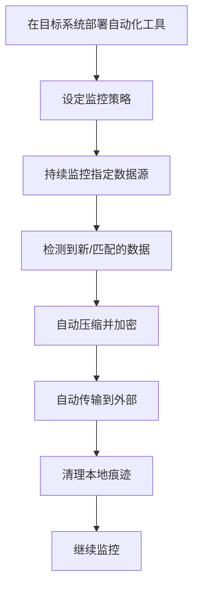

# 自动化渗漏 (T1020)

## 一句话通俗理解

就像在偷来的管道上装了一个自动传送带——不用人盯着，机器会自动把数据源源不断地运出去。

## 30秒速查卡

| 维度 | 你需要知道的 |
|------|-------------|
| 这是什么？ | 自动化渗漏（T1020）是攻击者用来破坏目标系统或数据的技术 |
| 为什么危险？ | 攻击者可以对目标造成不可逆的破坏，影响组织正常运营 |
| 谁需要关心？ | 安全运维团队、系统管理员、业务负责人 |
| 你的第一步防御 | 定期备份数据并测试恢复流程，确保备份与生产环境隔离 |
| 如果只做一件事 | 监控异常的数据删除或修改行为，设置关键文件完整性告警 |

## 难度等级

- ⭐⭐ 中级（需要一定基础）

## 技术描述

自动化渗漏（T1020）是MITRE ATT&CK框架中渗漏战术的一种技术。

**通俗解释：**
攻击者不是手动操作来传数据，而是写个脚本或程序，让它在后台自动运行。这个程序会持续监控目标系统中的数据变化，一旦发现有新数据就自动压缩、加密并发送出去。整个过程不需要人工干预，就像一个自动化的"数据搬运工"。

**技术原理：**

1. 攻击者在目标系统上部署自动化脚本或工具
2. 设定监控规则（监控特定目录、数据库表、文件类型等）
3. 当检测到新数据时，自动执行收集→压缩→加密→传输的流程
4. 传输完成后可选择清理本地临时文件

**用途与影响：**
自动化渗漏让攻击者能够持续不断地窃取数据，而不需要频繁地与目标系统交互，降低了被发现的风险。还可以在短时间内处理海量数据，大幅提升窃取效率。

## 子技术列表

**该技术没有子技术。**

## 攻击流程

### 典型攻击流程

```
部署自动化工具 --> 监控数据源 --> 检测到新数据 --> 自动处理 --> 自动传输
```



**步骤详解：**

1. **在目标系统部署自动化工具**
   - 通俗描述：在受害电脑上装一个自动搬运数据的程序
   - 技术细节：投递PowerShell脚本、Python程序或恶意软件
   - 常用工具：PowerShell、Python、自定义恶意软件

2. **设定监控策略**
   - 通俗描述：告诉程序偷哪些类型的数据
   - 技术细节：配置文件定义文件类型、目录路径、数据库表
   - 常用工具：配置文件、命令行参数

3. **持续监控指定数据源**
   - 通俗描述：程序一直在后台默默盯着目标文件
   - 技术细节：使用FileSystemWatcher或轮询机制
   - 常用工具：System.IO.FileSystemWatcher、inotify

4. **检测到新/匹配的数据**
   - 通俗描述：发现有新的文件就触发搬运
   - 技术细节：检查文件创建时间、修改时间、内容匹配
   - 常用工具：自定义脚本逻辑

5. **自动压缩并加密**
   - 通俗描述：自动打包加密封装
   - 技术细节：使用zip库和加密库
   - 常用工具：Compress-Archive、zip、gpg

6. **自动传输到外部**
   - 通俗描述：自动发送到攻击者的服务器
   - 技术细节：使用HTTP POST、FTP、SMTP等协议
   - 常用工具：curl、PowerShell Invoke-WebRequest

7. **清理本地痕迹**
   - 通俗描述：删除临时文件，不留下证据
   - 技术细节：shred命令或安全删除API
   - 常用工具：shred、sdelete

8. **继续监控**
   - 通俗描述：回到等待状态，准备下一次搬运
   - 技术细节：循环执行监控逻辑
   - 常用工具：while循环、定时任务

## 真实案例

### 案例1：CL0P的大规模自动化数据窃取活动（2023-2025）

- **时间**: 2023年05月-2025年
- **目标**: 全球2773个组织
- **攻击组织**: CL0P（TA505）
- **手法**: CL0P在MOVEit Transfer漏洞利用中部署LEMURLOOT webshell，该webshell具备自动从MOVEit数据库提取数据的能力。攻击者使用自动化脚本批量扫描暴露的MOVEit服务器、自动部署webshell、自动提取数据。整个过程高度自动化，无需人工逐个操作。2025年又利用Oracle EBS漏洞再次发动自动化大规模数据窃取活动，通过数千个被窃的第三方邮箱账户自动发送勒索邮件。
- **影响**: 9558万人数据泄露，158亿美元经济损失
- **参考链接**: [CISA - CL0P MOVEit Advisory](https://www.cisa.gov/news-events/cybersecurity-advisories/aa23-158a)

### 案例2：2025 Salesforce自动化数据渗漏活动（C0059）

- **时间**: 2025年
- **目标**: Salesforce客户组织
- **攻击组织**: C0059
- **手法**: 攻击者利用被盗的Salesforce凭证登录租户环境，使用自动化脚本批量导出联系人、机会、订单等业务数据。该活动通过Salesforce的Bulk API和Reporting API以自动化方式大规模拉取数据，规避了手动操作的单次限制。自动化脚本定期执行数据导出并传输至攻击者控制的云存储，整个过程完全自动化。
- **影响**: 大量Salesforce客户业务数据泄露
- **参考链接**: [MITRE ATT&CK - C0059](https://attack.mitre.org/campaigns/C0059/)

### 案例3：FIN7使用自动化工具窃取支付卡数据（2016-2018）

- **时间**: 2016-2018年
- **目标**: 餐饮、零售行业
- **攻击组织**: FIN7
- **手法**: FIN7在受害者销售点（POS）系统上部署Carbanak和GRIFFON后门，这些后门具备自动化收集和渗漏支付卡磁道数据的能力。攻击者设计了定期轮询机制，每隔几分钟自动扫描内存中的支付卡数据，并通过C2通道自动上传。整个过程无需人工干预，自动运行。
- **影响**: 数百万张支付卡数据被盗
- **参考链接**: [MITRE ATT&CK - FIN7](https://attack.mitre.org/groups/G0046/)

### 案例4：2026年ShinyHunters大规模自动化数据窃取活动

- **时间**: 2026年04月
- **目标**: 7-Eleven、Instructure Canvas等全球性组织
- **攻击组织**: ShinyHunters
- **手法**: ShinyHunters在2026年发动了多起自动化数据窃取活动，包括攻击7-Eleven的Salesforce环境和Instructure的Canvas学习管理系统。攻击者使用自动化脚本通过Salesforce API批量导出客户数据（7-Eleven），以及通过Canvas LMS API导出学生记录和学术数据。Canvas攻击中自动化脚本窃取了3.65TB数据，影响了约8809个教育机构的2.75亿用户。数据泄露后在暗网泄露站点自动发布。
- **影响**: 数亿用户数据泄露
- **参考链接**: [BleepingComputer - Carnival Cruise](https://www.bleepingcomputer.com/news/security/carnival-cruise-confirms-data-breach-affecting-nearly-6-million-people/)

## 红队视角

> ⚠️ **免责声明**：以下内容仅用于合法的安全测试、渗透测试和教育目的。未经授权对他人系统进行测试是违法行为。

### 实战技巧

1. **使用系统自带工具**
   优先使用PowerShell、cURL、BITSAdmin等系统自带工具编写自动化脚本，避免上传额外文件增加检测风险。

2. **文件系统监控**
   使用.NET的FileSystemWatcher或Linux的inotify监控目标目录，一旦有新文件创建立即自动处理。

3. **合理的轮询间隔**
   设置合理的轮询间隔（如5-15分钟），既保证数据及时传输，又不至于频率过高触发检测。

### 常用工具

| 工具名称 | 用途 | 平台 | 链接 |
|----------|------|------|------|
| PowerShell | Windows脚本环境 | Windows | 系统内置 |
| Python | 通用编程语言 | 全平台 | https://www.python.org/ |
| rsync | 文件同步工具 | Linux | 系统内置 |
| rclone | 云存储同步 | 全平台 | https://rclone.org/ |
| curl | HTTP请求工具 | 全平台 | https://curl.se/ |
| BITSAdmin | Windows后台传输 | Windows | 系统内置 |

### 注意事项

- 自动化脚本的错误处理要完善，避免崩溃后留下异常日志
- 使用加密通信防止自动化脚本的流量特征被识别
- 需要设定合理的运行频率，过于频繁可能被性能监控发现

## 蓝队视角

### 检测要点

1. **异常进程行为**
   - 日志来源：EDR系统、Sysmon
   - 关注字段：进程执行频率、文件访问模式、网络连接
   - 异常特征：某进程周期性地访问大量文件后进行网络连接

2. **自动化工具的使用**
   - 日志来源：Windows事件日志（Event ID 4688）
   - 关注字段：命令行参数、父进程
   - 异常特征：rsync、rclone、BITSAdmin等工具的非预期使用

3. **周期性的网络活动**
   - 日志来源：网络流量日志
   - 关注字段：连接时间、数据量、目标IP
   - 异常特征：非业务系统周期性地向外传输数据

### 监控建议

- 建立网络出口流量的基线，识别非预期的周期性传输
- 关注rsync、rclone、curl等工具的命令行参数中是否包含远程目标地址
- 对敏感数据存储目录实施严格的访问控制和审计日志

## 检测建议

### 网络层检测

**检测方法：** 监控网络出口流量的异常模式，特别是非工作时间的自动化数据传输。

**具体规则/命令示例：**

```
# 使用Zeek监控HTTP会话的频率和数据量
# 检测周期性的大数据量POST请求
```

**示例（Suricata规则）：**
```
alert http $HOME_NET any -> $EXTERNAL_NET any (msg:"T1020 - 周期性大量数据出站传输"; flow:to_server; http.method; content:"POST"; http.request_body; length:>10000000; classtype:trojan-activity; sid:1001020; rev:1;)
```

### 主机层检测

**检测方法：** 监控系统进程创建和脚本执行。

**Windows事件ID：**
- 事件ID 4688：进程创建，监控自动化工具执行
- 事件ID 4104：PowerShell脚本块日志
- 事件ID 5156：Windows过滤平台连接

**Linux日志：**
- 日志文件：/var/log/syslog、~/.bash_history
- 关键字段：脚本执行记录、rsync/rclone使用

**具体命令示例：**
```bash
# 检测运行中rsync进程
ps aux | grep -E "(rsync|rclone|curl.*http)"

# 查看周期性任务的日志
grep "CRON" /var/log/syslog | tail -50
```

### 应用层检测

**检测方法：** 应用层监控自动化API调用。

**用人话说：** 攻击者在受害系统上部署一个自动化脚本或程序，让它持续监控特定目录或数据源，一旦发现新数据就自动压缩、加密并发送出去——全程不需要人工干预，像在偷来的管道上装了一台自动传送带。与手动渗漏不同，自动化渗漏可以7×24小时不间断地偷数据，速度更快、隐蔽性更强。如果发现某系统上的脚本或进程周期性地读取大量文件后立即发起网络连接，且这些文件类型集中在文档、数据库等高价值数据上，很可能是自动化数据窃取行为。

**Sigma规则示例：**
```yaml
title: 检测自动化数据渗漏脚本的执行
status: experimental
description: 检测PowerShell脚本中调用网络传输和数据收集的组合
logsource:
    category: process_creation
    product: windows
detection:
    selection:
        Image|endswith: '\powershell.exe'
        CommandLine|contains:
            - 'Invoke-WebRequest'
            - 'Invoke-RestMethod'
            - 'Compress-Archive'
            - 'Get-ChildItem'
            - 'Start-Sleep'
    condition: selection
    timeframe: 5m
level: high
tags:
    - attack.t1020
```

## 缓解措施

### 优先级1：关键措施

**措施名称：** 限制脚本执行环境

**具体实施步骤：**
1. 启用PowerShell受限语言模式（Constrained Language Mode）
2. 使用AppLocker限制不可信脚本的执行
3. 对PowerShell ScriptBlock日志进行集中监控

**配置示例：**
```
# PowerShell受限语言模式
$ExecutionContext.SessionState.LanguageMode = "ConstrainedLanguage"

# 组策略：Windows Defender应用控制
计算机配置 -> 管理模板 -> 系统 -> AppLocker -> 配置规则
```

### 优先级2：重要措施

**措施名称：** 敏感数据出口管控

**具体实施步骤：**
1. 对敏感数据存储目录实施严格的访问控制和审计日志
2. 实施数据分级管理，对高敏感数据的导出操作设置审批流程
3. 部署EDR系统监控异常进程行为和网络连接

### 优先级3：建议措施

**措施名称：** 网络白名单

**具体实施步骤：**
1. 限制非授权的外部网络连接
2. 对出站流量实施白名单策略
3. 对非标准时间的出站连接实施告警

### MITRE ATT&CK 缓解措施映射

| 缓解措施ID | 缓解措施名称 | 适用性 | 说明 |
|------------|-------------|--------|------|
| M1038 | 执行防护 | 适用 | 限制脚本执行环境 |
| M1037 | 过滤网络流量 | 适用 | 网络出口白名单 |
| M1045 | 软件限制策略 | 适用 | AppLocker控制工具执行 |
| M1029 | 远程访问控制 | 部分适用 | 限制远程连接 |

## 动手实验

> ⚠️ **重要提示**：所有实验必须在隔离的实验室环境中进行，禁止对未授权的真实系统进行测试。

### 实验环境准备

**推荐靶场/实验平台：**

| 平台名称 | 类型 | 难度 | 链接 |
|----------|------|------|------|
| 本地虚拟机 | 虚拟靶场 | 中级 | VMware/VirtualBox |
| Detection Lab | 虚拟靶场 | 中级 | https://github.com/clong/DetectionLab |

**所需工具：**
- Windows系统或Linux系统
- PowerShell或Python
- 测试用的Web服务器（接收数据）

### 实验1：用PowerShell编写自动化渗漏脚本（中级）

**实验目标：** 编写一个简单的自动化渗漏脚本。

**实验步骤：**
1. 创建一个监控目录和测试文件
2. 编写PowerShell脚本：
   - 使用FileSystemWatcher监控目录
   - 检测到新文件时自动压缩
   - 通过HTTP POST发送到测试服务器
   - 发送成功后删除原文件
3. 运行脚本并放入测试文件
4. 验证文件被自动传输到测试服务器

**预期结果：** 文件被自动检测、压缩并传输到指定的服务器。

### 实验2：使用Sysmon检测自动化脚本活动（中级）

**实验目标：** 使用Sysmon捕获自动化脚本的活动日志。

**实验步骤：**
1. 在测试机上安装并配置Sysmon
2. 运行自动化渗漏脚本
3. 在事件查看器中查看Sysmon日志
4. 识别脚本活动的特征模式（文件创建、网络连接等）
5. 编写简单的检测规则

**预期结果：** 能够在Sysmon日志中清晰看到自动化脚本的文件操作和网络连接活动。

## 术语解释

| 术语 | 英文原名 | 通俗解释 |
|------|----------|----------|
| API | Application Programming Interface | 应用程序编程接口，程序之间交流的规则 |
| 自动化 | Automation | 用程序代替人工操作，就像用洗衣机代替手洗衣服 |
| EDR | Endpoint Detection and Response | 端点检测与响应，安装在电脑上的安全软件，监控异常行为 |
| 轮询 | Polling | 程序定期检查某个条件是否满足，就像每隔几分钟看一下邮箱有没有新邮件 |
| ScriptBlock | PowerShell脚本块 | PowerShell中的一段可执行代码，可以被日志记录 |
| Sysmon | System Monitor | Windows系统监控工具，记录进程创建、网络连接等详细事件 |

## 参考资料

### 官方文档

- [MITRE ATT&CK - T1020](https://attack.mitre.org/techniques/T1020/)

### 安全报告

- [CISA - CL0P MOVEit Advisory](https://www.cisa.gov/news-events/cybersecurity-advisories/aa23-158a) - CL0P大规模自动化数据窃取
- [MITRE ATT&CK - C0059](https://attack.mitre.org/campaigns/C0059/) - 2025 Salesforce自动化渗漏活动
- [MITRE ATT&CK - FIN7 Group](https://attack.mitre.org/groups/G0046/) - FIN7自动化支付卡窃取
- [BleepingComputer - Carnival Cruise Breach](https://www.bleepingcomputer.com/news/security/carnival-cruise-confirms-data-breach-affecting-nearly-6-million-people/) - 2026年ShinyHunters数据泄露

### 工具与资源

- [PowerShell文档](https://docs.microsoft.com/en-us/powershell/) - 微软官方PowerShell文档
- [Sysmon](https://docs.microsoft.com/en-us/sysinternals/downloads/sysmon) - Windows系统监控工具
- [AppLocker文档](https://docs.microsoft.com/en-us/windows/security/threat-protection/windows-defender-application-control/applocker/applocker-overview) - Windows应用控制
