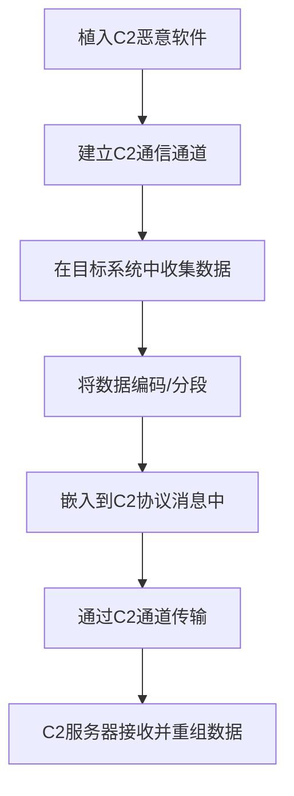

# 通过C2通道渗漏 (T1041)

## 一句话通俗理解

就像小偷用已经挖好的地道来运赃物——不再挖新通道，直接用原来进出踩点的地道把东西运出去。

## 30秒速查卡

| 维度 | 你需要知道的 |
|------|-------------|
| 这是什么？ | 通过C2通道渗漏（T1041）是攻击者用来破坏目标系统或数据的技术 |
| 为什么危险？ | 攻击者可以对目标造成不可逆的破坏，影响组织正常运营 |
| 谁需要关心？ | 安全运维团队、系统管理员、业务负责人 |
| 你的第一步防御 | 定期备份数据并测试恢复流程，确保备份与生产环境隔离 |
| 如果只做一件事 | 监控异常的数据删除或修改行为，设置关键文件完整性告警 |

## 难度等级

- ⭐⭐ 中级（需要一定基础）

## 技术描述

通过C2通道渗漏（T1041）是MITRE ATT&CK框架中渗漏战术的一种技术。

**通俗解释：**
攻击者不新建一个专门用来传数据的通道，而是直接使用已经建立好的"命令与控制"（C2）通道来传输窃取的数据。C2通道本来就是攻击者和受害电脑之间的通信线路，攻击者把数据混在正常的控制指令中一起发出去。这就像你原来只是用这条线路打电话（发指令），现在顺便把文件也通过电话线传真过去。

**技术原理：**

1. 攻击者已经在目标系统中植入了恶意软件，并与C2服务器建立了通信通道
2. 在需要渗出数据时，直接使用该通道发送数据
3. 数据被分段嵌入到C2协议的消息体中（如HTTP POST请求体、DNS查询响应等）
4. 与正常的C2通信流量混合在一起，难以区分

**用途与影响：**
这种技术的最大优势是不需要建立额外的网络连接，减少了攻击者的网络指纹总量。C2通道本身已经具备加密和隐蔽性，不需要额外混淆数据。即使被发现，C2通道和数据渗出是同时被阻断的，不会只暴露渗出行为。

## 子技术列表

**该技术没有子技术。**

## 攻击流程

### 典型攻击流程

```
植入C2木马 --> 建立C2通道 --> 收集数据 --> 编码嵌入C2流量 --> 传输到C2服务器
```



**步骤详解：**

1. **植入C2恶意软件**
   - 通俗描述：在受害电脑上安装一个能接收远程指令的木马
   - 技术细节：通过钓鱼邮件、漏洞利用等方式投递C2载荷
   - 常用工具：Cobalt Strike Beacon、Metasploit Meterpreter

2. **建立C2通信通道**
   - 通俗描述：木马和攻击者的服务器建立连接
   - 技术细节：通过HTTP/HTTPS/DNS等协议建立周期性连接
   - 常用工具：Cobalt Strike、PoshC2、Sliver

3. **在目标系统中收集数据**
   - 通俗描述：在受害电脑上搜索有价值的数据
   - 技术细节：按文件类型、关键字、目录搜索
   - 常用工具：find命令、PowerShell脚本

4. **将数据编码/分段**
   - 通俗描述：把数据切碎并编码，方便混入正常通信中
   - 技术细节：Base64编码、数据分段、AES加密
   - 常用工具：自定义编码模块

5. **嵌入到C2协议消息中**
   - 通俗描述：把数据藏在网络请求的"皮肤"下面
   - 技术细节：放入HTTP POST请求体、Cookie、自定义Header中
   - 常用工具：C2框架内置功能

6. **通过C2通道传输**
   - 通俗描述：正常的心跳包中夹带了私货
   - 技术细节：利用C2轮询请求的响应包携带数据块
   - 常用工具：C2框架内置功能

7. **C2服务器接收并重组数据**
   - 通俗描述：攻击者的服务器从收到的流量中提取并拼合数据
   - 技术细节：解码、解密、重组文件
   - 常用工具：C2服务器端程序

## 真实案例

### 案例1：CL0P通过C2通道渗漏MOVEit数据（2023-2025）

- **时间**: 2023年05月-2025年
- **目标**: 全球2773个组织的9558万人
- **攻击组织**: CL0P（TA505 / Lace Tempest）
- **手法**: CL0P利用MOVEit Transfer的SQL注入漏洞（CVE-2023-34362）部署LEMURLOOT webshell。该webshell通过HTTP C2通道与攻击者通信，将MOVEit数据库中的数据以gzip压缩格式返回。数据通过HTTP POST请求体传输，使用与正常MOVEit操作相似的自定义Header（X-siLock-Comment）进行验证。CL0P在2025年又利用Oracle EBS漏洞发动了类似的大规模数据窃取活动。
- **影响**: 估计经济损失158亿美元，95.8万人数据泄露
- **参考链接**: [CISA - CL0P MOVEit Advisory](https://www.cisa.gov/news-events/cybersecurity-advisories/aa23-158a)

### 案例2：Lazarus Group通过C2通道渗出加密钱包数据（2024-2025）

- **时间**: 2024年09月-2025年01月
- **目标**: 全球加密货币开发者
- **攻击组织**: Lazarus Group
- **手法**: Lazarus Group在"幽灵电路"行动中，通过供应链攻击植入恶意软件。被感染系统上窃取的数据通过C2服务器进行中转，使用端口1224进行C2通信。数据先发送到C2服务器，再通过C2通道传输到Dropbox。攻击者维护了多层代理基础设施，通过俄罗斯的Oculus代理网络中转后再到达真实的C2服务器。
- **影响**: 超过1500个系统被感染
- **参考链接**: [SecurityScorecard - Operation Phantom Circuit](https://securityscorecard.com/blog/operation-phantom-circuit-north-koreas-global-data-exfiltration-campaign/)

### 案例3：Cobalt Strike Beacon通过HTTP C2通道渗出（2016-2024）

- **时间**: 2016-2024年
- **目标**: 多个行业的受感染组织
- **攻击组织**: 多个APT和犯罪团伙
- **手法**: Cobalt Strike的Beacon载荷使用HTTP/HTTPS C2通道进行数据渗出。Beacon将收集的文件分割为大小可控的块，编码后通过POST请求发送到C2服务器。数据被嵌入到看似正常的HTTP会话中，包括模拟Web浏览器的User-Agent和标准的HTTP头字段。被多个APT组织广泛使用，包括APT29、APT41等。
- **影响**: 全球范围内大规模数据泄露
- **参考链接**: [MITRE ATT&CK - Cobalt Strike](https://attack.mitre.org/software/S0154/)

### 案例4：MITRE自身入侵事件中的C2渗漏（2024）

- **时间**: 2024年01月
- **目标**: MITRE研究网络
- **攻击组织**: UNC5221（疑似国家背景）
- **手法**: 攻击者利用Ivanti零日漏洞入侵MITRE的研究网络，部署了BRICKSTORM后门和WIREFIRE webshell。BRICKSTORM通过WebSocket与C2服务器通信，能执行文件上传/下载操作。WIREFIRE webshell则将命令执行结果通过Base64编码、AES加密后嵌入到正常HTTP响应中传输，实现了在C2通道内的数据渗漏。
- **影响**: MITRE研究网络数据泄露
- **参考链接**: [MITRE Engenuity - Technical Deep Dive](https://medium.com/mitre-engenuity/technical-deep-dive-understanding-the-anatomy-of-a-cyber-intrusion-080bddc679f3)

## 红队视角

> ⚠️ **免责声明**：以下内容仅用于合法的安全测试、渗透测试和教育目的。未经授权对他人系统进行测试是违法行为。

### 实战技巧

1. **利用C2框架内置渗漏功能**
   Cobalt Strike的Beacon自带文件上传下载功能，直接用upload/dlload命令即可实现C2通道渗漏，不需要额外工具。

2. **在心跳包中夹带数据**
   将渗出数据与正常的C2轮询请求一起发送，每心跳带一小块数据，长时间缓慢渗出。

3. **合理设置数据块大小**
   控制每个数据块的大小，使其不超过正常C2通信的数据量，避免触发基于流量的异常检测。

### 常用工具

| 工具名称 | 用途 | 平台 | 链接 |
|----------|------|------|------|
| Cobalt Strike | 渗透测试框架 | Windows/Linux | https://www.cobaltstrike.com/ |
| Metasploit | 渗透测试框架 | Linux | https://www.metasploit.com/ |
| Sliver | 开源C2框架 | 全平台 | https://github.com/BishopFox/sliver |
| PoshC2 | PowerShell C2框架 | Windows/Linux | https://github.com/nettitude/PoshC2 |

### 注意事项

- C2通道的流量大小突然变化可能会触发网络异常检测
- 数据嵌入方式的选择会影响检测概率（HTTP Header vs Body vs Cookie）
- 需要确保C2协议支持大数据块的传输

## 蓝队视角

### 检测要点

1. **C2流量异常增加**
   - 日志来源：网络流量日志、Web代理日志
   - 关注字段：源IP、目标IP、流量大小、连接时长
   - 异常特征：某个C2通道的流量突然增大，特别是上行数据量（从目标到C2）显著增加

2. **HTTP POST请求体异常**
   - 日志来源：Web代理或IDS/IPS日志
   - 关注字段：POST请求体大小、Content-Type、URL路径
   - 异常特征：POST请求体体积突然增大、包含高熵值数据

3. **C2协议中的文件元数据**
   - 日志来源：深度包检测工具
   - 关注字段：协议字段中包含文件名、路径、文件大小等信息
   - 异常特征：C2通信中出现非预期的文件元数据

### 监控建议

- 建立网络会话的流量基线，标记上行数据量异常的C2连接
- 分析HTTP POST请求体的熵值变化，高熵值可能指示加密后的渗出数据
- 注意C2工具的流量特征，如Beacon的周期性HTTP请求

## 检测建议

### 网络层检测

**检测方法：** 监控C2通信中的异常数据量波动。

**具体规则/命令示例：**

```
# 使用Zeek监控网络会话的上下行数据比例
# 当上行数据量超过阈值时触发告警
```

**示例（Suricata规则）：**
```
alert http $HOME_NET any -> $EXTERNAL_NET any (msg:"T1041 - C2通道异常上行数据量"; flow:to_server; http.method; content:"POST"; http.request_body; length:>1000000; classtype:trojan-activity; sid:1001041; rev:1;)
```

### 主机层检测

**检测方法：** 监控进程的网络连接行为和数据访问模式。

**Windows事件ID：**
- 事件ID 4688：进程创建，监控可疑的网络连接工具
- 事件ID 5156：Windows过滤平台连接

**Linux日志：**
- 日志文件：/var/log/syslog
- 关键字段：网络连接记录、进程网络活动

**具体命令示例：**
```bash
# 监控进程的实时网络连接
netstat -anp | grep ESTABLISHED

# 查看特定进程的网络活动
ss -tup | grep -E "(4444|8080|https)"
```

### 应用层检测

**检测方法：** 应用层流量分析。

**用人话说：** 攻击者偷到数据后，不走专门的文件传输通道，而是混在已有的命令与控制（C2）流量里一起发出去，像小偷把赃物藏在快递包裹里。大多数安全工具主要检测C2命令流量，不太关注从内到外的数据量——攻击者利用这个盲区。如果看到某台服务器既不执行日常备份也没有大量正常业务数据上传，却周期性向外发送大量数据，很可能是通过C2通道在偷数据。

**Sigma规则示例：**
```yaml
title: 检测C2通道中嵌入的渗出数据
status: experimental
description: 检测HTTP请求体中包含疑似文件的二进制数据
logsource:
    category: web
    product: proxy
detection:
    selection:
        http_method: POST
        request_body_size: ">500000"
        content_type:
            - 'application/x-www-form-urlencoded'
            - 'multipart/form-data'
        entropy_level: high
    condition: selection
level: high
tags:
    - attack.t1041
```

## 缓解措施

### 优先级1：关键措施

**措施名称：** 网络出口流量管控

**具体实施步骤：**
1. 实施出站防火墙白名单策略，仅允许业务必需的外部连接
2. 对出站HTTP/HTTPS流量进行内容过滤和大小监控
3. 部署Web代理对HTTPS流量进行解密检测

**配置示例：**
```
# 出站防火墙规则示例
# 仅允许白名单域名的出站HTTP/HTTPS
allow outbound to *.corporate-domain.com port 443
allow outbound to *.microsoft.com port 443
deny outbound any any
```

### 优先级2：重要措施

**措施名称：** 异常流量分析

**具体实施步骤：**
1. 部署基于异常的流量分析系统
2. 建立正常网络通信的基线
3. 对偏离基线的行为触发告警

### 优先级3：建议措施

**措施名称：** 威胁情报整合

**具体实施步骤：**
1. 订阅C2基础设施威胁情报
2. 及时更新防火墙和IDS的阻断列表
3. 对已知C2通信特征进行检测

### MITRE ATT&CK 缓解措施映射

| 缓解措施ID | 缓解措施名称 | 适用性 | 说明 |
|------------|-------------|--------|------|
| M1031 | 网络入侵检测 | 适用 | 部署IDS检测C2流量特征 |
| M1037 | 过滤网络流量 | 适用 | 控制出站网络连接 |
| M1021 | 限制基于Web的内容 | 适用 | Web代理过滤 |

## 动手实验

> ⚠️ **重要提示**：所有实验必须在隔离的实验室环境中进行，禁止对未授权的真实系统进行测试。

### 实验环境准备

**推荐靶场/实验平台：**

| 平台名称 | 类型 | 难度 | 链接 |
|----------|------|------|------|
| Detection Lab | 虚拟靶场 | 中级 | https://github.com/clong/DetectionLab |
| Cobalt Strike社区版 | 工具 | 中级 | https://www.cobaltstrike.com/ |

**所需工具：**
- Cobalt Strike或Sliver（开源替代）
- Wireshark
- Python 3

### 实验1：创建C2通道并传输文件（中级）

**实验目标：** 搭建简易C2通道并通过它传输文件。

**实验步骤：**
1. 使用Python编写一个简单的C2服务器和客户端
2. 客户端与服务器建立HTTP连接
3. 客户端读取本地文件，Base64编码后放入HTTP POST请求体
4. 服务器端接收并解码重组文件
5. 使用Wireshark捕获并分析流量特征

**预期结果：** 文件通过C2通道成功传输，流量与正常HTTP难以区分。

### 实验2：检测C2通道中的异常数据量（高级）

**实验目标：** 使用流量分析工具识别C2通道中的异常数据传输。

**实验步骤：**
1. 建立正常的C2通信基线
2. 启动数据渗出过程
3. 使用Zeek分析网络会话
4. 识别上下行数据比例的异常

**预期结果：** 能够通过流量分析识别出C2通道中的异常数据。

## 术语解释

| 术语 | 英文原名 | 通俗解释 |
|------|----------|----------|
| C2 | Command and Control | 命令与控制，攻击者遥控受害电脑的通信通道 |
| Beacon | 信标 | C2木马的一种，像灯塔一样定期向C2服务器报告状态 |
| 心跳 | Heartbeat | C2木马定期发给服务器的"我还在"信号 |
| 载荷 | Payload | 恶意软件中实际执行攻击功能的代码部分 |
| 熵值 | Entropy | 数据随机性的度量，加密数据通常有较高的熵值 |
| webshell | Web后门 | 放在Web服务器上的一句话木马，通过浏览器就能控制 |

## 参考资料

### 官方文档

- [MITRE ATT&CK - T1041](https://attack.mitre.org/techniques/T1041/)

### 安全报告

- [CISA - CL0P MOVEit Advisory](https://www.cisa.gov/news-events/cybersecurity-advisories/aa23-158a) - CL0P利用MOVEit漏洞进行数据渗漏
- [MITRE Engenuity - Technical Deep Dive](https://medium.com/mitre-engenuity/technical-deep-dive-understanding-the-anatomy-of-a-cyber-intrusion-080bddc679f3) - MITRE入侵事件技术深度分析
- [SecurityScorecard - Operation Phantom Circuit](https://securityscorecard.com/blog/operation-phantom-circuit-north-koreas-global-data-exfiltration-campaign/) - Lazarus Group幽灵电路行动分析

### 工具与资源

- [Cobalt Strike](https://www.cobaltstrike.com/) - 商业渗透测试框架
- [Sliver](https://github.com/BishopFox/sliver) - 开源C2框架
