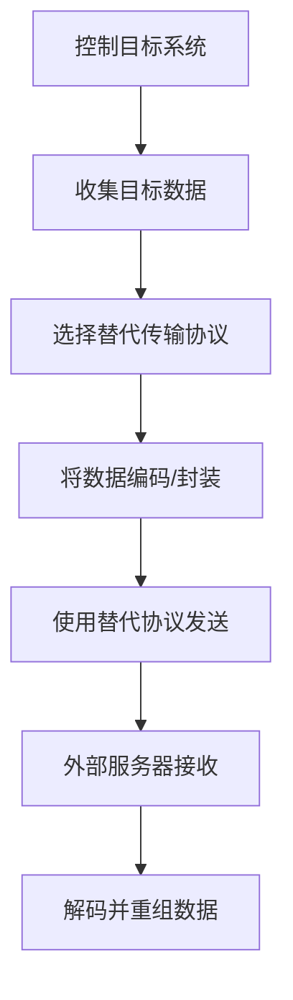

# 通过替代协议渗漏 (T1048)

## 一句话通俗理解

就像小偷把赃物藏在垃圾车里运出去——不经过大门检查，用别人想不到的通道（DNS查询、电子邮件、ICMP网络检测包）把数据传出去。

## 难度等级

- ⭐⭐ 中级（需要一定基础）

## 技术描述

通过替代协议渗漏（T1048）是MITRE ATT&CK框架中渗漏战术的一种技术。

**通俗解释：**
攻击者使用非预期的网络协议来传输窃取的数据。比如，把数据藏在DNS域名查询请求里、藏在ICMP（Ping）的数据包中、或者通过SMTP（电子邮件）发送加密附件。正常的网络防火墙通常允许这些协议通过（因为它们是网络运行必需的），但不会深度检查这些协议的内容。

**技术原理：**

1. 攻击者选择一个目标网络允许出站的替代协议（DNS、ICMP、SMTP等）
2. 将窃取的数据编码后嵌入到该协议的负载字段中
3. 通过该协议将数据发送到攻击者控制的外部服务器
4. 外部服务器从协议流量中提取并重组数据

**用途与影响：**
这种技术利用了一个普遍的安全漏洞：防火墙允许某些协议无条件通过（如DNS对于互联网访问是必需的），但不对这些协议的内容进行检查。替代协议渗漏很难被传统的安全设备检测。

## 子技术列表

**该技术共有 3 个子技术：**

| 子技术ID | 中文名称 | 通俗解释 |
|----------|----------|----------|
| T1048.002 | 对称加密渗出 | 用同一把钥匙加解密数据后传输，虽然被看到但打不开 |
| T1048.001 | 非对称加密渗出 | 用公钥加密，只有攻击者的私钥能解密，更安全 |
| T1048.003 | 未加密渗出 | 直接明文传输，速度快但容易被截获 |

<details>
<summary><strong>展开查看各子技术详细说明</strong></summary>

### T1048.002 - 对称加密渗出

**通俗理解：** 把数据装进一个密码箱（AES加密），虽然箱子被看到了但密码只有双方知道。

**详细说明：**
使用对称加密（AES、RC4等）保护渗出通道中的数据。攻击者在数据传输前使用对称加密算法对窃取数据进行加密，防止中间人检测或内容审查。加密后的数据可通过HTTP、HTTPS、DNS等协议传输。

### T1048.001 - 非对称加密渗出

**通俗理解：** 别人把一个公开的邮箱地址给你，你把信投进去，只有有钥匙的人才能打开邮箱取信。

**详细说明：**
使用非对称加密（公钥/私钥）保护渗出数据。攻击者使用目标的公钥加密窃取数据，确保只有持有对应私钥的攻击者才能解密。密钥管理更简单，攻击者无需在渗出环境中暴露解密密钥。

### T1048.003 - 未加密渗出

**通俗理解：** 直接用明信片寄出秘密信息，快但容易被别人看到。

**详细说明：**
以未加密或明文形式传输窃取数据。虽然不加密会增加被拦截和检测的风险，但攻击者可能因为数据本身已经是加密格式、追求传输速度、或目标网络缺乏深度包检测能力而选择明文传输。

</details>

## 攻击流程

### 典型攻击流程

```
控制目标系统 --> 收集数据 --> 选择替代协议 --> 编码嵌入 --> 通过替代协议发送 --> 外部接收
```



**步骤详解：**

1. **控制目标系统**
   - 通俗描述：先黑进目标电脑
   - 技术细节：通过钓鱼、漏洞利用等方式
   - 常用工具：Cobalt Strike、Metasploit

2. **收集目标数据**
   - 通俗描述：找到要偷的数据
   - 技术细节：搜索指定类型的文件
   - 常用工具：PowerShell、Bash脚本

3. **选择替代传输协议**
   - 通俗描述：决定用什么"伪装"来运数据
   - 技术细节：根据网络配置选择可用协议
   - 常用工具：nslookup、ping、telnet

4. **将数据编码/封装**
   - 通俗描述：把数据转换成协议能接受的格式
   - 技术细节：Base64编码、数据分段
   - 常用工具：自定义脚本、dnscat2

5. **使用替代协议发送**
   - 通俗描述：把数据通过选定的协议发出去
   - 技术细节：构造特殊的DNS查询、ICMP数据包等
   - 常用工具：dnscat2、icmptunnel、SMTP客户端

6. **外部服务器接收**
   - 通俗描述：攻击者的服务器接收这些"快递"
   - 技术细节：部署监听特定协议的服务器
   - 常用工具：自定义服务器、dnscat2 server

7. **解码并重组数据**
   - 通俗描述：从协议包中提取出原始数据
   - 技术细节：解码Base64，重组文件
   - 常用工具：自定义工具

## 真实案例

### 案例1：APT28使用DNS隧道渗出数据（2015-2017）

- **时间**: 2015-2017年
- **目标**: 美国政治组织、欧洲政府机构
- **攻击组织**: APT28（Fancy Bear / Sofacy）
- **手法**: APT28使用DNS隧道技术将窃取的数据编码在DNS查询请求中渗出。他们将数据分割并封装成DNS子域名查询，利用DNS UDP协议的低可见性规避防火墙检测。每个DNS查询请求看起来是正常的域名解析，但实际上查询的域名中编码了窃取的数据片段。
- **影响**: 美国大选期间大量敏感邮件泄露
- **参考链接**: [MITRE ATT&CK - APT28](https://attack.mitre.org/groups/G0007/)

### 案例2：Cobalt Group使用SMTP明文附件（2017-2018）

- **时间**: 2017-2018年
- **目标**: 全球金融机构
- **攻击组织**: Cobalt Group
- **手法**: Cobalt Group通过SMTP协议将窃取的数据作为电子邮件附件发送到攻击者控制的外部邮箱。附件使用ZIP压缩但未加密，利用SMTP作为正常业务流量的伪装。某些案例中他们使用受感染组织自身的邮件服务器发送这些邮件，使邮件流量看起来完全正常。
- **影响**: 全球多个银行被窃取数百万美元
- **参考链接**: [MITRE ATT&CK - Cobalt Group](https://attack.mitre.org/groups/G0080/)

### 案例3：Turla使用HTTPS加密隧道渗出（2017-2020）

- **时间**: 2017-2020年
- **目标**: 欧洲外交使团、国防部门
- **攻击组织**: Turla（Uroburys）
- **手法**: Turla使用Python编写的后门模块通过HTTPS协议渗出数据，数据在使用AES-256加密后放入HTTPS POST请求体中传输。加密的HTTPS流量使深度包检测无法区分恶意流量与正常Web流量。Turla选择了TLS加密层之上传输，利用了HTTPS无处不在的信任。
- **影响**: 多个欧洲外交机构数据泄露
- **参考链接**: [MITRE ATT&CK - Turla](https://attack.mitre.org/groups/G0010/)

### 案例4：2024年制造企业通过SSH/SCP替代协议渗漏（2024）

- **时间**: 2024年07月
- **目标**: 制造业企业
- **攻击组织**: 未知
- **手法**: 攻击者攻陷了Fortinet防火墙后，使用WinRAR压缩数据，再通过OpenSSH SCP（安全复制）协议将数据经端口443传输到DigitalOcean的VPS。攻击者选择端口443（HTTPS端口）进行SSH传输，规避了端口22（标准SSH端口）的增强监控。同时使用反向SSH隧道将目标服务器端口22通过443端口暴露给外部。
- **影响**: 多个文件服务器的业务数据被盗
- **参考链接**: [ReliaQuest - Data Exfiltration Attack Analysis](https://reliaquest.com/blog/data-exfiltration-attack-analysis-manufacturing-sector-breach/)

### 案例5：跨国保险公司DNS隧道渗透攻击（2024）

- **时间**: 2024年
- **目标**: 北美跨国保险公司
- **攻击组织**: 未知
- **手法**: 攻击者利用DNS隧道技术建立隐蔽通信通道，将近50台身份验证和密钥管理服务器的数据编码在DNS查询请求中逐块渗出。攻击者注册了恶意域名并设置恶意权威DNS服务器，将窃取的敏感数据分割编码为DNS子域名查询字符串（如base64编码数据.attacker-domain.com），通过TXT记录查询和MX记录查询向外传输。由于DNS是网络基础服务，防火墙默认允许UDP 53端口的流量通过且不进行深度检查，整个渗漏过程持续数周未被发现。安全公司Lumu的持续妥协评估平台检测到异常的DNS查询模式后才被发现。
- **影响**: 近50台核心认证服务器数据被渗漏，攻击者已建立活跃的数据交换通道
- **参考链接**: [Lumu - Detection & Response to a Real-World DNS Tunneling Attack](https://lumu.io/blog/lumu-detection-response-dns-tunneling-attack/)

## 红队视角

> ⚠️ **免责声明**：以下内容仅用于合法的安全测试、渗透测试和教育目的。未经授权对他人系统进行测试是违法行为。

### 实战技巧

1. **DNS隧道渗透**
   使用dnscat2等工具将数据编码为DNS查询请求。由于DNS是互联网基础服务，几乎不会被完全阻断。

2. **HTTPS端口上的SSH隧道**
   将SSH流量伪装在443端口上，利用HTTPS的通行权。许多防火墙对443端口的流量检测较弱。

3. **利用邮件协议**
   通过SMTP发送加密附件到外部邮箱，利用企业邮件系统的正常通信掩盖行为。

### 常用工具

| 工具名称 | 用途 | 平台 | 链接 |
|----------|------|------|------|
| dnscat2 | DNS隧道工具 | Windows/Linux/macOS | https://github.com/iagox86/dnscat2 |
| icmptunnel | ICMP隧道 | Linux | https://github.com/DhavalKapil/icmptunnel |
| OpenSSH SCP | 安全文件传输 | 全平台 | 系统内置 |
| ncat | 网络工具集 | 全平台 | https://nmap.org/ncat/ |
| socat | 多功能网络工具 | Linux | https://linux.die.net/man/1/socat |

### 注意事项

- DNS隧道容易被检测到异常的查询量和查询频率
- ICMP隧道速度极慢，只适合小数据量
- 使用HTTPS端口做SSH隧道时，JA3指纹可能暴露真实客户端

## 蓝队视角

### 检测要点

1. **DNS查询异常**
   - 日志来源：DNS服务器日志
   - 关注字段：查询域名长度、查询频率、TXT记录查询
   - 异常特征：超长域名查询（标签超过63字符）、高频非重复域名、大量TXT记录查询

2. **非标准端口的协议使用**
   - 日志来源：防火墙日志、网络流量日志
   - 关注字段：端口号与协议的对应关系
   - 异常特征：53端口上出现非DNS流量、22端口上出现非SSH流量

3. **大容量ICMP包**
   - 日志来源：网络流量捕获
   - 关注字段：ICMP包大小、频率
   - 异常特征：ICMP包大小超过正常值（正常Ping包只有几十字节）

### 监控建议

- 配置DNS出口流量安全过滤，限制TXT记录查询的目标域名
- 对非标准端口的协议使用实施告警
- 检查SMTP出站邮件中异常的加密附件

## 检测建议

### 网络层检测

**检测方法：** 监控非标准端口的协议使用和DNS查询异常。

**具体规则/命令示例：**

```
# 使用Zeek监控DNS查询中的异常特征
# 关注TXID记录查询、长域名等
```

**示例（Suricata规则）：**
```
alert dns $HOME_NET any -> any 53 (msg:"T1048 - 可疑的DNS TXT记录查询"; dns.query; content:"|01 00 00 01 00 00 00 00 00 00|"; sid:1001048; rev:1;)
```

### 主机层检测

**检测方法：** 监控DNS隧道工具和SCP等网络工具的使用。

**Windows事件ID：**
- 事件ID 4688：进程创建，监控dnscat2、ncat等工具
- 事件ID 5156：Windows过滤平台连接

**Linux日志：**
- 日志文件：/var/log/syslog
- 关键字段：SSH连接记录、DNS查询工具使用

**具体命令示例：**
```bash
# 检测DNS隧道工具
ps aux | grep -i "dnscat\|iodine\|dns2tcp"

# 查看异常的SSH隧道
ss -tlnp | grep -E "(443|53|22)"
```

### 应用层检测

**检测方法：** 邮件网关检测。

**Sigma规则示例：**
```yaml
title: 检测通过邮件协议发送的可疑加密附件
status: experimental
description: 检测SMTP出站邮件中包含加密压缩包附件
logsource:
    category: email
    product: smtp
detection:
    selection:
        attachment_extension:
            - '.zip'
            - '.rar'
            - '.7z'
        attachment_encrypted: true
        attachment_size: ">50MB"
    condition: selection
level: high
tags:
    - attack.t1048
```

## 缓解措施

### 优先级1：关键措施

**措施名称：** 协议白名单管控

**具体实施步骤：**
1. 在网络出口配置协议白名单，仅允许业务必需的协议和端口
2. 对DNS出口流量实施安全过滤
3. 配置深度包检测（DPI）识别异常协议使用

**配置示例：**
```
# 防火墙规则：仅允许必要的协议出站
allow outbound tcp port 443 (HTTPS)
allow outbound tcp port 80 (HTTP)
allow outbound udp port 53 (DNS)
allow outbound tcp port 25 (SMTP - 仅限邮件服务器)
deny outbound any any
```

### 优先级2：重要措施

**措施名称：** DNS安全加固

**具体实施步骤：**
1. 限制DNS递归查询的目标域名范围
2. 部署DNS安全扩展（DNSSEC）
3. 监控异常的TXT记录查询

### 优先级3：建议措施

**措施名称：** 邮件DLP策略

**具体实施步骤：**
1. 配置邮件网关规则阻止带有加密附件的出站邮件
2. 对大型附件实施额外审查
3. 审计异常的API调用模式

### MITRE ATT&CK 缓解措施映射

| 缓解措施ID | 缓解措施名称 | 适用性 | 说明 |
|------------|-------------|--------|------|
| M1037 | 过滤网络流量 | 适用 | 控制出站协议和端口 |
| M1021 | 限制基于Web的内容 | 适用 | Web代理和DLP规则 |
| M1031 | 网络入侵检测 | 适用 | 检测协议异常使用 |

## 动手实验

> ⚠️ **重要提示**：所有实验必须在隔离的实验室环境中进行，禁止对未授权的真实系统进行测试。

### 实验环境准备

**推荐靶场/实验平台：**

| 平台名称 | 类型 | 难度 | 链接 |
|----------|------|------|------|
| 本地虚拟机 | 虚拟靶场 | 中级 | VMware/VirtualBox |
| Kali Linux | 安全测试系统 | 中级 | https://www.kali.org/ |

**所需工具：**
- dnscat2
- Wireshark
- 两台Linux虚拟机（客户端和服务器）

### 实验1：DNS隧道实验（高级）

**实验目标：** 使用dnscat2建立DNS隧道传输文件。

**实验步骤：**
1. 在一台Linux上部署dnscat2服务器端
2. 在另一台Linux上运行dnscat2客户端连接服务器
3. 通过建立的DNS隧道传输文件
4. 使用Wireshark捕获并分析DNS查询包
5. 观察DNS查询中的编码数据

**预期结果：** 文件通过DNS隧道成功传输，流量看起来是正常的DNS查询。

### 实验2：SSH端口转发实验（中级）

**实验目标：** 将SSH隧道伪装在443端口。

**实验步骤：**
1. 配置SSH服务器监听443端口
2. 从客户端使用SSH连接443端口
3. 通过建立的SSH隧道传输文件
4. 使用netstat验证连接使用的端口

**预期结果：** SSH连接通过443端口建立，看起来像HTTPS流量。

## 术语解释

| 术语 | 英文原名 | 通俗解释 |
|------|----------|----------|
| DNS | Domain Name System | 域名系统，把网站名（如www.baidu.com）转换成IP地址的"电话本"服务 |
| DNS隧道 | DNS Tunneling | 把数据藏在DNS查询和响应中的技术，就像在图书馆的书里夹带纸条 |
| ICMP | Internet Control Message Protocol | 互联网控制消息协议，就是Ping命令用的协议，用来测试网络是否连通 |
| SMTP | Simple Mail Transfer Protocol | 简单邮件传输协议，就是发邮件用的协议 |
| 隧道 | Tunnel | 在一种网络协议之上封装另一种协议的数据，就像在普通公路上划出公交专用道 |
| JA3指纹 | JA3 Fingerprint | TLS客户端指纹，用于识别发起HTTPS连接的客户端软件类型 |

## 参考资料

### 官方文档

- [MITRE ATT&CK - T1048](https://attack.mitre.org/techniques/T1048/)
- [MITRE ATT&CK - T1048.001](https://attack.mitre.org/techniques/T1048/001/)
- [MITRE ATT&CK - T1048.002](https://attack.mitre.org/techniques/T1048/002/)
- [MITRE ATT&CK - T1048.003](https://attack.mitre.org/techniques/T1048/003/)

### 安全报告

- [ReliaQuest - Data Exfiltration Attack Analysis](https://reliaquest.com/blog/data-exfiltration-attack-analysis-manufacturing-sector-breach/) - 2024年制造业数据渗漏事件分析
- [MITRE ATT&CK - APT28](https://attack.mitre.org/groups/G0007/) - APT28 DNS隧道渗漏

### 工具与资源

- [dnscat2](https://github.com/iagox86/dnscat2) - DNS隧道工具
- [icmptunnel](https://github.com/DhavalKapil/icmptunnel) - ICMP隧道工具
