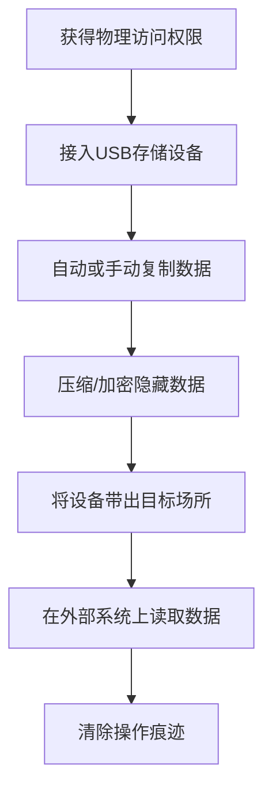

# 通过物理介质渗漏 (T1052)

## 一句话通俗理解

就像内鬼把公司机密文件藏在鞋底带出大楼——完全不经过网络，保安再严也拦不住。

## 难度等级

- ⭐⭐ 中级（需要一定基础）

## 技术描述

通过物理介质渗漏（T1052）是MITRE ATT&CK框架中渗漏战术的一种技术。

**通俗解释：**
攻击者不是通过网络把数据发出去，而是用实物的方式把数据带出目标网络。最常见的就是把文件拷到U盘里，然后人带着U盘走出大楼。因为数据根本没有经过网络，所有基于网络的检测手段（防火墙、入侵检测、DLP）都完全失效。

**技术原理：**

1. 攻击者通过远程控制或物理接触，在目标系统上获得数据访问权限
2. 将数据复制到可移动存储设备（USB闪存、外置硬盘、SD卡、光盘等）
3. 通过人工携带、邮寄等方式将物理介质运出目标场所
4. 在外部系统上读取数据

**用途与影响：**
物理介质渗漏是网络防御最完善的环境中最难防御的渗漏方式。对于"空气间隙"（Air Gap，完全物理隔离的网络）环境，物理介质是唯一的渗漏途径。这种技术常被用于高安全级别的目标，如军事网络、核设施等。

## 子技术列表

**该技术共有 2 个子技术：**

| 子技术ID | 中文名称 | 通俗解释 |
|----------|----------|----------|
| T1052.001 | USB | 用U盘等USB设备拷贝数据带走 |
| T1052.002 | 空气间隙 | 从完全与互联网物理隔离的系统中把数据取出 |

<details>
<summary><strong>展开查看各子技术详细说明</strong></summary>

### T1052.001 - USB

**通俗理解：** 把文件拷到U盘上揣兜里带走。

**详细说明：**
攻击者使用USB闪存驱动器或其他USB存储设备从目标系统拷贝数据。感染系统上的恶意软件可能自动将收集到的数据复制到接入的USB设备上，或者由人工操作进行拷贝。自动化方法包括修改AutoRun配置、监控USB插入事件自动写文件、使用USB Rubber Ducky等HID模拟设备伪装为键盘执行命令。

### T1052.002 - 空气间隙

**通俗理解：** 从完全没有网线的电脑上把数据弄出来。

**详细说明：**
针对与外部网络物理隔离（Air Gap）的系统和网络进行数据渗出。空气间隙环境没有网络连接，攻击者必须通过物理方式将数据移到外部。常见方法包括：用可移动介质拷贝、利用电磁波/声波/光信号等侧信道发射数据、通过打印文件后扫描间接传输。

</details>

## 攻击流程

### 典型攻击流程

```
获得物理访问 --> 接入USB设备 --> 复制数据 --> 带出目标场所 --> 读取数据
```



**步骤详解：**

1. **获得物理访问权限**
   - 通俗描述：攻击者先进入目标场所，或者远程控制一台有USB接口的电脑
   - 技术细节：通过社会工程学获取门禁权限，或通过远程访问植入恶意软件
   - 常用工具：万能钥匙、门禁卡复制器

2. **接入USB存储设备**
   - 通俗描述：把U盘插到目标电脑上
   - 技术细节：恶意软件也可以监控USB插入事件，自动响应
   - 常用工具：标准USB闪存盘、USB Rubber Ducky

3. **自动或手动复制数据**
   - 通俗描述：把文件拷贝到U盘上
   - 技术细节：恶意软件可自动搜索目标文件类型并复制
   - 常用工具：自定义恶意软件、PowerShell脚本

4. **压缩/加密隐藏数据**
   - 通俗描述：把文件打包加密，防止被安检发现
   - 技术细节：使用加密压缩包，文件扩展名伪装
   - 常用工具：WinRAR、7-Zip、VeraCrypt

5. **将设备带出目标场所**
   - 通俗描述：把U盘藏在身上带出大楼
   - 技术细节：利用安检漏洞、藏匿在衣物中
   - 常用工具：无

6. **在外部系统上读取数据**
   - 通俗描述：在攻击者的电脑上打开U盘查看数据
   - 技术细节：解密压缩包，提取数据
   - 常用工具：对应的解密工具

## 真实案例

### 案例1：Stuxnet使用USB突破空气间隙（2010）

- **时间**: 2005-2010年
- **目标**: 伊朗纳坦兹核设施
- **攻击组织**: 疑似美国/以色列联合开发
- **手法**: Stuxnet震网蠕虫通过USB驱动器从外部网络传播到伊朗核设施的空气间隙网络。攻击者在USB上放置了经过数字签名的恶意驱动程序，当操作员将USB插入连接到离心机控制系统的计算机时，恶意软件自动执行并开始在隔离网络中扩散。这证明了物理介质作为渗漏/注入途径的威力。
- **影响**: 严重破坏伊朗核浓缩计划
- **参考链接**: [MITRE ATT&CK - Stuxnet](https://attack.mitre.org/software/S0388/)

### 案例2：GoldenJackal使用USB桥接渗漏空气间隙网络数据（2022-2024）

- **时间**: 2022年5月-2024年3月
- **目标**: 欧盟某政府组织高安全空气间隙网络
- **攻击组织**: GoldenJackal（疑似俄语背景APT组织，主要针对政府与外交实体）
- **手法**: ESET研究人员发现GoldenJackal使用了一套自研的Go语言模块化工具集攻击欧盟政府组织的空气间隙网络。其中GoldenUsbCopy和GoldenUsbGo组件持续监控USB驱动器插入事件，检测到USB接入后自动按配置筛选感兴趣的文件（文档、图片、证书、加密密钥、OpenVPN配置等），使用AES加密后写入磁盘上的加密容器。GoldenAce组件通过USB驱动器在系统间传播恶意载荷和检索文件。收集到的数据通过GoldenMailer（以邮件附件形式发送到攻击者控制的邮箱）或GoldenDrive（上传至Google Drive）完成最终渗出。整套流程通过"USB桥接"方式在完全物理隔离的网络与外部互联网之间建立数据流转通道，实现针对空气间隙环境的高效数据渗漏。
- **影响**: 欧盟政府组织机密数据被盗，包括外交文件和加密密钥等高敏感性信息
- **参考链接**: [Mind the (air) gap: GoldenJackal gooses government guardrails - WeLiveSecurity](https://www.welivesecurity.com/en/eset-research/mind-air-gap-goldenjackal-gooses-government-guardrails/)

### 案例3：USBCulprit恶意软件自动窃取（2017）

- **时间**: 2017年
- **目标**: 中东政府机构
- **攻击组织**: CopyKittens
- **手法**: CopyKittens组织使用名为USBCulprit的恶意软件监控USB设备插入事件。当检测到USB设备连接时，恶意软件自动将分类后的文档复制到USB设备，包括Office文档、PDF和图像文件。这种自动化物理渗出手段使攻击者可以依赖内部人员无意中带入的物理介质完成数据转运。
- **影响**: 政府敏感文件通过U盘被窃取
- **参考链接**: [MITRE ATT&CK - CopyKittens](https://attack.mitre.org/groups/G0052/)

### 案例4：2024年RI Bridges数据泄露中的物理访问（2024）

- **时间**: 2024年07月-11月
- **目标**: 美国罗德岛州居民健康数据系统
- **攻击组织**: 未知（与Brain Cipher勒索团伙关联）
- **手法**: 攻击者获取凭证后通过VPN访问RI Bridges系统，在多个服务器上部署远程管理工具。虽然主要通过网络渗漏，但调查发现攻击者可能通过物理方式获取了最初的凭证。攻击者在28台服务器上进行了数据访问、打包和渗漏操作，持续近5个月，最终导致大量居民健康保险数据泄露。
- **影响**: 大量居民敏感健康数据泄露
- **参考链接**: [Rhode Island RIBridges Investigation](https://rhodeislandcurrent.com/wp-content/uploads/2025/05/RIBridges-Investigation-Summary-EMBARGOED.pdf)

## 现实意义——现代物理渗漏变种

> 传统的物理介质渗漏（U盘拷贝）在今天仍然有效，但现代攻击者已经发展出了更多精妙的变种，使其在数字化办公和云优先的时代仍然具有强大的威胁力。

### 变种1：BYOD-to-Cloud物理桥接

员工使用个人笔记本电脑（BYOD）连接公司网络时，物理介质的作用发生了质变。攻击者通过以下方式实现"物理→云"桥接：

1. **个人设备同步**：内部人员将数据从公司电脑复制到U盘后，插入个人电脑（不在公司网络内），通过OneDrive、iCloud、Google Drive等云同步服务自动上传到云端
2. **跨平台中转**：利用手机作为中转站——数据通过USB-C或Lightning线缆传输到手机后，通过手机4G/5G网络上传（完全绕过公司网络监控）
3. **AirDrop链式传输**：在苹果生态中，利用AirDrop将数据直接传输到附近的个人设备，设备离开公司范围后完成云同步

**检测难度**：这种变种中，物理拷贝本身发生在终端的正常操作中，而云同步则发生在个人设备上，企业安全监控完全覆盖不到。

### 变种2：M.2 NVMe-over-USB高速物理渗漏

现代M.2 NVMe固态硬盘通过USB-C转接器可以达到1GB/s以上的读写速度，使攻击者能在极短时间内窃取海量数据。

**技术要点**：
- 小型M.2 NVMe硬盘（拇指大小）通过USB-C转接器接入，外表隐蔽
- 使用高速写策略：30秒内可拷贝100GB以上的数据
- 结合加密容器（VeraCrypt/BitLocker To Go），数据在设备上全程加密
- 部分NVMe硬盘内置硬件加密，即使设备丢失也无需担忧

**现实场景**：2025年某金融企业的内部审计发现，一名即将离职的IT管理员在2分钟"咖啡休息"期间，通过隐蔽的NVMe-over-USB设备拷贝了包含客户PII的整个数据库（约127GB）。传统DLP因为数据已加密且操作者拥有合法权限而未能告警。

### 变种3：云DLP绕过——M.2 NVMe-over-USB + 云中转

这是物理渗漏与云服务结合的终极变种，专门绕云端最先进的DLP检测：

1. 攻击者将公司笔记本电脑上的数据通过NVMe-over-USB高速拷贝到个人物理设备
2. 设备中的恶意软件自动将数据分段加密，使用分块上传到多个云服务（Google Drive + Dropbox + OneDrive，每处只放一小部分）
3. 由于数据在个人设备上加密后再上传，且使用多服务分发，传统DLP和CASB无法识别
4. 攻击者从任何互联网终端收集所有分块，重组获得完整数据

**检测方法**：这种变种几乎无法通过网络层检测，必须依赖行为分析——异常的外设使用频率、非工作时间的物理接入、员工离职前的异常文件访问模式。

### 变种4：物联网设备作为物理渗漏桥梁

现代IoT设备（智能音箱、打印机、监控摄像头）通常包含大容量存储和网络连接功能，可被用作"物理→网络"的中转桥梁：

1. 攻击者将数据写入IoT设备的SD卡/内置存储（通过USB或网络接口）
2. IoT设备通过自身的Wi-Fi或有线网络连接将数据转发到外部
3. 设备属于业务必需品，安全策略通常允许其正常通信

**现实场景**：2024年披露的一个案例中，攻击者在攻陷了会议室智能显示屏后，利用其内置的存储和网络模块，将窃取的数据通过该设备的正常HTTPS通信通道中转出去，完全绕过了终端DLP监控。

## 红队视角

> ⚠️ **免责声明**：以下内容仅用于合法的安全测试、渗透测试和教育目的。未经授权对他人系统进行测试是违法行为。

### 实战技巧

1. **利用USB AutoRun**
   在某些遗留系统中，AutoRun功能仍然可用。配置USB设备的自动运行脚本，当U盘插入后自动执行数据拷贝。

2. **隐藏文件系统**
   使用VeraCrypt等工具创建加密的隐藏容器，即使物理设备被检查也难以发现数据。VeraCrypt支持创建加密卷中的隐藏卷（plausible deniability，合理否认性）。

3. **伪装文件类型**
   修改文件扩展名或文件头，使窃取的数据看起来像是系统文件或无意义的二进制文件。例如将.rar文件重命名为.dll，或将加密容器命名为system32.bin。

4. **USB Ducky + Powershell组合**
   使用USB Rubber Ducky模拟键盘输入，在数秒内执行PowerShell命令完成数据发现、压缩和转移到外部存储的完整流程。Ducky脚本示例：
   ```
   DELAY 1000
   WINDOWS r
   DELAY 500
   STRING powershell -W Hidden -Command "Compress-Archive -Path C:\Sensitive\* -DestinationPath D:\backup.zip"
   ENTER
   ```

5. **利用Windows Portable Device API**
   使用WPD API而非传统的文件系统API进行USB写入，可以绕过部分基于文件系统过滤驱动的DLP监控。WPD API是Windows用于管理MTP（媒体传输协议）设备的接口，某些DLP不对该接口进行监控。

6. **物理RFID/RF隐写**
   对于空气间隙环境的高安全场合，使用特制的RFID设备或RF发射器将数据编码在无线电信号中，不需要物理接触即可短距离传输数据。

### 常用工具

| 工具名称 | 用途 | 平台 | 链接 |
|----------|------|------|------|
| USB Rubber Ducky | HID模拟攻击设备 | 硬件 | https://shop.hak5.org/products/usb-rubber-ducky |
| VeraCrypt | 磁盘加密工具 | Windows/Linux/macOS | https://www.veracrypt.fr/ |
| WinRAR | 文件压缩打包 | Windows | https://www.win-rar.com/ |
| PowerShell | Windows脚本环境 | Windows | 系统内置 |
| BitLocker To Go | Windows设备加密 | Windows | 系统内置 |
| M.2 NVMe SSD | 高速便携存储 | 硬件 | 各大电子商城 |
| Rufus | USB启动盘制作（可创建持久存储） | Windows | https://rufus.ie/ |

### 注意事项

- 物理访问是最危险的渗漏方式，一旦被发现风险极高
- 需要在设备中隐藏数据，加密是最基本的要求（推荐VeraCrypt隐藏卷）
- 注意物理安全措施（金属探测器、安检门——NVMe设备体积小、金属含量低，更容易隐蔽携带）
- 对于自动化物理渗漏（恶意软件自动拷贝到USB），务必处理好删除痕迹的问题
- 使用WPD API绕过DLP时，需要注意WPD传输速度限制（通常比直接文件拷贝慢）

## 蓝队视角

### 检测要点

1. **USB设备异常使用**
   - 日志来源：Windows事件日志（Event ID 4663 - 尝试访问对象，过滤USB设备类GUID；Event ID 6416 - 新即插即用设备）
   - 关注字段：设备ID、序列号、接入时间、用户账号、设备类GUID
   - 异常特征：非授权用户在非工作时间接入USB存储设备、设备序列号不在白名单中
   - 检测命令：
   ```powershell
   # 查看最近24小时的USB设备接入记录
   Get-WinEvent -FilterHashtable @{LogName='Microsoft-Windows-Kernel-PnP/Driver';ID=400} | Where-Object {$_.TimeCreated -gt (Get-Date).AddDays(-1)} | Format-List
   
   # 使用PowerShell遍历USB历史记录
   Get-ItemProperty -Path "HKLM:\SYSTEM\CurrentControlSet\Enum\USBSTOR\*\*" | Select-Object FriendlyName, HardwareID
   ```

2. **大量文件复制行为**
   - 日志来源：Sysmon日志（Event ID 11 - 文件创建）
   - 关注字段：目标驱动器号、文件数量、文件类型、复制速率
   - 异常特征：短时间内向可移动驱动器复制大量文件（>100个/分钟）、文件类型集中（如全是.docx或.xlsx）
   - 检测命令：
   ```powershell
   # 检测指定时间范围内向可移动驱动器写入的文件数量
   Get-WinEvent -FilterHashtable @{LogName='Microsoft-Windows-Sysmon/Operational';ID=11} | Where-Object {$_.Properties[4].Value -match "^[D-Z]:\\"} | Group-Object {$_.Properties[4].Value.Split('\')[0]} | Sort-Object Count -Descending
   ```

3. **AutoRun注册表修改**
   - 日志来源：Windows事件日志（Event ID 4657 - 注册表修改）
   - 关注字段：注册表路径、修改的值
   - 异常特征：HKLM\Software\Microsoft\Windows\CurrentVersion\Policies\Explorer\NoDriveTypeAutoRun被修改

4. **WPD API调用检测**
   - 日志来源：ETW（Event Tracing for Windows）- Microsoft-Windows-WPD-API
   - 关注字段：进程名、设备标识、传输的文件列表
   - 异常特征：不合规的进程通过WPD API向便携设备写入大量文件
   - 检测思路：WPD API调用不会出现在常规的文件系统事件日志中，需要启用WPD ETW提供程序进行监控

5. **离职前异常行为检测**
   - 日志来源：HR系统联动 + 文件访问日志
   - 关注字段：员工离职日期、最近30天的USB使用频率变化、异常时间的文件访问
   - 异常特征：即将离职员工突然开始大量使用USB设备、在非工作时间访问平时不接触的敏感文件
   - 统计指标：USB使用频率的Z-score > 3（与历史行为相比的异常偏离）

6. **M.2 NVMe隐蔽存储检测**
   - 日志来源：BIOS/UEFI日志、设备管理日志
   - 关注字段：NVMe设备的热插拔事件、USB-to-NVMe桥接控制器识别
   - 异常特征：被识别为"ASMedia ASM2362"、"JMS583"等NVMe桥接芯片的设备接入，但用户无合理解释
   - 检测命令（查看NVMe桥接设备）：
   ```powershell
   Get-PnpDevice | Where-Object {$_.FriendlyName -match "NVMe|ASM|JMS"} | Format-Table FriendlyName, Status, InstanceId
   ```

### 监控建议

- 部署终端DLP方案检测USB文件复制操作，特别关注加密容器的写入行为
- 对空气间隙区域实施严格的两双人规则和物理陪同制度
- 定期审查USB设备使用日志，识别异常模式（设备使用频率、用户、时间段）
- 联动HR系统，对即将离职员工的USB使用行为实施增强监控
- 部署USB设备白名单机制，仅允许经批准的USB设备接入（通过硬件ID和序列号）
- 对NVMe-over-USB桥接设备接入事件实施高优先级告警

## 检测建议

### 网络层检测

**检测方法：** 物理介质渗漏本身不产生网络流量，网络层无法直接检测。但可以检测：
1. 物理渗漏后数据通过云同步工具上传时产生的网络流量
2. IoT设备被用作中转时的异常外连流量
3. BYOD-to-Cloud桥接中个人设备连接公司Wi-Fi时的异常数据上传

**具体检测方法：**
```bash
# 检测BYOD设备向云存储的大规模上传
# 关注非管理设备的云存储域名访问

# 检测IoT设备的异常外连
# 关注智能设备向非常用IP或域名发送的大量数据
```

### 主机层检测

**检测方法：** 监控USB设备的接入和文件复制事件，重点关注WPD API调用和NVMe桥接设备。

**Windows事件ID：**
- 事件ID 4663：尝试访问对象（如USB设备接入）
- 事件ID 6416：新即插即用设备安装（识别NVMe桥接芯片）
- 事件ID 4657：注册表值修改（AutoRun相关）
- 事件ID 4688：进程创建（监控复制命令如xcopy、robocopy、PowerShell Copy-Item）
- 事件ID 6420：设备驱动加载（可识别WPD兼容设备）

**Linux日志：**
- 日志文件：/var/log/syslog 或 /var/log/messages
- 关键字段：USB设备接入消息、mount事件、NVMe驱动加载

**具体命令示例：**
```bash
# 查看USB设备接入日志
dmesg | grep -i "usb"
# 或
journalctl -k | grep -i "usb"

# 查看USB存储设备挂载历史
grep -r "usb-storage" /var/log/syslog

# 检测NVMe桥接芯片接入（ASMedia等）
dmesg | grep -i "NVMe\|ASM2362\|JMS583"

# 查看系统识别到的所有USB设备历史
lsusb -t

# 检测WPD设备接入更详细的信息
udevadm monitor --property --subsystem-match=usb
```

**PowerShell检测命令：**
```powershell
# 检测USB存储设备历史
Get-ItemProperty -Path "HKLM:\SYSTEM\CurrentControlSet\Enum\USBSTOR\*\*" | Select FriendlyName, HardwareID, @{N="LastArrival";E={(Get-Date).AddDays(-(Get-ItemProperty -Path "HKLM:\SYSTEM\CurrentControlSet\Enum\USBSTOR\$($_.PSChildName)\Properties\{83da6326-97a6-4088-9453-a1923f573b29}\0064").Data)}} | Sort LastArrival -Descending | Select -First 20

# 检测WPD相关进程活动
Get-WinEvent -FilterHashtable @{ProviderName='Microsoft-Windows-WPD-API';ID=100} -MaxEvents 50 | Format-Table TimeCreated, Message -Wrap
```

### 应用层检测

**检测方法：** 终端DLP系统检测，重点检测加密容器写入和WPD API调用。

**Sigma规则示例：**
```yaml
title: 检测USB存储设备接入后的大批量文件复制
status: experimental
description: 检测通过cmd或PowerShell向可移动驱动器复制大量文件
logsource:
    category: process_creation
    product: windows
detection:
    selection:
        CommandLine|contains:
            - 'xcopy'
            - 'robocopy'
            - 'copy'
            - 'Copy-Item'
        CommandLine|contains:
            - 'D:\'
            - 'E:\'
            - 'F:\'
    condition: selection
level: medium
tags:
    - attack.t1052
---
title: 检测VeraCrypt加密容器的创建或挂载
status: experimental
description: 检测VeraCrypt等磁盘加密工具的进程创建
logsource:
    category: process_creation
    product: windows
detection:
    selection:
        Image|endswith:
            - '\VeraCrypt.exe'
            - '\VeraCrypt64.exe'
            - '\TrueCrypt.exe'
    condition: selection
level: medium
tags:
    - attack.t1052
---
title: 检测NVMe-over-USB桥接设备接入
status: experimental
description: 检测NVMe桥接芯片（ASMedia、JMS）的即插即用事件
logsource:
    category: driver_load
    product: windows
detection:
    selection:
        DeviceId|contains:
            - 'ASM2362'
            - 'JMS583'
            - 'RTL9210'
    condition: selection
level: high
tags:
    - attack.t1052
```

## 缓解措施

### 优先级1：关键措施

**措施名称：** 禁用USB存储设备写入功能

**具体实施步骤：**
1. 通过组策略禁用所有可移动存储设备的写入功能
2. 在BIOS/UEFI设置中禁用USB端口
3. 对必须使用的USB设备实施白名单管控

**配置示例：**
```
# Windows组策略配置
计算机配置 -> 管理模板 -> 系统 -> 可移动存储访问
-> 可移动磁盘: 拒绝写入权限 -> 已启用
```

### 优先级2：重要措施

**措施名称：** 物理安全管控

**具体实施步骤：**
1. 实施严格的出入管理流程
2. 对敏感区域部署金属探测器检查存储设备
3. 对空气间隙区域实施两双人规则

### 优先级3：建议措施

**措施名称：** 自动化脚本检测

**具体实施步骤：**
1. 部署自动化脚本检测USB接入后的大规模文件复制
2. 配置EDR规则监控USB Device事件
3. 定期审计USB使用日志

### MITRE ATT&CK 缓解措施映射

| 缓解措施ID | 缓解措施名称 | 适用性 | 说明 |
|------------|-------------|--------|------|
| M1034 | 身份和访问管理 | 部分适用 | 限制物理访问权限，实施多因素身份验证 |
| M1039 | 限制系统资源访问 | 适用 | 通过组策略限制USB写入功能 |
| M1047 | 审计 | 适用 | 审计USB设备使用日志 |
| M1049 | 物理安全 | 适用 | 物理访问控制、安检、两双人规则 |
| M1022 | 限制文件目录权限 | 适用 | 限制敏感数据的访问权限 |
| M1038 | 执行防护 | 适用 | 通过AppLocker限制复制命令的执行 |

## 动手实验

> ⚠️ **重要提示**：所有实验必须在隔离的实验室环境中进行，禁止对未授权的真实系统进行测试。

### 实验环境准备

**推荐靶场/实验平台：**

| 平台名称 | 类型 | 难度 | 链接 |
|----------|------|------|------|
| 本地虚拟机 | 虚拟靶场 | 初级 | VMware/VirtualBox |

**所需工具：**
- USB闪存盘（实验用）
- Windows组策略编辑器
- Sysmon日志查看工具

### 实验1：模拟USB文件复制检测（初级）

**实验目标：** 使用Windows事件日志检测USB文件复制行为。

**实验步骤：**
1. 在Windows测试机上启用Sysmon日志
2. 插入U盘并向其中复制文件
3. 使用事件查看器查看Sysmon日志中的文件复制事件
4. 配置组策略禁用USB写入并验证效果

**预期结果：** 观察Sysmon日志记录的文件复制事件，理解USB使用的日志特征。

### 实验2：使用VeraCrypt建立加密容器（中级）

**实验目标：** 创建隐藏加密容器模拟数据隐藏。

**实验步骤：**
1. 安装VeraCrypt
2. 创建一个加密文件容器
3. 将测试文件放入加密容器
4. 验证加密容器对外的伪装效果

**预期结果：** 加密容器看起来是随机数据，无法识别其中的内容。

### 实验3：检测NVMe桥接设备接入（高级）

**实验目标：** 学习检测M.2 NVMe-over-USB桥接设备的接入事件。

**实验步骤：**
1. 在Windows测试机上启用设备和驱动事件日志
2. 插入NVMe-to-USB桥接设备（或模拟的USB大容量存储设备）
3. 使用事件查看器查看Event ID 6416（新设备安装）
4. 使用PowerShell Get-PnpDevice查看设备属性
5. 编写检测脚本识别桥接芯片的硬件ID模式
6. 使用Sysmon记录设备接入事件

**预期结果：** 能够通过事件日志和PowerShell命令识别NVMe桥接设备的接入，理解这种隐蔽的高速物理渗漏方式。

## 术语解释

| 术语 | 英文原名 | 通俗解释 |
|------|----------|----------|
| 空气间隙 | Air Gap | 电脑完全不上网，与互联网物理隔离，就像把电脑放在没有网线也没有Wi-Fi的房间里 |
| AutoRun | 自动运行 | Windows的功能，U盘一插上就自动执行某个程序，就像把光盘放进光驱会自动播放 |
| BIOS | Basic Input/Output System | 电脑开机时最先运行的固件，控制最基本的硬件功能 |
| HID | Human Interface Device | 人机交互设备，如键盘、鼠标。USB Rubber Ducky把自己伪装成键盘来输入命令 |
| 物理隔离 | Physical Isolation | 系统完全不连接外部网络，没有任何网络接口，就像孤岛 |
| 桥接芯片 | Bridge Controller | 将一种硬件接口转换为另一种的芯片，如NVMe-to-USB桥接将固态硬盘接口转为USB接口 |
| BYOD | Bring Your Own Device | 员工携带个人设备上班的制度，攻击者利用个人设备与公司网络之间的数据流动进行物理渗漏 |
| MTP | Media Transfer Protocol | 媒体传输协议，用于在电脑和便携设备之间传输文件的协议，部分DLP不监控MTP接口 |
| WPD API | Windows Portable Devices API | Windows便携设备API，用于管理MTP设备，可被攻击者利用绕过基于文件系统过滤驱动的DLP |
| NVMe | Non-Volatile Memory Express | 一种高性能固态硬盘接口标准，NVMe SSD通过USB桥接后速度可达1GB/s以上 |
| USB白名单 | USB Allowlisting | 只允许经过批准的USB设备接入的安全策略，通过硬件ID和序列号进行识别 |
| 合理否认性 | Plausible Deniability | 加密软件的一种特性，即使被强制交出密码，也只会暴露一个"诱饵"分区，真正的隐藏分区仍然安全 |
| 硬件ID | Hardware ID | 操作系统用于识别硬件设备的唯一标识符，USB存储设备的硬件ID包含厂商和产品信息 |

## 参考资料

### 官方文档

- [MITRE ATT&CK - T1052](https://attack.mitre.org/techniques/T1052/)
- [MITRE ATT&CK - T1052.001 USB](https://attack.mitre.org/techniques/T1052/001/)
- [MITRE ATT&CK - T1052.002 Air Gap](https://attack.mitre.org/techniques/T1052/002/)

### 安全报告

- [Stuxnet Malware Analysis](https://attack.mitre.org/software/S0388/) - MITRE对Stuxnet的分析
- [Equation Group Campaign](https://attack.mitre.org/groups/G1003/) - MITRE对Equation Group的分析

### 工具与资源

- [USB Rubber Ducky](https://shop.hak5.org/products/usb-rubber-ducky) - HID模拟攻击设备
- [VeraCrypt](https://www.veracrypt.fr/) - 磁盘加密工具
