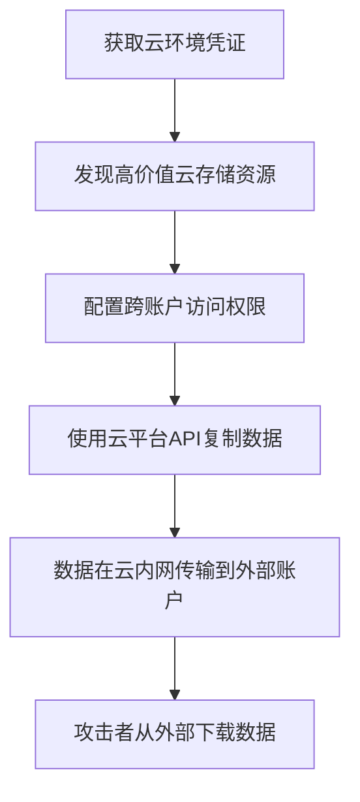

# 传输数据到云账户 (T1537)

## 一句话通俗理解

就像黑客登录了你的阿里云盘，直接把文件转到他的阿里云盘账户里——全程在阿里内部网络完成，你家防火墙根本看不到。

## 难度等级

- ⭐⭐ 中级（需要一定基础）

## 技术描述

传输数据到云账户（T1537）是MITRE ATT&CK框架中渗漏战术的一种技术。

**通俗解释：**
攻击者不是把数据从受害者的网络下载到外部服务器，而是利用在云环境中获得的凭证和权限，将云存储中的敏感数据从一个账户拷贝到另一个账户。这就像你已经拿到了保险柜的钥匙（云凭证），直接把保险柜里的东西搬到你的车里——全程在保险柜所在大楼内完成。

**技术原理：**

1. 攻击者获得受害者云环境的访问权限（凭据泄露、配置错误等）
2. 使用云平台提供的跨账户数据复制功能（如AWS S3跨账户复制、Azure AzCopy）
3. 将数据从受害者的云存储转移到攻击者控制的云账户
4. 数据全程在云服务商的内网传输，不经过受害者的网络出口

**用途与影响：**
因为所有操作都在云平台内部完成，流量不会出现在组织网络出口日志中，传统的网络监控手段完全失效。这种技术在云渗透测试中极难检测，需要依靠云平台的审计日志。

## 子技术列表

**该技术没有子技术。**

## 攻击流程

### 典型攻击流程

```
获取云凭证 --> 扫描目标云资源 --> 配置跨账户访问 --> 复制数据 --> 完成渗漏
```



**步骤详解：**

1. **获取云环境凭证**
   - 通俗描述：攻击者先弄到云服务的登录凭证或API密钥
   - 技术细节：通过凭证泄露、SSRF漏洞、IAM配置错误获取
   - 常用工具：AWS CLI、Azure CLI、gcloud CLI

2. **发现高价值云存储资源**
   - 通俗描述：在云环境里寻找包含敏感数据的存储桶
   - 技术细节：列出S3存储桶、Azure Blob容器等
   - 常用工具：aws s3 ls、az storage blob list

3. **配置跨账户访问权限**
   - 通俗描述：设置允许数据复制到另一个账户的权限
   - 技术细节：创建跨账户IAM角色信任关系
   - 常用工具：AWS IAM API、Azure RBAC

4. **使用云平台API复制数据**
   - 通俗描述：用云平台自己的复制功能把数据转到外部账户
   - 技术细节：使用S3 Cross-Region Replication或CopyObject API
   - 常用工具：aws s3 sync、azcopy、gsutil rsync

5. **数据在云内网传输到外部账户**
   - 通俗描述：数据通过云服务商的内部网络传输
   - 技术细节：不经过互联网，在云骨干网内完成
   - 常用工具：云平台内置功能

6. **攻击者从外部下载数据**
   - 通俗描述：攻击者在自己电脑上登入云账户，把数据下载下来
   - 技术细节：从攻击者的终端访问云平台下载数据
   - 常用工具：AWS CLI、浏览器

## 真实案例

### 案例1：Capital One数据泄露事件（2019）

- **时间**: 2019年
- **目标**: Capital One金融客户数据
- **攻击组织**: Paige Thompson（独立黑客）
- **手法**: 攻击者利用SSRF（服务端请求伪造）漏洞获取了AWS IAM角色的临时凭证，然后通过AWS CLI列出Capital One的S3存储桶内容，将包含1.06亿条客户信息的文件拷贝到攻击者自有的EC2实例和S3存储桶中。数据转移完全通过AWS内网进行，没有产生任何组织外部的网络流量，直到数据被发布到GitHub才被发现。
- **影响**: 1.06亿条客户信息泄露，罚款近2亿美元
- **参考链接**: [Justice Department - Capital One Sentencing](https://www.justice.gov/usao-wdwa/pr/former-amazon-employee-sentenced-10-million-data-breach)

### 案例2：SVR组织使用Azure数据工厂迁移数据（2020-2021）

- **时间**: 2020-2021年
- **目标**: 美国联邦政府机构
- **攻击组织**: SVR（APT29 / Cozy Bear）
- **手法**: SVR在SolarWinds供应链攻击中获取了受害者Azure环境的访问权限后，使用Azure数据工厂（Data Factory）和AzCopy工具将Microsoft 365邮件数据从受害者的租户迁移到攻击者控制的Azure订阅。整个过程通过Azure平台的内部复制功能完成，数据流量始终在Microsoft骨干网内传输，传统的边界防火墙无法监控。
- **影响**: 美国政府机构数据大量泄露
- **参考链接**: [MITRE ATT&CK - APT29](https://attack.mitre.org/groups/G0016/)

### 案例3：TeamTNT使用aws s3 sync窃取S3数据（2020-2021）

- **时间**: 2020-2021年
- **目标**: 全球Docker和Kubernetes环境
- **攻击组织**: TeamTNT
- **手法**: TeamTNT在攻陷了配置错误的AWS环境后，使用aws s3 sync命令将受害者S3存储桶中的数据同步到攻击者控制的AWS账户。攻击者创建了跨账户的IAM角色信任关系，利用受害者系统的临时凭证完成跨账户数据传输。由于同步操作在AWS内网完成，传统网络层检测手段完全失效。
- **影响**: 多个企业云存储数据被窃取
- **参考链接**: [MITRE ATT&CK - TeamTNT](https://attack.mitre.org/groups/G0139/)

### 案例4：Scattered Spider跨云数据转移（2022-2023）

- **时间**: 2022-2023年
- **目标**: 北美电信、金融行业
- **攻击组织**: Scattered Spider（UNC3944）
- **手法**: Scattered Spider在获取受害者云管理控制台的访问权限后，创建新的服务账户并授予跨账户S3存储桶访问权限。随后使用AWS S3复制API将包含客户PII（个人身份信息）的存储桶内容复制到外部AWS账户。部分转移使用了S3跨区域复制（CRR）功能，使数据跨越AWS地理区域传输到攻击者指定的区域。
- **影响**: 大量客户个人身份信息被盗
- **参考链接**: [MITRE ATT&CK - Scattered Spider](https://attack.mitre.org/groups/G1024/)

### 案例5：Storm-2949利用Microsoft Entra ID跨账户渗漏云数据（2026）

- **时间**: 2026年05月
- **目标**: 使用Microsoft 365和Azure的企业组织
- **攻击组织**: Storm-2949
- **手法**: Storm-2949通过社会工程学攻击Microsoft Entra ID的自助密码重置（SSPR）流程，诱骗高价值用户（包括IT人员和高级管理人员）批准伪造的MFA请求。获得初始访问后，攻击者重置密码、注册自己的MFA设备，利用被攻陷的身份凭据在云环境中横向移动。攻击者使用Microsoft Graph API查询和管理功能枚举用户、应用程序、服务主体、Key Vault、存储账户和SQL数据库等云端资产。他们使用AzCopy和Azure数据工厂从受害者的OneDrive、SharePoint和Azure存储跨租户复制数据到攻击者控制的Azure订阅，同时访问Key Vault中的数十个机密并在4分钟内批量导出。所有数据传输均在Azure骨干网内完成，未出现在组织网络出口日志中。
- **影响**: 企业Microsoft 365邮件、SharePoint文档、Azure Key Vault机密和数据库大量泄露
- **参考链接**: [Microsoft - Storm-2949 turned compromised identity into cloud-wide breach](https://www.microsoft.com/en-us/security/blog/2026/05/18/storm-2949-turned-compromised-identity-into-cloud-wide-breach/)

## 红队视角

> ⚠️ **免责声明**：以下内容仅用于合法的安全测试、渗透测试和教育目的。未经授权对他人系统进行测试是违法行为。

### 实战技巧

1. **利用S3跨区域复制**
   配置Cross-Region Replication（CRR）可自动同步数据到另一个区域的存储桶，产生合法的复制流量。

2. **使用快照共享**
   通过共享EBS快照或AMI镜像的方式，将数据在账户间传输，该操作在CloudTrail中不易与正常共享区分。

3. **利用AWS Organization结构**
   如果受害者使用AWS Organizations，利用组织内的信任关系将数据传输到组织外的账户。

### 常用工具

| 工具名称 | 用途 | 平台 | 链接 |
|----------|------|------|------|
| AWS CLI | AWS命令行工具 | Windows/Linux/macOS | https://aws.amazon.com/cli/ |
| AzCopy | Azure数据复制工具 | Windows/Linux | https://docs.microsoft.com/en-us/azure/storage/common/storage-use-azcopy-v10 |
| gsutil | Google Cloud CLI | Windows/Linux/macOS | https://cloud.google.com/storage/docs/gsutil |
| rclone | 跨云存储同步 | 全平台 | https://rclone.org/ |

### 注意事项

- 跨账户操作会在云平台的审计日志中留下记录（CloudTrail、Activity Log）
- 需要仔细配置IAM权限避免操作失败
- 注意数据量大的传输可能触发平台的风控机制

## 蓝队视角

### 检测要点

1. **跨账户数据访问事件**
   - 日志来源：AWS CloudTrail、Azure Activity Log、GCP Cloud Audit Logs
   - 关注字段：sourceIPAddress、userIdentity、resources、requestParameters
   - 异常特征：IAM用户或角色从非预期IP地址发起跨账户CopyObject操作

2. **IAM角色信任策略变更**
   - 日志来源：CloudTrail（UpdateAssumeRolePolicy）
   - 关注字段：策略文档内容、新增的外部账户ARN
   - 异常特征：新增了未知的外部账户信任关系

3. **异常的S3复制配置**
   - 日志来源：CloudTrail（PutBucketReplication）
   - 关注字段：目标存储桶ARN、IAM角色
   - 异常特征：新创建指向外部账户的复制规则

### 监控建议

- 配置CSPM（云安全态势管理）工具检测跨账户数据复制API的异常使用
- 对涉及跨组织的Azure订阅数据传输进行审计
- 设置数据分类标签，对包含敏感数据的存储桶跨账户复制触发告警

## 检测建议

### 网络层检测

**检测方法：** 云账户间传输在云内网完成，传统网络层检测手段无效。需要依赖云平台审计日志。

### 主机层检测

**检测方法：** 在云环境中检测AWS CLI等工具的执行。

**云平台告警规则示例：**

```
# AWS CloudTrail检测跨账户CopyObject
{
    "eventSource": "s3.amazonaws.com",
    "eventName": "CopyObject",
    "requestParameters": {
        "x-amz-copy-source": ["/*"],
        "bucketName": ["*"]
    },
    "userIdentity": {
        "type": "AssumedRole"
    }
}
```

**具体命令示例：**
```bash
# 使用AWS CLI查询CloudTrail日志中的跨账户操作
aws cloudtrail lookup-events \
    --lookup-attributes AttributeKey=EventName,AttributeValue=CopyObject \
    --query 'Events[?contains(CloudTrailEvent, `"cross-account"`)]'
```

### 应用层检测

**检测方法：** 云平台安全监控。

**Sigma规则示例：**
```yaml
title: 检测S3跨账户复制配置的创建
status: experimental
description: 检测S3存储桶跨区域复制规则的创建，特别是目标为外部账户
logsource:
    product: aws
    service: cloudtrail
detection:
    selection:
        eventName: PutBucketReplication
        requestParameters:
            replicationConfiguration:
                role|contains: 'arn:aws:iam::'
                rules:
                    destination:
                        bucket|contains: 'arn:aws:s3:::'
    condition: selection
level: high
tags:
    - attack.t1537
```

## 缓解措施

### 优先级1：关键措施

**措施名称：** 实施最小权限原则控制跨账户访问

**具体实施步骤：**
1. 严格控制IAM角色的跨账户访问权限
2. 使用S3存储桶策略中的Condition条件限制仅允许特定账户的跨账户操作
3. 配置AWS Organizations SCP禁止非授权的跨账户操作

**配置示例：**
```json
{
    "Version": "2012-10-17",
    "Statement": [
        {
            "Effect": "Deny",
            "Action": "s3:ReplicateObject",
            "Resource": "*",
            "Condition": {
                "StringNotEquals": {
                    "s3:x-amz-destination-bucket": "arn:aws:s3:::approved-bucket"
                }
            }
        }
    ]
}
```

### 优先级2：重要措施

**措施名称：** 启用详细审计日志

**具体实施步骤：**
1. 开启CloudTrail或Activity Log的详细记录
2. 将所有审计日志发送到独立的监控账户
3. 配置实时告警规则

### 优先级3：建议措施

**措施名称：** 部署CSPM工具

**具体实施步骤：**
1. 部署云安全态势管理工具
2. 配置策略检测配置错误
3. 定期执行云安全审计

### MITRE ATT&CK 缓解措施映射

| 缓解措施ID | 缓解措施名称 | 适用性 | 说明 |
|------------|-------------|--------|------|
| M1030 | 网络分段 | 部分适用 | 云环境内部传输不受网络分段限制 |
| M1026 | 权限审计 | 适用 | 审计IAM角色信任策略变更 |
| M1045 | 软件限制策略 | 适用 | 限制AWS CLI等工具的使用 |

## 动手实验

> ⚠️ **重要提示**：所有实验必须在隔离的实验室环境中进行，禁止对未授权的真实系统进行测试。

### 实验环境准备

**推荐靶场/实验平台：**

| 平台名称 | 类型 | 难度 | 链接 |
|----------|------|------|------|
| AWS Free Tier | 云平台 | 中级 | https://aws.amazon.com/free/ |
| Azure Free Account | 云平台 | 中级 | https://azure.microsoft.com/free/ |

**所需工具：**
- AWS CLI或Azure CLI
- 两个云账户（一个模拟受害者，一个模拟攻击者）
- CloudTrail或Activity Log查看权限

### 实验1：模拟跨账户S3数据复制（中级）

**实验目标：** 演示如何将数据从一个AWS账户复制到另一个。

**实验步骤：**
1. 在账户A（受害者）中创建S3存储桶并上传测试文件
2. 在账户B（攻击者）中创建目标存储桶
3. 配置账户B的存储桶策略允许账户A写入
4. 配置账户A的IAM角色允许跨账户操作
5. 使用aws s3 sync命令从账户A同步数据到账户B
6. 在CloudTrail日志中查看操作记录

**预期结果：** 成功跨账户复制数据，并在CloudTrail中留下操作日志。

### 实验2：检测跨账户IAM角色创建（中级）

**实验目标：** 学习如何检测非授权的跨账户信任关系。

**实验步骤：**
1. 创建模拟恶意跨账户IAM角色
2. 使用CloudTrail日志定位该角色创建事件
3. 分析IAM策略文档中的信任关系配置

**预期结果：** 能够在审计日志中识别跨账户信任关系的创建。

## 术语解释

| 术语 | 英文原名 | 通俗解释 |
|------|----------|----------|
| API | Application Programming Interface | 应用程序编程接口，程序之间交流的规则 |
| CloudTrail | AWS CloudTrail | AWS的审计日志服务，记录所有API调用，就像监控摄像头记录谁进出了大楼 |
| CSPM | Cloud Security Posture Management | 云安全态势管理，自动检查云环境配置是否有安全风险的工具 |
| IAM | Identity and Access Management | 身份和访问管理，云平台中控制谁能做什么的权限系统 |
| S3 | Simple Storage Service | AWS的云存储服务，类似于网络硬盘 |
| SSRF | Server Side Request Forgery | 服务端请求伪造漏洞，让服务器替攻击者去请求内部资源 |
| SCP | Service Control Policy | 服务控制策略，在AWS组织中统一设置权限上限的策略 |

## 参考资料

### 官方文档

- [MITRE ATT&CK - T1537](https://attack.mitre.org/techniques/T1537/)

### 安全报告

- [Capital One Data Breach Sentencing](https://www.justice.gov/usao-wdwa/pr/former-amazon-employee-sentenced-10-million-data-breach) - Capital One数据泄露判决
- [MITRE ATT&CK - APT29 Group](https://attack.mitre.org/groups/G0016/) - APT29/SolarWinds供应链攻击
- [MITRE ATT&CK - TeamTNT Group](https://attack.mitre.org/groups/G0139/) - TeamTNT云加密货币挖掘组织

### 工具与资源

- [AWS S3复制文档](https://docs.aws.amazon.com/AmazonS3/latest/userguide/replication.html) - AWS官方S3复制指南
- [Azure AzCopy](https://docs.microsoft.com/en-us/azure/storage/common/storage-use-azcopy-v10) - Azure数据复制工具
