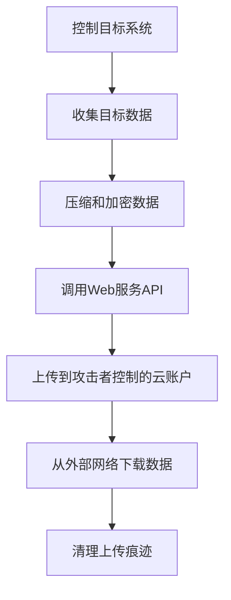

# 通过Web服务渗漏 (T1567)

## 一句话通俗理解

就像小偷用你的快递账号，把偷来的东西打包寄到他自己家——用正规的快递公司（云服务）送货，门卫根本不会怀疑。

## 难度等级

- ⭐⭐ 中级（需要一定基础）

## 技术描述

通过Web服务渗漏（T1567）是MITRE ATT&CK框架中渗漏战术的一种技术。

**通俗解释：**
攻击者利用合法的Web服务（如百度网盘、GitHub、Pastebin、企业微信等）来传输窃取的数据。因为这些服务是日常业务中常用的，所以网络防火墙一般不会拦截它们的流量。攻击者把偷到的数据上传到这些平台，然后再从外部网络下载下来，整个过程看起来就像是普通员工在使用云服务。

**技术原理：**

1. 攻击者在目标系统中植入恶意软件或脚本，获得文件访问权限
2. 恶意软件调用合法Web服务的API接口（如Google Drive API、GitHub API）
3. 将窃取的数据通过HTTPS加密上传到攻击者控制的云账户或公开空间
4. 攻击者从外部网络使用同样的API下载数据

**用途与影响：**
这种技术让攻击者可以绕过企业的防火墙和DLP（防数据泄露）系统，因为流量流向的是"受信任"的域名（如 microsoft.com、github.com），传统基于黑名单的检测无法发现。极难与正常的业务使用区分。

## 子技术列表

**该技术共有 4 个子技术：**

| 子技术ID | 中文名称 | 通俗解释 |
|----------|----------|----------|
| T1567.001 | 云存储 | 用网盘（OneDrive、Google Drive、Dropbox）传数据 |
| T1567.002 | 代码仓库 | 用GitHub、GitLab等代码托管平台传数据 |
| T1567.003 | 文本分享网站 | 用Pastebin等文本分享平台传小数据 |
| T1567.004 | Webhook | 用Slack、Discord的Webhook接口传数据 |

<details>
<summary><strong>展开查看各子技术详细说明</strong></summary>

### T1567.001 - 云存储

**通俗理解：** 就是把你偷的文件传到百度网盘上，然后从另一个电脑下载。

**详细说明：**
攻击者利用云存储服务（OneDrive、Google Drive、Dropbox、Box、iCloud等）进行数据渗出。通过使用服务的官方API或第三方工具（如rclone），将文件同步或上传到攻击者控制的云存储账户。流量看起来是正常的云服务流量，难以检测。

### T1567.002 - 代码仓库

**通俗理解：** 把偷来的数据当作代码提交到GitHub仓库里。

**详细说明：**
攻击者利用代码托管平台（GitHub、GitLab、Bitbucket等）的仓库功能进行数据渗出。数据通常以文件形式提交到公开或私有仓库中，伪装为合法的项目文件。

### T1567.003 - 文本分享网站

**通俗理解：** 用Pastebin这类网站贴代码的功能，把数据贴上去再复制走。

**详细说明：**
攻击者利用文本分享网站（Pastebin、Ghostbin、Hastebin等）的数据上传API进行渗出。由于这些网站常用于分享代码片段和日志，小规模数据的传输不会引发怀疑。

### T1567.004 - Webhook

**通俗理解：** 用企业微信或钉钉的机器人接口，把数据当消息发出去。

**详细说明：**
攻击者利用Webhook服务（Slack Webhook、Discord Webhook、Teams Webhook）的HTTP POST接口将数据传输到外部。Webhook服务设计用于集成通知，天然具有低可见性的特点。

</details>

## 攻击流程

### 典型攻击流程

```
控制目标系统 --> 收集目标数据 --> 调用Web服务API --> 上传数据到云服务 --> 从外部下载
```



**步骤详解：**

1. **控制目标系统**
   - 通俗描述：攻击者通过钓鱼、漏洞利用等方式先获得一台电脑的控制权
   - 技术细节：通过C2（命令与控制）通道下发渗漏模块
   - 常用工具：Cobalt Strike、Metasploit

2. **收集目标数据**
   - 通俗描述：在受害者的电脑上找到有价值的数据文件
   - 技术细节：根据预设规则搜索特定类型的文件（如 .docx、.xlsx）
   - 常用工具：自定义PowerShell脚本、find命令

3. **压缩和加密数据**
   - 通俗描述：把数据打包压缩并加密，防止被中间拦截的人看到
   - 技术细节：使用ZIP/RAR压缩 + AES加密
   - 常用工具：7-Zip、WinRAR、gpg

4. **调用Web服务API**
   - 通俗描述：用编程方式登录网盘、代码仓库等平台
   - 技术细节：使用OAuth令牌或API密钥进行身份认证
   - 常用工具：rclone、curl、Python requests

5. **上传到攻击者控制的云账户**
   - 通俗描述：把加密后的数据包上传到网盘上
   - 技术细节：通过HTTPS加密通道上传，流量看似正常
   - 常用工具：rclone、gsutil、aws cli

6. **从外部网络下载数据**
   - 通俗描述：攻击者在自己电脑上登入网盘把数据下载下来
   - 技术细节：从任何互联网终端访问云服务获取数据
   - 常用工具：浏览器、rclone、API客户端

7. **清理上传痕迹**
   - 通俗描述：删除本地缓存和临时文件
   - 技术细节：清除上传日志、清空剪贴板、删除临时文件
   - 常用工具：自定义脚本

## 真实案例

### 案例1：Lazarus Group通过Dropbox渗漏数据（2024-2025）

- **时间**: 2024年09月-2025年01月
- **目标**: 全球加密货币和科技行业开发者
- **攻击组织**: Lazarus Group（朝鲜背景APT组织）
- **手法**: Lazarus Group在"幽灵电路"（Phantom Circuit）行动中，通过供应链攻击植入恶意软件。被感染系统上的数据先发送到C2服务器，再由C2服务器自动上传到Dropbox进行存储和组织。攻击者与Dropbox的持久连接持续超过5小时，逐步上传窃取的开发凭证、认证令牌和系统配置信息。C2基础设施通过俄罗斯的Oculus代理网络进行中转，最终到达Dropbox。
- **影响**: 超过1500个系统被感染，遍布印度（284个）、巴西（32个）等多个国家
- **参考链接**: [SecurityScorecard - Operation Phantom Circuit](https://securityscorecard.com/blog/operation-phantom-circuit-north-koreas-global-data-exfiltration-campaign/)

### 案例2：APT41使用OneDrive渗出（T1567.001）

- **时间**: 2019-2021年
- **目标**: 全球制药、高科技行业
- **攻击组织**: APT41
- **手法**: APT41使用PINEGROVE后门通过OneDrive API进行数据渗出。PINEGROVE利用Microsoft Graph API接口将收集到的文件上传到攻击者控制的OneDrive账户，流量看起来是正常的Microsoft 365云服务流量。Google Cloud的威胁分析团队对此活动进行了详细披露。
- **影响**: 多个全球制药企业数据被盗
- **参考链接**: [Google Cloud - APT41 Arisen from Dust](https://cloud.google.com/blog/topics/threat-intelligence/apt41-arisen-from-dust)

### 案例3：CL0P利用MOVEit漏洞通过C2进行大规模数据窃取（2023-2025）

- **时间**: 2023年05月-2025年
- **目标**: 全球2773个组织的9558万人
- **攻击组织**: CL0P（TA505）
- **手法**: CL0P利用MOVEit Transfer的SQL注入漏洞（CVE-2023-34362）部署LEMURLOOT webshell，从MOVEit数据库中提取数据并通过HTTP通道传输。虽然主要使用C2通道，但数据最终被上传到攻击者控制的Web服务和数据泄露站点。后续在2025年，CL0P再次利用Oracle E-Business Suite漏洞发动大规模数据窃取活动，发送上万封勒索邮件。
- **影响**: 估计经济损失158亿美元，至少144起集体诉讼
- **参考链接**: [Net Sec Group - MOVEit Breach Analysis](https://netsecgroup.io/guides/moveit-clop-mass-exploitation)

### 案例4：ShinyHunters使用Salesforce API批量导出数据（2026）

- **时间**: 2026年04月
- **目标**: 7-Eleven便利店
- **攻击组织**: ShinyHunters
- **手法**: ShinyHunters通过社交工程攻击获得Salesforce环境访问权限，使用自动化脚本通过Salesforce Bulk API和Reporting API批量导出客户数据。攻击者声称窃取了超过60万条记录的企业数据和PII（个人身份信息），并泄露了9.4GB的压缩文档到暗网泄露站点。
- **影响**: 185,000人个人信息泄露
- **参考链接**: [BleepingComputer - 7-Eleven Data Breach](https://www.bleepingcomputer.com/news/security/7-eleven-confirms-data-breach-claimed-by-the-shinyhunters-gang/)

## 红队视角

> ⚠️ **免责声明**：以下内容仅用于合法的安全测试、渗透测试和教育目的。未经授权对他人系统进行测试是违法行为。

### 实战技巧

1. **使用rclone批量上传**
   使用rclone工具配合云存储的API，可以高效地从目标系统上传大量文件。配置好远程存储后，一条命令即可同步整个目录到云端。

2. **OAuth令牌复用**
   如果通过钓鱼获得了用户的OAuth令牌，可以直接使用该令牌访问对应的云服务API，无需额外认证，且流量与被盗用户行为一致。

3. **分时段小量上传**
   避免单次上传大量数据触发DLP告警。将数据分成小份，在不同的时间段上传，模仿正常用户的使用模式。

### 常用工具

| 工具名称 | 用途 | 平台 | 链接 |
|----------|------|------|------|
| rclone | 云存储文件同步 | Windows/Linux/macOS | https://rclone.org/ |
| curl | 命令行HTTP请求 | 全平台 | 系统内置 |
| gsutil | Google Cloud CLI | Windows/Linux/macOS | https://cloud.google.com/storage/docs/gsutil |
| AWS CLI | Amazon Web Services命令行 | Windows/Linux/macOS | https://aws.amazon.com/cli/ |
| PowerShell | Windows脚本环境 | Windows | 系统内置 |

### 注意事项

- 使用HTTPS代理避免直接IP暴露
- 上传前必须压缩加密，防止被流量审计拦截
- 注意云存储服务的上传速率限制和文件大小限制
- 使用完成后及时清理云存储中的数据，减少取证线索

## 蓝队视角

### 检测要点

1. **异常云存储API调用**
   - 日志来源：云访问安全代理（CASB）日志、Web代理日志
   - 关注字段：API调用频率、上传数据量、目标云服务域名
   - 异常特征：非工作时间的大量文件上传、从非预期地理位置的API调用

2. **OAuth令牌异常使用**
   - 日志来源：身份认证系统日志（Azure AD、Okta）
   - 关注字段：令牌使用IP地址、设备指纹、访问的资源类型
   - 异常特征：同一令牌从多个IP地址使用、令牌权限范围异常扩大

3. **非预期的Webhook调用**
   - 日志来源：网络流量日志、Web应用防火墙
   - 关注字段：POST请求的目标URL、请求体大小
   - 异常特征：内部系统向外部Webhook URL发送大量数据

### 监控建议

- 对云存储域名的流量进行深度分析，不因域名在白名单中就放弃检查
- 部署CASB（云访问安全代理）监控和控制对云服务的访问
- 监控GitHub/GitLab仓库的非工作时间commit活动和异常提交量

## 检测建议

### 网络层检测

**检测方法：** 监控出站流量中向云存储和代码托管平台的大批量数据上传行为。

**具体规则/命令示例：**

```
# 使用Zeek/Bro监控HTTP POST请求体大小
# 检测向知名云存储域名的大文件上传
```

**示例（Suricata规则）：**
```
alert http $HOME_NET any -> $EXTERNAL_NET any (msg:"T1567 - 向云存储服务上传大文件"; flow:to_server; http.method; content:"POST"; http.request_body; length:>50000000; content:"multipart/form-data"; http.content_type; classtype:trojan-activity; sid:1001567; rev:1;)
```

### 主机层检测

**检测方法：** 监控系统中rclone、gsutil、aws CLI等云存储工具的执行。

**Windows事件ID：**
- 事件ID 4688：进程创建，监控命令行参数中包含rclone、aws、gsutil等
- 事件ID 5156：Windows过滤平台连接，监控出站连接到云服务IP

**Linux日志：**
- 日志文件：/var/log/auth.log、~/.bash_history
- 关键字段：命令历史中包含rclone sync、aws s3 cp等

**具体命令示例：**
```bash
# 检测rclone的使用
grep -r "rclone" /home/*/.bash_history
# 查看AWS CLI使用记录
grep -r "aws s3" /home/*/.bash_history
```

### 应用层检测

**检测方法：** 应用层监控云服务API的调用频率和数据量。

**Sigma规则示例：**
```yaml
title: 检测rclone云存储同步工具的使用
status: experimental
description: 检测rclone进程创建，该工具常被用于数据渗漏
logsource:
    category: process_creation
    product: windows
detection:
    selection:
        Image|endswith: '\rclone.exe'
        CommandLine|contains:
            - 'sync'
            - 'copy'
            - 'move'
    condition: selection
level: high
tags:
    - attack.t1567
```

## 缓解措施

### 优先级1：关键措施

**措施名称：** 实施CASB策略管控云服务访问

**具体实施步骤：**
1. 部署云访问安全代理（CASB）方案
2. 配置策略限制非授权云存储服务的文件上传
3. 对高敏感数据的上传实施二次审批流程

**配置示例：**
```
# CASB策略示例：禁止向非企业级云存储上传敏感数据
if data_classification == "highly_sensitive" AND destination == "personal_cloud_storage":
    block
    alert_severity = "critical"
```

### 优先级2：重要措施

**措施名称：** OAuth应用授权管控

**具体实施步骤：**
1. 审查所有已授权的OAuth第三方应用
2. 限制用户可以授权的应用范围
3. 监控异常OAuth令牌使用行为

### 优先级3：建议措施

**措施名称：** 出站Webhook调用控制

**具体实施步骤：**
1. 建立Webhook URL白名单
2. 对Webhook出站调用实施审批机制
3. 限制内部系统直接访问外部Webhook服务

### MITRE ATT&CK 缓解措施映射

| 缓解措施ID | 缓解措施名称 | 适用性 | 说明 |
|------------|-------------|--------|------|
| M1037 | 过滤网络流量 | 适用 | 在Web代理层对云存储域名流量进行分析 |
| M1030 | 网络分段 | 部分适用 | 将数据收集系统与出口网络隔离 |
| M1021 | 限制基于Web的内容 | 适用 | 限制非必要的Web服务API调用 |

## 动手实验

> ⚠️ **重要提示**：所有实验必须在隔离的实验室环境中进行，禁止对未授权的真实系统进行测试。

### 实验环境准备

**推荐靶场/实验平台：**

| 平台名称 | 类型 | 难度 | 链接 |
|----------|------|------|------|
| Detection Lab | 虚拟靶场 | 中级 | https://github.com/clong/DetectionLab |
| Blue Team Labs | 在线平台 | 中级 | https://blueteamlabs.online/ |

**所需工具：**
- rclone：云存储文件同步工具
- Python 3：编写自动化渗漏脚本
- Wireshark：网络流量分析

**环境搭建：**
```bash
# 安装rclone
curl https://rclone.org/install.sh | sudo bash
# 配置远端存储（以Google Drive为例）
rclone config
```

### 实验1：模拟通过云存储渗漏（初级）

**实验目标：** 使用rclone将本地数据上传到测试云存储，观察网络流量特征。

**实验步骤：**
1. 创建一个测试用的云存储账号（推荐Google Drive测试账号）
2. 使用rclone配置远程存储
3. 创建包含模拟敏感数据的测试文件
4. 执行rclone sync命令上传
5. 使用Wireshark捕获并分析上传流量

**预期结果：** 观察到HTTPS加密流量流向云存储域名，从流量本身无法区分是正常使用还是恶意渗漏。

**学习要点：** 理解为什么这种技术难以被网络层检测发现。

### 实验2：通过Webhook渗漏（中级）

**实验目标：** 使用Discord Webhook模拟数据渗漏。

**实验步骤：**
1. 创建一个测试Discord服务器
2. 创建一个Webhook并获取URL
3. 编写Python脚本发送POST请求将数据发送到Webhook
4. 在Discord频道中查看接收到的数据

**预期结果：** 数据以消息形式出现在Discord频道中。

## 术语解释

| 术语 | 英文原名 | 通俗解释 |
|------|----------|----------|
| API | Application Programming Interface | 应用程序编程接口，就是程序之间互相打招呼的规则，就像两个人都说中文才能交流 |
| CASB | Cloud Access Security Broker | 云访问安全代理，在企业网络和云服务之间装的一个"安检门" |
| DLP | Data Loss Prevention | 防数据泄露系统，就像一个自动检查包裹内容物并阻止敏感物品寄出的安检机 |
| OAuth | Open Authorization | 开放授权协议，类似于酒店的临时房卡——你有权限进房间但不能进所有房间 |
| Webhook | Web回调 | 一种"有消息就通知你"的机制，就像快递到了手机会收到短信通知 |
| 数据渗漏 | Data Exfiltration | 把数据非法地从内部网络传输到外部，就像偷东西运出大门 |

## 参考资料

### 官方文档

- [MITRE ATT&CK - T1567](https://attack.mitre.org/techniques/T1567/)
- [MITRE ATT&CK - T1567.001 云存储](https://attack.mitre.org/techniques/T1567/001/)
- [MITRE ATT&CK - T1567.002 代码仓库](https://attack.mitre.org/techniques/T1567/002/)
- [MITRE ATT&CK - T1567.003 文本分享网站](https://attack.mitre.org/techniques/T1567/003/)
- [MITRE ATT&CK - T1567.004 Webhook](https://attack.mitre.org/techniques/T1567/004/)

### 安全报告

- [Google Cloud - APT41 Arisen from Dust](https://cloud.google.com/blog/topics/threat-intelligence/apt41-arisen-from-dust) - APT41利用OneDrive渗漏分析
- [SecurityScorecard - Operation Phantom Circuit](https://securityscorecard.com/blog/operation-phantom-circuit-north-koreas-global-data-exfiltration-campaign/) - Lazarus Group利用Dropbox渗漏分析

### 工具与资源

- [rclone](https://rclone.org/) - 云存储文件同步命令行工具
- [Cobalt Strike](https://www.cobaltstrike.com/) - 渗透测试框架

### 学习资料

- [MITRE ATT&CK - T1567 官方页面](https://attack.mitre.org/techniques/T1567/) - 官方技术文档
