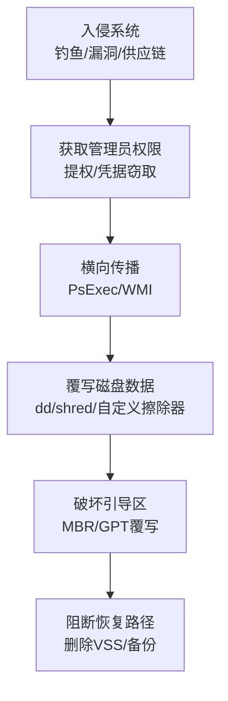

# 数据销毁 (T1485)

## 一句话通俗理解

不是锁你的文件（那还能要赎金），而是直接把你的数据烧成灰——谁也恢复不了，备份也救不回来。

## 30秒速查卡

| 维度 | 你需要知道的 |
|------|-------------|
| 这是什么？ | 数据销毁（T1485）是攻击者用来破坏目标系统或数据的技术 |
| 为什么危险？ | 攻击者可以对目标造成不可逆的破坏，可能导致业务完全中断 |
| 谁需要关心？ | 安全运维团队、系统管理员、业务负责人 |
| 你的第一步防御 | 定期备份数据并测试恢复流程，确保备份与生产环境隔离 |
| 如果只做一件事 | 监控异常的数据删除或修改行为，设置关键文件完整性告警 |

## 难度等级

⭐⭐ 中级（需要一定基础）

## 技术描述

数据销毁（T1485）是MITRE ATT&CK框架中影响战术的一种技术。攻击者故意覆盖、擦除或破坏数据，使其永久性不可恢复。这是影响战术中最具破坏性的技术。

**通俗解释：**
想象有人闯进你家，不是把文件锁在保险柜里勒索你，而是直接点火把文件烧成灰。数据销毁就是"烧文件"——攻击者使用专门的擦除工具，把硬盘上的数据覆盖上随机字符（就像在写满字的纸上再涂满墨水），或者直接破坏硬盘的引导区让整个电脑报废。与勒索软件（T1486）不同，数据销毁不要求赎金，纯粹是为了搞破坏。

**技术原理：**

1. 攻击者首先通过提权获得系统管理员权限
2. 使用专用擦除工具覆盖磁盘扇区（如使用 `dd if=/dev/random of=/dev/sda` 多次覆写）
3. 破坏主引导记录（MBR）或GUID分区表（GPT），使系统无法启动
4. 删除卷影副本和备份文件，防止数据恢复
5. 在某些攻击中，还会破坏EFI系统分区和固件

**用途与影响：**
数据销毁技术主要用于国家级APT攻击的地缘政治破坏行动（如Shamoon攻击沙特阿美、AcidRain攻击Viasat卫星）。在2025-2026年，擦除器攻击再度活跃，成为网络冲突中的首选破坏手段。与勒索攻击不同，擦除器攻击不追求经济利益，而是追求最大化破坏效果。

## 子技术列表

**该技术没有子技术。**

## 攻击流程

### 典型攻击流程

```
入侵系统 --> 获取权限 --> 传播扩散 --> 覆盖磁盘 --> 破坏引导 --> 阻断恢复
```



**步骤详解：**

1. **入侵系统**
   - 通俗描述：攻击者通过钓鱼邮件、漏洞利用或供应链攻击进入目标网络
   - 技术细节：使用鱼叉式钓鱼邮件投递初始载荷，或利用面向公网应用的已知漏洞
   - 常用工具：Cobalt Strike、Phishing框架

2. **获取管理员权限**
   - 通俗描述：提升权限到管理员级别，才能执行磁盘级操作
   - 技术细节：利用本地提权漏洞，或从已攻陷的域控制器获取域管理员权限
   - 常用工具：Mimikatz、PsExec

3. **横向传播**
   - 通俗描述：在内部网络中扩散，感染更多系统
   - 技术细节：使用PsExec、WMI或SMB漏洞（如永恒之蓝）在内网传播
   - 常用工具：PsExec、WMI、SMB漏洞利用

4. **覆写磁盘数据**
   - 通俗描述：用随机数据覆盖原始文件，让数据彻底消失
   - 技术细节：使用 `dd if=/dev/urandom of=/dev/sda bs=4M` 覆写整个磁盘，或自定义擦除器有针对性的覆盖关键文件
   - 常用工具：`dd`、`shred`、`wipee`、自定义擦除器

5. **破坏引导区**
   - 通俗描述：破坏硬盘的启动扇区，让系统无法开机
   - 技术细节：覆盖MBR（主引导记录）或GPT（GUID分区表），替换为自定义引导加载器或随机数据
   - 常用工具：自定义MBR覆写器

6. **阻断恢复**
   - 通俗描述：删除所有备份和系统恢复功能，确保数据无法恢复
   - 技术细节：删除卷影副本、擦除备份目录、删除备份分类
   - 常用工具：`vssadmin`、`wbadmin`

## 真实案例

### 案例1：Stryker 医疗科技擦除器攻击 (2026)

- **时间**: 2026年3月
- **目标**: Stryker 医疗科技公司（全球最大医疗设备制造商之一）
- **攻击组织**: Handala（与伊朗情报机构关联的黑客组织）
- **手法**: Handala 声称擦除了Stryker在全球79个国家的200,000多台系统、服务器和移动设备上的数据。攻击者使用自定义擦除器覆写关键磁盘扇区，同时删除备份和恢复数据。Stryker位于爱尔兰的工厂被迫让5,000多名员工回家停工。该攻击声称是报复美国对伊朗学校的导弹袭击。
- **影响**: Stryker全球运营严重中断，市值蒸发数十亿美元
- **参考链接**: [Iran-Backed Hackers Claim Wiper Attack on Stryker - Krebs](https://krebsonsecurity.com/2026/03/iran-backed-hackers-claim-wiper-attack-on-medtech-firm-stryker/)

### 案例2：Shamoon 沙特阿美 (2012/2016)

- **时间**: 2012年8月 / 2016年11月
- **目标**: 沙特阿美石油公司（2012）、多家中东组织（2016）
- **攻击组织**: APT33 (Elfin Team)，疑似伊朗背景
- **手法**: Shamoon擦除器将受害计算机的MBR替换为燃烧的美国国旗图片（2012版）或叙利亚国旗图片（2016版），然后用随机数据覆写文件内容。2012年版本销毁了30,000+台系统的数据。2016年版本增加了对网络共享的擦除能力和从内存中提取凭据的功能。
- **影响**: 沙特阿美被迫用1个月恢复系统，数据永久丢失
- **参考链接**: [Shamoon - MITRE ATT&CK](https://attack.mitre.org/software/S0140/)

### 案例3：AcidRain / Viasat KA-SAT (2022)

- **时间**: 2022年2月
- **目标**: Viasat 卫星通信客户的 KA-SAT 调制解调器
- **攻击组织**: 疑似俄罗斯 Sandworm 团队
- **手法**: AcidRain wiper 针对 Viasat 的卫星调制解调器，通过覆写关键系统分区和擦除闪存存储，使约30,000个调制解调器永久变砖。该攻击在2022年俄乌战争爆发前数小时发生，旨在破坏乌克兰军方和政府的卫星通信。
- **影响**: 乌克兰军方通信受损，欧洲多国卫星互联网用户数周无法使用
- **参考链接**: [AcidRain - MITRE ATT&CK](https://attack.mitre.org/software/S1124/)

### 案例4：Lotus 数据擦除器 - 委内瑞拉 (2025)

- **时间**: 2025年12月
- **目标**: 委内瑞拉国家石油公司（PDVSA）及能源公用事业
- **攻击组织**: 未公开归因
- **手法**: Lotus 擦除器通过两个批处理脚本（OhSyncNow.bat 和 notesreg.bat）准备系统：禁用Windows服务、枚举用户并禁用账户、更改密码、注销活跃会话、禁用所有网络接口。然后使用 `diskpart clean all` 覆写整个磁盘，用 `fsutil` 填满剩余空间。攻击时间与委内瑞拉政治动荡（总统被捕）高度吻合。
- **影响**: PDVSA交付系统瘫痪，全国能源运营受到严重影响
- **参考链接**: [Lotus Wiper Analysis - Kaspersky](https://securelist.com/tr/lotus-wiper/119472/)

## 红队视角

> ⚠️ **免责声明**：以下内容仅用于合法的安全测试、渗透测试和教育目的。未经授权对他人系统进行测试是违法行为。

### 实战技巧

1. **选择性擦除策略**
   不必擦除整个磁盘——擦除关键文件（数据库文件、邮件服务器存储、AD数据库）即可造成最大破坏。针对VMware环境，删除虚拟机磁盘文件（.vmdk）比擦除物理机更高效。

2. **触发式擦除**
   设置定时触发或远程触发机制，在特定时间点同时激活所有受感染系统上的擦除器，实现"地毯式"同步打击。

3. **隐形擦除**
   使用低慢速覆写策略，在不触发磁盘I/O告警的情况下逐步破坏数据。先覆盖关键系统文件使系统崩溃，用户重启后才发现无法恢复。

### 常用工具

| 工具名称 | 用途 | 平台 | 链接 |
|----------|------|------|------|
| dd | Unix/Linux磁盘复制和覆写工具 | Linux | 系统内置 |
| shred | 安全文件删除工具 | Linux | 系统内置 |
| sdelete | 安全删除工具 | Windows | https://learn.microsoft.com/sysinternals/ |
| diskpart | Windows磁盘分区管理 | Windows | 系统内置 |
| DBAN | 磁盘数据擦除启动盘 | 跨平台 | https://dban.org/ |

### 注意事项

- 此类测试的风险极高，必须使用专门隔离的测试环境
- 在物理机上测试可能导致硬件永久损坏
- 建议使用虚拟机快照功能，擦除后可快速复原
- 严格遵守法律和授权范围

## 蓝队视角

### 检测要点

1. **大规模磁盘写入检测**
   - 日志来源：Windows Event ID 4663、Sysmon Event ID 11
   - 关注字段：对物理磁盘的直接写入操作，`\Device\Harddisk` 相关操作
   - 异常特征：短时间内对大量非数据文件（系统文件、分区表区域）的写入

2. **MBR/GPT写操作检测**
   - 日志来源：Sysmon Event ID 13、EDR内核级告警
   - 关注字段：对磁盘0扇区（MBR）或GPT区域的异常写入
   - 异常特征：非系统更新或磁盘管理操作对引导扇区的写入

3. **擦除工具检测**
   - 日志来源：Sysmon Event ID 1
   - 关注字段：`dd`、`shred`、`wipe`、`diskpart clean` 等命令的执行
   - 异常特征：非存储管理员的磁盘级擦除操作

### 监控建议

- 在关键服务器上部署文件完整性监控（FIM），覆盖MBR和系统文件
- 使用EDR的磁盘I/O行为分析，检测异常的大规模覆写操作
- 监控启动扇区（MBR/GPT）的变更告警

## 检测建议

### 网络层检测

**检测方法：** 检测擦除器的C2通信和横向传播流量

**具体规则/命令示例：**
```
# 检测 PsExec 横向传播（擦除器常用传播方式）
alert tcp $HOME_NET any -> $HOME_NET 445 (msg:"Potential Lateral Movement - PsExec Service"; content:"PSEXESVC"; sid:1000003; rev:1;)
```

### 主机层检测

**检测方法：** 监控磁盘物理写入操作

**Windows事件ID：**
- 事件ID 4663：磁盘文件写入操作审计
- 事件ID 4656：磁盘句柄请求
- 事件ID 11 (Sysmon)：文件创建事件（覆写文件残骸）
- 事件ID 13 (Sysmon)：注册表变更（MBR相关注册表）

**具体命令示例：**
```bash
# Linux 检测大规模磁盘写入
auditctl -w /dev/sda -p w -k disk-wipe
ausearch -k disk-wipe --start today
```

### 应用层检测

**用人话说：** 这条规则在检测数据擦除器攻击。跟勒索软件不同，擦除器不要赎金，纯粹是搞破坏——用dd/shred覆写磁盘扇区、用diskpart clean all清除整个硬盘、破坏MBR使系统无法启动。检测的关键信号是：短时间内出现大量直接对物理磁盘的写入操作（不是正常文件修改）、系统工具如dd/shred/sdelete被执行且目标为/dev/sd*或整个分区、或者主引导记录（MBR）被非系统更新操作写入。一旦发现这些信号，攻击者已经在执行最后一击——数据正在被永久销毁，应该立刻切断被感染系统的网络连接并启动灾难恢复流程。

**Sigma规则示例：**
```yaml
title: 检测磁盘数据擦除命令执行
status: experimental
description: 检测Linux系统中使用dd或shred进行磁盘级数据擦除的行为
logsource:
    category: process_creation
    product: linux
detection:
    selection:
        Image|endswith:
            - '/dd'
            - '/shred'
        CommandLine|contains:
            - 'of=/dev/sd'
            - '/dev/zero'
            - '/dev/urandom'
            - '/dev/random'
    condition: selection
level: high
tags:
    - attack.t1485
```

## 缓解措施

### 优先级1：关键措施

**措施名称：** 不可变离线备份

**具体实施步骤：**
1. 维护完全离线（air-gapped）的备份副本
2. 使用WORM（写一次读多次）存储技术
3. 备份管理网络与生产网络物理隔离

### 优先级2：重要措施

**措施名称：** 关键系统保护

**具体实施步骤：**
1. 使用UEFI Secure Boot防止MBR/UEFI被篡改
2. 配置磁盘写保护策略，限制非授权磁盘级写入
3. 对物理机部署TPM（可信平台模块）完整性校验

### 优先级3：建议措施

**措施名称：** 最小权限和监控

**具体实施步骤：**
1. 限制管理员权限，实施Just Enough Administration (JEA)
2. 对敏感系统部署文件完整性监控（FIM）
3. 实施存储阵列的快照保护策略，防止批量卷删除

### MITRE ATT&CK 缓解措施映射

| 缓解措施ID | 缓解措施名称 | 适用性 | 说明 |
|------------|-------------|--------|------|
| M1053 | Data Backup | 适用 | 离线不可变备份 |
| M1022 | Restrict File and Directory Permissions | 适用 | 限制磁盘写入权限 |
| M1040 | Behavior Prevention on Endpoint | 适用 | 检测异常磁盘I/O行为 |
| M1029 | Remote Data Storage | 适用 | 不可变远程存储备份 |
| M1045 | Boot Integrity | 适用 | 启用UEFI Secure Boot |

## 动手实验

> ⚠️ **重要提示**：所有实验必须在隔离的实验室环境中进行，禁止对未授权的真实系统进行测试。

### 实验环境准备

**推荐靶场/实验平台：**

| 平台名称 | 类型 | 难度 | 链接 |
|----------|------|:----:|------|
| TryHackMe - Disk Forensics | 在线靶场 | 中级 | https://tryhackme.com/ |
| Let's Defend | 在线平台 | 中级 | https://letsdefend.io/ |

**所需工具：**
- Linux VM（Ubuntu/Debian）
- `dd`、`shred` 工具

**环境搭建：**
```bash
# 创建测试用的虚拟磁盘文件
dd if=/dev/zero of=test_disk.img bs=1M count=100
# 格式化测试磁盘
mkfs.ext4 test_disk.img
```

### 实验1：理解数据擦除原理（初级）

**实验目标：** 理解文件删除和文件覆写的区别

**实验步骤：**
1. 创建测试文件：`echo "Sensitive Data" > test.txt`
2. 查看文件内容：`cat test.txt`
3. 使用 `rm` 删除文件：`rm test.txt`
4. 使用数据恢复工具尝试恢复（如 `testdisk`）
5. 使用 `shred` 安全删除：`shred -vfz -n 3 test.txt`
6. 再次尝试恢复

**预期结果：** rm删除的文件可以恢复，shred覆写后的文件无法恢复

**学习要点：** 理解为什么简单的删除操作不等于安全销毁，覆写次数对恢复可能性的影响

### 实验2：模拟MBR覆写（高级）

**实验目标：** 理解MBR被破坏后系统无法启动的原理

**实验步骤：**
1. 在VM中创建快照（重要！）
2. 查看当前MBR内容：`dd if=/dev/sda of=mbr_backup bs=512 count=1`
3. 备份MBR：`dd if=/dev/sda of=mbr_backup.bin bs=512 count=1`
4. 覆写MBR：`dd if=/dev/urandom of=/dev/sda bs=512 count=1`
5. 重启系统观察结果
6. 从备份恢复MBR

**预期结果：** MBR被覆写后系统无法启动，恢复MBR后系统正常启动

**学习要点：** 理解MBR在系统启动中的作用，以及为什么擦除器要破坏MBR

## 术语解释

| 术语 | 英文原名 | 通俗解释 |
|------|----------|----------|
| 擦除器 | Wiper | 专门用来销毁数据的恶意软件，比勒索软件更狠——不要钱，只要你的数据彻底消失 |
| 主引导记录 | Master Boot Record (MBR) | 硬盘的第一个扇区，计算机开机时最先读取的区域，破环后系统直接变砖 |
| GUID分区表 | GUID Partition Table (GPT) | 现代硬盘的分区方案，比MBR更先进，但对数据销毁攻击同样脆弱 |
| 覆写 | Overwrite | 用新的数据覆盖掉旧数据，就像在写满字的纸上再写一遍，下面的字就看不见了 |
| 扇区 | Sector | 硬盘最小的存储单元，就像书的一页纸，多个扇区组成一个文件 |
| 数据恢复 | Data Recovery | 从损坏的存储介质中找回数据的技术，就像从碎纸机里拼回文件 |
| 文件完整性监控 | File Integrity Monitoring (FIM) | 监控文件是否被修改的系统，发现异常变更时告警 |
| 安全删除 | Secure Deletion | 不只是删除文件，还要用随机数据反复覆写，确保无法恢复 |
| 横向扩散 | Lateral Movement / Propagation | 攻击者在被入侵的网络内部从一台机器跳到另一台机器的过程 |
| 供应链攻击 | Supply Chain Attack | 不直接攻击目标，而是攻击目标的软件供应商，通过更新服务投递恶意软件 |

## 参考资料

### 官方文档

- [MITRE ATT&CK - Data Destruction](https://attack.mitre.org/techniques/T1485/)

### 安全报告

- [Krebs - Handala Stryker Wiper Attack](https://krebsonsecurity.com/2026/03/iran-backed-hackers-claim-wiper-attack-on-medtech-firm-stryker/)
- [Lotus Wiper Analysis - Kaspersky](https://securelist.com/tr/lotus-wiper/119472/)
- [Shamoon Analysis - Mandiant](https://www.mandiant.com/resources/shamoon-2-delivering-distraction)
- [AcidRain / Viasat Attack - SentinelOne](https://www.sentinelone.com/blog/acidrain-viperrat-new-malware-linked-to-viasat-satellite-hack/)
- [NotPetya Analysis - Welivesecurity](https://www.welivesecurity.com/2017/07/04/analysis-of-telebots-cunning-connection/)

### 工具与资源

- [DBAN](https://dban.org/) - 磁盘数据擦除工具
- [TestDisk](https://www.cgsecurity.org/wiki/TestDisk) - 数据恢复工具
- [Foremost](https://foremost.sourceforge.net/) - 文件恢复和取证工具

### 学习资料

- [Wiper Attacks in 2026 - NetSecurity](https://www.netsecurity.com/wiper-attacks-in-2026-the-return-of-destructive-cyber-operations/) - 2026年擦除器攻击分析
- [CISA - Wiper Malware](https://www.cisa.gov/news-events/alerts/2022/03/wiper-malware) - CISA擦除器恶意软件指南
