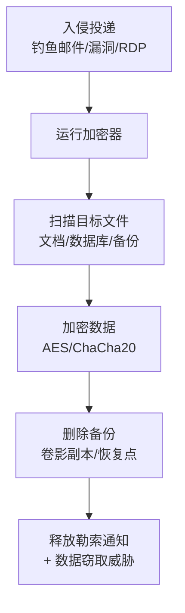

# 数据加密勒索 (T1486)

## 一句话通俗理解

攻击者把你的所有文件都加上密码锁，然后贴纸条说"给钱就给你钥匙"——这就是勒索软件的核心技术。

## 难度等级

⭐⭐ 中级（需要一定基础）

## 技术描述

数据加密勒索（T1486）是MITRE ATT&CK框架中影响战术的一种技术。这是勒索软件（Ransomware）的核心技术，也是当前网络安全领域最严重的威胁之一。

**通俗解释：**
想象你回到家，发现家门被换成了一把密码锁，门上贴着纸条："转账10万比特币，我就告诉你密码。"攻击者做的事情类似——他们入侵你的电脑后，用加密算法把你的所有文档、照片、数据库文件都锁住，只有他们手里的密钥才能解开。与数据销毁（T1485）不同，加密后的数据理论上还能恢复（只要有密钥），但攻击者通常要求支付赎金才给密钥。

**技术原理：**

1. 攻击者首先在目标系统上执行勒索软件程序（通常通过钓鱼邮件、漏洞利用或RDP爆破等方式投递）
2. 勒索软件扫描本地磁盘、网络共享和挂载的远程存储，列出所有目标文件类型（如文档、图片、数据库文件）
3. 使用对称加密算法（如AES、ChaCha20）快速加密文件内容，再用非对称加密（如RSA）保护对称密钥
4. 加密完成后，删除原始文件、卷影副本和备份，在每个目录下释放勒索通知文件
5. 现代勒索软件还会在加密前窃取敏感数据，实施"双重勒索"——不给钱就公开数据

**用途与影响：**
攻击者使用这个技术的核心目的是获取经济收益。通过勒索软件即服务（RaaS）模式，即使是技术能力不高的攻击者也能发动勒索攻击。2025年全球勒索软件攻击事件超过4,700起，涉及医疗、制造、能源等关键基础设施领域，造成的经济损失高达数百亿美元。

## 子技术列表

**该技术没有子技术。**

## 攻击流程

### 典型攻击流程

```
入侵投递 --> 运行加密器 --> 扫描文件 --> 加密数据 --> 释放勒索通知 --> 双重勒索
```



**步骤详解：**

1. **入侵投递**
   - 通俗描述：攻击者通过钓鱼邮件、漏洞利用或远程桌面爆破等方式把勒索软件送到目标系统上
   - 技术细节：使用带宏的Office文档、恶意链接下载、RDP暴力破解、漏洞利用工具包（如永恒之蓝）等
   - 常用工具：Cobalt Strike、Phishing框架、漏洞利用工具包

2. **运行加密器**
   - 通俗描述：勒索软件开始在受害者的电脑上运行，准备加密文件
   - 技术细节：提权后禁用安全软件（停止防病毒服务），停止数据库等进程以解锁文件，然后开始扫描文件
   - 常用工具：`net stop`、`sc stop`、`wmic` 进程终止

3. **扫描目标文件**
   - 通俗描述：勒索软件查找所有值得加密的文件，包括本地文档、网络共享和云存储
   - 技术细节：遍历所有驱动器（C:、D:、网络映射盘），匹配目标扩展名列表（如 .doc、.pdf、.xls、.db、.bak等），跳过系统文件以保持系统运行
   - 常用工具：勒索软件内置的文件遍历模块

4. **加密数据**
   - 通俗描述：使用高强度加密算法锁住文件，每个文件用不同的密钥加密
   - 技术细节：现代勒索软件（如LockBit、BlackCat）使用ChaCha20或AES-256加密文件内容，再用RSA-4096或Curve25519加密每个文件的密钥，实现"混合加密"
   - 常用工具：勒索软件内置的加密模块

5. **删除备份**
   - 通俗描述：删除系统的自动备份和还原点，让受害者无法自己恢复
   - 技术细节：执行 `vssadmin delete shadows /all` 删除卷影副本，`wbadmin delete catalog` 删除备份分类，`bcdedit /set {default} recoveryenabled No` 禁用系统恢复
   - 常用工具：`vssadmin`、`wmic`、`bcdedit`、`wevtutil`

6. **释放勒索通知**
   - 通俗描述：在每个文件夹留下赎金说明，告诉受害者怎么交钱拿密钥
   - 技术细节：创建 `README.txt`、`HOW_TO_DECRYPT.html` 等勒索通知文件，包含比特币地址、Tor联系网站、受害者唯一编号等
   - 常用工具：勒索软件内置的勒索通知模块

## 真实案例

### 案例1：LockBit 勒索软件 (2019-至今)

- **时间**: 2019年-2026年
- **目标**: 全球各行业组织（制造、医疗、金融、政府）
- **攻击组织**: LockBit（勒索软件即服务团伙）
- **手法**: LockBit 使用 ChaCha20 和 RSA-4096 混合加密方案，采用文件分块加密策略提高速度。LockBit 3.0/4.0 支持通过 StealBit 工具自动渗漏数据，实现双重勒索（加密+数据泄露）。2024年2月，国际执法机构通过"Operation Cronos"行动查封了LockBit的基础设施，但该组织在2024年底又宣布推出LockBit 4.0版本。2025-2026年，LockBit 5.0变种继续活跃，攻击了巴西食品行业巨头Brassuco Alimentos等多家企业。
- **影响**: 造成全球数千家组织数据被加密，勒索赎金从数十万到数千万美元不等
- **参考链接**: [LockBit - MITRE ATT&CK](https://attack.mitre.org/software/S1112/)

### 案例2：BlackCat/ALPHV 勒索软件 (2021-2025)

- **时间**: 2021年-2025年
- **目标**: 全球各行业，包括医疗、制药、制造业
- **攻击组织**: BlackCat (ALPHV)
- **手法**: BlackCat 是首款使用 Rust 语言编写的知名勒索软件，采用 AES-256 加密文件，支持自定义配置。其加密器兼容 Windows、Linux 和 ESXi 平台，可针对虚拟化环境加密虚拟磁盘文件。BlackCat 采用 RaaS 模式运营，招募下线（Affiliate）执行攻击。2023年，BlackCat 攻击了多家美国企业。2025年底，美国司法部起诉了多名 BlackCat 关联的网络勒索谈判专家和前安全公司员工。
- **影响**: 造成大量企业数据被加密和泄露，部分组织支付了数百万美元赎金
- **参考链接**: [BlackCat - MITRE ATT&CK](https://attack.mitre.org/software/S1065/)

### 案例3：Qilin 勒索软件 (2024-2025)

- **时间**: 2024年-2025年
- **目标**: 全球医疗、科技行业
- **攻击组织**: Qilin（又名Agenda）
- **手法**: 2024年6月，Qilin 攻击了英国病理检测服务商 Synnovis，加密了其 IT 系统并窃取了大量患者数据（包括姓名、出生日期、NHS编号和血检信息）。攻击者在暗网泄露站点发布"证据包"（Proof Packs），威胁公开敏感患者数据，索要5000万美元赎金。Qilin 还引入了AI辅助谈判机器人，自动与受害者进行赎金谈判。
- **影响**: 导致伦敦多家医院紧急医疗服务中断数月，患者数据被公开泄露
- **参考链接**: [Qilin Ransomware - Sophos](https://news.sophos.com/en-us/2025/10/08/the-state-of-ransomware-in-healthcare-2025/)

### 案例4：FunkSec 勒索软件 (2024-2025)

- **时间**: 2024年-2025年
- **目标**: 欧洲和亚洲政府、科技、教育机构
- **攻击组织**: FunkSec
- **手法**: FunkSec 是2024年末出现的 RaaS 勒索软件组织，其独特之处在于大量使用 AI 生成代码（通过LLM生成，包含完美无瑕的注释）。FunkSec 采用双重勒索策略，但赎金要求异常低（高频次、低成本模式），2024年12月一个月就声称攻击了比老牌勒索软件更多的受害者。FunkSec 代表了AI辅助勒索软件的新趋势。
- **影响**: 带动了AI辅助勒索软件开发的趋势，增加了防御难度
- **参考链接**: [Kaspersky 2025 Ransomware Report](https://securelist.com/state-of-ransomware-in-2025/116475/)

## 红队视角

> ⚠️ **免责声明**：以下内容仅用于合法的安全测试、渗透测试和教育目的。未经授权对他人系统进行测试是违法行为。

### 实战技巧

1. **加密效率优化**
   采用分块加密策略，只加密每个文件的前几MB（如128KB-1MB），即可使文件不可用，同时大幅提升加密速度。LockBit 等勒索软件使用的正是这种策略。

2. **绕过安全软件检测**
   在加密前先停止常见安全软件服务，使用进程空心化（Process Hollowing）或DLL侧加载（DLL Side-Loading）技术运行加密器。

3. **最大化破坏效果**
   加密网络共享和NAS设备，针对VMware ESXi环境加密虚拟磁盘文件（.vmdk、.vhd），使用 `esxcli` 命令停止虚拟机。

### 常用工具

| 工具名称 | 用途 | 平台 | 链接 |
|----------|------|------|------|
| Cobalt Strike | 红队C2框架，用于植入勒索软件 | 跨平台 | https://www.cobaltstrike.com/ |
| XMRig | 加密矿工，测试挖矿行为检测 | 跨平台 | https://github.com/xmrig/xmrig |
| Cryptsetup | Linux磁盘加密测试 | Linux | https://gitlab.com/cryptsetup/cryptsetup |
| EDR-Paranoid | 测试EDR绕过技巧 | Windows | https://github.com/Push3AX/EDR-Paranoid |

### 注意事项

- 所有测试必须在获得明确书面授权的环境中进行
- 加密操作必须使用测试密钥，确保测试后可以解密
- 注意不要影响到生产数据和备份系统
- 使用专门的隔离实验室环境，避免加密操作扩散到外部网络

## 蓝队视角

### 检测要点

1. **大规模文件操作检测**
   - 日志来源：Windows Event Log (Event ID 4663)、Sysmon Event ID 11 (FileCreate)
   - 关注字段：大量文件在同一目录被修改或重命名
   - 异常特征：短时间内对数千个文件执行读取-加密-写入操作

2. **勒索通知文件创建**
   - 日志来源：Sysmon Event ID 11、File System Audit
   - 关注字段：新创建的 `.txt`、`.html`、`.png` 文件，文件名包含 `README`、`DECRYPT`、`HOW_TO` 等关键词
   - 异常特征：在多个目录同时出现类似命名的通知文件

3. **卷影副本删除**
   - 日志来源：Windows Event ID 524、Sysmon Event ID 1
   - 关注字段：`vssadmin`、`wmic shadowcopy` 等命令的执行
   - 异常特征：非管理员在非维护时间执行卷影删除命令

### 监控建议

- 部署EDR方案，启用反勒索软件行为检测模块
- 监控加密API（CryptEncrypt、BCryptEncrypt）的异常大规模调用
- 建立文件扩展名变更基线，检测批量文件重命名行为
- 对管理员执行敏感命令（vssadmin、bcdedit）设置实时告警

## 检测建议

### 网络层检测

**检测方法：** 检测勒索软件的C2通信和勒索软件下载流量

**具体规则/命令示例：**

```
# Suricata规则 - 检测勒索软件Tor连接
alert tcp $HOME_NET any -> $EXTERNAL_NET 443 (msg:"Potential Ransomware TOR Connection"; flow:to_server; tls.sni; content:"onion"; nocase; sid:1000001; rev:1;)
```

### 主机层检测

**检测方法：** 监控勒索软件的关键行为指标

**Windows事件ID：**
- 事件ID 4663：文件操作审计（大量文件写入）
- 事件ID 524：卷影副本删除
- 事件ID 7036：服务状态变更（安全服务被停止）
- 事件ID 1102：安全日志被清除

**具体命令示例：**
```powershell
# 检测近期卷影副本删除操作
Get-WinEvent -FilterHashtable @{LogName='Security'; ID=524} | Select-Object TimeCreated, Message

# 监控批量文件扩展名变更
Get-WinEvent -FilterHashtable @{LogName='Security'; ID=4663} | Where-Object {$_.Properties -match '\.(locked|encrypt|crypt)'}
```

### 应用层检测

**Sigma规则示例：**
```yaml
title: 检测卷影副本删除 - 勒索软件前兆
status: experimental
description: 检测攻击者使用vssadmin删除卷影副本的行为，通常是勒索软件的前置操作
logsource:
    category: process_creation
    product: windows
detection:
    selection:
        Image|endswith: '\vssadmin.exe'
        CommandLine|contains|all:
            - 'delete'
            - 'shadows'
    condition: selection
level: high
tags:
    - attack.t1486
    - attack.t1490
```

## 缓解措施

### 优先级1：关键措施

**措施名称：** 3-2-1 备份策略

**具体实施步骤：**
1. 维护至少3份数据副本
2. 存储在2种不同的介质上
3. 至少1份离线（不可变）备份，不能被网络访问删除

**配置示例：**
```bash
# 使用 rsync 创建离线备份
rsync -avz --delete /data /mnt/offline-backup/
```

### 优先级2：重要措施

**措施名称：** 限制远程访问和应用程序白名单

**具体实施步骤：**
1. 对RDP启用网络级别认证（NLA），限制暴露到公网
2. 使用AppLocker或Windows Defender Application Control (WDAC)限制未授权程序的执行
3. 禁用Office宏，或仅允许经过数字签名的宏运行

### 优先级3：建议措施

**措施名称：** 补丁管理和邮件安全

**具体实施步骤：**
1. 定期修补已知漏洞（特别是面向公网的应用和系统）
2. 部署邮件安全网关，过滤恶意附件和钓鱼链接
3. 实施多因素认证（MFA），降低凭据泄露后的入侵风险

### MITRE ATT&CK 缓解措施映射

| 缓解措施ID | 缓解措施名称 | 适用性 | 说明 |
|------------|-------------|--------|------|
| M1036 | Account Use Policies | 适用 | 限制账户权限和RDP访问 |
| M1041 | Encrypt Sensitive Information | 适用 | 对敏感数据加密存储 |
| M1040 | Behavior Prevention on Endpoint | 适用 | 部署端点行为检测和防护 |
| M1029 | Remote Data Storage | 适用 | 使用不可变离线备份 |
| M1038 | Execution Prevention | 适用 | 应用程序白名单控制 |
| M1053 | Data Backup | 适用 | 实施3-2-1备份策略 |

## 动手实验

> ⚠️ **重要提示**：所有实验必须在隔离的实验室环境中进行，禁止对未授权的真实系统进行测试。

### 实验环境准备

**推荐靶场/实验平台：**

| 平台名称 | 类型 | 难度 | 链接 |
|----------|------|:----:|------|
| TryHackMe - Ransomware | 在线靶场 | 中级 | https://tryhackme.com/ |
| Let's Defend - SOC Simulation | 在线平台 | 中级 | https://letsdefend.io/ |
| Any.Run | 沙箱分析 | 初级 | https://any.run/ |

**所需工具：**
- 7-Zip：测试文件加密和压缩操作
- Sysinternals Suite：进程监控工具
- Process Monitor：文件操作监控

**环境搭建：**
```bash
# 在隔离VM中安装Windows 10/11
# 安装推荐的安全工具
# 准备测试文件（文档、图片等）
```

### 实验1：理解文件加密过程（初级）

**实验目标：** 通过手动操作理解文件加密和解密的基本原理

**实验步骤：**
1. 在VM中创建测试文件夹，放入不同类型的文件（.txt、.docx、.xlsx、.jpg）
2. 使用7-Zip或PowerShell对文件进行AES加密
3. 观察加密前后文件大小的变化
4. 使用正确的密码解密，确认文件恢复

**预期结果：** 加密后的文件无法直接打开，解密后恢复正常

**学习要点：** 理解对称加密的基本工作原理，以及为什么没有密钥就无法恢复文件

### 实验2：监控加密行为检测（中级）

**实验目标：** 使用安全工具监控和分析勒索软件行为

**实验步骤：**
1. 在隔离VM中启用Sysmon日志记录
2. 使用Process Monitor监控文件I/O操作
3. 使用YARA编写简单的勒索软件检测规则
4. 运行已知的勒索软件样本（从MalwareBazaar获取，注意隔离）

**预期结果：** 能够识别加密行为的I/O特征，理解如何通过行为检测勒索软件

**学习要点：** 掌握基于行为的勒索软件检测方法

## 术语解释

| 术语 | 英文原名 | 通俗解释 |
|------|----------|----------|
| 对称加密 | Symmetric Encryption | 加密和解密用同一把钥匙，就像家里的大门用同一把钥匙上锁和开锁 |
| 非对称加密 | Asymmetric Encryption | 加密和解密用不同的钥匙，公钥用来锁门（加密），私钥用来开门（解密） |
| 混合加密 | Hybrid Encryption | 结合两种加密方式的优点：用对称加密快速处理大数据，再用非对称加密保护对称密钥 |
| 勒索软件即服务 | RaaS (Ransomware as a Service) | 像租房子一样租用勒索软件，开发者提供软件、更新和售后，下线负责入侵执行 |
| 双重勒索 | Double Extortion | 不仅加密你的数据，还先偷走数据，威胁不给钱就公开——两重压力逼你付款 |
| 卷影副本 | Volume Shadow Copy | Windows系统的自动备份快照功能，能让你把文件恢复到之前的状态 |
| 解密密钥 | Decryption Key | 解锁加密数据所需的密码，勒索软件手里有它，你给了钱它才给你 |
| 加密器 | Encryptor | 勒索软件中负责加密文件的模块，是恶意软件的核心组件 |
| RDP | Remote Desktop Protocol | 远程桌面协议，能让你从另一台电脑远程操作这个电脑，攻击者常用它来登录和操作受害系统 |
| Affiliate（下线） | Affiliate | RaaS模式中的执行者，负责入侵和部署勒索软件，与开发者分成赎金 |

## 参考资料

### 官方文档

- [MITRE ATT&CK - Data Encrypted for Impact](https://attack.mitre.org/techniques/T1486/)

### 安全报告

- [GRIT 2026 Ransomware Report](https://www.guidepointsecurity.com/wp-content/uploads/2026/01/GRIT-2026-Ransomware-and-Cyber-Threat-Report.pdf) - 2026年度勒索软件报告
- [LockBit 3.0 Analysis - Trend Micro](https://www.trendmicro.com/vinfo/us/security/news/ransomware-spotlight/lockbit-3-0)
- [BlackCat/ALPHV Analysis - Mandiant](https://www.mandiant.com/resources/blog/alphv-ransomware-bold-affiliates)
- [2025年勒索软件流行态势报告 - 360](https://www.360.cn/n/12899.html)

### 工具与资源

- [MalwareBazaar](https://bazaar.abuse.ch/) - 恶意软件样本库
- [Any.Run](https://any.run/) - 在线恶意软件沙箱
- [IDA Free](https://hex-rays.com/ida-free/) - 恶意软件逆向分析工具

### 学习资料

- [TryHackMe - Ransomware Room](https://tryhackme.com/) - 勒索软件攻防实验室
- [Ransomware Overview - CISA](https://www.cisa.gov/stopransomware) - CISA反勒索软件指南
