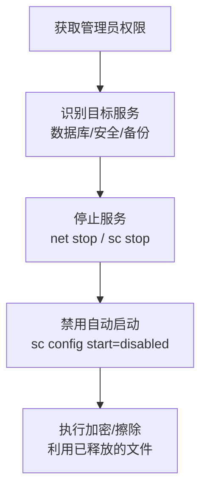

# 停止服务 (T1489)

## 一句话通俗理解

攻击者关掉你的数据库、邮件服务器和安全软件——就像在抢银行之前先把警报系统关了。

## 难度等级

⭐ 初级（新手可学）

## 技术描述

停止服务（T1489）是MITRE ATT&CK框架中影响战术的一种技术。攻击者通过停止关键业务服务或系统服务，使系统功能受损或数据不可用。

**通俗解释：**
想象你要破坏一个公司的运营，最简单的方法不是砸电脑，而是直接拔掉服务器电源——但这太明显了。更聪明的做法是：在系统里输入几条命令，关掉数据库服务（所有业务读写都卡住）、关掉邮件服务器（员工没法沟通）、关掉防病毒软件（安全系统失效）。这些操作看起来就像是普通的系统维护，但实际上是在为下一步的破坏开路。

**技术原理：**

1. 攻击者通过管理员权限访问目标系统（通过RDP、PsExec或其他远程管理工具）
2. 使用服务控制命令停止目标服务：`net stop [服务名]` 或 `sc stop [服务名]`
3. 可能修改服务的启动类型为禁用，防止服务自动重启
4. 在勒索软件场景中，先停止数据库和邮件服务，解锁被占用的文件
5. 停止安全软件（防病毒/EDR）以规避检测，为后续加密或销毁操作打通道路

**用途与影响：**
攻击者停止服务有多重目的：为勒索软件加密做准备（释放被锁文件）、禁用安全防御、直接破坏业务运营。停止服务是勒索软件攻击中的"标准前置操作"。2025-2026年，几乎所有的重大勒索软件事件都包含了服务停止步骤。

## 子技术列表

**该技术没有子技术。**

## 攻击流程

### 典型攻击流程

```
获取权限 --> 识别目标服务 --> 停止服务 --> 禁用自动启动 --> 执行破坏
```



**步骤详解：**

1. **获取管理员权限**
   - 通俗描述：攻击者需要管理员权限才能停止系统级服务
   - 技术细节：通过RDP爆破、PsExec远程执行或已有后门提升权限
   - 常用工具：RDP、PsExec、Cobalt Strike

2. **识别目标服务**
   - 通俗描述：攻击者会先扫描系统上运行了哪些服务和进程
   - 技术细节：使用 `tasklist /svc`、`sc query` 或 `Get-Service` 列出所有服务，筛选出数据库、安全软件、备份软件的服务名
   - 常用工具：`tasklist`、`sc`、PowerShell

3. **停止服务**
   - 通俗描述：用系统命令关掉目标服务
   - 技术细节：`net stop MSSQLSERVER`（停止SQL Server）、`net stop "Veeam Backup Service"`（停止备份软件）、`net stop "Windows Defender"`（停止安全软件）
   - 常用工具：`net stop`、`sc stop`、`Stop-Service` (PowerShell)

4. **禁用自动启动**
   - 通俗描述：修改服务配置，让系统重启后服务也不会自动启动
   - 技术细节：`sc config [服务名] start=disabled` 将服务启动类型改为禁用
   - 常用工具：`sc config`、`Set-Service` (PowerShell)

5. **执行破坏**
   - 通俗描述：在目标服务停止后执行文件加密或数据销毁
   - 技术细节：此时数据库文件不再被锁定，勒索软件可以顺利加密所有文件
   - 常用工具：勒索软件加密器

## 真实案例

### 案例1：Conti 勒索软件 (2020-2022)

- **时间**: 2020年-2022年
- **目标**: 全球各行业（医疗、政府、制造）
- **攻击组织**: Conti (RaaS)
- **手法**: Conti在加密文件前会执行一个"准备工作"阶段，使用 `net stop` 命令停止超过100种服务和进程，包括数据库服务（SQL Server、MySQL、Oracle）、邮件服务（Exchange、邮件客户端）、备份软件（Veeam、Acronis）、ERP系统（SAP）和安全软件（各种AV/EDR）。Conti维护一个目标进程列表，在加密前逐一终止。停止服务采用 `net stop` 和 `sc stop` 命令组合，同时使用 `taskkill /f /im` 强制终止进程。
- **影响**: 数百家组织系统瘫痪，赎金总额超1亿美元
- **参考链接**: [Conti Analysis - CISA](https://www.cisa.gov/news-events/analysis-reports/ar21-265a)

### 案例2：LockBit 勒索软件 (2019-至今)

- **时间**: 2019年-2026年
- **目标**: 全球各行业
- **攻击组织**: LockBit
- **手法**: LockBit的加密器包含进程和服务终止功能。LockBit 3.0/4.0停止的服务列表包括：数据库服务（SQL Server、PostgreSQL、MySQL）、虚拟化平台的代理服务（如VSS服务）、备份管理软件（Veeam、CommVault）和安全防护软件（各类AV/EDR）。LockBit还会终止特定进程如 `outlook.exe`、`sqlservr.exe`、`veeam.exe`等。停止服务使用 `net stop` 和 `sc stop` 组合，禁用自动启动防止服务恢复。
- **影响**: 全球数千组织受影响，LockBit成为最活跃的勒索软件家族
- **参考链接**: [LockBit 3.0 - Trend Micro](https://www.trendmicro.com/vinfo/us/security/news/ransomware-spotlight/lockbit-3-0)

### 案例3：LazyWiper / DynoWiper - 波兰擦除器攻击 (2025)

- **时间**: 2025年
- **目标**: 波兰政府机构
- **攻击组织**: Campaign C0063（疑似白俄罗斯背景）
- **手法**: 2025年波兰擦除器攻击中，LazyWiper和DynoWiper在擦除数据前会停止数据库服务（PostgreSQL、MSSQL）、消息队列服务（RabbitMQ、Kafka）和Web服务器（Apache、Nginx）。通过停止这些服务，擦除器确保数据文件不被锁定，能够顺利覆写。同时停止安全日志服务以掩盖痕迹。攻击者使用批处理脚本批量停止目标服务。
- **影响**: 波兰政府机构关键数据被销毁，服务中断
- **参考链接**: [C0063 - MITRE ATT&CK](https://attack.mitre.org/campaigns/C0063/)

### 案例4：SamSam 针对医疗系统的服务停止 (2018)

- **时间**: 2018年
- **目标**: 美国医疗和政府机构
- **攻击组织**: SamSam (RaaS)
- **手法**: SamSam的早期版本包含针对医疗系统特定服务的停止命令，包括医院信息系统（HIS）、放射科信息系统（RIS）和财务系统。攻击者通过RDP入侵后手动或通过批处理脚本执行 `net stop` 命令。SamSam的独特之处在于攻击者是手动操作的——他们会先在系统中查看正在运行的服务，然后有针对性地停止关键业务服务，而非盲目执行预设列表。
- **影响**: 多家医院急诊服务暂停，患者生命安全受到威胁
- **参考链接**: [SamSam Ransomware - CISA](https://www.cisa.gov/news-events/alerts/2018/06/samsam-ransomware)

## 红队视角

> ⚠️ **免责声明**：以下内容仅用于合法的安全测试、渗透测试和教育目的。未经授权对他人系统进行测试是违法行为。

### 实战技巧

1. **悄无声息地停止服务**
   使用 `sc stop [服务名]` 替代 `net stop`，前者输出更少、更隐蔽。使用 PowerShell 的 `Stop-Service -Name [服务名] -Force -ErrorAction SilentlyContinue` 静默执行。

2. **先停安全软件再停业务服务**
   先停防病毒和EDR代理，避免被安全软件拦截后续操作。顺序很重要——先破坏防御，再对业务下手。

3. **利用合法管理工具**
   PsExec、WMIC、SCCM等合法管理工具可以远程批量停止服务，不会触发基于工具签名的检测规则。

### 常用工具

| 工具名称 | 用途 | 平台 | 链接 |
|----------|------|------|------|
| net | Windows服务管理命令 | Windows | 系统内置 |
| sc | Windows服务控制管理 | Windows | 系统内置 |
| PsExec | 远程执行命令 | Windows | https://learn.microsoft.com/sysinternals/ |
| taskkill | 终止进程 | Windows | 系统内置 |
| systemctl | Linux服务管理 | Linux | 系统内置 |

### 注意事项

- 在授权测试中，停止关键服务前务必与客户确认，避免造成意外的业务中断
- 制定服务回滚计划，测试后确保服务能够正常恢复
- 某些服务有自我保护机制（如安全软件的防篡改保护），停止时可能触发告警

## 蓝队视角

### 检测要点

1. **服务停止命令监控**
   - 日志来源：Windows Event ID 7036、Sysmon Event ID 1
   - 关注字段：`net stop`、`sc stop`、`Stop-Service` 命令的执行
   - 异常特征：短时间内大量服务被停止，特别是数据库、安全软件和备份服务

2. **关键服务状态监控**
   - 日志来源：Windows Event ID 7036（服务状态从Running变为Stopped）
   - 关注字段：关键业务服务的状态变更
   - 异常特征：非维护窗口期的服务停止，或安全中心/防病毒服务异常停止

3. **进程终止监控**
   - 日志来源：Sysmon Event ID 1、Windows Event ID 4689
   - 关注字段：`taskkill` 或 `TerminateProcess` API的异常调用
   - 异常特征：批量终止进程，特别是数据库和安全软件进程

### 监控建议

- 建立关键服务基线列表，监控基线外服务的停止行为
- 安全软件配置防篡改保护（Tamper Protection），防止被停止或卸载
- 使用EDR监控异常的大量服务停止操作

## 检测建议

### 网络层检测

**检测方法：** 检测远程服务停止命令的横向传播流量

**具体规则/命令示例：**
```
# Suricata规则 - 检测SMB上的PsExec远程服务控制
alert tcp $HOME_NET any -> $HOME_NET 445 (msg:"Remote Service Control via PsExec"; content:"|5c|PSEXESVC|2e|exe"; sid:1000004; rev:1;)
```

### 主机层检测

**检测方法：** 监控服务状态变更

**Windows事件ID：**
- 事件ID 7036：服务进入运行、停止、暂停状态
- 事件ID 7045：新服务被安装（PsExec等服务传播痕迹）
- 事件ID 4689：进程终止

**具体命令示例：**
```powershell
# 检测服务停止事件
Get-WinEvent -FilterHashtable @{LogName='System'; ID=7036} | Where-Object {$_.Message -match 'stopped'} | Format-Table TimeCreated, Message

# 监控安全软件服务被停止
Get-WinEvent -FilterHashtable @{LogName='System'; ID=7036} | Where-Object {$_.Message -match 'WinDefend|MsMpEng|Sense'} | Format-Table TimeCreated, Message
```

### 应用层检测

**Sigma规则示例：**
```yaml
title: 使用 net stop 停止服务
status: experimental
description: 检测攻击者使用net stop命令停止Windows服务的行为
logsource:
    category: process_creation
    product: windows
detection:
    selection:
        CommandLine|contains|all:
            - 'net'
            - 'stop'
    condition: selection
level: medium
tags:
    - attack.t1489
```

## 缓解措施

### 优先级1：关键措施

**措施名称：** 严格管控服务控制权限

**具体实施步骤：**
1. 限制非管理员用户执行服务停止命令
2. 配置关键服务（安全软件、数据库）的ACL，限制停止/修改权限
3. 对关键服务配置"失败操作"为重启动或重启计算机

### 优先级2：重要措施

**措施名称：** 服务自我保护配置

**具体实施步骤：**
1. 启用安全软件的防篡改保护（Tamper Protection）
2. 将关键服务配置为受保护进程（Protected Process Light, PPL）
3. 使用组策略限制 `sc.exe` 和 `net.exe` 的执行权限

### 优先级3：建议措施

**措施名称：** 监控和恢复计划

**具体实施步骤：**
1. 部署服务状态监控，关键服务异常停止时立即告警
2. 配置自动恢复策略，服务意外停止后自动重启
3. 建立应急响应流程，服务批量停止时触发调查

### MITRE ATT&CK 缓解措施映射

| 缓解措施ID | 缓解措施名称 | 适用性 | 说明 |
|------------|-------------|--------|------|
| M1030 | Network Segmentation | 适用 | 隔离关键系统管理网络 |
| M1018 | User Account Management | 适用 | 限制服务控制权限 |
| M1040 | Behavior Prevention on Endpoint | 适用 | 检测异常服务停止行为 |
| M1026 | Privileged Account Management | 适用 | 保护高权限账户 |
| M1038 | Execution Prevention | 部分适用 | 限制sc/net命令执行 |

## 动手实验

> ⚠️ **重要提示**：所有实验必须在隔离的实验室环境中进行，禁止对未授权的真实系统进行测试。

### 实验环境准备

**推荐靶场/实验平台：**

| 平台名称 | 类型 | 难度 | 链接 |
|----------|------|:----:|------|
| TryHackMe | 在线靶场 | 初级 | https://tryhackme.com/ |
| Hack The Box | 在线靶场 | 中级 | https://www.hackthebox.com/ |

**所需工具：**
- Windows VM
- PowerShell

**环境搭建：**
```powershell
# 查看所有服务
Get-Service | Where-Object {$_.Status -eq 'Running'} | Format-Table Name, DisplayName
```

### 实验1：服务管理操作（初级）

**实验目标：** 学习Windows服务管理的基本命令

**实验步骤：**
1. 查看当前运行的服务：`sc query` 或 `Get-Service`
2. 选择一个非关键测试服务（如 Print Spooler），停止它：`net stop Spooler`
3. 确认服务已停止：`sc query Spooler`
4. 重新启动服务：`net start Spooler`
5. 尝试禁用服务：`sc config Spooler start=disabled`
6. 恢复为自动启动：`sc config Spooler start=auto`

**预期结果：** 服务可以被停止、启动和配置启动类型

**学习要点：** 理解服务控制命令，了解攻击者如何利用这些命令

### 实验2：监控服务停止行为（中级）

**实验目标：** 学习如何检测和审计服务停止操作

**实验步骤：**
1. 启用Windows安全审计策略中的"进程创建"和"服务状态"审计
2. 执行一系列服务停止命令
3. 检查Windows事件日志（Event ID 7036和4689）
4. 使用PowerShell脚本解析日志中的异常模式

**预期结果：** 服务停止操作被完整记录在事件日志中

**学习要点：** 掌握服务停止行为的检测和取证方法

## 术语解释

| 术语 | 英文原名 | 通俗解释 |
|------|----------|----------|
| 服务 | Service | Windows后台运行的程序，不需要用户登录就能运行，比如数据库服务、安全软件服务 |
| 进程 | Process | 正在运行的程序实例，每个打开的程序都是一个或多个进程 |
| 服务控制管理器 | Service Control Manager (SCM) | Windows管理所有服务的核心组件，负责服务的启动、停止和配置 |
| 启动类型 | Startup Type | 服务的启动方式，可以是自动（开机启动）、手动（需要时启动）或禁用 |
| 防篡改保护 | Tamper Protection | 安全软件保护自己不被关闭、修改或卸载的机制 |
| 受保护进程 | Protected Process Light (PPL) | Windows的一种保护机制，普通程序无法停止、调试或修改受保护进程 |
| 进程终止 | Process Termination | 强制结束一个正在运行的程序，使用taskkill或任务管理器 |
| 业务连续性 | Business Continuity | 组织在遭受破坏后维持基本运营的能力 |
| 维护窗口 | Maintenance Window | 计划好的系统维护时间段，通常是业务低峰期 |
| 回滚计划 | Rollback Plan | 操作出问题时的补救方案，把系统恢复到操作前的状态 |

## 参考资料

### 官方文档

- [MITRE ATT&CK - Service Stop](https://attack.mitre.org/techniques/T1489/)

### 安全报告

- [Conti Ransomware Analysis - CISA](https://www.cisa.gov/news-events/analysis-reports/ar21-265a)
- [LockBit 3.0 - Trend Micro](https://www.trendmicro.com/vinfo/us/security/news/ransomware-spotlight/lockbit-3-0)
- [SamSam Ransomware - CISA](https://www.cisa.gov/news-events/alerts/2018/06/samsam-ransomware)
- [Poland Wiper Campaign C0063](https://attack.mitre.org/campaigns/C0063/)

### 工具与资源

- [Sysinternals PsExec](https://learn.microsoft.com/sysinternals/downloads/psexec) - 远程执行工具
- [Windows Service Documentation](https://learn.microsoft.com/windows/win32/services/services) - Windows服务官方文档

### 学习资料

- [Microsoft - Service Control Manager](https://learn.microsoft.com/windows/win32/services/service-control-manager) - SCM官方文档
- [CISA - Ransomware Guide](https://www.cisa.gov/stopransomware) - CISA反勒索软件指南
