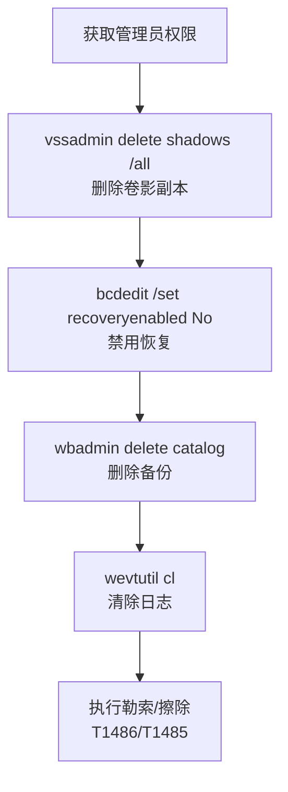

# 阻止系统恢复 (T1490)

## 一句话通俗理解

在勒索你之前，先把你的备份和恢复功能全删掉——让你被黑了也只能乖乖交钱。

## 难度等级

⭐⭐ 中级（需要一定基础）

## 技术描述

阻止系统恢复（T1490）是MITRE ATT&CK框架中影响战术的一种技术。攻击者通过删除或禁用系统的恢复功能，使受害者无法在遭受破坏后自行恢复系统。

**通俗解释：**
Windows系统有个自动备份快照功能（卷影副本），就像游戏里的存档点，系统出问题了可以读档恢复。攻击者做的第一件事就是删掉所有存档点——删除卷影副本、禁用系统还原、删掉备份目录。这样一来，当你被勒索软件加密了文件后，既没有备份可以恢复，系统也无法自动修复，只能乖乖交钱。

**技术原理：**

1. 攻击者首先获取管理员权限（通过提权或使用已有高权限账户）
2. 使用 Windows 自带管理工具删除卷影副本：`vssadmin delete shadows /all`
3. 禁用系统恢复功能：`bcdedit /set {default} recoveryenabled No`
4. 删除 Windows 备份分类：`wbadmin delete catalog -quiet`
5. 清除 Windows 事件日志：`wevtutil cl`，妨碍取证分析

**用途与影响：**
这个技术几乎总是与勒索软件（T1486）和数据销毁（T1485）配合使用。没有它，受害者可以通过备份恢复被加密的文件，勒索就失去了意义。它是最大化破坏效果的关键步骤。在2025-2026年的擦除器攻击中，阻止恢复已经成为标准操作流程。

## 子技术列表

**该技术没有子技术。**

## 攻击流程

### 典型攻击流程

```
获取权限 --> 删除卷影副本 --> 禁用系统恢复 --> 删除备份 --> 清除日志 --> 执行破坏
```



**步骤详解：**

1. **获取管理员权限**
   - 通俗描述：攻击者必须有管理员权限才能执行系统恢复相关的操作
   - 技术细节：通过横向移动获得域管理员权限，或利用本地提权漏洞（如PrintNightmare）提升权限
   - 常用工具：Mimikatz、PsExec、PowerShell

2. **删除卷影副本**
   - 通俗描述：删除Windows系统的自动备份快照，让系统无法"回到过去"
   - 技术细节：执行 `vssadmin delete shadows /all /quiet` 删除所有卷影副本，或使用 `wmic shadowcopy delete`、`Get-WmiObject Win32_Shadowcopy | Remove-WmiObject`
   - 常用工具：`vssadmin.exe`、`wmic.exe`、PowerShell

3. **禁用系统恢复**
   - 通俗描述：关闭Windows的自动修复和恢复功能
   - 技术细节：使用 `bcdedit /set {default} recoveryenabled No` 禁用Windows恢复环境（WinRE），通过注册表禁用系统还原
   - 常用工具：`bcdedit.exe`、`reg.exe`

4. **删除备份**
   - 通俗描述：删除备份目录和备份分类，让专门的备份软件也失效
   - 技术细节：执行 `wbadmin delete catalog -quiet` 删除Windows备份分类，删除备份目录和备份挂载点
   - 常用工具：`wbadmin.exe`、`del`、`rmdir`

5. **清除日志**
   - 通俗描述：清空系统日志，让后续调查人员找不到线索
   - 技术细节：使用 `wevtutil cl` 清除系统日志、安全日志和应用日志
   - 常用工具：`wevtutil.exe`、PowerShell

## 真实案例

### 案例1：NotPetya 全球破坏 (2017)

- **时间**: 2017年6月
- **目标**: 乌克兰及全球企业
- **攻击组织**: 疑似俄罗斯Sandworm团队
- **手法**: NotPetya 在执行加密和MBR覆写后，自动执行 `vssadmin.exe delete shadows /all /quiet` 和 `wmic.exe shadowcopy delete` 删除卷影副本。同时使用 `bcdedit.exe /set {default} recoveryenabled No` 禁用Windows恢复环境，使用 `wbadmin delete catalog -quiet` 删除备份分类，从多个维度阻断系统恢复路径。造成的损失超过100亿美元。
- **影响**: 全球数千家企业系统被毁，包括马士基航运、默克制药、FedEx等
- **参考链接**: [NotPetya - MITRE ATT&CK](https://attack.mitre.org/software/S0368/)

### 案例2：Conti 勒索软件 (2020-2022)

- **时间**: 2020年-2022年
- **目标**: 全球医疗、政府、制造业组织
- **攻击组织**: Conti (RaaS)
- **手法**: Conti的加密器在加密前会执行一系列恢复阻断命令：`vssadmin delete shadows /all /quiet`、`wbadmin delete catalog -quiet`、`bcdedit /set {default} recoveryenabled No`。Conti还会清除Windows事件日志（`wevtutil cl`），进一步妨碍取证分析和恢复操作。所有命令均在加密前执行，确保加密操作不可逆。
- **影响**: 数百家组织数据被加密，赎金超过1亿美元
- **参考链接**: [Conti Analysis - CISA](https://www.cisa.gov/news-events/analysis-reports/ar21-265a)

### 案例3：LockBit 勒索软件 (2019-至今)

- **时间**: 2019年-2026年
- **目标**: 全球各行业
- **攻击组织**: LockBit
- **手法**: LockBit 勒索软件在加密周期中执行完整的恢复阻断操作。LockBit 3.0/4.0 除了标准的卷影删除操作外，还会通过WMI调用禁用系统保护，删除Windows备份分类。LockBit 的部分变种还包含按后缀删除备份文件（`.bak`、`.backup`、`.vbk`等）的功能。2024年执法行动后，LockBit 4.0/5.0版本增强了恢复阻断能力，增加了对云备份和NAS快照的删除功能。
- **影响**: 全球数千组织受影响
- **参考链接**: [LockBit - MITRE ATT&CK](https://attack.mitre.org/software/S1112/)

### 案例4：DynoWiper 波兰擦除器攻击 (2025)

- **时间**: 2025年
- **目标**: 波兰政府机构
- **攻击组织**: 疑似与白俄罗斯相关的威胁组织（Campaign C0063）
- **手法**: DynoWiper 在擦除数据前先执行 `vssadmin delete shadows /all`、`bcdedit /set {default} recoveryenabled No` 和 `wbadmin delete catalog`，确保清除操作无法被系统恢复功能回滚。该擦除器还会删除EFI系统分区，使设备彻底无法启动。
- **影响**: 波兰政府机构系统瘫痪，数据永久丢失
- **参考链接**: [C0063 - MITRE ATT&CK](https://attack.mitre.org/campaigns/C0063/)

## 红队视角

> ⚠️ **免责声明**：以下内容仅用于合法的安全测试、渗透测试和教育目的。未经授权对他人系统进行测试是违法行为。

### 实战技巧

1. **批量执行恢复阻断**
   在域环境中使用组策略对象（GPO）或PsExec批量在所有域成员上执行恢复阻断命令，一次性瘫痪整个组织的恢复能力。

2. **静默执行**
   在所有命令后添加 `/quiet` 或 `-quiet` 参数，避免弹出确认对话框引起用户注意。使用PowerShell的 `-ErrorAction SilentlyContinue` 忽略错误。

3. **云环境恢复阻断**
   在AWS中删除EC2快照和RDS自动备份：`aws ec2 delete-snapshot`、`aws rds delete-db-automated-backup`。在Azure中删除恢复点：`Remove-AzRecoveryServicesBackupProtectionPolicy`。

### 常用工具

| 工具名称 | 用途 | 平台 | 链接 |
|----------|------|------|------|
| vssadmin | 管理Windows卷影副本 | Windows | 系统内置 |
| wbadmin | 管理Windows备份 | Windows | 系统内置 |
| bcdedit | 管理启动配置数据 | Windows | 系统内置 |
| wevtutil | 管理Windows事件日志 | Windows | 系统内置 |
| AWS CLI | 管理AWS资源 | 跨平台 | https://aws.amazon.com/cli/ |
| Az PowerShell | 管理Azure资源 | Windows | https://learn.microsoft.com/powershell/azure/ |

### 注意事项

- 测试时务必验证操作能否回滚，避免对测试环境造成不可逆损坏
- 某些备份软件有自我保护机制（如Veeam的加固存储库），测试前需了解
- 注意合规要求，某些行业的备份删除操作可能违反法规

## 蓝队视角

### 检测要点

1. **卷影删除监控**
   - 日志来源：Windows Event ID 524、Sysmon Event ID 1
   - 关注字段：命令行中包含 `vssadmin`、`delete`、`shadows` 的组合
   - 异常特征：非备份管理员在非工作时间执行卷影删除

2. **备份管理操作**
   - 日志来源：Windows Event ID 7036（服务变更）、Event ID 4663
   - 关注字段：对备份目录的大规模删除或修改操作
   - 异常特征：备份目录中的 `.bak`、`.vbk` 等文件被批量删除

3. **日志清除行为**
   - 日志来源：Windows Event ID 1102（安全日志被清除）
   - 关注字段：日志清除时间和清除者账户
   - 异常特征：安全日志被非管理员或非计划内清除

### 监控建议

- 对 `vssadmin.exe`、`wbadmin.exe`、`bcdedit.exe` 等敏感工具设置命令行审计规则
- 创建"卷影副本数量骤降"的告警规则，实时监控VSS状态
- 部署备份监控系统（如Veeam ONE），检测备份作业异常失败

## 检测建议

### 网络层检测

**检测方法：** 监控PsExec等远程执行恢复阻断命令的流量

**具体规则/命令示例：**
```
# Suricata规则 - 检测远程执行恢复阻断命令
alert tcp $HOME_NET any -> $HOME_NET 445 (msg:"Potential Remote Recovery Inhibition via PsExec"; content:"vssadmin|00|delete|00|shadows"; sid:1000002; rev:1;)
```

### 主机层检测

**检测方法：** 监控卷影副本和备份相关的命令执行

**Windows事件ID：**
- 事件ID 524：卷影副本被删除
- 事件ID 7036：服务状态变更（VSS服务被停止）
- 事件ID 1102：安全日志被清除
- 事件ID 4663：备份目录文件被大量删除

**具体命令示例：**
```powershell
# 检测卷影副本删除事件
Get-WinEvent -FilterHashtable @{LogName='System'; ID=524} | Format-Table TimeCreated, Message -AutoSize

# 监控敏感命令行执行 (Sysmon)
Get-WinEvent -FilterHashtable @{LogName='Microsoft-Windows-Sysmon/Operational'; ID=1} | Where-Object {$_.Properties -match 'vssadmin|wbadmin|bcdedit'} | Format-Table TimeCreated, Properties -AutoSize
```

### 应用层检测

**Sigma规则示例：**
```yaml
title: 检测系统恢复禁用命令执行
status: experimental
description: 检测攻击者使用bcdedit禁用Windows恢复环境的典型行为
logsource:
    category: process_creation
    product: windows
detection:
    selection:
        CommandLine|contains|all:
            - 'bcdedit'
            - 'recoveryenabled'
            - 'No'
    condition: selection
level: high
tags:
    - attack.t1490
```

## 缓解措施

### 优先级1：关键措施

**措施名称：** 不可变备份策略

**具体实施步骤：**
1. 使用不可变存储（如S3 Object Lock、Veeam Hardened Repository）保护备份数据
2. 维护离线（air-gapped）备份，备份存储不连接网络
3. 备份管理账户实施MFA和最小权限原则

**配置示例：**
```bash
# AWS S3 Object Lock 配置
aws s3api put-object-lock-configuration --bucket my-backup-bucket --object-lock-configuration ObjectLockEnabled=Enabled
```

### 优先级2：重要措施

**措施名称：** 限制敏感命令执行权限

**具体实施步骤：**
1. 通过组策略限制非授权用户执行 `vssadmin`、`wbadmin`、`bcdedit` 命令
2. 使用应用程序白名单（AppLocker）阻止未授权的命令行工具执行
3. 配置Windows Defender Attack Surface Reduction (ASR)规则，阻止卷影副本删除

### 优先级3：建议措施

**措施名称：** 备份隔离和恢复测试

**具体实施步骤：**
1. 备份网络与生产网络物理或逻辑隔离
2. 每月至少进行一次完整的恢复演练
3. 部署备份监控系统，实时检测备份失败和异常删除

### MITRE ATT&CK 缓解措施映射

| 缓解措施ID | 缓解措施名称 | 适用性 | 说明 |
|------------|-------------|--------|------|
| M1053 | Data Backup | 适用 | 实施不可变离线备份策略 |
| M1022 | Restrict File and Directory Permissions | 适用 | 限制对备份目录的访问权限 |
| M1038 | Execution Prevention | 部分适用 | 限制vssadmin等命令的执行 |
| M1040 | Behavior Prevention on Endpoint | 适用 | 部署端点行为检测，监控恢复阻断行为 |
| M1029 | Remote Data Storage | 适用 | 使用不可变远程存储 |

## 动手实验

> ⚠️ **重要提示**：所有实验必须在隔离的实验室环境中进行，禁止对未授权的真实系统进行测试。

### 实验环境准备

**推荐靶场/实验平台：**

| 平台名称 | 类型 | 难度 | 链接 |
|----------|------|:----:|------|
| TryHackMe - Windows Forensics | 在线靶场 | 中级 | https://tryhackme.com/ |
| Let's Defend - SOC Simulation | 在线平台 | 中级 | https://letsdefend.io/ |

**所需工具：**
- Windows VM（Windows 10/11或Server 2019/2022）
- Sysinternals Suite：Process Monitor、Process Explorer

**环境搭建：**
```powershell
# 在Windows VM中确认卷影副本状态
vssadmin list shadows
# 创建测试卷影副本
wmic shadowcopy call create Volume=C:\
```

### 实验1：卷影副本操作（初级）

**实验目标：** 理解卷影副本的创建和删除操作

**实验步骤：**
1. 在Windows VM中查看当前卷影副本：`vssadmin list shadows`
2. 创建一个卷影副本：`wmic shadowcopy call create Volume=C:\`
3. 确认新副本已创建：`vssadmin list shadows`
4. 删除所有卷影副本：`vssadmin delete shadows /all`

**预期结果：** 卷影副本创建后可以查看，删除后列表为空

**学习要点：** 理解卷影副本的作用，以及为什么勒索软件要先删除它

### 实验2：监控与恢复（中级）

**实验目标：** 学习检测卷影副本删除和尝试系统恢复

**实验步骤：**
1. 启用Sysmon和Windows安全审计策略
2. 执行完整的恢复阻断命令序列（vssadmin + bcdedit + wbadmin）
3. 检查Windows事件日志中生成的审计事件
4. 尝试使用Windows恢复环境恢复系统

**预期结果：** 恢复阻断命令被记录在事件日志中，可以使用SIEM规则检测

**学习要点：** 掌握恢复阻断行为的检测方法和响应流程

## 术语解释

| 术语 | 英文原名 | 通俗解释 |
|------|----------|----------|
| 卷影副本 | Volume Shadow Copy (VSS) | Windows系统的"后悔药"功能，自动保存文件的历史版本，可以随时恢复到之前的状态 |
| 卷影复制服务 | Volume Shadow Copy Service | Windows后台服务，负责创建和管理卷影副本 |
| 系统还原 | System Restore | Windows的系统级"时光机"，可以把整个系统恢复到之前的某个正常状态 |
| 恢复环境 | Windows Recovery Environment (WinRE) | Windows的紧急修复模式，系统启动不了时可以进这里修复 |
| 备份分类 | Backup Catalog | Windows备份的索引目录，删掉后即使备份文件还在，也无法恢复 |
| 离线备份 | Air-Gapped Backup | 完全不联网的备份，物理上断开网络连接，攻击者从网络上无法接触和破坏 |
| 不可变存储 | Immutable Storage | 写入后就不能修改或删除的存储系统，像刻了光盘一样只读 |
| MBR | Master Boot Record | 硬盘的主引导记录，计算机启动时最先读取的区域，被破坏后系统无法启动 |
| 启动配置数据 | Boot Configuration Data (BCD) | Windows启动的配置文件，告诉系统怎么启动、启动哪个操作系统 |
| 事件日志 | Event Log | Windows系统的"黑匣子"记录，记录了系统运行中的各种事件和安全告警 |

## 参考资料

### 官方文档

- [MITRE ATT&CK - Inhibit System Recovery](https://attack.mitre.org/techniques/T1490/)

### 安全报告

- [CISA - Conti Ransomware Analysis](https://www.cisa.gov/news-events/analysis-reports/ar21-265a)
- [NotPetya Analysis - Welivesecurity](https://www.welivesecurity.com/2017/07/04/analysis-of-telebots-cunning-connection/)
- [LockBit 3.0 Analysis - Trend Micro](https://www.trendmicro.com/vinfo/us/security/news/ransomware-spotlight/lockbit-3-0)
- [Poland Wiper Campaign C0063](https://attack.mitre.org/campaigns/C0063/)

### 工具与资源

- [Sysinternals Suite](https://learn.microsoft.com/sysinternals/) - Windows系统诊断工具集
- [Veeam Hardened Repository](https://www.veeam.com/) - 不可变备份存储方案

### 学习资料

- [Microsoft - VSS Documentation](https://learn.microsoft.com/windows/win32/vss/volume-shadow-copy-service-overview) - 卷影复制服务官方文档
- [CISA - Ransomware Guide](https://www.cisa.gov/stopransomware) - CISA反勒索软件指南
