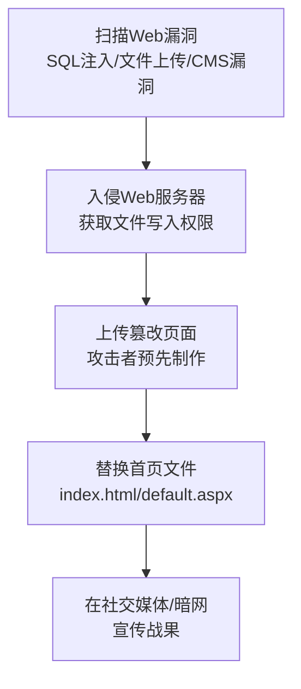

# 网页篡改 (T1491)

## 一句话通俗理解

黑客黑掉你的网站，把首页换成他们想让你看到的内容——比如贴上一句骂你的话或者政治口号。

## 30秒速查卡

| 维度 | 你需要知道的 |
|------|-------------|
| 这是什么？ | 网页篡改（T1491）是攻击者用来破坏目标系统或数据的技术 |
| 为什么危险？ | 攻击者可以对目标造成不可逆的破坏，影响组织正常运营 |
| 谁需要关心？ | 安全运维团队、系统管理员、业务负责人 |
| 你的第一步防御 | 定期备份数据并测试恢复流程，确保备份与生产环境隔离 |
| 如果只做一件事 | 监控异常的数据删除或修改行为，设置关键文件完整性告警 |

## 难度等级

⭐ 初级（新手可学）

## 技术描述

网页篡改（T1491）是MITRE ATT&CK框架中影响战术的一种技术。攻击者修改目标组织面向公众或内部的Web内容，以传播信息、造成声誉损害或干扰业务运营。

**通俗解释：**
想象你是一家公司的官网，某天早上客户打开你的网站，发现首页变成了一张讽刺漫画配上一句"你们公司被黑了！"——这就是网页篡改。攻击者通过入侵你的Web服务器，把网站文件（比如首页的HTML文件）替换成了他们自己做的内容。这就像有人在你家店门口贴了一张大字报。

**技术原理：**

1. 攻击者通过Web漏洞（SQL注入、文件上传漏洞）或服务器入侵获取Web服务器的文件写入权限
2. 定位网站根目录中的首页文件（如 `index.html`、`default.aspx`、`index.php`）
3. 将原始文件替换为攻击者预先准备的篡改页面
4. 篡改页面通常包含政治宣传、黑客组织声明、讽刺内容或恶意重定向代码

**用途与影响：**
网页篡改技术主要用于政治抗议（Hacktivism）、虚假信息传播或破坏组织声誉。对于黑客活动主义者来说，篡改知名网站是他们最直接、最有影响力的一种抗议方式。在某些APT攻击中，篡改内部网站也可能被用于散布虚假信息或制造混乱。

## 子技术列表

**该技术共有 2 个子技术：**

| 子技术ID | 中文名称 | 通俗解释 |
|----------|----------|----------|
| T1491.001 | 内部网页篡改 | 篡改公司内部网站的内容，如内部门户、内部通知页面 |
| T1491.002 | 外部网页篡改 | 篡改面向公众的网站，让所有访问者都能看到被篡改的内容 |

<details>
<summary><strong>展开查看各子技术详细说明</strong></summary>

各子技术详细说明请参阅独立文档：

- [T1491.001 - 内部网页篡改](./T1491/T1491.001-Internal-Defacement.md) — 攻击者改的不是对外的网站，而是公司内部的网站，比如内部公告栏、HR系统页面
- [T1491.002 - 外部网页篡改](./T1491/T1491.002-External-Defacement.md) — 攻击者改掉公司对外的官方网站，让所有访问者都能看到被篡改的内容

</details>

## 攻击流程

### 典型攻击流程

```
扫描漏洞 --> 入侵Web服务器 --> 上传篡改页面 --> 替换首页 --> 宣传战果
```



**步骤详解：**

1. **扫描Web漏洞**
   - 通俗描述：攻击者先扫描目标网站，看有没有可以利用的安全漏洞
   - 技术细节：使用自动化扫描工具检测SQL注入、文件上传漏洞、CMS已知漏洞（如WordPress插件漏洞）
   - 常用工具：SQLMap、Nikto、WPScan、Burp Suite

2. **入侵Web服务器**
   - 通俗描述：利用找到的漏洞进入Web服务器后台
   - 技术细节：SQL注入获取管理员凭据、利用文件上传漏洞上传webshell、利用CMS已知漏洞
   - 常用工具：SQLMap、Webshell、CVE漏洞利用脚本

3. **上传篡改页面**
   - 通俗描述：攻击者把自己做好的篡改页面上传到服务器上
   - 技术细节：通过webshell上传、利用文件管理器功能上传、或通过FTP/SSH上传
   - 常用工具：Webshell、中国菜刀/蚁剑

4. **替换首页**
   - 通俗描述：把原来的首页文件删除，换成篡改页面
   - 技术细节：替换 `index.html`、`default.aspx`、`index.php` 等默认首页文件
   - 常用工具：Webshell文件管理功能

5. **宣传战果**
   - 通俗描述：攻击者在社交媒体和暗网上炫耀自己的"战绩"
   - 技术细节：在Twitter/Telegram上发布截图和链接
   - 常用工具：Zone-H（网页篡改存档网站）

## 真实案例

### 案例1：Anonymous 俄乌冲突中的网页篡改 (2022-2023)

- **时间**: 2022年2月-2023年
- **目标**: 俄罗斯政府机构、国有企业、国家媒体网站
- **攻击组织**: Anonymous及相关黑客组织
- **手法**: 俄乌战争爆发后，Anonymous对大量俄罗斯网站发动攻击。攻击者利用CMS未修补漏洞和Web服务器配置错误，篡改了俄罗斯国家电视台、政府部委（如国防部、外交部）和国有银行（如Sberbank）的网站首页。首页被替换为反战信息、乌克兰国旗和相关声明。部分篡改使用了分布式拒绝服务（DDoS）和网页篡改的组合攻击。
- **影响**: 俄罗斯多个政府和企业网站一度显示反战内容，全球媒体广泛报道
- **参考链接**: [BBC - Anonymous Ukraine Actions](https://www.bbc.com/news/technology-60520504)

### 案例2：叙利亚电子军篡改美联社Twitter (2013)

- **时间**: 2013年4月
- **目标**: 美联社（Associated Press）Twitter账号
- **攻击组织**: 叙利亚电子军（SEA）
- **手法**: 叙利亚电子军通过社会工程学获取美联社社交媒体账号的凭据，篡改了美联社的Twitter账号，发布了一条"白宫发生爆炸，奥巴马受伤"的假新闻推文。这条推文导致道琼斯工业平均指数瞬间暴跌超过140点，市值蒸发约1360亿美元。虽然这是社交媒体账号篡改而非网站篡改，但原理相同——利用篡改权威信息源传播虚假信息。
- **影响**: 全球金融市场短暂恐慌，美联社声誉受损
- **参考链接**: [SEA - MITRE ATT&CK](https://attack.mitre.org/groups/G0073/)

### 案例3：伊朗网络军篡改多国政府网站 (2011-2013)

- **时间**: 2011年-2013年
- **目标**: 美国银行、纳斯达克、多家西方政府网站
- **攻击组织**: 伊朗网络军（Iran Cyber Army）
- **手法**: 自称"伊朗网络军"的黑客组织利用Web服务器漏洞和SQL注入技术，篡改了包括美国银行、纳斯达克和多家西方政府在内的网站首页。首页被替换为政治口号和伊朗国旗图案。攻击者使用SQL注入获取数据库中的管理员凭据，然后登录CMS后台上传篡改页面。部分网站的篡改持续了数天才被发现和恢复。
- **影响**: 多家知名网站名誉受损，暴露了Web安全的普遍漏洞
- **参考链接**: [Iran Cyber Army - CISA](https://www.cisa.gov/news-events/analysis-reports/ar22-099a)

### 案例4：乌克兰网情汇聚专项行动 (2025)

- **时间**: 2025年
- **目标**: 乌克兰政府机构网站
- **攻击组织**: 多个黑客组织
- **手法**: 在持续的网络冲突中，多个攻击组织针对乌克兰政府机构网站进行外部篡改（T1491.002），替换为虚假的投降公告或政治宣传内容。部分入侵利用了Web服务器未及时修复的漏洞，部分通过窃取CMS管理员凭据实现。篡改页面通常包含亲俄宣传内容或虚假的政府声明。
- **影响**: 乌克兰政府信息发布一度混乱，部分信息被误传
- **参考链接**: [CISA - Pro-Russia Hacktivists Conduct Opportunistic Attacks Against US and Global Critical Infrastructure (AA25-343A)](https://www.cisa.gov/news-events/cybersecurity-advisories/aa25-343a)

## 红队视角

> ⚠️ **免责声明**：以下内容仅用于合法的安全测试、渗透测试和教育目的。未经授权对他人系统进行测试是违法行为。

### 实战技巧

1. **不要只改首页**
   只改首页太容易被发现和恢复。高级技巧是同时篡改多个页面（关于我们、联系方式等），甚至替换CSS/JS文件，让整个网站看起来怪异但不易被立即发现根因。

2. **检查文件完整性后再说**
   在篡改前先记录原始文件的权限和所有权，确保测试完成后可以完美恢复。建议使用Git或rsync备份原始网站文件。

3. **使用Sed替换插入**
   不在首页写入完整内容，而是在原始首页的HTML中通过 `sed` 命令插入一句话或一个图片。这种方式更难被网站所有者的自动检测发现。

### 常用工具

| 工具名称 | 用途 | 平台 | 链接 |
|----------|------|------|------|
| SQLMap | SQL注入自动化工具 | 跨平台 | https://sqlmap.org/ |
| WPScan | WordPress漏洞扫描 | 跨平台 | https://wpscan.com/ |
| Burp Suite | Web安全测试平台 | Java | https://portswigger.net/burp |
| Nikto | Web服务器扫描器 | 跨平台 | https://github.com/sullo/nikto |

### 注意事项

- 网页篡改是明显的违法行为，授权测试必须明确范围和目标
- 测试完成后必须100%恢复到原始状态
- 篡改测试建议使用独立的测试环境，而非生产环境

## 蓝队视角

### 检测要点

1. **网站文件完整性监测**
   - 日志来源：File Integrity Monitoring (FIM)、Web服务器访问日志
   - 关注字段：关键文件（index.html、default.aspx）的修改时间和哈希值
   - 异常特征：非发布窗口期的首页文件被修改

2. **CMS管理员登录监控**
   - 日志来源：CMS审计日志、Web服务器访问日志
   - 关注字段：非正常时间的管理员登录、来自非预期IP的管理员登录
   - 异常特征：短时间内多次失败的登录尝试后成功登录

3. **异常文件上传检测**
   - 日志来源：Web服务器访问日志、WAF日志
   - 关注字段：非预期的文件上传请求
   - 异常特征：通过文件上传功能上传了可执行脚本（.php、.asp、.jsp）

### 监控建议

- 部署Web应用防火墙（WAF）检测和阻止对CMS的未授权访问
- 使用内容分发网络（CDN）的缓存层作为保护，即使源站被篡改，CDN缓存仍可提供正常内容
- 设置网站内容变更告警，一旦首页哈希值变化即发出通知

## 检测建议

### 网络层检测

**检测方法：** 检测异常的文件上传流量和SQL注入攻击

**具体规则/命令示例：**
```
# Suricata规则 - 检测SQL注入攻击
alert tcp $EXTERNAL_NET any -> $HTTP_SERVERS $HTTP_PORTS (msg:"SQL Injection Attempt"; content:"union"; http_uri; nocase; content:"select"; http_uri; nocase; sid:1000005; rev:1;)
```

### 主机层检测

**检测方法：** 监控Web目录的文件变更

**Windows事件ID：**
- 事件ID 4663：Web目录文件被修改
- 事件ID 4656：文件句柄被打开（用于写入）

**具体命令示例：**
```bash
# Linux - 使用inotify监控Web目录
inotifywait -m -r -e modify,create,delete /var/www/html/
```

### 应用层检测

**用人话说：** 这条规则在检测网页篡改攻击。攻击者入侵Web服务器后，会替换网站首页文件（index.html/index.php/default.aspx）为政治宣传或攻击声明页面。检测的关键信号是：Web根目录下的首页文件在非发布窗口期被修改（文件哈希值变化且无对应发布记录）、CMS后台出现来自非预期IP的管理员登录、或者WAF检测到SQL注入/文件上传漏洞利用尝试。网页篡改常见于黑客行动主义（Hacktivism）——攻击者不是为了钱，而是为了传播政治信息或展示入侵能力。

**Sigma规则示例：**
```yaml
title: 检测Web目录文件完整性变更
status: experimental
description: 检测Web服务器根目录下关键文件的非法修改
logsource:
    category: file_event
    product: linux
detection:
    selection:
        TargetFilename|startswith: '/var/www/html/'
        TargetFilename|endswith:
            - 'index.html'
            - 'index.php'
            - 'default.aspx'
        EventType: 'Modify'
    condition: selection
level: high
tags:
    - attack.t1491
```

## 缓解措施

### 优先级1：关键措施

**措施名称：** Web应用安全加固

**具体实施步骤：**
1. 及时修补CMS和插件漏洞（保持WordPress、Drupal等系统更新）
2. 部署Web应用防火墙（WAF）
3. 对Web服务器实施最小权限，网站文件设为只读

### 优先级2：重要措施

**措施名称：** 内容完整性保护

**具体实施步骤：**
1. 文件完整性监控（FIM）覆盖Web目录
2. 网站文件权限设置为仅Web管理员可写，Web服务用户只读
3. 实施内容发布审批和CI/CD流程，禁止手动修改生产环境文件

### 优先级3：建议措施

**措施名称：** 快速恢复能力

**具体实施步骤：**
1. 维护可快速恢复的网站静态副本
2. 使用版本控制（Git）管理网站源码
3. 配置CDN缓存层，源站被篡改时可以从缓存恢复

### MITRE ATT&CK 缓解措施映射

| 缓解措施ID | 缓解措施名称 | 适用性 | 说明 |
|------------|-------------|--------|------|
| M1013 | Application Development Guidelines | 适用 | 安全编码规范防止Web漏洞 |
| M1032 | Multi-factor Authentication | 适用 | CMS管理员后台启用MFA |
| M1030 | Network Segmentation | 适用 | Web服务器网络隔离 |
| M1015 | Active Directory Configuration | 部分适用 | CMS集成AD统一认证 |
| M1051 | Update Software | 适用 | 定期更新CMS和插件 |

## 动手实验

> ⚠️ **重要提示**：所有实验必须在隔离的实验室环境中进行，禁止对未授权的真实系统进行测试。

### 实验环境准备

**推荐靶场/实验平台：**

| 平台名称 | 类型 | 难度 | 链接 |
|----------|------|:----:|------|
| TryHackMe - Web Hacking | 在线靶场 | 初级 | https://tryhackme.com/ |
| Hack The Box | 在线靶场 | 中级 | https://www.hackthebox.com/ |
| DVWA | 本地靶场 | 初级 | https://github.com/digininja/DVWA |

**所需工具：**
- Burp Suite（社区版）
- SQLMap
- Local Web Server (Apache/Nginx)

**环境搭建：**
```bash
# 使用Docker搭建DVWA靶场
docker run --rm -it -p 80:80 vulnerables/web-dvwa
```

### 实验1：理解网页篡改的原理（初级）

**实验目标：** 模拟网页篡改的过程

**实验步骤：**
1. 在本地搭建一个简单的Web服务器
2. 创建一个简单的测试网站（index.html + 几个页面）
3. 模拟攻击者：直接修改index.html的内容并保存
4. 刷新浏览器查看篡改效果
5. 从备份恢复原始页面

**预期结果：** 修改Web目录下的文件后，访客可以看到被篡改的内容

**学习要点：** 理解为什么保护Web目录的写入权限如此重要

### 实验2：SQL注入获取CMS权限（中级）

**实验目标：** 学习通过SQL注入获取网站后台权限

**实验步骤：**
1. 在DVWA靶场中设置SQL注入难度为"low"
2. 使用SQLMap自动检测和利用SQL注入漏洞
3. 获取数据库中的管理员用户名和密码哈希
4. 破解哈希值登录CMS后台
5. 在CMS后台找到修改网站内容的入口

**预期结果：** 通过SQL注入可以获取管理员凭据，进而篡改网站内容

**学习要点：** 理解SQL注入到网页篡改的完整攻击路径

## 术语解释

| 术语 | 英文原名 | 通俗解释 |
|------|----------|----------|
| 网页篡改 | Defacement | 黑客入侵网站后修改网页内容的行为 |
| SQL注入 | SQL Injection | 在登录框或URL中插入SQL代码来欺骗数据库的技术，就像伪造身份证明混入大楼 |
| CMS | Content Management System | 内容管理系统，如WordPress，让不懂编程的人也能管理网站 |
| WebShell | Web Shell | 攻击者在Web服务器上放置的后门程序，通过浏览器就能执行系统命令 |
| 首页 | Homepage / Index Page | 网站的主页，通常是访客访问网站时第一个看到的页面 |
| 文件上传漏洞 | File Upload Vulnerability | Web应用没有正确验证上传文件类型，攻击者可以上传恶意脚本 |
| WAF | Web Application Firewall | Web应用防火墙，专门检测和阻止针对Web应用的攻击 |
| 文件完整性监控 | File Integrity Monitoring (FIM) | 监控文件是否被非法修改的安全机制 |
| Hacktivism | Hacktivism (黑客行动主义) | 利用黑客技术表达政治或社会立场的活动 |
| 凭证 | Credentials | 用户名和密码的组合，用于登录系统的身份信息 |

## 参考资料

### 官方文档

- [MITRE ATT&CK - Defacement](https://attack.mitre.org/techniques/T1491/)
- [MITRE ATT&CK - Internal Defacement (T1491.001)](https://attack.mitre.org/techniques/T1491/001/)
- [MITRE ATT&CK - External Defacement (T1491.002)](https://attack.mitre.org/techniques/T1491/002/)

### 安全报告

- [BBC - Anonymous黑客行动](https://www.bbc.com/news/technology-60520504)
- [叙利亚电子军分析 - Mandiant](https://www.mandiant.com/resources/syrian-electronic-army-continues-attacks)
- [Iran Cyber Army - CISA](https://www.cisa.gov/news-events/analysis-reports/ar22-099a)

### 工具与资源

- [Zone-H](https://zone-h.org/) - 网页篡改存档和监控
- [OWASP Top 10](https://owasp.org/www-project-top-ten/) - Web安全十大风险

### 学习资料

- [PortSwigger Web Security Academy](https://portswigger.net/web-security) - 免费Web安全学习平台
- [OWASP - Web安全测试指南](https://owasp.org/www-project-web-security-testing-guide/)
