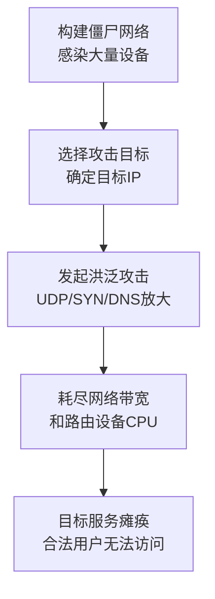

# 网络拒绝服务 (T1498)

## 一句话通俗理解

用海量垃圾流量堵死你的网络通道，让真正的用户挤不进来。

## 30秒速查卡

| 维度 | 你需要知道的 |
|------|-------------|
| 这是什么？ | 网络拒绝服务（T1498）是攻击者用来破坏目标系统或数据的技术 |
| 为什么危险？ | 攻击者可以对目标造成不可逆的破坏，影响组织正常运营 |
| 谁需要关心？ | 安全运维团队、系统管理员、业务负责人 |
| 你的第一步防御 | 定期备份数据并测试恢复流程，确保备份与生产环境隔离 |
| 如果只做一件事 | 监控异常的数据删除或修改行为，设置关键文件完整性告警 |

## 难度等级

⭐⭐ 中级（需要一定基础）

## 技术描述

网络拒绝服务（T1498）是MITRE ATT&CK框架中影响战术的一种技术。攻击者通过网络层或传输层洪泛攻击，使目标网络基础设施无法处理合法流量。

**通俗解释：**
想象一家奶茶店门口被上千人堵住，这些人不是来买奶茶的，而是一个个站在门口不进去——真正的顾客根本挤不进去。网络DDoS攻击就是这个原理：攻击者用大量"僵尸电脑"或"物联网设备"向目标服务器发送海量垃圾请求，把服务器的网络带宽和计算资源全部耗尽，合法用户根本无法访问。

**技术原理：**

1. 攻击者首先构建僵尸网络（Botnet）——感染大量设备（电脑、摄像头、路由器）并远程控制它们
2. 在攻击时间点，攻击者向所有僵尸设备发送攻击指令
3. 僵尸设备同时向目标发送大量网络请求（UDP洪泛、SYN洪泛、DNS放大查询等）
4. 目标的网络带宽被瞬间耗尽，路由器/防火墙因处理大量请求而CPU过载
5. 合法用户无法访问目标服务

**用途与影响：**
网络DoS攻击可用于敲诈勒索（DDoS勒索）、政治抗议（Hacktivism）、或在军事冲突中作为基础设施破坏手段。2025年全球DDoS攻击规模和频率持续增长，攻击峰值已超过2Tbps。

## 子技术列表

**该技术没有子技术。**

## 攻击流程

### 典型攻击流程

```
构建僵尸网络 --> 选择攻击目标 --> 发起攻击 --> 耗尽资源 --> 服务瘫痪
```



**步骤详解：**

1. **构建僵尸网络**
   - 通俗描述：攻击者先感染大量设备，组建一支"网络军队"
   - 技术细节：利用弱口令和未修补漏洞感染IoT设备，安装DDoS恶意软件（如Mirai）
   - 常用工具：Mirai botnet、自传播恶意软件

2. **选择攻击目标**
   - 通俗描述：确定要攻击的目标IP地址或域名
   - 技术细节：通过DNS解析获取目标服务器IP，确定攻击的端口和协议
   - 常用工具：`nslookup`、`dig`

3. **发起洪泛攻击**
   - 通俗描述：命令所有僵尸设备同时向目标发送海量请求
   - 技术细节：UDP洪泛发送大量随机端口的UDP包；SYN洪泛发送大量TCP半开连接；DNS放大反射攻击利用开放的DNS服务器将小查询放大约50倍后反射到目标
   - 常用工具：Mirai C2服务器、DDoS脚本

4. **耗尽资源**
   - 通俗描述：目标网络带宽被消耗完，路由器因处理太多的请求而"累瘫"
   - 技术细节：网络链路利用率达到100%，路由器CPU和内存耗尽
   - 常用工具：无（这是攻击效果）

5. **服务瘫痪**
   - 通俗描述：合法用户无法访问目标网站或服务
   - 技术细节：TCP连接超时、HTTP请求无响应、业务中断
   - 常用工具：无（这是攻击效果）

## 真实案例

### 案例1：Dyn DNS DDoS (2016) - Mirai僵尸网络

- **时间**: 2016年10月21日
- **目标**: Dyn公司（主要DNS服务提供商）
- **攻击组织**: 非特定APT组织，使用Mirai僵尸网络
- **手法**: Mirai僵尸网络利用大量被感染的IoT设备（摄像头、路由器、DVR）发起DNS查询洪泛攻击。攻击峰值达1.2Tbps，多个攻击波次持续数小时。Dyn的DNS基础设施被淹没，导致依赖Dyn DNS服务的Twitter、Netflix、Spotify、Airbnb、Reddit等大量网站因为DNS解析失败而无法访问。这是首次大规模IoT僵尸网络DDoS攻击，充分展示了IoT设备的安全风险。
- **影响**: 美国东海岸大量互联网服务中断数小时，数百万用户受影响
- **参考链接**: [Mirai Botnet - MITRE ATT&CK](https://attack.mitre.org/software/S0585/)

### 案例2：GitHub Memcached DDoS (2018)

- **时间**: 2018年2月28日
- **目标**: GitHub
- **攻击组织**: 未公开
- **手法**: 攻击者利用暴露在公网上的Memcached UDP服务（端口11211）进行反射放大攻击。通过向Memcached服务器发送伪造源地址为GitHub IP的小查询（约15字节），服务器返回放大10,000-50,000倍的响应流量（约750KB），攻击峰值达1.35Tbps。GitHub使用了Akamai的DDoS清洗服务，约10分钟后恢复正常，这是当时记录的最大DDoS攻击。
- **影响**: GitHub间歇性中断约20分钟
- **参考链接**: [GitHub DDoS Report](https://github.blog/news-insights/insights/ddos-incident-report/)

### 案例3：Google Cloud Armor HTTPS DDoS (2023)

- **时间**: 2023年8月
- **目标**: Google Cloud客户
- **攻击组织**: 未公开
- **手法**: Google报告了峰值达398M rps（每秒请求数）的HTTPS DDoS攻击。攻击者利用多个云服务商的被劫持虚拟机发起HTTPS请求，绕过传统的网络层DDoS防护。攻击类型为应用层（Layer 7）DDoS，前期也使用了网络层洪泛进行掩护。这次攻击展示了DDoS攻击从网络层向应用层演进的趋势。
- **影响**: 目标客户服务短暂中断
- **参考链接**: [Google Cloud DDoS Report](https://cloud.google.com/blog/products/identity-security/google-cloud-mitigated-largest-ddos-attack)

### 案例4：俄乌冲突中的DDoS攻击 (2022-至今)

- **时间**: 2022年-至今
- **目标**: 乌克兰政府网站、俄罗斯政府机构和银行
- **攻击组织**: 双方支持者（Anonymous、Killnet等）
- **手法**: 俄乌战争爆发后，双方支持者发动了大规模网络DDoS攻击。乌克兰政府网站的DDoS攻击峰值超过1Tbps。Anonymous等组织对俄罗斯政府、国有银行和新闻媒体网站发动持续DDoS攻击。部分攻击使用僵尸网络（Mirai等），部分由志愿者手动使用LOIC/ HOIC等低强度工具发起。攻击目标涵盖政府门户、银行系统、交通系统和媒体网站。
- **影响**: 双方关键信息服务多次中断，网络战争成为常规冲突的延伸
- **参考链接**: [CISA - Ukraine DDoS](https://www.cisa.gov/news-events/analysis-reports/ar22-099a)

## 红队视角

> ⚠️ **免责声明**：以下内容仅用于合法的安全测试、渗透测试和教育目的。未经授权对他人系统进行测试是违法行为。

### 实战技巧

1. **反射放大攻击的高效选择**
   Memcached放大倍率最高（10,000-50,000倍），但需要找到开放的服务。DNS放大倍率约50倍，但UDP 53端口通常可访问。NTP放大倍率约500倍，monlist命令已逐渐被禁用。

2. **混合攻击策略**
   先使用网络层洪泛消耗带宽，再使用应用层慢速攻击（Slowloris）耗尽连接池，组合攻击更难防御。

3. **使用云服务商的压力测试工具**
   AWS、Azure、GCP都提供授权的DDoS模拟测试服务，可以在获得授权的情况下测试防御能力。

### 常用工具

| 工具名称 | 用途 | 平台 | 链接 |
|----------|------|------|------|
| hping3 | 网络洪泛测试工具 | 跨平台 | 系统内置/可安装 |
| LOIC | 低轨道离子炮（DDoS测试） | Windows | https://github.com/NewEraCracker/LOIC |
| Slowloris | 慢速HTTP攻击工具 | 跨平台 | https://github.com/gkbrk/slowloris |
| nmap | 端口扫描和网络探测 | 跨平台 | https://nmap.org/ |

### 注意事项

- DDoS测试必须获得目标系统的明确书面授权
- 即使使用自己的系统测试，也要注意可能对上游网络提供商的影响
- 很多国家和地区将DDoS攻击视为严重犯罪行为

## 蓝队视角

### 检测要点

1. **带宽异常监控**
   - 日志来源：网络流量分析（NetFlow/sFlow）、路由器/交换机SNMP
   - 关注字段：带宽利用率、PPS（每秒包数）、新建连接速率
   - 异常特征：带宽利用率突增至基线值的数倍，特别是UDP流量占比飙升

2. **协议比例异常**
   - 日志来源：流量分析工具、IDS/IPS
   - 关注字段：TCP/UDP/ICMP流量比例
   - 异常特征：UDP流量占比从正常的10-20%飙升至80%以上（常见UDP洪泛特征）

3. **反射放大攻击特征**
   - 日志来源：NetFlow、防火墙日志
   - 关注字段：小请求包+超大响应包的比例
   - 异常特征：DNS/NTP/Memcached端口流量异常增大

### 监控建议

- 部署流量分析工具（如ntopng、ELK Stack）建立流量基线
- 配置BGP FlowSpec或RTBH（远程触发黑洞）的自动化响应
- 与云DDoS防护服务商（如Cloudflare、Akamai、AWS Shield）建立联动机制

## 检测建议

### 网络层检测

**检测方法：** 监控网络入口带宽和PPS异常

**具体规则/命令示例：**
```bash
# 使用tcpdump捕获DDoS流量特征
tcpdump -i eth0 -n -c 10000 'tcp[tcpflags] & (tcp-syn) != 0' | wc -l

# 检查DNS放大流量
tcpdump -i eth0 -n port 53 and 'udp[10] & 0x80 != 0'
```

### 主机层检测

**检测方法：** 监控系统网络资源使用

**Windows性能计数器：**
- Network Interface\Bytes Total/sec
- TCPv4\Connection Failures
- TCPv4\Connections Established

**具体命令示例：**
```bash
# Linux - 查看连接统计
netstat -n | awk '{print $6}' | sort | uniq -c | sort -rn

# 查看SYN_RECV状态（SYN洪泛特征）
netstat -ant | grep SYN_RECV | wc -l
```

### 应用层检测

**用人话说：** 这条规则在检测网络层DDoS攻击。攻击者用僵尸网络（成千上万的被感染IoT设备和服务器）向目标发送海量垃圾流量，比如UDP洪泛（大流量冲击带宽）、SYN洪泛（耗尽服务器连接表）、或者DNS/NTP/Memcached反射放大（小查询放大几十到几万倍后反射到目标）。检测的关键信号是：带宽利用率在几分钟内从正常基线飙升到接近100%、入站UDP流量占比从10%暴涨到80%以上、或者DNS/NTP端口的响应包远大于请求包（反射放大特征）。DDoS攻击的意图明显——就是用流量堵死你的网络入口，让合法用户无法访问。

**Sigma规则示例：**
```yaml
title: 检测DNS放大攻击特征
status: experimental
description: 检测DNS响应包远大于请求包的异常流量
logsource:
    category: dns
    product: windows
detection:
    selection:
        ResponseCode: 0
        RequestSize: "<= 100"
        ResponseSize: ">= 4000"
    condition: selection
level: high
tags:
    - attack.t1498
```

## 缓解措施

### 优先级1：关键措施

**措施名称：** DDoS防护服务

**具体实施步骤：**
1. 部署云DDoS清洗服务（Cloudflare、Akamai、AWS Shield）
2. 启用CDN分发内容，CDN节点吸收攻击流量
3. 配置BGP黑洞路由（RTBH）和流量牵引

### 优先级2：重要措施

**措施名称：** 网络基础设施加固

**具体实施步骤：**
1. 关闭不必要的UDP端口（特别是DNS递归、NTP monlist、Memcached、SSDP、SNMP的对外暴露）
2. 配置路由器/交换机的速率限制（Rate Limiting）和ACL
3. 启用SYN Cookie、TCP连接限速

### 优先级3：建议措施

**措施名称：** 网络架构优化

**具体实施步骤：**
1. 部署负载均衡和反向代理
2. 实施网络分段，关键业务系统隔离保护
3. 使用IP信誉列表和地理位置过滤

### MITRE ATT&CK 缓解措施映射

| 缓解措施ID | 缓解措施名称 | 适用性 | 说明 |
|------------|-------------|--------|------|
| M1037 | Filter Network Traffic | 适用 | ACL过滤和速率限制 |
| M1030 | Network Segmentation | 适用 | 网络分段隔离 |
| M1042 | Disable or Remove Feature or Program | 适用 | 关闭不必要的UDP服务 |
| M1018 | User Account Management | 部分适用 | 管理网络设备用户权限 |
| M1050 | Exploit Protection | 部分适用 | 启用SYN Cookie等保护 |

## 动手实验

> ⚠️ **重要提示**：所有实验必须在隔离的实验室环境中进行，禁止对未授权的真实系统进行测试。

### 实验环境准备

**推荐靶场/实验平台：**

| 平台名称 | 类型 | 难度 | 链接 |
|----------|------|:----:|------|
| TryHackMe - DDoS Attacks | 在线靶场 | 中级 | https://tryhackme.com/ |
| PentesterLab | 在线靶场 | 中级 | https://pentesterlab.com/ |

**所需工具：**
- hping3
- iperf3
- Wireshark

**环境搭建：**
```bash
# 在本地VM中搭建测试环境
# 一台作为攻击机，一台作为目标
```

### 实验1：SYN洪泛模拟（初级）

**实验目标：** 理解SYN洪泛攻击的原理和效果

**实验步骤：**
1. 启动Wireshark捕获流量
2. 在攻击机上使用hping3发送SYN包：`hping3 -S -p 80 --flood 目标IP`
3. 在目标机上观察 `netstat -ant | grep SYN_RECV`
4. 观察Wireshark中SYN包和SYN-ACK包的比例
5. 攻击停止后查看连接恢复情况

**预期结果：** 攻击时目标机的SYN_RECV数量急剧增加

**学习要点：** 理解TCP三次握手的原理和SYN洪泛的机制

### 实验2：反射放大攻击模拟（中级）

**实验目标：** 理解DNS反射放大的工作原理

**实验步骤：**
1. 在隔离网络中搭建一个开放的DNS服务器
2. 发送伪造源地址的小DNS查询包
3. 使用Wireshark捕获并观察放大倍数
4. 计算请求包和响应包的大小比例

**预期结果：** 小查询包产生远大于自身的响应包

**学习要点：** 理解为什么反射放大攻击难以防御

## 术语解释

| 术语 | 英文原名 | 通俗解释 |
|------|----------|----------|
| 拒绝服务 | Denial of Service (DoS) | 让服务无法被合法用户使用，就像把餐厅门口堵住不让顾客进去 |
| 分布式拒绝服务 | Distributed Denial of Service (DDoS) | 用大量分布在各地的设备同时攻击一个目标，比单一来源的攻击更难防御 |
| 僵尸网络 | Botnet | 被黑客远程控制的"僵尸"设备大军，由成千上万的被感染电脑、摄像头、路由器组成 |
| 洪泛攻击 | Flood Attack | 发送海量数据或请求淹没目标，就像用消防水管对着一个水杯灌水 |
| 反射放大攻击 | Reflection/Amplification Attack | 利用公开服务的漏洞，把一个小请求放大成大响应反射到目标 |
| SYN洪泛 | SYN Flood | 发送大量TCP连接请求但不完成握手，消耗服务器连接资源 |
| 带宽 | Bandwidth | 网络通道的宽度，就像水管的口径——越宽能同时流过的水（数据）越多 |
| 放大倍率 | Amplification Factor | 攻击请求被放大的倍数，比如发送1字节请求得到100字节响应，放大倍率就是100 |
| 流量清洗 | Traffic Scrubbing | 在DDoS攻击中过滤掉恶意流量、只让正常流量通过的防护技术 |
| RTBH | Remote Triggered Black Hole | 远程触发黑洞路由，把攻击流量引导到一个"黑洞"路由器丢弃掉 |

## 参考资料

### 官方文档

- [MITRE ATT&CK - Network Denial of Service](https://attack.mitre.org/techniques/T1498/)

### 安全报告

- [Dyn DDoS Analysis - CISA](https://www.cisa.gov/news-events/alerts/2016/10/dyn-ddos-attack)
- [GitHub DDoS Incident Report](https://github.blog/news-insights/insights/ddos-incident-report/)
- [Google Cloud DDoS Mitigation](https://cloud.google.com/blog/products/identity-security/google-cloud-mitigated-largest-ddos-attack)
- [Mirai Botnet - MITRE ATT&CK](https://attack.mitre.org/software/S0585/)

### 工具与资源

- [Cloudflare DDoS Protection](https://www.cloudflare.com/ddos/) - DDoS防护服务
- [AWS Shield](https://aws.amazon.com/shield/) - AWS DDoS防护
- [ntopng](https://www.ntop.org/) - 网络流量分析工具

### 学习资料

- [Cloudflare - DDoS Attacks](https://www.cloudflare.com/learning/ddos/what-is-a-ddos-attack/) - DDoS攻击科普
- [CISA - DDoS Guide](https://www.cisa.gov/news-events/alerts/2022/03/ddos-attacks) - CISA DDoS指南
