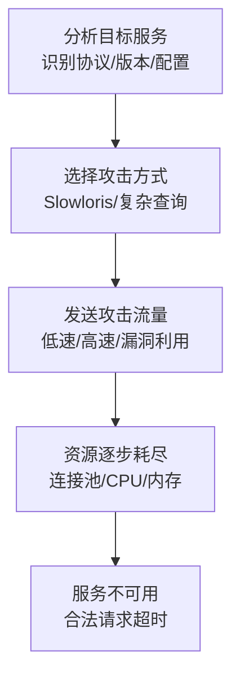

# 端点拒绝服务 (T1499)

## 一句话通俗理解

不像网络DDoS那样堵你门前的路，而是直接让你的服务器累死——CPU占满、内存耗尽、进程卡死。

## 难度等级

⭐⭐ 中级（需要一定基础）

## 技术描述

端点拒绝服务（T1499）是MITRE ATT&CK框架中影响战术的一种技术。攻击者针对特定端点系统而非网络基础设施发起拒绝服务攻击，使系统资源耗尽、服务不可用。

**通俗解释：**
网络DDoS（T1498）就像用很多人堵住你店门口的路——顾客进不来是因为路被堵了。而端点DoS（T1499）是直接在你店里搞破坏——打开所有水龙头、用所有插座、把马桶冲水不停——让店里的资源耗尽。攻击者不通过网络带宽攻击，而是直接对目标服务器发送大量计算请求，让它的CPU飙升到100%、内存耗尽、处理不过来合法请求。

**技术原理：**

1. 攻击者识别目标系统的弱点（资源限制、协议漏洞、应用逻辑缺陷）
2. 发送精心构造的请求，利用这些弱点耗尽系统资源
3. 系统资源（CPU、内存、进程表、文件描述符、连接池）被耗尽
4. 合法请求无法被处理，服务不可用

**用途与影响：**
端点DoS攻击可用于敲诈勒索、竞争性破坏或作为更复杂攻击的掩护。相比网络DDoS，端点DoS需要的攻击带宽更小但效果同样显著。2025-2026年，针对云数据库和应用服务器的端点DoS攻击显著增加。

## 子技术列表

**该技术共有 4 个子技术：**

| 子技术ID | 中文名称 | 通俗解释 |
|----------|----------|----------|
| T1499.001 | 操作系统资源耗尽 | 把操作系统的进程表、内存、文件描述符全部耗尽 |
| T1499.002 | 服务资源耗尽 | 针对特定服务（如Web服务器）的连接池或处理能力耗尽 |
| T1499.003 | 应用层资源耗尽 | 利用复杂的查询或大文件上传耗尽应用的计算资源 |
| T1499.004 | 应用或系统漏洞利用 | 利用软件漏洞（如缓冲区溢出）导致系统崩溃 |

<details>
<summary><strong>展开查看各子技术详细说明</strong></summary>

### T1499.001 - 操作系统资源耗尽

**通俗理解：** 让操作系统忙不过来了——进程太多、内存不足、文件句柄用光

**详细说明：**
攻击者通过大量连接或进程消耗操作系统资源，使系统无响应。典型方式包括：fork炸弹（无限创建子进程）、大量TCP连接消耗文件描述符、内存分配耗尽。在Windows中可能通过大量句柄分配实现。

### T1499.002 - 服务资源耗尽

**通俗理解：** 针对某个服务（比如网站服务器）的连接池或线程池耗尽

**详细说明：**
针对特定服务或协议的资源耗尽攻击。例如Slowloris攻击：向HTTP服务器发送部分请求但不发送完整的请求头，服务器保持这些半开连接，最终耗尽连接池。类似方式也适用于DNS、SMTP等服务。

### T1499.003 - 应用层资源耗尽

**通俗理解：** 利用复杂的业务逻辑操作消耗应用的计算能力

**详细说明：**
针对应用层逻辑的资源消耗，区别于协议层的简单洪泛。例如：发送大量计算密集型数据库查询（笛卡尔积连接）、大文件上传导致磁盘填满、复杂的搜索查询导致CPU耗尽。这种攻击最难防御，因为流量看起来是正常的业务请求。

### T1499.004 - 应用或系统漏洞利用

**通俗理解：** 利用软件本身的bug让程序崩溃

**详细说明：**
利用漏洞（如缓冲区溢出、整数溢出、释放后使用）触发系统死循环、资源泄漏或崩溃。Ping of Death就是经典案例——发送超过65535字节的畸形ICMP包导致接收系统崩溃。与简单洪泛不同，这种方式利用软件缺陷实现拒绝服务。

</details>

## 攻击流程

### 典型攻击流程

```
分析目标 --> 选择攻击方式 --> 发送攻击流量 --> 资源耗尽 --> 服务不可用
```



**步骤详解：**

1. **分析目标**
   - 通俗描述：攻击者先看看目标运行的是什么服务
   - 技术细节：使用nmap扫描开放端口和运行的服务版本
   - 常用工具：`nmap`、`netcat`

2. **选择攻击方式**
   - 通俗描述：根据服务类型选择最有效的攻击方法
   - 技术细节：Web服务器选Slowloris，数据库选复杂查询，旧系统选已知CVE
   - 常用工具：Slowloris脚本、SQLMap

3. **发送攻击流量**
   - 通俗描述：发送精心构造的请求
   - 技术细节：低带宽、高效果的请求模式
   - 常用工具：Slowloris、hping3、自定义脚本

4. **资源耗尽**
   - 通俗描述：服务器的资源（连接数、CPU、内存）被逐步耗尽
   - 技术细节：连接池满、CPU 100%、内存OOM
   - 常用工具：无（攻击效果）

5. **服务不可用**
   - 通俗描述：合法用户无法使用服务
   - 技术细节：HTTP 503、连接超时、无响应
   - 常用工具：无（攻击效果）

## 真实案例

### 案例1：Slowloris 慢速攻击 (2009-至今)

- **时间**: 2009年-至今
- **目标**: Web服务器（Apache、Tomcat等）
- **攻击组织**: 非特定组织，广泛用于Hacktivism
- **手法**: Slowloris使用部分HTTP请求保持与Web服务器的多个连接，但不发送完整的请求头。服务器保持这些半开连接，最终耗尽连接池，导致无法处理合法请求。攻击者只需极低的带宽（单台机器即可）就能让中等规模的Web服务器瘫痪。这属于T1499.002（Service Exhaustion Flood）的典型场景。
- **影响**: 大量小型网站因无法承受Slowloris攻击而临时下线
- **参考链接**: [Slowloris - MITRE ATT&CK](https://attack.mitre.org/techniques/T1499/002/)

### 案例2：SQL Server RDS 内存耗尽 (2022)

- **时间**: 2022年
- **目标**: 某大型电商平台的云数据库
- **攻击组织**: 未公开
- **手法**: 攻击者利用SQL注入点发送大量计算密集型查询（笛卡尔积连接、多表UNION、大量LIKE模糊查询），导致云数据库的RDS实例内存耗尽，CPU飙升至100%，所有业务查询超时。攻击流量仅有几十个请求/秒，但每个请求都设计了极高的计算复杂度。这是Application Exhaustion（T1499.003）的典型场景。数据库恢复需要数小时。
- **影响**: 电商平台交易中断约6小时，损失数百万美元
- **参考链接**: [MITRE - T1499.003](https://attack.mitre.org/techniques/T1499/003/)

### 案例3：Ping of Death - OS Exhaustion (历史经典)

- **时间**: 1990年代-至今（旧系统仍受影响）
- **目标**: 各类操作系统
- **攻击组织**: 广泛使用
- **手法**: Ping of Death发送超过65535字节的畸形ICMP包，导致接收系统缓冲区溢出和崩溃。这是OS Exhaustion（T1499.001）和Exploitation（T1499.004）的早期经典案例。虽然现代操作系统已修复此漏洞，但类似的协议漏洞仍在不断被发现。
- **影响**: 目标系统蓝屏死机（BSOD）或内核恐慌
- **参考链接**: [Ping of Death - Wikipedia](https://en.wikipedia.org/wiki/Ping_of_death)

### 案例4：Log4Shell 拒绝服务攻击 (2021-至今)

- **时间**: 2021年12月-至今
- **目标**: 使用Log4j库的Java应用
- **攻击组织**: 大量APT组织和网络犯罪团伙
- **手法**: CVE-2021-44228（Log4Shell）漏洞除了被用于远程代码执行外，也被用于拒绝服务攻击。攻击者构造特殊的JNDI查询字符串，触发Log4j的无限递归解析，导致CPU耗尽和进程崩溃。一条精心构造的日志消息就能让服务器瘫痪。这属于Application or System Exploitation（T1499.004）。
- **影响**: 全球数百万台Java服务器受影响
- **参考链接**: [CVE-2021-44228 - NVD](https://nvd.nist.gov/vuln/detail/CVE-2021-44228)

### 案例5：HTTP/2 Rapid Reset - 云服务提供商大规模端点DoS (2023-2025)

- **时间**: 2023年8月-至今（持续活跃）
- **目标**: Google Cloud、AWS、Cloudflare等全球主要云服务商及其客户
- **攻击组织**: 多方（多个DDoS犯罪团伙和APT组织）
- **手法**: CVE-2023-44487（Rapid Reset）利用HTTP/2协议的流取消机制缺陷。攻击者与服务器建立单个TCP连接后，快速并发创建大量HTTP/2 stream并立即发送RST_STREAM帧取消。每次取消强制服务器执行资源清理操作，但客户端的成本极低。通过这种方式，单个攻击者能以极低带宽产生每秒数百万次请求的冲击力，直接耗尽服务器CPU、内存和连接池资源。2023年8-10月期间，Google Cloud报告了峰值达3.98亿RPS的创纪录攻击，AWS和Cloudflare也遭受了类似规模的攻击。2024-2025年，该攻击手法持续进化，攻击者利用更大的僵尸网络和更优化的重置模式，持续针对金融、游戏和云服务行业。这属于T1499.004（Application or System Exploitation）——利用HTTP/2协议实现级别的漏洞实现拒绝服务。
- **影响**: 全球数千个Web服务遭受间歇性中断，云服务商需要紧急修补HTTP/2协议栈并部署额外的速率限制措施
- **参考链接**: [CVE-2023-44487 - NVD](https://nvd.nist.gov/vuln/detail/CVE-2023-44487) | [Google Cloud Rapid Reset Analysis](https://cloud.google.com/blog/products/identity-security/how-it-works-the-novel-http2-rapid-reset-ddos-attack) | [NETSCOUT - HTTP/2 Rapid Reset DDoS](https://www.netscout.com/blog/asert/http2-rapid-reset-application-layer-ddos-attacks-targeting)

## 红队视角

> ⚠️ **免责声明**：以下内容仅用于合法的安全测试、渗透测试和教育目的。未经授权对他人系统进行测试是违法行为。

### 实战技巧

1. **慢速攻击的优势**
   Slowloris类攻击不需要大带宽，一台笔记本就能攻击中型Web服务器。关键在于隐蔽性——流量看起来像正常的慢速连接。

2. **利用应用逻辑**
   找到业务中的计算密集型操作（如报表生成、批量导出、复杂搜索），发送少量这类请求就能造成资源耗尽。这种方式比洪泛更难防御。

3. **混合攻击**
   先使用Slowloris耗尽连接池，然后使用应用层复杂查询消耗CPU，组合攻击效果更好。

### 常用工具

| 工具名称 | 用途 | 平台 | 链接 |
|----------|------|------|------|
| Slowloris | HTTP慢速攻击 | 跨平台 | https://github.com/gkbrk/slowloris |
| hping3 | 协议洪泛测试 | 跨平台 | 系统内置/可安装 |
| GoldenEye | HTTP DoS测试工具 | 跨平台 | https://github.com/jseidl/GoldenEye |
| THC-SSL-DoS | SSL协商耗尽工具 | 跨平台 | https://github.com/niccokunzmann/thc-ssl-dos |

### 注意事项

- 权限测试中必须在隔离环境中进行
- Slowloris测试可能影响负载均衡器的稳定性
- 应用层资源耗尽测试需要精确控制请求量，避免造成真实的业务中断

## 蓝队视角

### 检测要点

1. **半开连接检测**
   - 日志来源：`netstat`、防火墙连接表
   - 关注字段：SYN_RCVD状态的连接数、TIME_WAIT堆积
   - 异常特征：大量半开连接数量超过正常基线的数倍

2. **P99延迟突增**
   - 日志来源：APM工具、应用服务器日志
   - 关注字段：P99响应时间
   - 异常特征：P99延迟从正常的毫秒级突增到秒级甚至分钟级

3. **资源使用率异常**
   - 日志来源：系统监控工具（Prometheus、Zabbix）
   - 关注字段：CPU使用率、内存使用率、进程数、文件描述符数
   - 异常特征：CPU持续100%、内存使用率突增、OOM事件

### 监控建议

- 配置CPU/内存的阈值告警，超过基线时自动触发
- 使用APM工具监控应用层响应时间，建立P99延迟的基线
- 部署WAF检测SQL注入后的资源消耗攻击（大量复杂查询）

## 检测建议

### 网络层检测

**检测方法：** 检测Slowloris慢速攻击特征

**具体规则/命令示例：**
```
# Suricata规则 - 检测HTTP慢速攻击
alert tcp $EXTERNAL_NET any -> $HTTP_SERVERS $HTTP_PORTS (msg:"Slowloris Attack Detected"; flow:to_server; content:"|0d 0a|"; http_header_names; within:2; byte_test:1,<,50,0,relative; sid:1000006; rev:1;)
```

### 主机层检测

**检测方法：** 监控资源使用率和半开连接

**具体命令示例：**
```bash
# 检测半开连接数量
netstat -ant | grep SYN_RECV | wc -l

# 查看文件描述符使用
lsof | wc -l

# 查看进程数
ps aux | wc -l
```

### 应用层检测

**Sigma规则示例：**
```yaml
title: 检测异常的高延迟HTTP请求
status: experimental
description: 检测Web服务器响应时间异常延长的行为
logsource:
    category: webserver
    product: apache
detection:
    selection:
        c-duration: "> 300000"
    condition: selection
    timeframe: 5m
level: medium
tags:
    - attack.t1499
```

## 缓解措施

### 优先级1：关键措施

**措施名称：** 速率限制和连接管理

**具体实施步骤：**
1. 配置Web服务器的连接超时和最大连接数限制
2. 实施IP级别的速率限制，单IP不超过N个并发连接
3. 使用反向代理（Nginx/HAProxy）转发请求，代理层进行限流

### 优先级2：重要措施

**措施名称：** 应用层防护

**具体实施步骤：**
1. 部署WAF检测SQL注入和慢速攻击
2. 对数据库实施查询超时和连接池限制
3. 实施请求频率控制（API限流）

### 优先级3：建议措施

**措施名称：** 架构优化

**具体实施步骤：**
1. 使用弹性伸缩组自动扩展应对流量波动
2. 及时修补已知漏洞（CVE），防止Exploitation类DoS
3. 实施微服务和服务熔断（Circuit Breaker）机制

### MITRE ATT&CK 缓解措施映射

| 缓解措施ID | 缓解措施名称 | 适用性 | 说明 |
|------------|-------------|--------|------|
| M1037 | Filter Network Traffic | 适用 | 速率限制和连接过滤 |
| M1018 | User Account Management | 部分适用 | API密钥限流 |
| M1050 | Exploit Protection | 适用 | 修补已知漏洞 |
| M1042 | Disable or Remove Feature or Program | 部分适用 | 禁用不必要的服务 |
| M1030 | Network Segmentation | 适用 | 网络分段隔离 |

## 动手实验

> ⚠️ **重要提示**：所有实验必须在隔离的实验室环境中进行，禁止对未授权的真实系统进行测试。

### 实验环境准备

**推荐靶场/实验平台：**

| 平台名称 | 类型 | 难度 | 链接 |
|----------|------|:----:|------|
| TryHackMe | 在线靶场 | 中级 | https://tryhackme.com/ |
| PentesterLab | 在线靶场 | 中级 | https://pentesterlab.com/ |

**所需工具：**
- Slowloris（Python脚本）
- Apache/Nginx测试服务器
- Wireshark

**环境搭建：**
```bash
# 使用Docker搭建测试Web服务器
docker run -d --name test-web -p 8080:80 httpd:alpine
```

### 实验1：Slowloris攻击模拟（初级）

**实验目标：** 理解Slowloris攻击的原理和效果

**实验步骤：**
1. 启动测试Web服务器
2. 安装Slowloris：`git clone https://github.com/gkbrk/slowloris`
3. 运行Slowloris攻击：`python3 slowloris.py 127.0.0.1 -p 8080`
4. 在另一终端观察连接状态：`watch -n 1 "netstat -ant | grep 8080 | wc -l"`
5. 尝试从浏览器访问，观察响应情况

**预期结果：** 攻击后连接数急剧增加，浏览器无法访问

**学习要点：** 理解为什么低带宽的慢速攻击能瘫痪服务器

### 实验2：配置缓解措施（中级）

**实验目标：** 学习配置Nginx限制连接数防御Slowloris

**实验步骤：**
1. 在Nginx配置中添加限流设置（limit_conn、limit_req）
2. 配置客户端超时（client_header_timeout、client_body_timeout）
3. 重启Nginx使配置生效
4. 再次使用Slowloris攻击，观察效果

**预期结果：** 配置限流后，Slowloris无法耗尽连接池

**学习要点：** 掌握应用层DoS攻击的防御配置方法

## 术语解释

| 术语 | 英文原名 | 通俗解释 |
|------|----------|----------|
| 端点 | Endpoint | 网络中的单个设备或服务，比如一台服务器、一个数据库、一个API服务 |
| 连接池 | Connection Pool | 服务器维护的一组网络连接资源，就像酒店的客房数量有限 |
| 半开连接 | Half-Open Connection | TCP连接只完成了第一步（SYN）但没完成全部握手，挂在半空中 |
| 文件描述符 | File Descriptor | 操作系统为每个打开的文件或网络连接分配的数字编号，数量有限 |
| 慢速攻击 | Slow Rate Attack | 不以高速发送请求，而是以极低的速度保持大量连接，慢慢消耗资源 |
| 缓冲区溢出 | Buffer Overflow | 往一个大小固定的容器里塞超过容量的数据，多余的数据溢出到别的区域造成破坏 |
| 熔断机制 | Circuit Breaker | 当某个服务出问题时自动切断连接，防止问题扩散到整个系统 |
| 负载均衡 | Load Balancing | 把请求分散到多台服务器处理，避免单台服务器过载 |
| 速率限制 | Rate Limiting | 限制每个用户或IP在一定时间内的请求次数，就像餐厅限制每人只能点2个菜 |
| 反代 | Reverse Proxy | 放在服务器前面的代理程序，隐藏后端服务器并承担流量转发 |

## 参考资料

### 官方文档

- [MITRE ATT&CK - Endpoint Denial of Service](https://attack.mitre.org/techniques/T1499/)
- [MITRE - OS Exhaustion Flood (T1499.001)](https://attack.mitre.org/techniques/T1499/001/)
- [MITRE - Service Exhaustion Flood (T1499.002)](https://attack.mitre.org/techniques/T1499/002/)
- [MITRE - Application Exhaustion Flood (T1499.003)](https://attack.mitre.org/techniques/T1499/003/)
- [MITRE - Application or System Exploitation (T1499.004)](https://attack.mitre.org/techniques/T1499/004/)

### 安全报告

- [HTTP/2 Rapid Reset Attack - Google Cloud](https://cloud.google.com/blog/products/identity-security/how-it-works-the-novel-http2-rapid-reset-ddos-attack)
- [HTTP/2 Rapid Reset DDoS - NETSCOUT](https://www.netscout.com/blog/asert/http2-rapid-reset-application-layer-ddos-attacks-targeting)
- [Slowloris Attack - CISA](https://www.cisa.gov/news-events/alerts/2009/09/slowloris-ddos-attack)
- [Memcached DDoS - Cloudflare](https://www.cloudflare.com/learning/ddos/memcached-ddos-attack/)
- [GitHub DDoS Incident](https://github.blog/news-insights/insights/ddos-incident-report/)

### 工具与资源

- [Slowloris](https://github.com/gkbrk/slowloris) - HTTP慢速攻击工具
- [Nginx Rate Limiting](https://www.nginx.com/blog/rate-limiting-nginx/) - Nginx限流配置

### 学习资料

- [Cloudflare - DoS Attacks](https://www.cloudflare.com/learning/ddos/dos-attack/) - DoS攻击科普
- [OWASP - DoS Prevention](https://owasp.org/www-community/DoS_Attack_Cheat_Sheet) - OWASP DoS防御指南
