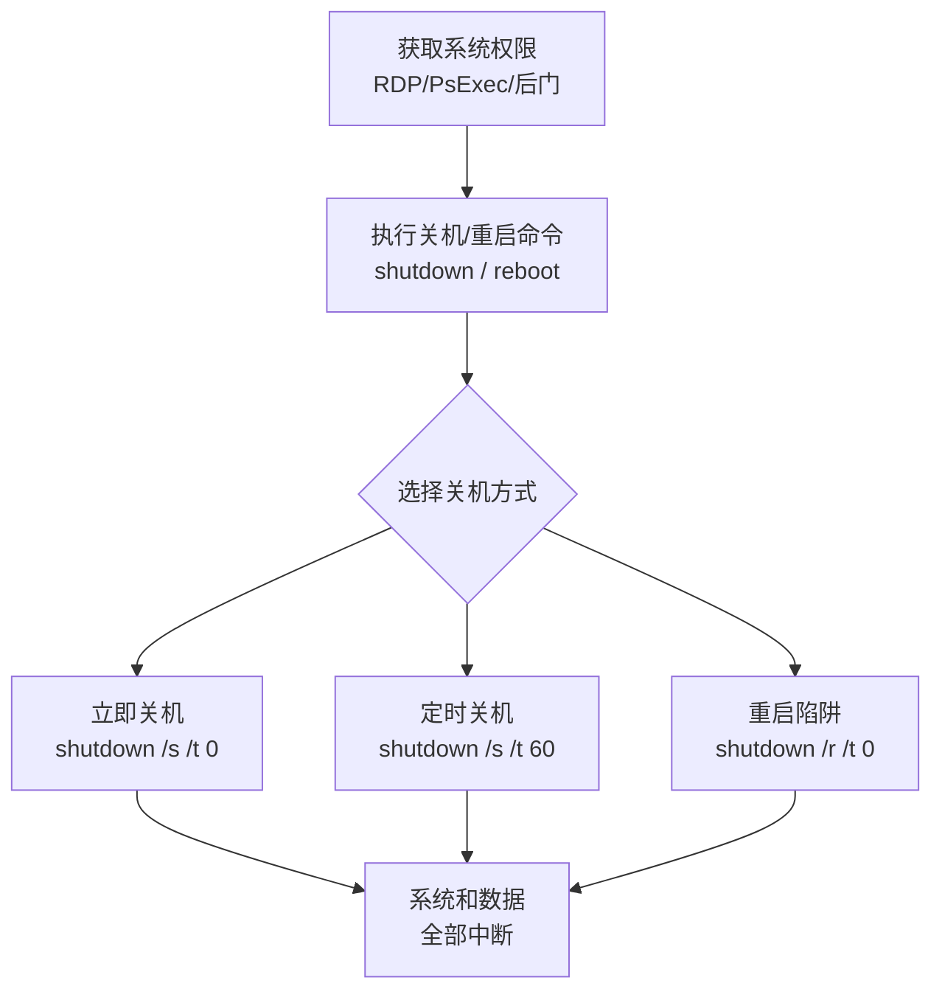

# 系统关机重启 (T1529)

## 一句话通俗理解

攻击者远程关掉你的服务器或让它重启——就像有人拔掉了你电脑的电源线。

## 难度等级

⭐ 初级（新手可学）

## 技术描述

系统关机/重启（T1529）是MITRE ATT&CK框架中影响战术的一种技术。攻击者通过关闭或重启系统来中断业务运营、破坏系统可用性。

**通俗解释：**
这是最简单但最有效的破坏手段之一——攻击者只需要在你的系统上执行一条 `shutdown /s` 命令，你的服务器就关机了。所有在上面运行的业务全部中断。有时候攻击者不是简单地关机，而是让系统不断重启（陷入重启循环），让系统根本无法正常工作。

**技术原理：**

1. 攻击者通过远程管理工具（RDP、PsExec、WMI）或已植入的后门获得系统执行权限
2. 执行系统关机/重启命令：Windows使用 `shutdown /s`（关机）、`shutdown /r`（重启）；Linux使用 `shutdown -h now`、`reboot`
3. 攻击者也可能设置定时关机（`shutdown /t 60`）或在特定条件触发时执行
4. 在某些场景下，使用 `shutdown /p`（强制关机，不提示用户）

**用途与影响：**
关机重启可用于：触发破坏性载荷（如擦除器需要重启才能破坏MBR）、中断关键业务系统、作为破坏行动的最终步骤。在某些APT攻击中，攻击者在其他破坏操作完成后执行关机，给受害者造成"一切都完了"的最终打击。

## 子技术列表

**该技术没有子技术。**

## 攻击流程

### 典型攻击流程

```
获取权限 --> 执行关机/重启命令 --> 系统关闭 --> 业务中断
```



**步骤详解：**

1. **获取系统权限**
   - 通俗描述：攻击者需要有管理员权限才能执行关机命令
   - 技术细节：通过RDP远程登录、PsExec远程执行或通过后门执行命令
   - 常用工具：RDP、PsExec、Cobalt Strike、Metasploit

2. **执行关机/重启命令**
   - 通俗描述：攻击者执行系统命令来关机或重启
   - 技术细节：Windows使用 `shutdown /s /t 0`（立即关机）、`shutdown /r /t 0`（立即重启）；Linux使用 `shutdown -h now`、`reboot`
   - 常用工具：系统内置命令

3. **关机方式选择**
   - 通俗描述：攻击者根据目的选择不同的关机方式
   - 技术细节：立即关机直接中断服务、延迟关机给用户看通知的时间、重启用于触发引导区破坏
   - 常用工具：`shutdown.exe`、`reboot`、`poweroff`

4. **业务中断**
   - 通俗描述：系统关闭后所有业务全部停摆
   - 技术细节：数据库连接断开、Web服务停止、用户会话终止
   - 常用工具：系统关机机制

## 真实案例

### 案例1：乌克兰电网攻击 - Industryer (2016)

- **时间**: 2016年12月
- **目标**: 乌克兰电力公司
- **攻击组织**: Sandworm（疑似俄罗斯背景）
- **手法**: Industryer（Crash Override）恶意软件在导致变电站断路器跳闸后，自动执行一系列关机命令。攻击者远程登录到SCADA系统后，使用 `shutdown /s /t 0` 命令关闭控制服务器和站级计算机，使操作人员无法及时响应电网异常。此外还使用了UPS（不间断电源）的远程管理功能切断供电，导致停电状态无法被快速恢复。这是首次已知的针对电力系统的恶意软件辅助关机攻击。
- **影响**: 乌克兰首都基辅部分区域停电约1小时
- **参考链接**: [Industroyer - MITRE ATT&CK](https://attack.mitre.org/software/S0604/)

### 案例2：OlympicDestroyer - 平昌冬奥会 (2018)

- **时间**: 2018年2月
- **目标**: 2018平昌冬奥会IT系统
- **攻击组织**: 疑似俄罗斯背景
- **手法**: OlympicDestroyer在部署破坏性载荷后，使用Windows系统命令远程重启了数百台服务器和工作站。重启后在系统引导时触发MBR破坏逻辑，导致系统无法正常启动。攻击者还使用了PsExec在域内批量执行 `shutdown /r /t 0`。奥运会开幕式当天，场馆IT系统、Wi-Fi网络和门票系统全部瘫痪。
- **影响**: 冬奥会开幕式IT系统瘫痪，数万名观众无法正常入场
- **参考链接**: [OlympicDestroyer - Welivesecurity](https://www.welivesecurity.com/2018/03/13/olympicdestroyer-takes-next-step/)

### 案例3：NotPetya 强制重启陷阱 (2017)

- **时间**: 2017年6月
- **目标**: 全球企业
- **攻击组织**: Sandworm（疑似俄罗斯背景）
- **手法**: NotPetya在完成MBR覆写后，显示伪造的磁盘修复提示，要求用户重启系统。一旦重启，被破坏的MBR将加载NotPetya的引导加载器，显示伪造的勒索界面。重启是NotPetya完成整个攻击链条的关键触发步骤。NotPetya并不立即关机，而是利用"重启陷阱"诱使用户自己触发破坏逻辑。
- **影响**: 全球约2,000个组织被感染，损失超100亿美元
- **参考链接**: [NotPetya - MITRE ATT&CK](https://attack.mitre.org/software/S0368/)

### 案例4：LockBit/BlackCat 加密后重启 (2021-至今)

- **时间**: 2021年-至今
- **目标**: 全球各行业
- **攻击组织**: LockBit、BlackCat等勒索软件团伙
- **手法**: 部分勒索软件变种在完成文件加密后，执行 `shutdown /r /t 60` 命令，给用户60秒时间看到勒索通知，然后自动重启。重启后系统可能进入安全模式，某些变种还会利用重启加载内核级驱动或引导加载器。2025-2026年的新变种增强了重启后的持续性——重启后自动执行第二阶段载荷，进一步破坏系统恢复功能。
- **影响**: 受害者数据被加密且系统在重启后进入不可用状态
- **参考链接**: [MITRE - T1529](https://attack.mitre.org/techniques/T1529/)

### 案例5：Jaguar Land Rover 勒索软件导致全球工厂停产 (2025)

- **时间**: 2025年9月-10月
- **目标**: Jaguar Land Rover（JLR）全球制造工厂及供应链
- **攻击组织**: 疑似Qilin/BlackSuit勒索软件团伙
- **手法**: 攻击者通过钓鱼邮件或VPN漏洞获得JLR企业网络访问权限后，横向移动到生产执行系统（MES）、ERP系统和VMware ESXi虚拟化平台。在部署勒索软件加密前，攻击者执行了系统关机命令关闭安全监控和备份服务器，随后加密了关键生产控制服务器和工程工作站。加密导致工厂的装配线控制系统、物流调度系统和质量检测系统全部瘫痪。JLR被迫主动切断所有英国工厂的生产线电源并执行受控关机，以防止勒索软件传播到OT网络中的PLC和机器人控制系统。此次攻击涉及制造执行系统（MES）的受控关停和超过30,000台设备的系统重启恢复过程。属于T1529（系统关机重启）的典型场景。
- **影响**: JLR全球所有工厂停产超过3周，英国经济损失约19亿英镑（25亿美元），影响104,000名供应链工人，批发销量下降43%
- **参考链接**: [Dragos 2026 OT Cybersecurity Report](https://www.dragos.com/blog/dragos-2026-ot-cybersecurity-year-in-review) | [JLR Cyberattack Halts Production - SCW Magazine](https://scw-mag.com/news/jaguar-land-rover-cyberattack-halts-car-production-and-disrupts-supply-chain/)

## 红队视角

> ⚠️ **免责声明**：以下内容仅用于合法的安全测试、渗透测试和教育目的。未经授权对他人系统进行测试是违法行为。

### 实战技巧

1. **定时关机配合破坏载荷**
   使用 `shutdown /t 300` 设置5分钟后关机，在这段时间内完成数据窃取或其他操作。定时关机可以制造紧迫感，迫使管理员在有限时间内做出决策。

2. **远程批量关机**
   在域环境中使用以下命令批量关闭所有域成员：
   ```powershell
   Get-ADComputer -Filter * | ForEach-Object { shutdown /s /m \\$_.Name /t 0 }
   ```

3. **虚假关机通知**
   在关机前修改关机提示消息：`shutdown /s /t 120 /c "系统紧急更新，请保存工作"`，使用看似合法的系统消息麻痹用户。

### 常用工具

| 工具名称 | 用途 | 平台 | 链接 |
|----------|------|------|------|
| shutdown | 系统关机/重启命令 | Windows | 系统内置 |
| reboot/poweroff | Linux系统关机 | Linux | 系统内置 |
| PsExec | 远程执行关机命令 | Windows | https://learn.microsoft.com/sysinternals/ |
| WMIC | 远程管理命令 | Windows | 系统内置 |
| IPMI/iDRAC/iLO | 带外远程管理 | 硬件 | 硬件自带 |

### 注意事项

- 授权测试中严禁对生产系统执行关机操作
- 使用VM快照进行测试，避免物理机测试
- 通知相关干系人，避免误判为真实攻击

## 蓝队视角

### 检测要点

1. **关机命令监控**
   - 日志来源：Windows Event ID 1074、Sysmon Event ID 1
   - 关注字段：`shutdown.exe`、`Restart-Computer`、`Stop-Computer` 的执行
   - 异常特征：非管理员用户的关机操作、非计划维护时间的关机

2. **远程关机检测**
   - 日志来源：Windows Event ID 1074（关机类型和原因代码）
   - 关注字段：远程关机（`/m` 参数）、批量关机
   - 异常特征：短时间内大量系统的关机或重启事件

3. **云环境关机检测**
   - 日志来源：CloudTrail (AWS)、Activity Log (Azure)
   - 关注字段：`StopInstances`、`PowerOff`、`PowerOffVM` API调用
   - 异常特征：非授权的实例停止操作、批量停止未受保护的实例

### 监控建议

- 对 `shutdown.exe` 设置命令行审计规则，记录每次执行的参数
- 建立计划内维护窗口时间表，异常时间的关机操作立即告警
- 对关键服务器配置关机授权审批流程

## 检测建议

### 网络层检测

**检测方法：** 检测远程关机命令的横向传播

**具体规则/命令示例：**
```
# Suricata规则 - 检测远程关机命令
alert tcp $HOME_NET any -> $HOME_NET 445 (msg:"Remote Shutdown via PsExec"; content:"shutdown"; within:2048; sid:1000007; rev:1;)
```

### 主机层检测

**检测方法：** 监控系统关机事件

**Windows事件ID：**
- 事件ID 1074：系统关机和重启
- 事件ID 1076：另一台计算机远程关闭本机
- 事件ID 6008：非正常关机（未正常关闭）

**具体命令示例：**
```powershell
# 检测系统关机事件
Get-WinEvent -FilterHashtable @{LogName='System'; ID=1074} | Format-Table TimeCreated, Message

# 检测非正常关机
Get-WinEvent -FilterHashtable @{LogName='System'; ID=6008} | Format-Table TimeCreated, Message
```

### 应用层检测

**Sigma规则示例：**
```yaml
title: 检测远程系统关机操作
status: experimental
description: 检测使用shutdown命令远程关闭系统的行为
logsource:
    category: process_creation
    product: windows
detection:
    selection:
        CommandLine|contains|all:
            - 'shutdown'
            - '/m'
    condition: selection
level: high
tags:
    - attack.t1529
```

## 缓解措施

### 优先级1：关键措施

**措施名称：** 限制关机权限

**具体实施步骤：**
1. 通过组策略限制谁有权关闭系统（计算机配置 > Windows设置 > 安全设置 > 用户权限分配 > 关闭系统）
2. 从"关闭系统"权限中移除普通用户和普通管理员
3. 仅保留关键运维人员有远程关机权限

### 优先级2：重要措施

**措施名称：** 远程访问控制

**具体实施步骤：**
1. 限制远程管理工具（PsExec、WMIC）的使用权限
2. 限制对带外管理接口（BMC/IPMI/iDRAC）的网络访问，使用独立管理网络
3. 对关键系统启用关机密码保护（BIOS设置）

### 优先级3：建议措施

**措施名称：** 自动恢复和容灾

**具体实施步骤：**
1. 配置关键服务器的自动启动策略（BIOS断电恢复后自动开机）
2. 对关键业务实施集群部署，单系统关闭不影响整体
3. 数据库和关键服务配置故障转移

### MITRE ATT&CK 缓解措施映射

| 缓解措施ID | 缓解措施名称 | 适用性 | 说明 |
|------------|-------------|--------|------|
| M1026 | Privileged Account Management | 适用 | 限制关机权限 |
| M1030 | Network Segmentation | 适用 | 管理网络隔离 |
| M1035 | Limit Access to Resource Over Network | 适用 | 限制远程管理工具 |
| M1042 | Disable or Remove Feature or Program | 部分适用 | 禁用不必要的远程关机功能 |
| M1053 | Data Backup | 适用 | 系统状态备份用于快速恢复 |

## 动手实验

> ⚠️ **重要提示**：所有实验必须在隔离的实验室环境中进行，禁止对未授权的真实系统进行测试。

### 实验环境准备

**推荐靶场/实验平台：**

| 平台名称 | 类型 | 难度 | 链接 |
|----------|------|:----:|------|
| TryHackMe | 在线靶场 | 初级 | https://tryhackme.com/ |
| Hack The Box | 在线靶场 | 中级 | https://www.hackthebox.com/ |

**所需工具：**
- Windows VM
- Linux VM

### 实验1：系统关机命令操作（初级）

**实验目标：** 学习Windows和Linux的关机命令

**实验步骤：**
1. 在Windows VM中尝试各种关机命令（不实际关机）：
   - `shutdown /s /t 3600`（设定1小时后关机，然后取消：`shutdown /a`）
   - `shutdown /r /t 300`（设定5分钟后重启）
   - `shutdown /l`（注销当前用户）
2. 在Linux VM中尝试：
   - `shutdown -h +60`（设定60分钟后关机）
   - `shutdown -c`（取消已计划的关机）

**预期结果：** 关机指令被正确设置和取消

**学习要点：** 理解攻击者如何利用这些简单命令造成破坏

### 实验2：检测和响应关机事件（中级）

**实验目标：** 学习检测和调查异常关机事件

**实验步骤：**
1. 记录当前系统的正常运行时间
2. 执行一次计划的关机测试（仅在快照保护的VM中）
3. 重启后查看Windows事件日志中的Event ID 1074
4. 分析关机事件的来源用户和原因代码
5. 判断哪些关机行为是异常的

**预期结果：** 所有关机事件都被记录在日志中，可以追溯到执行命令的用户

**学习要点：** 掌握通过事件日志调查关机事件的流程

## 术语解释

| 术语 | 英文原名 | 通俗解释 |
|------|----------|----------|
| 关机 | Shutdown | 关闭操作系统，停止所有程序的运行，最后关闭计算机电源 |
| 重启 | Reboot/Restart | 关闭后再重新启动系统，常用于系统更新后 |
| 带外管理 | Out-of-Band Management (OOB) | 不依赖操作系统本身的远程管理方式，像BMC、IPMI可以在系统关机状态下远程开机 |
| BMC | Baseboard Management Controller | 主板上的管理芯片，即使服务器关机也能远程控制 |
| IPMI | Intelligent Platform Management Interface | 服务器远程管理的标准接口，用于远程开关机 |
| 引导加载器 | Boot Loader | 系统启动时最先运行的程序，负责加载操作系统 |
| MBR | Master Boot Record | 硬盘的主引导记录，系统启动时最先读取的区域 |
| 故障转移 | Failover | 当主系统出现故障时自动切换到备用系统的机制 |
| 勒索通知 | Ransom Note | 勒索软件加密后留在受害者系统上的赎金说明文件 |
| 引导区破坏 | Boot Sector Destruction | 破坏硬盘的启动区域，使系统无法正常启动 |

## 参考资料

### 官方文档

- [MITRE ATT&CK - System Shutdown/Reboot](https://attack.mitre.org/techniques/T1529/)

### 安全报告

- [Industroyer Report - Dragos](https://www.dragos.com/blog/industryer/crashoverride-malware-analysis)
- [OlympicDestroyer Analysis - Welivesecurity](https://www.welivesecurity.com/2018/03/13/olympicdestroyer-takes-next-step/)
- [NotPetya Analysis - Welivesecurity](https://www.welivesecurity.com/2017/07/04/analysis-of-telebots-cunning-connection/)
- [Dragos 2026 OT Cybersecurity Year in Review](https://www.dragos.com/blog/dragos-2026-ot-cybersecurity-year-in-review)
- [Jaguar Land Rover Cyberattack Halts Production - SCW Magazine](https://scw-mag.com/news/jaguar-land-rover-cyberattack-halts-car-production-and-disrupts-supply-chain/)

### 工具与资源

- [Sysinternals PsExec](https://learn.microsoft.com/sysinternals/downloads/psexec) - 远程执行工具
- [Windows Shutdown Command](https://learn.microsoft.com/windows-server/administration/windows-commands/shutdown) - shutdown命令文档

### 学习资料

- [Microsoft - System Shutdown](https://learn.microsoft.com/windows/win32/shutdown/system-shutdown) - 系统关机机制文档
- [Linux man shutdown](https://man7.org/linux/man-pages/man8/shutdown.8.html) - Linux关机命令指南
