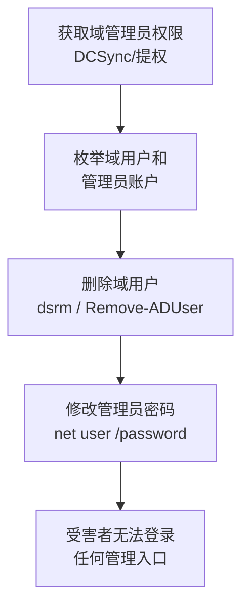

# 账户访问移除 (T1531)

## 一句话通俗理解

攻击者删掉你的账号或改掉你的密码，让你再也登录不了系统——自己家的门都进不去。

## 难度等级

⭐ 初级（新手可学）

## 技术描述

账户访问移除（T1531）是MITRE ATT&CK框架中影响战术的一种技术。攻击者通过删除、锁定或修改用户账户凭据，使合法用户无法访问系统或数据。

**通俗解释：**
想象一下，你下班回家发现门禁密码被人改了，你的工卡也被注销了，你站在公司门口却进不去——这就是账户访问移除。攻击者在入侵系统后，通过管理员权限批量删除或禁用用户账户、修改密码为随机值，让IT团队连自己的系统都登不进去，更别说恢复被加密的数据了。

**技术原理：**

1. 攻击者首先获取域管理员或本地管理员权限
2. 使用 Active Directory 管理工具或 `net user` 命令批量操作账户
3. 可能的操作包括：删除用户账户、修改密码为随机值、禁用账户、撤销访问权限
4. 在云环境中，攻击者可能通过IAM API删除用户或撤销API密钥

**用途与影响：**
该技术通常与其他影响技术配合使用。攻击者在部署勒索软件或擦除器后，通过删除管理员账户阻止IT团队登录恢复系统。如果受害者连管理入口都无法进入，那么备份恢复、杀毒清理等所有操作都无法进行。

## 子技术列表

**该技术没有子技术。**

## 攻击流程

### 典型攻击流程

```
获取域管理员权限 --> 枚举账户信息 --> 批量删除/禁用账户 --> 修改密码 --> 受害者无法登录
```



**步骤详解：**

1. **获取域管理员权限**
   - 通俗描述：攻击者先得到最高权限，才能批量操作所有用户
   - 技术细节：通过DCSync攻击获取域控凭据、利用AD CS漏洞（如ESC8）提权
   - 常用工具：Mimikatz（DCSync）、Impacket

2. **枚举账户信息**
   - 通俗描述：攻击者查看当前有哪些用户和管理员
   - 技术细节：使用 `net user /domain`、`Get-ADUser` 查询域用户列表
   - 常用工具：`net`、PowerShell AD模块

3. **批量删除/禁用账户**
   - 通俗描述：一次性删除或禁用所有用户账户
   - 技术细节：使用 `dsrm 用户DN` 删除用户，`Disable-ADAccount` 禁用账户
   - 常用工具：`dsrm`、`Remove-ADUser`、`Disable-ADAccount`

4. **修改密码**
   - 通俗描述：把管理员密码改成随机值，让管理员也登不进去
   - 技术细节：`net user administrator 随机密码$%^` 或 `Set-ADAccountPassword`
   - 常用工具：`net user`、`Set-ADAccountPassword`

5. **受害者无法登录**
   - 通俗描述：所有管理员都无法登录系统
   - 技术细节：RDP登录失败、远程管理工具认证失败
   - 常用工具：系统认证机制

## 真实案例

### 案例1：NotPetya (2017)

- **时间**: 2017年6月
- **目标**: 乌克兰及全球企业
- **攻击组织**: Sandworm（疑似俄罗斯背景）
- **手法**: NotPetya在加密系统后，使用 `net user` 命令删除或禁用本地管理员账户，同时修改系统账户凭据，使受害者即使愿意支付赎金也无法恢复系统。该操作由wiper组件的DLL加载后自动执行，针对域控制器执行 `dsrm` 命令批量删除域用户。IT管理员账号全部被禁用，组织完全丧失了对系统的控制权。
- **影响**: 全球超过2,000个组织的IT系统瘫痪，损失超100亿美元
- **参考链接**: [NotPetya - MITRE ATT&CK](https://attack.mitre.org/software/S0368/)

### 案例2：OlympicDestroyer - 平昌冬奥会 (2018)

- **时间**: 2018年2月
- **目标**: 2018年平昌冬奥会IT系统
- **攻击组织**: 疑似俄罗斯背景
- **手法**: 攻击者在部署破坏性载荷前，通过Active Directory管理工具批量禁用域用户账户，导致场馆IT系统和票务系统瘫痪数日。攻击者同时清除了大量管理员账户。由于管理员账户全部被禁用，IT恢复团队甚至无法登录域控制器来恢复系统，只能通过物理访问和本地管理员账号进行紧急恢复。
- **影响**: 冬奥会开幕当天核心IT系统瘫痪
- **参考链接**: [OlympicDestroyer - MITRE ATT&CK](https://attack.mitre.org/software/S0369/)

### 案例3：沙特阿美 Shamoon (2012)

- **时间**: 2012年8月
- **目标**: 沙特阿美石油公司
- **攻击组织**: APT33 (Elfin Team)
- **手法**: Shamoon擦除器在销毁数据后，进一步删除或禁用域控制器上的用户账户，阻止IT团队通过远程管理恢复系统。攻击者使用域管理员权限执行 `net group "Domain Admins" /delete` 等命令。沙特阿美被迫使用了1个月的时间来重建IT系统和恢复账户。
- **影响**: 30,000+台系统被销毁，业务中断数周
- **参考链接**: [Shamoon - MITRE ATT&CK](https://attack.mitre.org/software/S0140/)

### 案例4：Lotus Wiper - 委内瑞拉 (2025)

- **时间**: 2025年12月
- **目标**: 委内瑞拉国家石油公司（PDVSA）
- **攻击组织**: 未公开归因
- **手法**: Lotus擦除器的第二阶段（notesreg.bat）枚举所有用户并通过 `net user 用户名 随机密码` 更改密码，然后禁用所有网络接口，注销活跃会话，禁用缓存登录。这使得IT团队无法通过任何方式访问系统，即使物理访问也无法使用受影响的账户登录。
- **影响**: PDVSA交付系统瘫痪，全国能源运营受影响
- **参考链接**: [Lotus Wiper - Kaspersky](https://securelist.com/tr/lotus-wiper/119472/)

## 红队视角

> ⚠️ **免责声明**：以下内容仅用于合法的安全测试、渗透测试和教育目的。未经授权对他人系统进行测试是违法行为。

### 实战技巧

1. **非破坏性测试**
   在授权测试中，不要真的删除账户。可以创建新的测试账户然后删除它来模拟效果，或者使用 `-WhatIf` 参数预览操作结果。

2. **先枚举再动手**
   在执行账户操作前先使用 `net user /domain` 和 `net group "Domain Admins" /domain` 枚举目标环境中的账户结构，了解谁是最关键的管理员。

3. **保留逃生通道**
   测试环境中始终保留一个本地管理员账户（非域账户），防止域控制器操作失误导致自己被锁在外面。

### 常用工具

| 工具名称 | 用途 | 平台 | 链接 |
|----------|------|------|------|
| net | Windows用户和组管理 | Windows | 系统内置 |
| dsrm | 删除AD对象 | Windows | 系统内置 |
| PowerShell AD | Active Directory管理cmdlet | Windows | RSAT工具 |
| Impacket | AD协议操作工具包 | 跨平台 | https://github.com/fortra/impacket |
| Mimikatz | 凭据提取和DCSync | Windows | https://github.com/gentilkiwi/mimikatz |

### 注意事项

- 此技术的红队测试风险极高，删除账户操作可能造成不可逆的业务中断
- 测试前务必与客户确认逃生方案（如紧急管理账户和控制台访问）
- 建议使用专门的测试AD环境，而非生产环境

## 蓝队视角

### 检测要点

1. **用户删除事件监控**
   - 日志来源：Windows Event ID 4726（用户账户被删除）
   - 关注字段：执行删除操作的用户账户、被删除的用户名、删除时间
   - 异常特征：短时间内大量用户账户被删除

2. **用户禁用事件监控**
   - 日志来源：Windows Event ID 4725（用户账户被禁用）
   - 关注字段：执行禁用操作的用户账户
   - 异常特征：所有管理员账户同时被禁用、非工作时间大量禁用

3. **密码修改监控**
   - 日志来源：Windows Event ID 4723（用户修改自己密码）、4724（管理员重置用户密码）
   - 关注字段：谁修改了谁密码、修改源IP
   - 异常特征：管理员密码被非管理员修改、多个密码修改来源异常

### 监控建议

- 建立AD变更监控体系，对账户删除和禁用设置高优先级告警
- 对"Domain Admins"和"Enterprise Admins"组成员变更设置实时通知
- 保留至少一个不用于日常管理的"破门账户"（Break Glass Account），该账户审计全面、操作受限

## 检测建议

### 网络层检测

**检测方法：** 检测远程账户管理操作的网络流量

**具体规则/命令示例：**
```
# Suricata规则 - 检测AD远程管理命令
alert tcp $HOME_NET any -> $HOME_NET 445 (msg:"Remote AD User Deletion"; content:"|2f|domain"; nocase; content:"|75 73 65 72|"; nocase; sid:1000008; rev:1;)
```

### 主机层检测

**检测方法：** 监控AD账户变更事件

**Windows事件ID：**
- 事件ID 4720：用户账户被创建
- 事件ID 4725：用户账户被禁用
- 事件ID 4726：用户账户被删除
- 事件ID 4724：管理员重置用户密码
- 事件ID 4738：用户账户被修改

**具体命令示例：**
```powershell
# 检测账户删除事件
Get-WinEvent -FilterHashtable @{LogName='Security'; ID=4726} | Format-Table TimeCreated, Message -AutoSize

# 检测所有AD变更事件
Get-WinEvent -FilterHashtable @{LogName='Security'; ID=4720,4725,4726,4738} | Format-Table TimeCreated, Id, Message
```

### 应用层检测

**Sigma规则示例：**
```yaml
title: 检测大量用户账户被删除
status: experimental
description: 检测短时间内多个用户账户被批量删除的行为
logsource:
    category: process_creation
    product: windows
detection:
    selection:
        CommandLine|contains|all:
            - 'dsrm'
            - 'Remove-ADUser'
    condition: selection
    timeframe: 5m
level: high
tags:
    - attack.t1531
```

## 缓解措施

### 优先级1：关键措施

**措施名称：** 账户操作权限管控

**具体实施步骤：**
1. 实施最小权限原则，普通管理员不可删除其他管理员账户
2. 部署Privileged Access Management (PAM)方案保护高权限账户
3. 对Active Directory实施"安全管理员"分层模型（Tier Model）

### 优先级2：重要措施

**措施名称：** 多因素认证（MFA）

**具体实施步骤：**
1. 对所有管理员账户启用MFA
2. 对敏感操作（如删除账户、重置密码）要求MFA二次验证
3. 在云环境中启用IAM MFA和API密钥轮换

### 优先级3：建议措施

**措施名称：** 账户恢复准备

**具体实施步骤：**
1. 维护离线备份的域控制器快照（系统状态备份）
2. 保留Break Glass（应急管理）账户，密码密封保存
3. 定期测试账户恢复流程

### MITRE ATT&CK 缓解措施映射

| 缓解措施ID | 缓解措施名称 | 适用性 | 说明 |
|------------|-------------|--------|------|
| M1026 | Privileged Account Management | 适用 | PAM保护高权限账户 |
| M1032 | Multi-factor Authentication | 适用 | 管理员账户启用MFA |
| M1018 | User Account Management | 适用 | 实施Tier Model分层管理 |
| M1015 | Active Directory Configuration | 适用 | AD安全加固配置 |
| M1028 | Operating System Configuration | 部分适用 | 限制net命令的执行权限 |

## 动手实验

> ⚠️ **重要提示**：所有实验必须在隔离的实验室环境中进行，禁止对未授权的真实系统进行测试。

### 实验环境准备

**推荐靶场/实验平台：**

| 平台名称 | 类型 | 难度 | 链接 |
|----------|------|:----:|------|
| TryHackMe - Active Directory | 在线靶场 | 中级 | https://tryhackme.com/ |
| Hack The Box | 在线靶场 | 高级 | https://www.hackthebox.com/ |

**所需工具：**
- Windows Server（域控制器）
- Windows 10（域成员）
- PowerShell AD模块

**环境搭建：**
```powershell
# 在域控制器上安装AD DS角色
Install-WindowsFeature -Name AD-Domain-Services -IncludeManagementTools
```

### 实验1：AD用户管理操作（初级）

**实验目标：** 理解用户账户的基本管理操作

**实验步骤：**
1. 在AD测试环境中创建一个新用户：`New-ADUser -Name "TestUser" -SamAccountName "testuser" -UserPrincipalName "testuser@test.local"`
2. 启用用户：`Enable-ADAccount -Identity "testuser"`
3. 修改用户密码：`Set-ADAccountPassword -Identity "testuser" -Reset -NewPassword (ConvertTo-SecureString "NewP@ss123" -AsPlainText -Force)`
4. 禁用用户：`Disable-ADAccount -Identity "testuser"`
5. 删除用户：`Remove-ADUser -Identity "testuser" -Confirm:$false`

**预期结果：** 用户可以被创建、启用、禁用和删除

**学习要点：** 理解攻击者如何通过PowerShell批量操作AD账户

### 实验2：检测账户操作事件（中级）

**实验目标：** 学习通过事件日志检测AD账户操作

**实验步骤：**
1. 在域控制器上启用AD审计策略
2. 执行一系列用户操作（创建、修改密码、禁用、删除）
3. 查看Windows安全日志中的对应事件
4. 编写PowerShell脚本自动提取账户变更事件

**预期结果：** 所有操作都被记录在安全事件日志中

**学习要点：** 掌握AD账户操作的审计和检测方法

## 术语解释

| 术语 | 英文原名 | 通俗解释 |
|------|----------|----------|
| 域控制器 | Domain Controller (DC) | 管理网络中所有用户账户和密码的服务器，就像公司的HR部门 |
| Active Directory | Active Directory (AD) | Windows网络中的用户和资源管理系统，就像公司的员工名册 |
| 域管理员 | Domain Admin | 网络中最高权限的管理员，可以管理所有电脑和用户 |
| 凭据 | Credentials | 登录系统的用户名和密码组合，就像你的工号和门禁卡 |
| 删除账户 | Delete Account | 从系统中彻底移除用户账户，就像从花名册中划掉一个人的名字 |
| 禁用账户 | Disable Account | 临时停用账户但不删除，就像冻结门禁卡但卡还在 |
| 密码重置 | Password Reset | 强制更改用户的密码，就像换了一把新锁 |
| 应急账户 | Break Glass Account | 紧急情况下使用的特殊管理账户，密码密封保留，平时不用 |
| 用户主体名称 | User Principal Name (UPN) | 用户的登录名，格式为 user@domain.com |
| 安全标识符 | Security Identifier (SID) | Windows中每个用户和组的唯一身份编号，就像身份证号 |

## 参考资料

### 官方文档

- [MITRE ATT&CK - Account Access Removal](https://attack.mitre.org/techniques/T1531/)

### 安全报告

- [NotPetya Analysis - Welivesecurity](https://www.welivesecurity.com/2017/07/04/analysis-of-telebots-cunning-connection/)
- [OlympicDestroyer Report - Welivesecurity](https://www.welivesecurity.com/2018/03/13/olympicdestroyer-takes-next-step/)
- [Shamoon Report - Mandiant](https://www.mandiant.com/resources/shamoon-2-delivering-distraction)
- [Lotus Wiper - Kaspersky](https://securelist.com/tr/lotus-wiper/119472/)

### 工具与资源

- [Microsoft AD Documentation](https://learn.microsoft.com/windows-server/identity/ad-ds/) - AD官方文档
- [PowerShell AD Module](https://learn.microsoft.com/powershell/module/activedirectory/) - AD管理cmdlet

### 学习资料

- [Microsoft - AD Security Best Practices](https://learn.microsoft.com/windows-server/identity/ad-ds/plan/security-best-practices) - AD安全最佳实践
- [CISA - Active Directory Security](https://www.cisa.gov/news-events/analysis-reports/ar22-099a) - AD安全指南
