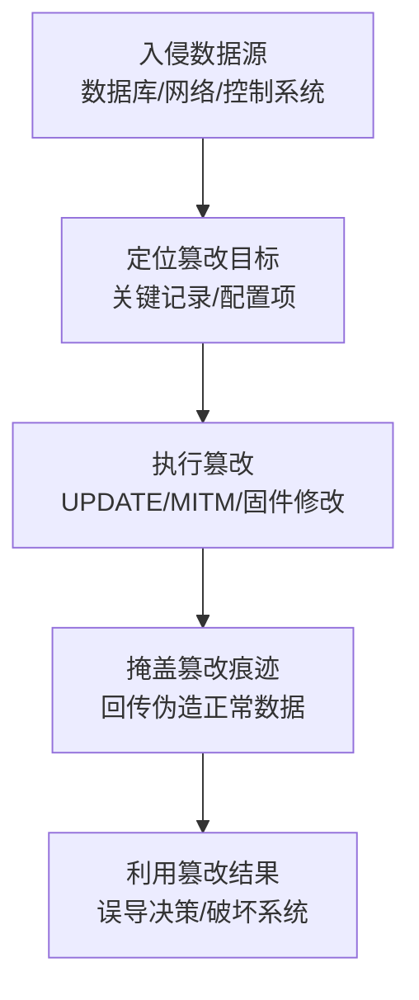

# 数据篡改 (T1565)

## 一句话通俗理解

不删你的数据，也不锁你的文件——而是偷偷把数据改掉，让你用"假数据"做决策，你还不知道被改了。

## 30秒速查卡

| 维度 | 你需要知道的 |
|------|-------------|
| 这是什么？ | 数据篡改（T1565）是攻击者用来破坏目标系统或数据的技术 |
| 为什么危险？ | 攻击者可以对目标造成不可逆的破坏，影响组织正常运营 |
| 谁需要关心？ | 安全运维团队、系统管理员、业务负责人 |
| 你的第一步防御 | 定期备份数据并测试恢复流程，确保备份与生产环境隔离 |
| 如果只做一件事 | 监控异常的数据删除或修改行为，设置关键文件完整性告警 |

## 难度等级

⭐⭐ 中级（需要一定基础）

## 技术描述

数据篡改（T1565）是MITRE ATT&CK框架中影响战术的一种技术。攻击者在未经授权的情况下插入、删除或修改数据，以产生预期效果或掩盖其他活动。

**通俗解释：**
想象有人潜入公司，不是偷走财务报表，也不是销毁它——而是悄悄把上面的数字改了几个零。你第二天正常上班，完全不知道数据被篡改了，拿着这份被改过的报表做决策。数据篡改就是这样——攻击者不破坏数据本身，而是改动其中的关键信息，让你做出错误的判断或操作。这是影响战术中最高级、最隐蔽的方式之一。

**技术原理：**

1. 攻击者通过入侵获得对数据源（数据库、配置文件、网络流量）的访问权限
2. 根据攻击目标选择要篡改的数据：业务数据、配置文件、网络传输中的数据
3. 对数据进行精细修改（插入、删除或替换），使修改尽可能隐蔽
4. 在某些场景中，篡改实时数据的同时回传伪造的正常数据，掩盖篡改行为

**用途与影响：**
数据篡改分为三个场景：篡改存储的数据（金融记录造假）、篡改传输中的数据（中间人攻击修改网页内容）、篡改实时系统的数据（工业控制系统数据篡改）。在国家级APT攻击中，数据篡改常被用于操控金融系统、工业控制系统或政治竞选数据。

## 子技术列表

**该技术共有 3 个子技术：**

| 子技术ID | 中文名称 | 通俗解释 |
|----------|----------|----------|
| T1565.001 | 存储数据篡改 | 修改数据库或文件中的已存储数据 |
| T1565.002 | 传输数据篡改 | 在网络传输过程中拦截并修改数据 |
| T1565.003 | 实时系统数据篡改 | 修改工业控制系统或嵌入式系统的实时数据 |

<details>
<summary><strong>展开查看各子技术详细说明</strong></summary>

各子技术详细说明请参阅独立文档：

- [T1565.001 - 存储数据篡改](./T1565/T1565.001-Stored-Data-Manipulation.md) — 改掉硬盘上或数据库里存着的数据
- [T1565.002 - 传输数据篡改](./T1565/T1565.002-Transmitted-Data-Manipulation.md) — 数据在网络上传输时被拦下来改掉再发出去
- [T1565.003 - 实时系统数据篡改](./T1565/T1565.003-Real-time-Data-Manipulation.md) — 修改工业控制系统或医疗设备的运行数据，非常危险

</details>

## 攻击流程

### 典型攻击流程

```
入侵数据源 --> 定位篡改目标 --> 执行数据篡改 --> 掩盖篡改痕迹 --> 利用篡改结果
```



**步骤详解：**

1. **入侵数据源**
   - 通俗描述：攻击者先进入存储或处理数据的系统
   - 技术细节：通过SQL注入入侵数据库、通过网络嗅探劫持网络连接、通过供应链攻击感染工业控制软件
   - 常用工具：SQL注入工具、中间人攻击工具包

2. **定位篡改目标**
   - 通俗描述：找到哪些数据被篡改后影响最大
   - 技术细节：定位金融交易表中的关键记录、定位配置文件中关键参数、定位PLC控制器的控制逻辑
   - 常用工具：数据库查询工具、逆向分析工具

3. **执行篡改**
   - 通俗描述：修改目标数据
   - 技术细节：执行SQL UPDATE语句修改数据库记录、使用网络嗅探工具修改传输数据包、修改PLC固件逻辑
   - 常用工具：SQL语句、Ettercap（MITM）、自定义固件修改工具

4. **掩盖篡改痕迹**
   - 通俗描述：让系统看起来一切正常
   - 技术细节：回传伪造的正常传感器数据覆盖异常数据、删除数据库审计日志
   - 常用工具：数据回传工具

5. **利用篡改结果**
   - 通俗描述：篡改数据开始发挥作用
   - 技术细节：被篡改的金融数据导致错误交易、被修改的工业控制数据导致设备损坏
   - 常用工具：无（攻击效果）

## 真实案例

### 案例1：Stuxnet - 伊朗核设施 (2010) - RTOS Manipulation

- **时间**: 2009-2010年
- **目标**: 伊朗纳坦兹核设施的铀浓缩离心机
- **攻击组织**: 疑似美国/以色列联合开发（奥林匹克运动会行动）
- **手法**: Stuxnet感染西门子Step 7工业控制系统后，修改PLC（可编程逻辑控制器）的运行时数据。它向离心机发送异常转速指令（使离心机超速至损毁点），同时向监控系统回传伪造的正常运行数据，掩盖离心机因过速而物理损毁的证据。Stuxnet还巧妙利用了"中间人攻击"的方式篡改PLC和监控系统之间的通信数据。这是T1565.003（RTOS Data Manipulation）的巅峰之作。
- **影响**: 约1,000台离心机物理损毁，伊朗核计划被延缓数年
- **参考链接**: [Stuxnet - MITRE ATT&CK](https://attack.mitre.org/software/S0603/)

### 案例2：XZ Utils 供应链后门 - Linux核心库代码篡改 (2024) - Stored Data

- **时间**: 2024年3月
- **目标**: Linux生态系统（Debian、Fedora、openSUSE等发行版）
- **攻击组织**: "Jia Tan"（疑似国家级背景，具体归属未公开）
- **手法**: 攻击者通过长达两年的社会工程活动，逐渐获得XZ Utils（广泛使用的数据压缩库）的维护者权限。在版本5.6.0和5.6.1中，攻击者在源代码tarball和构建脚本中植入了多阶段后门代码。恶意代码篡改了liblzma库的构建过程，在编译阶段注入恶意二进制对象，最终修改了OpenSSH守护进程的行为——使持有特定Ed448私钥的攻击者能够绕过SSH认证执行远程代码。攻击者还通过模糊的测试文件和良性描述的提交记录掩盖篡改行为，是对开源软件供应链数据进行篡改的经典案例。这属于T1565.001（Stored Data Manipulation），被NVD评为CVSS 10.0最高严重等级。
- **影响**: 全球数百万Linux系统面临后门风险，所幸在被广泛部署前被发现；引发全行业对开源软件供应链完整性的重新评估
- **参考链接**: [CVE-2024-3094 - NVD](https://nvd.nist.gov/vuln/detail/CVE-2024-3094) | [XZ Utils Backdoor Analysis - Akamai](https://www.akamai.com/blog/security-research/critical-linux-backdoor-xz-utils-discovered-what-to-know)

### 案例3：FrostyGoop - 乌克兰供暖系统数据篡改 (2024) - RTOS Data Manipulation

- **时间**: 2024年1月
- **目标**: 乌克兰利沃夫市Lvivteploenergo区域供暖公司
- **攻击组织**: 疑似俄罗斯背景（具体组织未确认）
- **手法**: 攻击者利用Mikrotik路由器漏洞于2023年4月获得初始访问权限，部署Webshell窃取凭据。2024年1月，攻击者激活FrostyGoop恶意软件——这是首个通过Modbus TCP协议直接与ICS（工业控制系统）交互的ICS专用恶意软件。FrostyGoop向ENCO供暖控制器发送恶意Modbus命令，篡改控制器中保存的温度寄存器数据，使控制器误以为水温已达标而停止加热。攻击者将固件降级到缺乏监控功能的旧版本以掩盖篡改行为。受害系统在零下温度下被迫向600多栋建筑泵送冷水。这属于T1565.003（实时系统数据篡改）。
- **影响**: 利沃夫市约100,000居民在冬季48小时内无供暖和热水供应
- **参考链接**: [FrostyGoop ICS Malware - Dragos](https://www.dragos.com/blog/protect-against-frostygoop-ics-malware-targeting-operational-technology) | [FrostyGoop Analysis - The Record](https://therecord.media/frostygoop-malware-ukraine-heat)

### 案例4：Triton / Trisis - 石化设施 (2017) - RTOS Manipulation

- **时间**: 2017年12月
- **目标**: 中东某石化设施的Schneider Electric Triconex安全仪表系统（SIS）
- **攻击组织**: 疑似俄罗斯背景（Xenotime / C0029）
- **手法**: 攻击者部署Triton（Trisis）框架，修改Triconex安全控制器的固件和运行时数据。该恶意软件能够修改安全仪表系统的逻辑，在保持安全功能表观正常的同时禁用关键安全保护。攻击者通过篡改PLC的运行时数据，使安全仪表系统在事故发生时不会触发紧急停机，可能造成物理设备损毁和人员伤亡。
- **影响**: 石化设施面临严重安全风险，该事件导致整个行业重新评估ICS安全
- **参考链接**: [Triton - MITRE ATT&CK](https://attack.mitre.org/software/S1009/)

## 红队视角

> ⚠️ **免责声明**：以下内容仅用于合法的安全测试、渗透测试和教育目的。未经授权对他人系统进行测试是违法行为。

### 实战技巧

1. **数据库篡改测试**
   在授权测试中，使用 `UPDATE` 语句修改测试数据库中的非生产记录。验证应用程序是否能够检测到数据完整性被破坏。

2. **中间人测试**
   使用Ettercap或Bettercap在可控网络环境中测试应用层数据传输的完整性。检查是否存在TLS加密缺失、证书固定等安全机制。

3. **ICS安全测试**
   在隔离的PLC测试环境中，模拟篡改控制逻辑和传感器数据。验证SCADA系统是否能够检测到异常数据模式。

### 常用工具

| 工具名称 | 用途 | 平台 | 链接 |
|----------|------|------|------|
| Ettercap | 中间人攻击测试 | 跨平台 | https://www.ettercap-project.org/ |
| Bettercap | 网络攻击和监控框架 | 跨平台 | https://www.bettercap.org/ |
| Burp Suite | Web流量拦截和修改 | Java | https://portswigger.net/burp |
| PLC攻击框架 | ICS安全测试工具 | 跨平台 | GRASSMARLIN、OpenPLC |
| SQLMap | SQL注入自动化 | 跨平台 | https://sqlmap.org/ |

### 注意事项

- 数据篡改测试风险极高，被篡改的数据可能传播到下游系统
- 测试必须在完全隔离的非生产环境中进行
- ICS/PLC测试需要专门的硬件和仿真环境

## 蓝队视角

### 检测要点

1. **数据库完整性监控**
   - 日志来源：数据库审计日志、事务日志
   - 关注字段：异常的大批量UPDATE操作、非工作时间的数据修改
   - 异常特征：没有对应事务审计的批量UPDATE、非业务逻辑的SQL操作

2. **网络传输完整性**
   - 日志来源：网络流量分析、IDS/IPS
   - 关注字段：非预期的HTTP响应修改、DNS响应异常
   - 异常特征：HTTP响应内容与请求的预期不符、未加密的敏感数据修改

3. **工业控制系统数据异常**
   - 日志来源：SCADA日志、PLC事件日志
   - 关注字段：异常的传感器读数、控制指令与反馈不匹配
   - 异常特征：传感器数据与物理逻辑不符（如压力持续升高但安全阀不动作）

### 监控建议

- 部署数据库活动监控（DAM）方案，检测SQL注入后的数据篡改行为
- 实施文件完整性监控（FIM），覆盖关键配置文件和系统文件
- 对ICS网络实施深度包检测（DPI），建立控制指令的基线

## 检测建议

### 网络层检测

**检测方法：** 检测中间人攻击流量

**具体规则/命令示例：**
```
# Suricata规则 - 检测ARP欺骗（中间人攻击前兆）
alert arp $HOME_NET any -> $HOME_NET any (msg:"ARP Cache Poisoning Detected"; arp.opcode:2; arp.dst.proto_ipv4:!arp.src.proto_ipv4; sid:1000009; rev:1;)
```

### 主机层检测

**检测方法：** 监控数据库事务日志

**数据库层审计：**
- 对关键表启用变更数据捕获（CDC）
- 审计所有UPDATE/DELETE操作的执行者和执行时间
- 监控非应用层直接对数据库的SQL操作

**具体命令示例：**
```sql
-- SQL Server 启用审计
CREATE SERVER AUDIT Data_Integrity_Audit TO FILE (FILEPATH = 'C:\Audit\');
ALTER SERVER AUDIT Data_Integrity_Audit WITH (STATE = ON);
```

### 应用层检测

**用人话说：** 这条规则在检测数据篡改攻击——这是影响战术中最隐蔽的方式。攻击者不删除数据也不加密勒索，而是偷偷修改关键数据让你用"假数据"做决策。有三种场景：篡改存储数据（改数据库里账户余额、财务记录）、篡改传输数据（中间人劫持改网络包内容）、篡改实时系统数据（修改工业控制系统的传感器读数）。检测的关键信号是：数据库出现非业务逻辑的批量UPDATE操作、网络中出现ARP欺骗或DNS劫持的迹象、或者ICS系统中的传感器数据与物理逻辑不一致（如压力持续升高但安全仪表不动作）。数据篡改最难发现——因为你根本不知道数据被改过。

**Sigma规则示例：**
```yaml
title: 检测数据库批量数据修改
status: experimental
description: 检测数据库中的大批量UPDATE/DELETE操作
logsource:
    category: database
    product: mssql
detection:
    selection:
        CommandType: "UPDATE"
        RowsAffected: ">= 1000"
        LoginName|contains:
            - 'sa'
            - 'admin'
    condition: selection
    timeframe: 5m
level: high
tags:
    - attack.t1565
```

## 缓解措施

### 优先级1：关键措施

**措施名称：** 数据完整性保护

**具体实施步骤：**
1. 对关键数据文件实施最小权限原则，限制非授权写入
2. 数据库启用行级安全（RLS）和审计功能
3. 实施文件完整性监控（FIM），覆盖关键系统文件

### 优先级2：重要措施

**措施名称：** 传输数据完整性

**具体实施步骤：**
1. 全网实施TLS/SSL加密传输
2. 使用一致性哈希或数字签名验证传输数据的完整性
3. 实施DNSSEC防止DNS欺骗

### 优先级3：建议措施

**措施名称：** ICS/工业控制安全

**具体实施步骤：**
1. 对RTOS和ICS设备实施网络分段，隔离于通用IT网络
2. 定期进行数据完整性检查和校验和比对
3. 实施变更管理流程，所有数据修改需经审批和审计

### MITRE ATT&CK 缓解措施映射

| 缓解措施ID | 缓解措施名称 | 适用性 | 说明 |
|------------|-------------|--------|------|
| M1022 | Restrict File and Directory Permissions | 适用 | 限制数据文件写入权限 |
| M1029 | Remote Data Storage | 部分适用 | 远程不可变存储 |
| M1030 | Network Segmentation | 适用 | ICS网络隔离 |
| M1041 | Encrypt Sensitive Information | 适用 | 数据加密传输和存储 |
| M1047 | Audit | 适用 | 数据库变更审计 |

## 动手实验

> ⚠️ **重要提示**：所有实验必须在隔离的实验室环境中进行，禁止对未授权的真实系统进行测试。

### 实验环境准备

**推荐靶场/实验平台：**

| 平台名称 | 类型 | 难度 | 链接 |
|----------|------|:----:|------|
| TryHackMe - Web Hacking | 在线靶场 | 中级 | https://tryhackme.com/ |
| ICS-CERT VDP | 虚拟靶场 | 高级 | https://ics-cert-training.inl.gov/ |
| PentesterLab | 在线靶场 | 中级 | https://pentesterlab.com/ |

**所需工具：**
- MySQL/PostgreSQL（数据库测试）
- Burp Suite（中间人测试）
- Wireshark（流量分析）

### 实验1：SQL注入修改数据库（初级）

**实验目标：** 理解通过SQL注入修改数据库数据的方法

**实验步骤：**
1. 在DVWA靶场中找到SQL注入漏洞
2. 发送SQL注入查询获取数据库结构
3. 使用 `UPDATE` 语句修改数据库中的数据
4. 验证数据已被修改

**预期结果：** 通过SQL注入成功修改了数据库中的记录

**学习要点：** 理解为什么参数化查询是防止SQL注入的关键

### 实验2：Burp Suite 拦截和修改请求（中级）

**实验目标：** 学习通过中间人方式修改HTTP请求和响应

**实验步骤：**
1. 配置Burp Suite作为浏览器代理
2. 拦截一个Web应用的登录请求
3. 修改请求参数（如修改用户ID或金额）
4. 观察应用对篡改数据的响应

**预期结果：** 应用接受了被篡改的数据（如果缺乏完整性校验）

**学习要点：** 理解为什么需要对关键请求参数进行签名或校验

## 术语解释

| 术语 | 英文原名 | 通俗解释 |
|------|----------|----------|
| 中间人攻击 | Man-in-the-Middle (MITM) | 攻击者悄悄站在你和服务器之间，你发给服务器的数据他先看一遍再转交 |
| 存储数据 | Stored Data | 保存在硬盘或数据库中的数据，像存在文件柜里的文件 |
| 传输数据 | Transmitted Data | 在网络上传输的数据，像寄出的信件 |
| 实时系统 | Real-Time Operating System (RTOS) | 必须实时响应的系统，如工业控制、汽车电脑 |
| PLC | Programmable Logic Controller | 可编程逻辑控制器，工业现场里控制机器的电脑 |
| SCADA | Supervisory Control and Data Acquisition | 工业控制系统的监控和数据采集系统 |
| 固件 | Firmware | 设备内置的"底层软件"，像设备的操作系统 |
| 数字签名 | Digital Signature | 数据的防伪标签，接收方验证签名确认数据没有被改过 |
| DPI | Deep Packet Inspection | 深度包检测，检查网络数据包完整内容的防火墙技术 |
| 参数化查询 | Parameterized Query | 一种安全的数据库查询方式，用户输入的内容不会被当成SQL代码执行 |

## 参考资料

### 官方文档

- [MITRE ATT&CK - Data Manipulation](https://attack.mitre.org/techniques/T1565/)
- [MITRE - Stored Data Manipulation (T1565.001)](https://attack.mitre.org/techniques/T1565/001/)
- [MITRE - Transmitted Data Manipulation (T1565.002)](https://attack.mitre.org/techniques/T1565/002/)
- [MITRE - RTOS Data Manipulation (T1565.003)](https://attack.mitre.org/techniques/T1565/003/)

### 安全报告

- [Stuxnet Analysis - Langner](https://www.langner.com/wp-content/uploads/2017/03/to-kill-a-centrifuge.pdf)
- [XZ Utils Backdoor Analysis - Akamai](https://www.akamai.com/blog/security-research/critical-linux-backdoor-xz-utils-discovered-what-to-know)
- [FrostyGoop ICS Malware Report - Dragos](https://www.dragos.com/blog/protect-against-frostygoop-ics-malware-targeting-operational-technology)
- [Triton/Trisis Analysis - Mandiant](https://www.mandiant.com/resources/triton-malware-what-it-targets-and-how-to-defend)

### 工具与资源

- [Ettercap](https://www.ettercap-project.org/) - 中间人攻击测试工具
- [Bettercap](https://www.bettercap.org/) - 网络攻击和监控框架
- [GRASSMARLIN](https://github.com/nsacyber/GRASSMARLIN) - ICS网络分析工具

### 学习资料

- [OWASP - Data Integrity](https://owasp.org/www-project-data-integrity/) - 数据完整性安全
- [CISA - ICS Security](https://www.cisa.gov/topics/industrial-control-systems) - 工业控制系统安全
