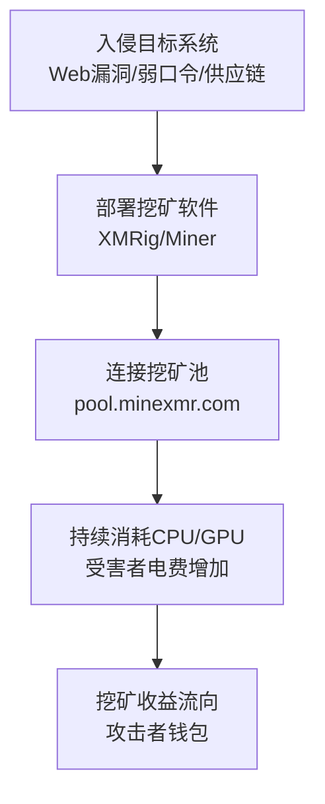

# 资源劫持 (T1654)

## 一句话通俗理解

你的电脑在帮别人挖矿赚钱——CPU狂转、电费暴涨，但你一分钱也拿不到。

## 30秒速查卡

| 维度 | 你需要知道的 |
|------|-------------|
| 这是什么？ | 资源劫持（T1654）是攻击者用来破坏目标系统或数据的技术 |
| 为什么危险？ | 攻击者可以对目标造成不可逆的破坏，影响组织正常运营 |
| 谁需要关心？ | 安全运维团队、系统管理员、业务负责人 |
| 你的第一步防御 | 定期备份数据并测试恢复流程，确保备份与生产环境隔离 |
| 如果只做一件事 | 监控异常的数据删除或修改行为，设置关键文件完整性告警 |

## 难度等级

⭐⭐ 中级（需要一定基础）

## 技术描述

资源劫持（T1654）是MITRE ATT&CK框架中影响战术的一种技术。攻击者未经授权使用被攻陷系统的计算资源，通常用于挖掘加密货币、发起DDoS攻击或带宽消耗操作。

**通俗解释：**
想象有人偷偷在你的电脑上装了一个"挖矿程序"，你的电脑CPU一直全速运转、风扇嗡嗡响、电费蹭蹭涨，但挖出来的加密货币全进了别人的口袋——这就是资源劫持。攻击者不偷你的数据、不加密你的文件，而是利用你的计算资源来赚钱。在云环境中，攻击者甚至可能用你的云账号启动大量昂贵的GPU实例来挖矿或进行AI模型训练，让你月底收到天价账单。

**技术原理：**

1. 攻击者通过入侵获得目标系统的执行权限（Web漏洞、弱口令、供应链攻击）
2. 在目标系统上部署资源密集型程序（通常是加密货币挖矿软件）
3. 挖矿软件连接到攻击者控制的挖矿池（Mining Pool），持续运行
4. 受害者系统的CPU/GPU使用率持续飙升，电费增加
5. 攻击者将挖矿所得汇集到自己的钱包地址

**用途与影响：**
资源劫持主要用于获取经济利益（挖矿收益），或在僵尸网络中使用被劫持的带宽发起DDoS攻击。2025年，基于云环境的资源劫持攻击显著增加，攻击者利用被攻陷的云账户启动GPU实例进行AI模型训练或密码破解。

## 子技术列表

**该技术共有 2 个子技术：**

| 子技术ID | 中文名称 | 通俗解释 |
|----------|----------|----------|
| T1654.001 | 计算资源劫持 | 利用受害者的CPU/GPU进行挖矿或计算任务 |
| T1654.002 | 带宽资源劫持 | 利用受害者的网络带宽进行DDoS或流量转发 |

<details>
<summary><strong>展开查看各子技术详细说明</strong></summary>

各子技术详细说明请参阅独立文档：

- [T1654.001 - 计算资源劫持](./T1654/T1654.001-Compute-Resource-Hijacking.md) — 用你的电脑CPU/GPU帮攻击者挖矿
- [T1654.002 - 带宽资源劫持](./T1654/T1654.002-Bandwidth-Resource-Hijacking.md) — 用你的网络带宽帮攻击者发动攻击

</details>

## 攻击流程

### 典型攻击流程

```
入侵目标系统 --> 部署挖矿软件 --> 连接挖矿池 --> 持续挖矿 --> 获利
```



**步骤详解：**

1. **入侵目标系统**
   - 通俗描述：攻击者先要进到目标系统里
   - 技术细节：利用Web应用漏洞上传webshell、通过弱口令SSH/RDP爆破、供应链污染（污染开源包）
   - 常用工具：漏洞扫描器、SQLMap、Hydra（爆破）

2. **部署挖矿软件**
   - 通俗描述：把挖矿程序上传到目标系统并运行
   - 技术细节：下载XMRig等挖矿程序到目标系统，配置挖矿池地址和钱包地址，设置挖矿程序为服务实现持久化
   - 常用工具：XMRig、wget/curl下载、计划任务/服务持久化

3. **连接挖矿池**
   - 通俗描述：挖矿软件连接到挖矿池开始工作
   - 技术细节：挖矿软件通过stratum协议连接挖矿池（如pool.minexmr.com:4444），开始提交工作量证明
   - 常用工具：挖矿池协议

4. **持续消耗资源**
   - 通俗描述：挖矿软件一直占用CPU/GPU
   - 技术细节：挖矿软件持续运行，CPU使用率保持在80-100%，系统变慢，电费增加
   - 常用工具：挖矿程序运行时

5. **攻击者获利**
   - 通俗描述：挖到的虚拟货币进入攻击者的钱包
   - 技术细节：挖矿池根据贡献的计算量分配加密货币，定期汇入攻击者的钱包地址
   - 常用工具：加密货币钱包

## 真实案例

### 案例1：Drive-by Cryptojacking - Coinhive (2017-2019)

- **时间**: 2017年-2019年
- **目标**: 全球访问植入Coinhive JavaScript挖矿脚本的网站用户
- **攻击组织**: 各类网站运营者和攻击者
- **手法**: Coinhive提供的JavaScript挖矿脚本在被嵌入网站后，访问该网站的用户浏览器会使用CPU资源挖掘Monero加密货币。攻击者入侵高流量网站植入该脚本，利用大量访客的计算资源。2017年底，Coinhive脚本出现在包括政府网站、视频网站和CDN（如Pirate Bay）在内的大量站点上。据估计，全球有数亿台设备在不知情的情况下参与了挖矿。这是Compute Resource Hijacking（T1654.001）的典型Web端实现。
- **影响**: 数亿用户CPU被劫持，浏览器性能严重下降
- **参考链接**: [Cryptojacking - CISA](https://www.cisa.gov/news-events/alerts/2018/02/cryptojacking-alert)

### 案例2：TeamTNT 云环境挖矿 (2020-2021)

- **时间**: 2020年-2021年
- **目标**: 云环境中未保护的Docker和Kubernetes集群
- **攻击组织**: TeamTNT
- **手法**: TeamTNT组织扫描互联网上暴露的Docker API端口（2375/2376），利用未认证的Docker守护进程部署挖矿容器。攻击者使用masscan和zmap扫描大量IP段，自动部署XMRig挖矿软件挖掘Monero。TeamTNT还利用Kubernetes集群的未授权API，在Pod中运行挖矿进程，劫持云租户的计算资源。TeamTNT同时具备蠕虫式自传播能力，会扫描内网中的其他Docker主机。
- **影响**: 数千个未保护的Docker和K8s集群被入侵，云账单飙升
- **参考链接**: [TeamTNT - MITRE ATT&CK](https://attack.mitre.org/groups/G0139/)

### 案例3：Mirai 僵尸网络 - 带宽劫持 (2016-至今)

- **时间**: 2016年-至今
- **目标**: IoT设备（摄像头、路由器、DVR）
- **攻击组织**: 非特定组织
- **手法**: Mirai恶意软件感染弱口令保护的IoT设备后，将这些设备组建为僵尸网络。被感染的设备的大部分网络带宽被劫持用于发动大规模DDoS攻击。2016年Dyn DNS攻击正是由Mirai僵尸网络发起，每台受感染设备向目标发送大量DNS查询流量，耗尽目标网络带宽。Mirai的源代码在2016年被公开后，衍生出大量变种，2025-2026年仍有Mirai变种在活跃。
- **影响**: 多次大规模DDoS攻击导致全球互联网服务中断
- **参考链接**: [Mirai Botnet - MITRE ATT&CK](https://attack.mitre.org/software/S0585/)

### 案例4：PyPI & npm 供应链挖矿 (2022-至今)

- **时间**: 2022年-至今
- **目标**: 使用受污染开源包的应用服务器
- **攻击组织**: 各类网络犯罪团伙
- **手法**: 攻击者向PyPI、npm等包管理平台上传包含挖矿载荷的恶意包。这些包在安装或运行时静默部署XMRig挖矿软件，消耗运行这些应用的服务器CPU资源。部分恶意包伪装为流行库的同形异义词（Typosquatting，如伪装成"requests"的"reqeusts"），开发者在不知情的情况下引入依赖。2025年，此类攻击持续增长，攻击者开始使用AI生成的包名来绕过检测。
- **影响**: 大量开发者和企业服务器被用于挖矿
- **参考链接**: [PyPI Cryptojacking - Sonatype](https://blog.sonatype.com/cryptojacking-campaigns-target-pypi-ecosystem)

## 红队视角

> ⚠️ **免责声明**：以下内容仅用于合法的安全测试、渗透测试和教育目的。未经授权对他人系统进行测试是违法行为。

### 实战技巧

1. **挖矿程序伪装**
   将挖矿程序重命名为系统进程名称（如 `svchost.exe`、`syslogd`），使用数字签名伪装。挖矿程序路径设置为系统目录（如 `C:\Windows\System32\`）。

2. **CPU使用率控制**
   配置挖矿程序的CPU使用率上限（如50-60%），避免100%占用引起用户注意。使用 `--max-cpu-usage=50` 参数限制资源消耗。

3. **持久化配置**
   将挖矿程序注册为系统服务或计划任务，设置自动重启策略。使用双重备份——即使一个被删，另一个能自动恢复。

### 常用工具

| 工具名称 | 用途 | 平台 | 链接 |
|----------|------|------|------|
| XMRig | Monero挖矿软件 | 跨平台 | https://github.com/xmrig/xmrig |
| masscan | 大规模端口扫描 | 跨平台 | https://github.com/robertdavidgraham/masscan |
| zmap | 互联网级扫描器 | 跨平台 | https://zmap.io/ |
| Docker | 容器部署挖矿程序 | 跨平台 | https://www.docker.com/ |

### 注意事项

- 挖矿测试的收益非常小（测试环境的计算能力有限），不要期望有任何经济回报
- 测试挖矿程序时应使用仅用于测试的专用钱包地址
- 注意云服务商的AUP（可接受使用政策），很多云服务商禁止挖矿活动

## 蓝队视角

### 检测要点

1. **CPU/GPU使用率异常**
   - 日志来源：系统监控工具（Prometheus、Zabbix、Task Manager）
   - 关注字段：CPU使用率持续80%以上、GPU使用率异常
   - 异常特征：非业务时间段的CPU占用突增、进程CPU使用率与业务负载不匹配

2. **挖矿进程检测**
   - 日志来源：Sysmon Event ID 1、进程列表
   - 关注字段：进程名（xmrig、minerd、cgminer等）、命令行中包含挖矿池地址
   - 异常特征：未知进程大量占用CPU、进程名伪装但行为异常

3. **挖矿池网络连接**
   - 日志来源：防火墙日志、DNS日志、网络流量分析
   - 关注字段：对已知挖矿池域名（pool.minexmr.com、supportxmr.com等）的连接
   - 异常特征：内部服务器对外部挖矿池的频繁连接

### 监控建议

- 建立CPU/GPU使用率基线，超过150%基线时告警
- 对已知挖矿池域名（minexmr、supportxmr、nanopool等）设置DNS黑名单
- 在云环境中设置资源使用预算告警，监控异常的实例启动和GPU使用

## 检测建议

### 网络层检测

**检测方法：** 检测挖矿池的网络连接

**具体规则/命令示例：**
```
# Suricata规则 - 检测到挖矿池的连接
alert tcp $HOME_NET any -> $EXTERNAL_NET 4444 (msg:"Potential Cryptomining Pool Connection"; content:"stratum"; nocase; sid:1000010; rev:1;)

# Suricata规则 - DNS查询挖矿池域名
alert udp $HOME_NET any -> $DNS_SERVERS 53 (msg:"Cryptomining Pool DNS Query"; content:"minexmr"; nocase; sid:1000011; rev:1;)
```

### 主机层检测

**检测方法：** 监控CPU使用率和挖矿进程

**具体命令示例：**
```bash
# Linux - 查看CPU使用率最高的进程
ps aux --sort=-%cpu | head -10

# 检查已知挖矿进程
ps aux | grep -E 'xmrig|minerd|cgminer|minergate'

# Windows - 使用PowerShell检查CPU使用率
Get-Process | Sort-Object CPU -Descending | Select-Object -First 10 Name, CPU, WorkingSet
```

### 应用层检测

**用人话说：** 这条规则在检测资源劫持——攻击者偷偷用你的电脑挖矿或者用你的带宽攻击别人。挖矿劫持是最常见的：攻击者入侵服务器后部署XMRig挖门罗币，你的CPU一直100%狂转、电费暴涨但币都进了别人的钱包。检测的关键信号是：CPU使用率持续80%以上但业务负载没有增加、进程列表中看到xmrig/minerd/cgminer等挖矿进程、服务器对挖矿池域名（pool.minexmr.com等）有频繁连接。带宽劫持则是攻击者用你的服务器当DDoS跳板，你的出站流量突然暴增但业务量没变化。在云环境中，劫持更危险——攻击者可能用你的云账号启动大量GPU实例挖矿或训练AI，留下天价账单。

**Sigma规则示例：**
```yaml
title: 检测加密货币挖矿进程
status: experimental
description: 检测系统中运行的加密货币挖矿相关进程
logsource:
    category: process_creation
    product: windows
detection:
    selection:
        Image|endswith:
            - '\xmrig.exe'
            - '\minerd.exe'
            - '\cgminer.exe'
            - '\minergate.exe'
            - '\ccminer.exe'
    condition: selection
level: high
tags:
    - attack.t1654
```

## 缓解措施

### 优先级1：关键措施

**措施名称：** 阻止挖矿池通信

**具体实施步骤：**
1. 在网络防火墙上阻止对已知挖矿池域名的访问
2. 使用DNS过滤阻止挖矿池域名的解析
3. 阻止stratum协议（端口4444）的出站流量

### 优先级2：重要措施

**措施名称：** 容器和云环境安全

**具体实施步骤：**
1. 保护Docker和Kubernetes API的访问权限，禁止暴露到公网
2. 实施容器安全策略，限制容器可使用的CPU/GPU资源上限
3. 对云环境资源设置预算告警，检测异常的实例使用

### 优先级3：建议措施

**措施名称：** 端点保护和供应链安全

**具体实施步骤：**
1. 在浏览器中启用广告拦截和脚本控制扩展防止Drive-by挖矿
2. 定期扫描开源依赖中的已知恶意包
3. 使用端点检测方案监控挖矿行为特征

### MITRE ATT&CK 缓解措施映射

| 缓解措施ID | 缓解措施名称 | 适用性 | 说明 |
|------------|-------------|--------|------|
| M1031 | Network Intrusion Prevention | 适用 | 阻止挖矿池通信 |
| M1026 | Privileged Account Management | 适用 | 保护云管理账户 |
| M1018 | User Account Management | 部分适用 | 容器安全配置 |
| M1030 | Network Segmentation | 适用 | 网络隔离减少暴露面 |
| M1040 | Behavior Prevention on Endpoint | 适用 | 检测异常资源使用 |

## 动手实验

> ⚠️ **重要提示**：所有实验必须在隔离的实验室环境中进行，禁止对未授权的真实系统进行测试。

### 实验环境准备

**推荐靶场/实验平台：**

| 平台名称 | 类型 | 难度 | 链接 |
|----------|------|:----:|------|
| TryHackMe - Cryptojacking | 在线靶场 | 中级 | https://tryhackme.com/ |
| Let's Defend | 在线平台 | 中级 | https://letsdefend.io/ |

**所需工具：**
- Linux VM
- XMRig（仅用于测试目的，连接到测试挖矿池）
- CPU监控工具（htop、nmon）

### 实验1：CPU使用率监控（初级）

**实验目标：** 学习监控和识别异常CPU使用率

**实验步骤：**
1. 启动系统监控工具：`htop` 或 `top`
2. 正常运行几分钟，观察基线CPU使用率
3. 模拟挖矿：运行一个CPU密集型任务（`stress --cpu 4 --timeout 120`）
4. 观察CPU使用率的变化
5. 识别消耗CPU最多的进程

**预期结果：** CPU密集型任务运行后，CPU使用率飙升到接近100%

**学习要点：** 理解如何通过CPU使用率异常检测可能的挖矿行为

### 实验2：部署和检测挖矿软件（中级）

**实验目标：** 学习挖矿软件的部署方式和检测方法

**实验步骤：**
1. 下载XMRig（仅测试，连接到测试池）：`wget https://github.com/xmrig/xmrig/releases/download/...`
2. 配置挖矿程序连接到测试挖矿池（仅用于实验）
3. 启动挖矿程序（使用 `--dry-run` 参数不真正挖矿）
4. 使用 `ps aux` 和 `netstat` 检测挖矿进程和网络连接
5. 使用YARA规则扫描挖矿程序特征
6. 清理挖矿程序和配置

**预期结果：** 挖矿程序可以被进程检测、网络检测和YARA规则发现

**学习要点：** 掌握挖矿行为的检测方法

## 术语解释

| 术语 | 英文原名 | 通俗解释 |
|------|----------|----------|
| 加密货币挖矿 | Cryptocurrency Mining | 用计算机的计算能力去"解数学题"来产生虚拟货币的过程，解出题目就有币奖励 |
| 挖矿池 | Mining Pool | 把很多人的计算力合在一起挖矿，大家按贡献分收益，就像众筹买彩票一起分奖金 |
| Monero（门罗币） | Monero (XMR) | 一种注重隐私的加密货币，交易记录很难追踪，是攻击者首选的挖矿币种 |
| 僵尸网络 | Botnet | 被黑客远程控制的设备网络，像一支"僵尸军队" |
| CPU占用率 | CPU Usage | 中央处理器被占用的比例，100%说明CPU在全力工作 |
| GPU | Graphics Processing Unit | 图形处理器，擅长并行计算，挖矿和AI训练都需要它 |
| 工作量证明 | Proof of Work (PoW) | 挖矿的计算方式，用大量的计算来证明你付出了劳动 |
| Stratum协议 | Stratum Protocol | 挖矿软件和挖矿池之间的通信协议 |
| Cryptojacking | Cryptojacking（隐蔽挖矿） | 偷偷在别人电脑上挖矿而不告诉对方的行为 |
| Typosquatting | Typosquatting | 注册和流行软件相似的名字（如reqeusts冒充requests），诱导开发者下载 |

## 参考资料

### 官方文档

- [MITRE ATT&CK - Resource Hijacking](https://attack.mitre.org/techniques/T1654/)
- [MITRE - Compute (T1654.001)](https://attack.mitre.org/techniques/T1654/001/)
- [MITRE - Bandwidth (T1654.002)](https://attack.mitre.org/techniques/T1654/002/)

### 安全报告

- [TeamTNT Analysis - CISA](https://www.cisa.gov/news-events/analysis-reports/ar21-100a)
- [Mirai Botnet - MITRE ATT&CK](https://attack.mitre.org/software/S0585/)
- [Cryptojacking Alert - CISA](https://www.cisa.gov/news-events/alerts/2018/02/cryptojacking-alert)
- [PyPI Cryptojacking - Sonatype](https://blog.sonatype.com/cryptojacking-campaigns-target-pypi-ecosystem)

### 工具与资源

- [XMRig](https://github.com/xmrig/xmrig) - Monero挖矿软件
- [masscan](https://github.com/robertdavidgraham/masscan) - 大规模端口扫描器
- [Coinhive - Archived](https://coinhive.com/) - 浏览器挖矿JS（已关闭，历史参考）

### 学习资料

- [CISA - Cryptojacking](https://www.cisa.gov/news-events/alerts/2018/02/cryptojacking-alert) - 挖矿攻击指南
- [AWS - Resource Hijacking Prevention](https://aws.amazon.com/security/) - 云安全最佳实践
- [Docker Security](https://docs.docker.com/engine/security/) - Docker安全最佳实践
