# ATT&CK 知识库 v19

> 基于 MITRE ATT&CK® v19 Enterprise 矩阵的完整知识库，覆盖全部 **15 个战术（Tactics）** 和 **254 个技术（Techniques）**，包含 910+ 子技术。所有文档提供通俗理解、技术原理、真实案例、红蓝队视角、检测建议和动手实验。

---

## 知识库概览

### 攻击链全景图

下图展示了 MITRE ATT&CK 框架中全部 15 个战术在典型攻击链中的推进顺序：

```mermaid
graph LR
    A["01 侦察<br/>TA0043"] --> B["02 资源开发<br/>TA0042"]
    B --> C["03 初始访问<br/>TA0001"]
    C --> D["04 执行<br/>TA0002"]
    D --> E["05 持久化<br/>TA0003"]
    E --> F["06 权限提升<br/>TA0004"]
    F --> G["07 隐蔽<br/>TA0005"]
    G --> H["08 防御削弱<br/>TA0112"]
    H --> I["09 凭证访问<br/>TA0006"]
    I --> J["10 发现<br/>TA0007"]
    J --> K["11 横向移动<br/>TA0008"]
    K --> L["12 收集<br/>TA0009"]
    L --> M["13 命令与控制<br/>TA0011"]
    M --> N["14 渗漏<br/>TA0010"]
    N --> O["15 影响<br/>TA0040"]

    style A fill:#ff6b6b,stroke:#333,stroke-width:2px,color:#fff
    style B fill:#ff6b6b,stroke:#333,stroke-width:2px,color:#fff
    style C fill:#ff6b6b,stroke:#333,stroke-width:2px,color:#fff
    style D fill:#ff6b6b,stroke:#333,stroke-width:2px,color:#fff
    style E fill:#ff6b6b,stroke:#333,stroke-width:2px,color:#fff
    style F fill:#ff6b6b,stroke:#333,stroke-width:2px,color:#fff
    style G fill:#ff6b6b,stroke:#333,stroke-width:2px,color:#fff
    style H fill:#ff6b6b,stroke:#333,stroke-width:2px,color:#fff
    style I fill:#ff6b6b,stroke:#333,stroke-width:2px,color:#fff
    style J fill:#ff6b6b,stroke:#333,stroke-width:2px,color:#fff
    style K fill:#ff6b6b,stroke:#333,stroke-width:2px,color:#fff
    style L fill:#ff6b6b,stroke:#333,stroke-width:2px,color:#fff
    style M fill:#ff6b6b,stroke:#333,stroke-width:2px,color:#fff
    style N fill:#ff6b6b,stroke:#333,stroke-width:2px,color:#fff
    style O fill:#ff6b6b,stroke:#333,stroke-width:2px,color:#fff
```

### 统计总览

| 指标 | 数值 |
|------|:----:|
| 战术（Tactics） | 15 |
| 技术（Techniques） | 254 |
| 子技术（Sub-techniques） | 910+ |
| 文章总数 | 274 |
| 完成度 | 100%（274/274 ✅） |
| 数据来源 | MITRE ATT&CK v19 Enterprise |

---

## 战术详览

### 01 - 侦察 (TA0043)

> **侦察就像小偷在踩点，观察目标的环境和弱点——了解得越多，下手越容易。**

侦察是网络攻击的**第一步**。攻击者在正式入侵目标系统之前，花大量时间收集信息——目标有哪些服务器、用了什么软件、员工是谁、网络结构什么样。

**技术数：12 个 | 子技术数：34 个**

| 技术ID | 名称 | 一句话理解 |
|--------|------|-----------|
| [T1589](./01-Reconnaissance/T1589-Gather-Victim-Identity-Information.md) | **收集受害者身份信息** | 收集目标员工的姓名、邮箱、密码等个人信息 |
| [T1590](./01-Reconnaissance/T1590-Gather-Victim-Network-Information.md) | **收集受害者网络信息** | 摸清目标的域名、DNS、IP地址和网络拓扑 |
| [T1591](./01-Reconnaissance/T1591-Gather-Victim-Org-Information.md) | **收集受害者组织信息** | 了解目标公司的组织架构、业务关系和运营节奏 |
| [T1592](./01-Reconnaissance/T1592-Gather-Victim-Host-Information.md) | **收集受害者主机信息** | 了解目标电脑的硬件、软件和配置详情 |
| [T1593](./01-Reconnaissance/T1593-Search-Open-Websites-Domains.md) | **搜索开放网站/域名** | 从社交媒体、搜索引擎和代码仓库中搜集目标信息 |
| [T1594](./01-Reconnaissance/T1594-Search-Victim-Owned-Websites.md) | **搜索受害者拥有的网站** | 直接浏览目标公司的官网和内部系统找信息 |
| [T1595](./01-Reconnaissance/T1595-Active-Scanning.md) | **主动扫描** | 直接扫描目标系统，找开放端口和漏洞 |
| [T1596](./01-Reconnaissance/T1596-Search-Open-Technical-Databases.md) | **搜索开放技术数据库** | 查询DNS、WHOIS、证书等公开技术数据库 |
| [T1597](./01-Reconnaissance/T1597-Search-Closed-Sources.md) | **搜索闭源资料** | 从付费情报平台和地下市场购买目标信息 |
| [T1598](./01-Reconnaissance/T1598-Phishing-for-Information.md) | **钓鱼获取信息** | 用假邮件、假网站、假电话骗取目标的敏感信息 |
| [T1681](./01-Reconnaissance/T1681-Search-Threat-Vendor-Data.md) | **搜索威胁供应商数据** | 攻击者查看安全公司对自己的分析报告来调整策略 |
| [T1682](./01-Reconnaissance/T1682-Query-Public-AI-Services.md) | **查询公开AI服务** | 利用ChatGPT等AI工具辅助侦察和攻击规划 |

→ [详细文档](./01-Reconnaissance/)

---

### 02 - 资源开发 (TA0042)

> **攻击者在发动攻击之前，需要准备"武器"和"阵地"——买域名、租服务器、造木马、建假身份，这就是资源开发。**

资源开发是攻击者的"备战阶段"，发生在侦察之后、初始访问之前。

**技术数：10 个 | 子技术数：41 个**

| 技术ID | 名称 | 一句话理解 |
|--------|------|-----------|
| [T1583](./02-Resource-Development/T1583-Acquire-Infrastructure.md) | **获取基础设施** | 买域名、租服务器，搭建攻击者的"秘密基地" |
| [T1584](./02-Resource-Development/T1584-Compromise-Infrastructure.md) | **破坏基础设施** | 黑进别人的服务器当跳板，借刀杀人增加溯源难度 |
| [T1585](./02-Resource-Development/T1585-Establish-Accounts.md) | **建立账户** | 注册假账号、建假身份，为钓鱼和社工做准备 |
| [T1586](./02-Resource-Development/T1586-Compromise-Accounts.md) | **破坏账户** | 盗用别人的真账号，利用已有信任关系发起攻击 |
| [T1587](./02-Resource-Development/T1587-Develop-Capabilities.md) | **开发能力** | 自己动手造武器——写木马、挖漏洞、伪造证书 |
| [T1588](./02-Resource-Development/T1588-Obtain-Capabilities.md) | **获取能力** | 从暗网买现成的武器——木马、漏洞、工具 |
| [T1608](./02-Resource-Development/T1608-Stage-Capabilities.md) | **暂存能力** | 把弹药部署到服务器上，随时准备开火 |
| [T1650](./02-Resource-Development/T1650-Acquire-Access.md) | **获取访问权限** | 直接花钱买别人的钥匙，跳过入侵步骤 |
| [T1659](./02-Resource-Development/T1659-Content-Injection.md) | **内容注入** | 在合法网站里偷偷塞入恶意代码，暗中下手 |
| [T1683](./02-Resource-Development/T1683-Generate-Content.md) | **生成内容** | 用AI造假——生成钓鱼邮件、假视频、假新闻 |

→ [详细文档](./02-Resource-Development/)

---

### 03 - 初始访问 (TA0001)

> **初始访问就像小偷找到进入房子的第一个入口——攻击者想尽一切办法"进门"，无论是翻窗、骗钥匙，还是跟着快递员混进去。**

初始访问是攻击者从"外部"进入"内部"的转折点，位于侦察和资源开发之后。

**技术数：10 个 | 子技术数：11 个**

| 技术ID | 名称 | 一句话理解 |
|--------|------|-----------|
| [T1078](./03-Initial-Access/T1078-Valid-Accounts.md) | **有效账户** | 偷到或猜到合法账户密码，直接登录 |
| [T1091](./03-Initial-Access/T1091-Replication-Through-Removable-Media.md) | **通过可移动介质复制** | 通过感染U盘等移动设备传播恶意软件 |
| [T1133](./03-Initial-Access/T1133-External-Remote-Services.md) | **外部远程服务** | 利用VPN、RDP等远程服务的漏洞或弱密码进入 |
| [T1189](./03-Initial-Access/T1189-Drive-by-Compromise.md) | **水坑攻击** | 在你常去的网站埋伏，等你一来就自动中招 |
| [T1190](./03-Initial-Access/T1190-Exploit-Public-Facing-Application.md) | **利用面向公众的应用** | 直接攻击暴露在互联网上的系统漏洞 |
| [T1195](./03-Initial-Access/T1195-Supply-Chain-Compromise.md) | **供应链妥协** | 在软件/硬件的生产或分发环节动手脚 |
| [T1199](./03-Initial-Access/T1199-Trusted-Relationship.md) | **信任关系** | 入侵目标信得过的供应商，借道进入 |
| [T1200](./03-Initial-Access/T1200-Hardware-Additions.md) | **硬件添加** | 物理植入恶意设备到目标网络中 |
| [T1566](./03-Initial-Access/T1566-Phishing.md) | **钓鱼** | 用欺骗性邮件/消息诱骗用户中招 |
| [T1669](./03-Initial-Access/T1669-Wi-Fi-Networks.md) | **Wi-Fi网络** | 通过无线网络漏洞或欺骗接入目标内网 |

→ [详细文档](./03-Initial-Access/)

---

### 04 - 执行 (TA0002)

> **执行就是攻击者想尽办法让恶意代码在你的电脑上"跑起来"——就像小偷撬开门锁之后，需要在屋里动手翻找东西一样。**

执行是攻击链中最关键的一环——它紧跟在初始访问之后，是攻击者从"进得来"到"干得了"的转折点。

**技术数：20 个 | 子技术数：46 个**

| 技术ID | 名称 | 一句话理解 |
|--------|------|-----------|
| [T1059](./04-Execution/T1059-Command-and-Scripting-Interpreter.md) | **命令和脚本解释器** | 利用系统自带的PowerShell、cmd、Python等执行恶意命令 |
| [T1203](./04-Execution/T1203-Exploitation-for-Client-Execution.md) | **客户端漏洞利用执行** | 利用浏览器/Office漏洞，打开文件即自动运行 |
| [T1204](./04-Execution/T1204-User-Execution.md) | **用户执行** | 骗用户自己点击链接、打开文件来执行代码 |
| [T1053](./04-Execution/T1053-Scheduled-Task-Job.md) | **计划任务/作业** | 利用系统的定时任务功能自动运行恶意代码 |
| [T1047](./04-Execution/T1047-Windows-Management-Instrumentation.md) | **Windows管理规范** | 利用Windows内置的WMI管理工具执行命令 |
| [T1106](./04-Execution/T1106-Native-API.md) | **原生API** | 直接调用操作系统底层函数执行恶意代码 |
| [T1072](./04-Execution/T1072-Software-Deployment-Tools.md) | **软件部署工具** | 劫持SCCM等软件分发工具批量推送恶意软件 |
| [T1127](./04-Execution/T1127-Trusted-Developer-Utilities-Proxy-Execution.md) | **受信任开发工具代理执行** | 利用MSBuild等合法开发工具执行恶意代码 |
| [T1129](./04-Execution/T1129-Shared-Modules.md) | **共享模块** | 劫持DLL让正常程序加载恶意代码 |
| [T1197](./04-Execution/T1197-BITS-Jobs.md) | **BITS作业** | 利用Windows后台传输服务下载恶意文件 |
| [T1559](./04-Execution/T1559-Inter-Process-Communication.md) | **进程间通信** | 利用COM、DDE等机制在合法进程中执行恶意代码 |
| [T1569](./04-Execution/T1569-System-Services.md) | **系统服务** | 创建或修改系统服务来执行恶意代码 |
| [T1574](./04-Execution/T1574-Hijack-Execution-Flow.md) | **劫持执行流** | 利用DLL加载机制劫持程序执行 |
| [T1609](./04-Execution/T1609-Container-Administration-Command.md) | **容器管理命令** | 利用kubectl、docker等容器管理工具执行恶意操作 |
| [T1610](./04-Execution/T1610-Deploy-Container.md) | **部署容器** | 部署恶意容器运行挖矿、后门等恶意负载 |
| [T1648](./04-Execution/T1648-Serverless-Execution.md) | **无服务器执行** | 利用AWS Lambda等无服务器平台执行恶意代码 |
| [T1651](./04-Execution/T1651-Cloud-Administration-Command.md) | **云管理命令** | 利用AWS CLI、Azure PowerShell等云管理工具 |
| [T1674](./04-Execution/T1674-Input-Injection.md) | **输入注入** | 伪造键盘鼠标输入控制受害系统 |
| [T1675](./04-Execution/T1675-ESXi-Administration-Command.md) | **ESXi管理命令** | 利用VMware ESXi管理命令控制虚拟机 |
| [T1677](./04-Execution/T1677-Poisoned-Pipeline-Execution.md) | **毒化流水线执行** | 破坏CI/CD构建流水线注入恶意代码 |

→ [详细文档](./04-Execution/)

---

### 05 - 持久化 (TA0003)

> **攻击者在你的系统里"安家"，确保即使你发现了部分入侵痕迹，他们依然能卷土重来。**

持久化就像小偷在你家装了暗门——即使你换了锁、重装了系统，他依然能通过暗门随时进来。

**技术数：25 个 | 子技术数：106 个**

| 技术ID | 名称 | 一句话理解 |
|--------|------|-----------|
| [T1098](./05-Persistence/T1098-Account-Manipulation.md) | **账户操纵** | 偷偷给自己的钥匙加上管理员权限 |
| [T1108](./05-Persistence/T1108-Redundant-Access.md) | **冗余访问** | 建立多个备用入口，确保主入口被封后仍能进入 |
| [T1197](./05-Persistence/T1197-BITS-Jobs.md) | **BITS作业** | 利用Windows后台下载功能偷偷运行恶意代码 |
| [T1547](./05-Persistence/T1547-Boot-or-Logon-Autostart-Execution.md) | **启动或登录自动执行** | 在系统启动"自动播放列表"里塞进恶意程序 |
| [T1037](./05-Persistence/T1037-Boot-or-Logon-Initialization-Scripts.md) | **启动或登录初始化脚本** | 修改开机/登录时自动运行的脚本 |
| [T1671](./05-Persistence/T1671-Cloud-Application-Integration.md) | **云应用集成** | 在云平台上安装"合法"的间谍应用 |
| [T1554](./05-Persistence/T1554-Compromise-Client-Software-Binary.md) | **篡改客户端软件二进制** | 把正版软件换成夹带私货的版本 |
| [T1136](./05-Persistence/T1136-Create-Account.md) | **创建账户** | 偷偷给自己开一个管理员账号 |
| [T1543](./05-Persistence/T1543-Create-or-Modify-System-Process.md) | **创建或修改系统进程** | 创建伪装成系统服务的后门 |
| [T1050](./05-Persistence/T1050-New-Service.md) | **创建新服务** | 创建新的系统服务来持久化运行恶意代码 |
| [T1546](./05-Persistence/T1546-Event-Triggered-Execution.md) | **事件触发执行** | 设置"陷阱"——特定事件发生时自动执行恶意代码 |
| [T1668](./05-Persistence/T1668-Exclusive-Control.md) | **独占控制** | 锁住云资源，让管理员自己都删不掉 |
| [T1133](./05-Persistence/T1133-External-Remote-Services.md) | **外部远程服务** | 用你的VPN/远程桌面当自己的后门 |
| [T1525](./05-Persistence/T1525-Implant-Internal-Image.md) | **植入内部镜像** | 在系统镜像/容器镜像里预埋后门 |
| [T1556](./05-Persistence/T1556-Modify-Authentication-Process.md) | **修改认证流程** | 篡改门禁系统，让假钥匙也能开门 |
| [T1574](./05-Persistence/T1574-Hijack-Execution-Flow.md) | **劫持执行流** | 让程序加载恶意DLL而不是正版的 |
| [T1112](./05-Persistence/T1112-Modify-Registry.md) | **修改注册表** | 在Windows的"配置数据库"里动手脚 |
| [T1137](./05-Persistence/T1137-Office-Application-Startup.md) | **Office应用启动** | 利用Word/Excel的自动化功能执行恶意代码 |
| [T1653](./05-Persistence/T1653-Power-Settings.md) | **电源设置** | 修改电源设置，确保电脑不会"睡觉"中断活动 |
| [T1542](./05-Persistence/T1542-Pre-OS-Boot.md) | **预启动** | 在操作系统加载之前就植入后门（固件级） |
| [T1053](./05-Persistence/T1053-Scheduled-Task-Job.md) | **计划任务/作业** | 设置定时器，让恶意代码按时自动运行 |
| [T1505](./05-Persistence/T1505-Server-Software-Component.md) | **服务器软件组件** | 在Web服务器/数据库里植入后门组件 |
| [T1176](./05-Persistence/T1176-Software-Extensions.md) | **软件扩展** | 通过恶意浏览器扩展或Office插件保持访问 |
| [T1205](./05-Persistence/T1205-Traffic-Signaling.md) | **流量信号** | 发送特定"暗号"网络包唤醒休眠的后门 |
| [T1078](./05-Persistence/T1078-Valid-Accounts.md) | **有效账户** | 直接用偷来的合法账号登录，无需安装恶意软件 |

→ [详细文档](./05-Persistence/)

---

### 06 - 权限提升 (TA0004)

> **权限提升就像从普通员工变成公司管理员——拿到门禁卡后，想办法进入总经理办公室，获取更高的系统控制权。**

攻击者通过初始访问进入系统后往往只有低权限，要真正控制目标系统必须提升权限。

**技术数：13 个 | 子技术数：89 个**

| 技术ID | 名称 | 一句话理解 |
|--------|------|-----------|
| [T1548](./06-Privilege-Escalation/T1548-Abuse-Elevation-Control-Mechanism.md) | **滥用提升控制机制** | 绕过系统自带的权限"门禁"机制 |
| [T1134](./06-Privilege-Escalation/T1134-Access-Token-Manipulation.md) | **访问令牌操纵** | 偷别人的"工牌"冒充高权限用户 |
| [T1098](./06-Privilege-Escalation/T1098-Account-Manipulation.md) | **账户操纵** | 悄悄给自己升职加薪 |
| [T1547](./06-Privilege-Escalation/T1547-Boot-or-Logon-Autostart-Execution.md) | **引导或登录自启动执行** | 让恶意程序在开机时自动以高权限运行 |
| [T1037](./06-Privilege-Escalation/T1037-Boot-or-Logon-Initialization-Scripts.md) | **引导或登录初始化脚本** | 在系统启动脚本里塞入恶意命令 |
| [T1543](./06-Privilege-Escalation/T1543-Create-or-Modify-System-Process.md) | **创建或修改系统进程** | 创建一个"合法"的系统服务来运行恶意代码 |
| [T1484](./06-Privilege-Escalation/T1484-Domain-or-Tenant-Policy-Modification.md) | **域或租户策略修改** | 修改公司的"规章制度"让自己为所欲为 |
| [T1611](./06-Privilege-Escalation/T1611-Escape-to-Host.md) | **逃逸到主机** | 从虚拟机/容器里"越狱"到宿主机 |
| [T1546](./06-Privilege-Escalation/T1546-Event-Triggered-Execution.md) | **事件触发执行** | 设置"定时炸弹"，特定事件发生时自动执行 |
| [T1068](./06-Privilege-Escalation/T1068-Exploitation-for-Privilege-Escalation.md) | **利用漏洞提升权限** | 利用系统漏洞直接获取最高权限 |
| [T1055](./06-Privilege-Escalation/T1055-Process-Injection.md) | **进程注入** | 把恶意代码"寄生"在合法的高权限进程里 |
| [T1053](./06-Privilege-Escalation/T1053-Scheduled-Task-Job.md) | **计划任务/作业** | 利用系统的"定时闹钟"功能执行恶意代码 |
| [T1078](./06-Privilege-Escalation/T1078-Valid-Accounts.md) | **有效账户** | 直接用别人的账号密码登录高权限账户 |

→ [详细文档](./06-Privilege-Escalation/)

---

### 07 - 隐蔽 (TA0005)

> **攻击者像小偷一样隐藏自己的行踪——擦掉指纹、改监控录像、把工具伪装成普通物品，让你发现不了有人来过。**

隐蔽战术贯穿整个攻击链全过程，是攻击者的"保护伞"。

**技术数：25 个 | 子技术数：172 个**

| 技术ID | 名称 | 一句话理解 |
|--------|------|-----------|
| [T1014](./07-Stealth/T1014-Rootkit.md) | **Rootkit** | 像系统里的"隐身衣"，让恶意软件对杀毒软件完全不可见 |
| [T1027](./07-Stealth/T1027-Obfuscated-Files-or-Info.md) | **混淆文件或信息** | 把恶意代码伪装成普通数据 |
| [T1036](./07-Stealth/T1036-Masquerading.md) | **伪装** | 把恶意程序改名成系统文件的名字 |
| [T1055](./07-Stealth/T1055-Process-Injection.md) | **进程注入** | 把恶意代码藏到合法程序里面运行 |
| [T1056](./07-Stealth/T1056-Input-Capture.md) | **输入捕获** | 偷偷记录你敲的每个键 |
| [T1059](./07-Stealth/T1059-Command-and-Scripting-Interpreter.md) | **命令和脚本解释器** | 用系统自带的工具执行恶意命令 |
| [T1070](./07-Stealth/T1070-Indicator-Removal.md) | **清除痕迹** | 删除操作日志和临时文件 |
| [T1078](./07-Stealth/T1078-Valid-Accounts.md) | **有效账户** | 用偷来的账号密码登录系统 |
| [T1098](./07-Stealth/T1098-Account-Manipulation.md) | **账户操纵** | 修改账户设置，让偷来的账户变成自己的 |
| [T1134](./07-Stealth/T1134-Access-Token-Manipulation.md) | **访问令牌操纵** | 偷取系统的"通行证"，冒充高级用户 |
| [T1140](./07-Stealth/T1140-Deobfuscate-Decode-Files-or-Information.md) | **去混淆/解码文件或信息** | 把加密或编码的恶意代码还原 |
| [T1195](./07-Stealth/T1195-Supply-Chain-Compromise.md) | **供应链攻击** | 在软件更新中植入后门 |
| [T1202](./07-Stealth/T1202-Indirect-Command-Execution.md) | **间接命令执行** | 用系统信任的工具间接执行恶意命令 |
| [T1218](./07-Stealth/T1218-System-Binary-Proxy-Execution.md) | **系统二进制代理执行** | 利用微软签名的合法程序运行恶意代码 |
| [T1480](./07-Stealth/T1480-Execution-Guardrails.md) | **执行护栏** | 设置检查条件，只在真实目标上运行恶意代码 |
| [T1497](./07-Stealth/T1497-Virtualization-Sandbox-Evasion.md) | **虚拟化/沙箱规避** | 检测是否在分析环境中，如果是就假装无害 |
| [T1542](./07-Stealth/T1542-Pre-OS-Boot.md) | **操作系统启动前** | 在操作系统加载前植入恶意代码 |
| [T1546](./07-Stealth/T1546-Event-Triggered-Execution.md) | **事件触发执行** | 设置特定事件触发恶意代码 |
| [T1548](./07-Stealth/T1548-Abuse-Elevation-Control-Mechanism.md) | **滥用提升控制机制** | 绕过权限提升的提示 |
| [T1553](./07-Stealth/T1553-Subvert-Trust-Controls.md) | **颠覆信任控制** | 伪造数字签名让系统信任恶意软件 |
| [T1556](./07-Stealth/T1556-Modify-Authentication-Process.md) | **修改认证过程** | 在登录系统中开后门 |
| [T1562](./07-Stealth/T1562-Impair-Defenses.md) | **削弱防御** | 禁用杀毒软件、防火墙等安全工具 |
| [T1564](./07-Stealth/T1564-Hide-Artifacts.md) | **隐藏痕迹** | 隐藏文件、进程、网络连接等存在痕迹 |
| [T1574](./07-Stealth/T1574-Hijack-Execution-Flow.md) | **劫持执行流** | 劫持合法程序的加载过程 |
| [T1610](./07-Stealth/T1610-Deploy-Container.md) | **部署容器** | 在容器中运行恶意活动隐藏踪迹 |

→ [详细文档](./07-Stealth/)

---

### 08 - 防御削弱 (TA0112)

> **防御削弱就是攻击者想办法让保安系统失效——关掉摄像头、伪造通行证、删掉监控记录，让你发现不了他来过。**

防御削弱贯穿整个攻击生命周期，核心逻辑是让安全产品"看不见"、"管不了"、"来不及反应"。

**技术数：25 个 | 子技术数：134 个**

| 技术ID | 名称 | 一句话理解 |
|--------|------|-----------|
| [T1562](./08-Defense-Impairment/T1562-Impair-Defenses.md) | **削弱防御** | 直接关掉保安系统 |
| [T1070](./08-Defense-Impairment/T1070-Indicator-Removal.md) | **清除痕迹** | 删掉监控录像和进出记录 |
| [T1027](./08-Defense-Impairment/T1027-Obfuscated-Files-or-Info.md) | **文件信息混淆** | 把违禁品藏在普通包裹里 |
| [T1036](./08-Defense-Impairment/T1036-Masquerading.md) | **伪装技术** | 穿上保安制服混进去 |
| [T1564](./08-Defense-Impairment/T1564-Hide-Artifacts.md) | **隐藏工件** | 把东西藏在看不见的地方 |
| [T1553](./08-Defense-Impairment/T1553-Subvert-Trust-Controls.md) | **颠覆信任控制** | 伪造一张假通行证 |
| [T1556](./08-Defense-Impairment/T1556-Modify-Authentication-Process.md) | **修改认证流程** | 偷偷改了门锁的钥匙 |
| [T1484](./08-Defense-Impairment/T1484-Domain-or-Tenant-Policy-Modification.md) | **域/租户策略修改** | 改了整个公司的安保规则 |
| [T1222](./08-Defense-Impairment/T1222-File-Permissions-Modification.md) | **文件权限修改** | 改了文件柜的锁 |
| [T1497](./08-Defense-Impairment/T1497-Virtualization-Sandbox-Evasion.md) | **虚拟化/沙箱逃逸** | 检测到被关在实验室就不干活 |
| [T1014](./08-Defense-Impairment/T1014-Rootkit.md) | **Rootkit** | 穿上隐身衣在系统里活动 |
| [T1059](./08-Defense-Impairment/T1059-Command-and-Scripting-Interpreter.md) | **命令和脚本解释器** | 用系统自带的工具干坏事 |
| [T1055](./08-Defense-Impairment/T1055-Process-Injection.md) | **进程注入** | 附身到合法程序里活动 |
| [T1218](./08-Defense-Impairment/T1218-System-Binary-Proxy-Execution.md) | **系统二进制代理执行** | 让合法系统工具替我干活 |
| [T1202](./08-Defense-Impairment/T1202-Indirect-Command-Execution.md) | **间接命令执行** | 借别人的手发号施令 |
| [T1112](./08-Defense-Impairment/T1112-Modify-Registry.md) | **修改注册表** | 改了系统的配置开关 |
| [T1098](./08-Defense-Impairment/T1098-Account-Manipulation.md) | **账户操纵** | 偷偷给自己开了后门账户 |
| [T1078](./08-Defense-Impairment/T1078-Valid-Accounts.md) | **有效账户** | 用偷来的钥匙光明正大进门 |
| [T1056](./08-Defense-Impairment/T1056-Input-Capture.md) | **输入捕获** | 在键盘上装了记录器 |
| [T1480](./08-Defense-Impairment/T1480-Execution-Guardrails.md) | **执行护栏** | 只在特定环境才露出真面目 |
| [T1542](./08-Defense-Impairment/T1542-Pre-OS-Boot.md) | **引导前启动** | 在系统启动前就动手脚 |
| [T1548](./08-Defense-Impairment/T1548-Abuse-Elevation-Control-Mechanism.md) | **滥用提升控制机制** | 绕过权限检查直接提权 |
| [T1689](./08-Defense-Impairment/T1689-Downgrade-Attack.md) | **降级攻击** | 强迫系统用更弱的安全协议 |
| [T1687](./08-Defense-Impairment/T1687-Exploitation-for-Defense-Impairment.md) | **利用漏洞削弱防御** | 找到保安系统的漏洞并利用它 |

→ [详细文档](./08-Defense-Impairment/)

---

### 09 - 凭证访问 (TA0006)

> **凭证访问就像偷钥匙——攻击者想方设法拿到你的登录密码、令牌或证书，然后冒充你进入系统。**

凭证访问是横向移动和权限提升的关键前置步骤——有了凭证，整个域都可能沦陷。

**技术数：19 个 | 子技术数：63 个**

| 技术ID | 名称 | 一句话理解 |
|--------|------|-----------|
| [T1003](./09-Credential-Access/T1003-OS-Credential-Dumping.md) | **操作系统凭证转储** | 从系统内存和数据库中把密码哈希"倒"出来 |
| [T1040](./09-Credential-Access/T1040-Network-Sniffing.md) | **网络嗅探** | 在网络上"偷听"传输中的密码 |
| [T1056](./09-Credential-Access/T1056-Input-Capture.md) | **输入捕获** | 记录你键盘敲了什么、屏幕点了什么 |
| [T1110](./09-Credential-Access/T1110-Brute-Force.md) | **暴力破解** | 一个一个试密码，总能试对 |
| [T1111](./09-Credential-Access/T1111-Multi-Factor-Authentication-Interception.md) | **多因素认证拦截** | 连你的手机验证码也一起偷走 |
| [T1141](./09-Credential-Access/T1141-Input-Prompt.md) | **输入提示** | 弹个假的登录框骗你输密码 |
| [T1187](./09-Credential-Access/T1187-Forced-Authentication.md) | **强制认证** | 逼你的电脑自动把密码发给攻击者 |
| [T1212](./09-Credential-Access/T1212-Exploitation-for-Credential-Access.md) | **凭证访问漏洞利用** | 利用软件漏洞直接偷密码 |
| [T1503](./09-Credential-Access/T1503-Credentials-from-Web-Browsers.md) | **浏览器凭证窃取** | 从浏览器记住的密码里提取明文 |
| [T1528](./09-Credential-Access/T1528-Steal-Application-Access-Token.md) | **窃取应用访问令牌** | 偷走OAuth令牌，不用密码也能登录 |
| [T1539](./09-Credential-Access/T1539-Steal-Web-Session-Cookie.md) | **窃取Web会话Cookie** | 偷走浏览器的"登录凭证小纸条" |
| [T1550](./09-Credential-Access/T1550-Use-Alternate-Authentication-Material.md) | **使用替代认证材料** | 不用密码，拿哈希或票据直接登录 |
| [T1552](./09-Credential-Access/T1552-Unsecured-Credentials.md) | **不安全的凭证** | 在配置文件、脚本里找到别人留下的密码 |
| [T1555](./09-Credential-Access/T1555-Credentials-from-Password-Stores.md) | **密码存储凭证提取** | 从密码管理器和系统保险箱里偷密码 |
| [T1556](./09-Credential-Access/T1556-Modify-Authentication-Process.md) | **修改认证流程** | 改掉门锁的结构，让自己的钥匙能开门 |
| [T1557](./09-Credential-Access/T1557-Adversary-in-the-Middle.md) | **中间人攻击** | 夹在你和服务器之间偷看通信内容 |
| [T1558](./09-Credential-Access/T1558-Steal-or-Forge-Kerberos-Tickets.md) | **窃取或伪造Kerberos票据** | 伪造域认证的"通行证" |
| [T1606](./09-Credential-Access/T1606-Forge-Web-Credentials.md) | **伪造Web凭证** | 伪造SAML/OAuth令牌冒充任何用户 |
| [T1649](./09-Credential-Access/T1649-Steal-Authentication-Certificate.md) | **窃取或伪造认证证书** | 偷走数字证书的私钥 |

→ [详细文档](./09-Credential-Access/)

---

### 10 - 发现 (TA0007)

> **发现就像小偷进家后先四处张望——看看屋里有什么值钱的东西、有没有人、门在哪里。**

发现是整个攻击链条中的"侦察兵"阶段——攻击者需要搞清楚"我在哪"、"周围有什么"。

**技术数：35 个 | 子技术数：24 个**

| 技术ID | 名称 | 一句话理解 |
|--------|------|-----------|
| [T1007](./10-Discovery/T1007-System-Service-Discovery.md) | **系统服务发现** | 检查电脑上跑了哪些后台服务 |
| [T1010](./10-Discovery/T1010-Application-Window-Discovery.md) | **应用程序窗口发现** | 查看当前打开了哪些窗口 |
| [T1012](./10-Discovery/T1012-Query-Registry.md) | **查询注册表** | 翻看Windows系统的"大辞典"找配置信息 |
| [T1016](./10-Discovery/T1016-System-Network-Configuration-Discovery.md) | **系统网络配置发现** | 查看电脑的网络设置 |
| [T1018](./10-Discovery/T1018-Remote-System-Discovery.md) | **远程系统发现** | 扫描周围哪些电脑在线 |
| [T1033](./10-Discovery/T1033-System-Owner-User-Discovery.md) | **系统所有者/用户发现** | 查看当前登录的用户是谁 |
| [T1040](./10-Discovery/T1040-Network-Sniffing.md) | **网络嗅探** | 监听网络中的数据包 |
| [T1046](./10-Discovery/T1046-Network-Service-Scanning.md) | **网络服务扫描** | 扫描其他电脑开放了哪些端口和服务 |
| [T1049](./10-Discovery/T1049-System-Network-Connections-Discovery.md) | **系统网络连接发现** | 查看电脑当前和哪些地址有网络连接 |
| [T1057](./10-Discovery/T1057-Process-Discovery.md) | **进程发现** | 查看电脑上正在运行哪些程序 |
| [T1069](./10-Discovery/T1069-Permission-Groups-Discovery.md) | **权限组发现** | 查看有哪些用户组和成员的权限设置 |
| [T1082](./10-Discovery/T1082-System-Information-Discovery.md) | **系统信息发现** | 查看电脑的详细配置信息 |
| [T1083](./10-Discovery/T1083-File-and-Directory-Discovery.md) | **文件和目录发现** | 浏览文件系统中的文件夹和文件 |
| [T1087](./10-Discovery/T1087-Account-Discovery.md) | **账户发现** | 枚举系统中的所有用户账户信息 |
| [T1120](./10-Discovery/T1120-Peripheral-Device-Discovery.md) | **外围设备发现** | 查看电脑连接了哪些外设 |
| [T1124](./10-Discovery/T1124-System-Time-Discovery.md) | **系统时间发现** | 查看系统当前时间和时区设置 |
| [T1135](./10-Discovery/T1135-Network-Share-Discovery.md) | **网络共享发现** | 查看网络上共享的文件夹和资源 |
| [T1201](./10-Discovery/T1201-Password-Policy-Discovery.md) | **密码策略发现** | 查看系统的密码规则要求 |
| [T1217](./10-Discovery/T1217-Browser-Bookmark-Discovery.md) | **浏览器书签发现** | 查看浏览器收藏夹 |
| [T1482](./10-Discovery/T1482-Domain-Trust-Discovery.md) | **域信任发现** | 查看域之间的信任关系 |
| [T1497](./10-Discovery/T1497-Virtualization-Sandbox-Evasion.md) | **虚拟化/沙箱规避** | 检测是否在虚拟机或分析环境里运行 |
| [T1518](./10-Discovery/T1518-Software-Discovery.md) | **软件发现** | 查看系统上安装了哪些软件 |
| [T1526](./10-Discovery/T1526-Cloud-Service-Discovery.md) | **云服务发现** | 枚举云平台上运行的服务 |
| [T1538](./10-Discovery/T1538-Cloud-Service-Dashboard.md) | **云服务仪表盘** | 查看云平台的管理控制面板信息 |
| [T1580](./10-Discovery/T1580-Cloud-Infrastructure-Discovery.md) | **云基础设施发现** | 枚举云环境中的基础设施资源 |
| [T1613](./10-Discovery/T1613-Container-and-Resource-Discovery.md) | **容器和资源发现** | 查看容器环境中的信息和API |
| [T1614](./10-Discovery/T1614-System-Location-Discovery.md) | **系统位置发现** | 确定系统所处的物理或地理位置 |
| [T1615](./10-Discovery/T1615-Group-Policy-Discovery.md) | **组策略发现** | 查看域组策略配置信息 |
| [T1619](./10-Discovery/T1619-Cloud-Storage-Object-Discovery.md) | **云存储对象发现** | 枚举云存储中的对象和文件 |
| [T1622](./10-Discovery/T1622-Debugger-Evasion-Discovery.md) | **调试器规避发现** | 检测是否在被调试器跟踪分析 |
| [T1652](./10-Discovery/T1652-Device-Driver-Discovery.md) | **设备驱动发现** | 查看系统上安装了哪些驱动程序 |
| [T1654](./10-Discovery/T1654-Log-Enumeration.md) | **日志枚举** | 浏览系统和应用日志寻找信息 |
| [T1673](./10-Discovery/T1673-Virtual-Machine-Discovery.md) | **虚拟机发现** | 检测当前是否运行在虚拟机中 |
| [T1680](./10-Discovery/T1680-Local-Storage-Discovery.md) | **本地存储发现** | 查看电脑连接的磁盘和存储设备 |

→ [详细文档](./10-Discovery/)

---

### 11 - 横向移动 (TA0008)

> **横向移动就像小偷潜入大楼后，从一个房间摸到另一个房间。**

横向移动是攻击者从"已入侵"到"达成目标"的必经之路。

**技术数：11 个 | 子技术数：14 个**

| 技术ID | 名称 | 一句话理解 |
|--------|------|-----------|
| [T1021](./11-Lateral-Movement/T1021-Remote-Services.md) | **远程服务** | 偷到凭据后直接用RDP、SSH远程登录其他系统 |
| [T1051](./11-Lateral-Movement/T1051-Shared-Webroot.md) | **共享Web根目录** | 利用Web服务器共享目录在不同系统间传递文件 |
| [T1072](./11-Lateral-Movement/T1072-Software-Deployment-Tools.md) | **软件部署工具** | 滥用SCCM等软件分发系统，一键推送到所有电脑 |
| [T1080](./11-Lateral-Movement/T1080-Taint-Shared-Content.md) | **污染共享内容** | 在共享文件夹投放恶意文档，等同事打开就中招 |
| [T1091](./11-Lateral-Movement/T1091-Replication-Through-Removable-Media.md) | **通过可移动介质传播** | 用U盘在隔离网络之间搬运恶意软件 |
| [T1207](./11-Lateral-Movement/T1207-Rogue-Domain-Controller.md) | **恶意域控制器** | 伪造域控制器，劫持整个域的认证流量 |
| [T1210](./11-Lateral-Movement/T1210-Exploitation-of-Remote-Services.md) | **远程服务漏洞利用** | 利用远程服务安全漏洞，无需凭据即可入侵 |
| [T1534](./11-Lateral-Movement/T1534-Internal-Spearphishing.md) | **内部鱼叉式钓鱼** | 用已入侵的内部账户给同事发钓鱼邮件 |
| [T1550](./11-Lateral-Movement/T1550-Use-Alternate-Authentication-Material.md) | **使用替代认证材料** | 用密码哈希、Kerberos票据代替明文密码认证 |
| [T1563](./11-Lateral-Movement/T1563-Remote-Service-Session-Hijacking.md) | **远程服务会话劫持** | 接管别人已经登录的远程连接 |
| [T1570](./11-Lateral-Movement/T1570-Lateral-Tool-Transfer.md) | **横向工具传输** | 把黑客工具从一台机器传到另一台 |

→ [详细文档](./11-Lateral-Movement/)

---

### 12 - 收集 (TA0009)

> **攻击者把已经找到的有价值数据打包带走，就像小偷进到屋里翻到值钱的东西后，往自己口袋里装。**

收集是攻击链中数据从受害者环境转移到攻击者控制的关键转折点。

**技术数：17 个 | 子技术数：18 个**

| 技术ID | 名称 | 一句话理解 |
|--------|------|-----------|
| [T1005](./12-Collection/T1005-Data-from-Local-System.md) | **本地系统数据** | 直接翻受害者电脑上的文件 |
| [T1025](./12-Collection/T1025-Data-from-Removable-Media.md) | **可移动介质数据** | 读取插在电脑上的U盘、移动硬盘里的数据 |
| [T1039](./12-Collection/T1039-Data-from-Network-Shared-Drive.md) | **网络共享数据** | 访问公司内部共享文件夹里的文件 |
| [T1056](./12-Collection/T1056-Input-Capture.md) | **输入捕获** | 记录你敲的每一个键盘按键 |
| [T1074](./12-Collection/T1074-Data-Staged.md) | **数据分段** | 把偷来的数据先集中放到一个地方再打包 |
| [T1113](./12-Collection/T1113-Screen-Capture.md) | **屏幕捕获** | 偷偷截下受害者电脑屏幕的内容 |
| [T1114](./12-Collection/T1114-Email-Collection.md) | **邮件收集** | 翻看受害者的邮箱，获取通信内容 |
| [T1115](./12-Collection/T1115-Clipboard-Data.md) | **剪贴板数据** | 读取你复制粘贴的内容（如密码、钱包地址） |
| [T1119](./12-Collection/T1119-Automated-Collection.md) | **自动收集** | 设置定时任务让电脑自动上缴数据 |
| [T1123](./12-Collection/T1123-Audio-Capture.md) | **音频捕获** | 偷偷打开麦克风录制周围的声音 |
| [T1125](./12-Collection/T1125-Video-Capture.md) | **视频捕获** | 偷偷打开摄像头录制视频 |
| [T1185](./12-Collection/T1185-Browser-Session-Hijacking.md) | **浏览器会话劫持** | 偷走浏览器中的登录态，冒充你访问网站 |
| [T1213](./12-Collection/T1213-Data-from-Information-Repositories.md) | **信息库数据** | 从公司的Wiki、SharePoint、Git仓库中偷文档 |
| [T1530](./12-Collection/T1530-Data-from-Cloud-Storage.md) | **云存储数据** | 从云盘（OneDrive、S3）里偷文件 |
| [T1557](./12-Collection/T1557-Adversary-in-the-Middle.md) | **中间人攻击** | 在中间拦截你和服务器的通信 |
| [T1560](./12-Collection/T1560-Archive-Collected-Data.md) | **压缩收集的数据** | 把偷来的数据打包压缩，方便传输 |
| [T1602](./12-Collection/T1602-Data-from-Network-Shared-Drive.md) | **网络共享驱动数据** | 从网络设备和文件服务器中收集配置和数据 |

→ [详细文档](./12-Collection/)

---

### 13 - 命令与控制 (TA0011)

> **命令与控制就像攻击者手里的遥控器——通过它远程指挥被黑掉的电脑干活。**

C2通道的质量直接决定了攻击者能在目标网络中"存活"多久。

**技术数：19 个 | 子技术数：33 个**

| 技术ID | 名称 | 一句话理解 |
|--------|------|-----------|
| [T1071](./13-Command-and-Control/T1071-Application-Layer-Protocol.md) | **应用层协议** | 把C2指令藏在HTTP、DNS等正常网络流量中 |
| [T1092](./13-Command-and-Control/T1092-Communication-Through-Removable-Media.md) | **通过可移动介质通信** | 用U盘在隔离网络间传递指令 |
| [T1659](./13-Command-and-Control/T1659-Content-Injection.md) | **内容注入** | 篡改正常网页内容来藏C2指令 |
| [T1132](./13-Command-and-Control/T1132-Data-Encoding.md) | **数据编码** | 把C2数据改头换面（如Base64） |
| [T1001](./13-Command-and-Control/T1001-Data-Obfuscation.md) | **数据混淆** | 给C2数据穿上迷彩服 |
| [T1568](./13-Command-and-Control/T1568-Dynamic-Resolution.md) | **动态解析** | 让C2地址像变色龙一样随时变化 |
| [T1573](./13-Command-and-Control/T1573-Encrypted-Channel.md) | **加密通道** | 给C2通信加把锁 |
| [T1008](./13-Command-and-Control/T1008-Fallback-Channels.md) | **备用通道** | 主C2通道断了就自动切备用 |
| [T1665](./13-Command-and-Control/T1665-Hide-Infrastructure.md) | **隐藏基础设施** | 把C2服务器藏在CDN、云服务后面 |
| [T1105](./13-Command-and-Control/T1105-Ingress-Tool-Transfer.md) | **工具导入** | 通过C2通道传送更多攻击工具 |
| [T1104](./13-Command-and-Control/T1104-Multi-Stage-Channels.md) | **多阶段通道** | 分阶段建立C2连接 |
| [T1095](./13-Command-and-Control/T1095-Non-Application-Layer-Protocol.md) | **非应用层协议** | 用ICMP等底层协议传C2数据 |
| [T1571](./13-Command-and-Control/T1571-Non-Standard-Port.md) | **非标准端口** | 在没人注意的端口上跑C2流量 |
| [T1572](./13-Command-and-Control/T1572-Protocol-Tunneling.md) | **协议隧道** | 把C2数据打包成另一种协议 |
| [T1090](./13-Command-and-Control/T1090-Proxying.md) | **代理** | 通过中间服务器转发C2流量 |
| [T1219](./13-Command-and-Control/T1219-Remote-Access-Tools.md) | **远程访问工具** | 用TeamViewer等合法工具远程控制 |
| [T1205](./13-Command-and-Control/T1205-Traffic-Signaling.md) | **流量信令** | 用特殊的敲门暗号激活C2通道 |
| [T1102](./13-Command-and-Control/T1102-Web-Service.md) | **Web服务** | 用GitHub、Twitter等公共网站传C2指令 |

→ [详细文档](./13-Command-and-Control/)

---

### 14 - 渗漏 (TA0010)

> **数据渗漏就是攻击者把偷到的数据偷偷运出去，就像小偷在屋里翻到值钱的东西后，要想办法运出小区大门。**

渗漏是攻击者的最终目标之一——把有价值的数据拿到手。

**技术数：9 个 | 子技术数：9 个**

| 技术ID | 名称 | 一句话理解 |
|--------|------|-----------|
| [T1567](./14-Exfiltration/T1567-Exfiltration-Over-Web-Service.md) | **通过Web服务渗漏** | 用网盘、GitHub、Pastebin等正规网站传数据 |
| [T1052](./14-Exfiltration/T1052-Exfiltration-Over-Physical-Medium.md) | **通过物理介质渗漏** | 用U盘、硬盘把数据带出网络 |
| [T1029](./14-Exfiltration/T1029-Scheduled-Transfer.md) | **定时传输** | 设定半夜自动上传，趁没人值班时传数据 |
| [T1537](./14-Exfiltration/T1537-Transfer-Data-to-Cloud-Account.md) | **传输数据到云账户** | 把受害者的云数据直接转到攻击者云账户 |
| [T1011](./14-Exfiltration/T1011-Exfiltration-Over-Other-Network-Medium.md) | **通过其他网络介质渗漏** | 用蓝牙、Wi-Fi、4G等传数据 |
| [T1041](./14-Exfiltration/T1041-Exfiltration-Over-C2-Channel.md) | **通过C2通道渗漏** | 直接使用命令控制通道带数据出去 |
| [T1048](./14-Exfiltration/T1048-Exfiltration-Over-Alternative-Protocol.md) | **通过替代协议渗漏** | 用DNS、邮件、ICMP等非预期协议传输数据 |
| [T1030](./14-Exfiltration/T1030-Data-Transfer-Size-Limits.md) | **数据大小限制** | 把大文件切成小份分批传 |
| [T1020](./14-Exfiltration/T1020-Automated-Exfiltration.md) | **自动化渗漏** | 写脚本自动把偷到的数据往外传 |

→ [详细文档](./14-Exfiltration/)

---

### 15 - 影响 (TA0040)

> **影响就是攻击者最后一步——毁你的数据、瘫你的系统、勒索你的钱财，让你没法正常干活。**

影响是攻击链的终点，攻击者通过勒索加密、数据销毁或服务中断实现最终目的。

**技术数：11 个 | 子技术数：12 个**

| 技术ID | 名称 | 一句话理解 |
|--------|------|-----------|
| [T1531](./15-Impact/T1531-Account-Access-Removal.md) | **账户访问移除** | 删你的账号改你的密码，让你登不进系统 |
| [T1485](./15-Impact/T1485-Data-Destruction.md) | **数据销毁** | 把数据彻底抹掉，神仙也恢复不了 |
| [T1486](./15-Impact/T1486-Data-Encrypted-for-Impact.md) | **数据加密勒索** | 锁死你的文件要赎金——勒索软件核心 |
| [T1565](./15-Impact/T1565-Data-Manipulation.md) | **数据篡改** | 偷偷改你的数据，让你信以为真 |
| [T1491](./15-Impact/T1491-Defacement.md) | **网页篡改** | 黑掉你的网站，贴上一堆骂你的话 |
| [T1499](./15-Impact/T1499-Endpoint-Denial-of-Service.md) | **端点拒绝服务** | 让某台服务器累趴下 |
| [T1498](./15-Impact/T1498-Network-Denial-of-Service.md) | **网络拒绝服务** | 用海量流量堵死你的网络 |
| [T1490](./15-Impact/T1490-Inhibit-System-Recovery.md) | **阻止系统恢复** | 删掉你的备份，让你被勒索后没法恢复 |
| [T1654](./15-Impact/T1654-Resource-Hijacking.md) | **资源劫持** | 用你的电脑挖矿赚钱 |
| [T1529](./15-Impact/T1529-System-Shutdown-Reboot.md) | **系统关机重启** | 强行关掉你的服务器 |
| [T1489](./15-Impact/T1489-Service-Stop.md) | **停止服务** | 关掉你的数据库或安全软件 |

→ [详细文档](./15-Impact/)

---

## 完整统计

| 序号 | 战术名称 | TA ID | 技术数 | 子技术数 | 包含文件数 |
|:---:|----------|:-----:|:------:|:--------:|:----------:|
| 01 | 侦察 | TA0043 | 12 | 34 | 13 |
| 02 | 资源开发 | TA0042 | 10 | 41 | 11 |
| 03 | 初始访问 | TA0001 | 10 | 11 | 11 |
| 04 | 执行 | TA0002 | 20 | 46 | 21 |
| 05 | 持久化 | TA0003 | 25 | 106 | 26 |
| 06 | 权限提升 | TA0004 | 13 | 89 | 14 |
| 07 | 隐蔽 | TA0005 | 25 | 172 | 26 |
| 08 | 防御削弱 | TA0112 | 25 | 134 | 26 |
| 09 | 凭证访问 | TA0006 | 19 | 63 | 20 |
| 10 | 发现 | TA0007 | 35 | 24 | 36 |
| 11 | 横向移动 | TA0008 | 11 | 14 | 12 |
| 12 | 收集 | TA0009 | 17 | 18 | 18 |
| 13 | 命令与控制 | TA0011 | 19 | 33 | 20 |
| 14 | 渗漏 | TA0010 | 9 | 9 | 10 |
| 15 | 影响 | TA0040 | 11 | 12 | 12 |

> **总计：15 个战术，254 个技术，900+ 个子技术，274 篇文档**

---

## 学习路径

### 基础篇（适合入门）
1. **侦察** → **资源开发** → **初始访问** → **执行**：理解攻击者如何"踩点、准备、进门、动手"
2. **影响**：最直观易懂——勒索软件、DDoS都是新闻常见概念

### 进阶篇（需要一定基础）
3. **持久化** → **权限提升**：理解攻击者如何在系统里"安家"和"升官"
4. **发现** → **横向移动**：理解攻击者如何"摸清环境、跳来跳去"

### 高级篇（需要深入技术理解）
5. **隐蔽** → **防御削弱**：理解攻击者如何"隐身、关掉保安"
6. **凭证访问** → **收集**：理解攻击者如何"偷钥匙、拿数据"
7. **命令与控制** → **渗漏**：理解攻击者如何"遥控、运脏"

---

## 文章结构规范

每篇技术文章按以下结构组织：

| 章节 | 内容 |
|------|------|
| **一句话通俗理解** | 一个生活化类比，秒懂技术本质 |
| **难度等级** | ⭐~⭐⭐⭐ |
| **技术描述** | 通俗解释 + 技术原理 + 用途影响 |
| **子技术列表** | 全部子技术的中文说明 |
| **攻击流程** | 典型攻击步骤 + Mermaid流程图 |
| **真实案例** | 2-4个历史攻击事件（包含APT组织、手法、影响、参考链接） |
| **红队视角** | 实战技巧 + 常用工具 + 注意事项 |
| **蓝队视角** | 检测要点 + 监控建议 |
| **检测建议** | 网络层/主机层/应用层检测 + Sigma规则示例 |
| **缓解措施** | 优先级分级（关键/重要/建议）+ MITRE缓解映射 |
| **动手实验** | 实验环境准备 + 分级实验步骤 |
| **术语解释** | 关键术语中英文对照 + 通俗解释 |
| **参考资料** | 官方文档 + 安全报告 + 工具链接 |

---

## 数据来源

- [MITRE ATT&CK® Enterprise Matrix v19](https://attack.mitre.org/matrices/enterprise/)
- [MITRE ATT&CK STIX Data](https://github.com/mitre-attack/attack-stix-data)
- 互联网公开威胁情报、安全研究报告、APT 分析报告

---

> **版本**: v19 | **更新**: 2026-06 | **文档数**: 274 | **完成度**: 100%
